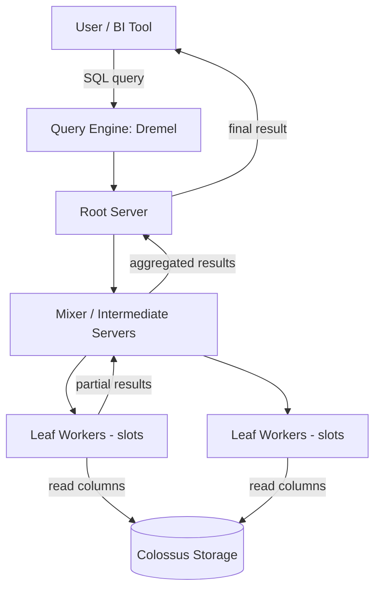
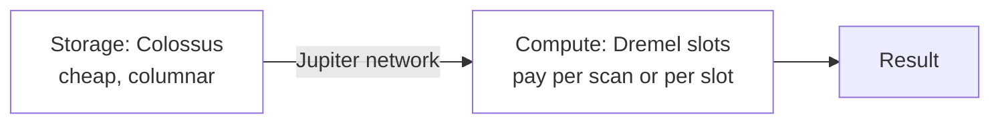

# BigQuery — Fundamentals

Think of it like a massive public library with thousands of librarians on standby. You don't buy shelves, you don't hire staff, and you don't worry about how the books are stored. You simply walk up to the counter, hand over a question ("find every book mentioning dragons published after 1990"), and an army of librarians fans out across the building, each scanning a different aisle in parallel, then merges their findings into one answer. You pay only for the pages they had to scan — not for the building. That's BigQuery: a serverless data warehouse where storage and compute are separate, and queries are massively parallelized for you.

## What Is BigQuery?

BigQuery is Google Cloud's fully managed, serverless data warehouse. Key properties:

- **Serverless** — no clusters to size, patch, or resume. You submit SQL; Google provisions compute.
- **Columnar storage** — data is stored column-by-column, so a query reading 3 columns out of 200 only scans those 3.
- **Separation of storage and compute** — storage lives in Colossus (Google's distributed file system), compute runs in Dremel. They scale independently.
- **Standard SQL** — ANSI-compliant SQL with extensions (arrays, structs, ML).

## The Core Architecture (High Level)

Three names you must know for interviews:

| Component | Role | Analogy |
|-----------|------|---------|
| **Dremel** | Query execution engine — builds a tree of workers | The librarians |
| **Colossus** | Distributed storage holding table data in Capacitor (columnar) format | The bookshelves |
| **Borg / slots** | Compute allocation; a *slot* is a unit of CPU+RAM for query work | Staffing schedule |
| **Jupiter** | Petabit-scale network shuffling data between storage and compute | The hallways |



The query is decomposed into a tree: leaf workers scan storage in parallel, mixers aggregate partial results, and the root returns the final answer.

## Datasets, Tables, and Projects

The resource hierarchy:

```text
Project (billing boundary)
  └── Dataset (access-control + location boundary)
        └── Table / View / Materialized View / Routine
```

- A **dataset** lives in one location (e.g., `US`, `EU`, `asia-south1`). You cannot join tables across locations.
- Tables can be **native**, **external** (data stays in GCS/Drive/Bigtable), or **views**.

## Your First Queries

Create a dataset and table with the `bq` CLI:

```bash
# Create a dataset in the US multi-region
bq mk --dataset --location=US my_project:sales_ds

# Load a CSV from Cloud Storage
bq load \
  --source_format=CSV \
  --skip_leading_rows=1 \
  --autodetect \
  sales_ds.orders \
  gs://my-bucket/orders.csv
```

Query it:

```sql
SELECT
  customer_id,
  COUNT(*) AS order_count,
  SUM(amount) AS total_spent
FROM sales_ds.orders
WHERE order_date >= '2026-01-01'
GROUP BY customer_id
ORDER BY total_spent DESC
LIMIT 10;
```

From Python:

```python
from google.cloud import bigquery

client = bigquery.Client(project="my_project")

query = """
    SELECT customer_id, SUM(amount) AS total_spent
    FROM sales_ds.orders
    GROUP BY customer_id
    ORDER BY total_spent DESC
    LIMIT 5
"""

for row in client.query(query).result():
    print(row.customer_id, row.total_spent)
```

## How You're Charged (The Junior-Level View)

Two separate bills:

1. **Storage** — roughly $0.02/GB/month (active), about half that for data untouched for 90 days (long-term storage). Cheap.
2. **Compute** — the big one. Two models:
   - **On-demand**: ~$6.25 per TB *scanned* by your queries. First 1 TB/month free.
   - **Capacity (editions)**: you buy **slots** (compute units) at an hourly rate; queries draw from your slot pool instead of paying per TB.

Junior takeaway: **you pay for bytes scanned, not bytes returned**. `SELECT *` on a 10 TB table costs ~$62 even with `LIMIT 10`, because `LIMIT` does not reduce scanning.

Check cost *before* running using a dry run:

```bash
bq query --dry_run --use_legacy_sql=false \
  'SELECT * FROM sales_ds.orders'
# Output: Query successfully validated. Assuming the tables are not
# modified, running this query will process 10485760 bytes of data.
```

## Partitioning and Clustering (First Look)

These are the two most important cost/performance levers:

- **Partitioning** splits a table into segments (usually by date). A query filtering on the partition column only scans matching partitions. This is called **partition pruning**.
- **Clustering** sorts data *within* each partition by up to 4 columns, so filters and joins on those columns skip irrelevant blocks.

```sql
CREATE TABLE sales_ds.orders_part
PARTITION BY DATE(order_ts)
CLUSTER BY customer_id, region
AS
SELECT * FROM sales_ds.orders;
```

```sql
-- This scans ONLY the Jan 2026 partitions, not the whole table
SELECT SUM(amount)
FROM sales_ds.orders_part
WHERE DATE(order_ts) BETWEEN '2026-01-01' AND '2026-01-31';
```

## Loading vs Streaming (First Look)

| Method | Latency | Cost | Use case |
|--------|---------|------|----------|
| Batch load (`bq load`, `LOAD DATA`) | Minutes | **Free** | Daily/hourly files |
| Storage Write API | Seconds | Cheap (~$0.025/GB) | Modern streaming |
| Legacy streaming inserts (`insertAll`) | Seconds | More expensive (~$0.05/GB) | Legacy pipelines |

Rule of thumb: batch when you can, stream only when the business needs sub-minute freshness.

## Views and Time Travel

A **view** is a saved query (no storage); a **materialized view** precomputes and auto-refreshes results.

**Time travel** lets you query a table as it existed up to 7 days ago:

```sql
SELECT *
FROM sales_ds.orders
FOR SYSTEM_TIME AS OF TIMESTAMP_SUB(CURRENT_TIMESTAMP(), INTERVAL 2 HOUR);
```

Great for "I just ran a bad UPDATE" recoveries:

```sql
CREATE OR REPLACE TABLE sales_ds.orders AS
SELECT *
FROM sales_ds.orders
FOR SYSTEM_TIME AS OF TIMESTAMP_SUB(CURRENT_TIMESTAMP(), INTERVAL 1 HOUR);
```

## BigQuery ML in One Minute

You can train models with pure SQL — no data movement:

```sql
CREATE OR REPLACE MODEL sales_ds.churn_model
OPTIONS (
  model_type = 'logistic_reg',
  input_label_cols = ['churned']
) AS
SELECT
  tenure_months,
  monthly_spend,
  support_tickets,
  churned
FROM sales_ds.customer_features;
```

```sql
SELECT *
FROM ML.PREDICT(
  MODEL sales_ds.churn_model,
  (SELECT * FROM sales_ds.new_customers)
);
```

Supported model types include linear/logistic regression, k-means, time-series (ARIMA_PLUS), boosted trees, and remote calls to Vertex AI LLMs.

## Common Junior Interview Questions

**Q: Why is BigQuery called "serverless"?**
Because users never provision or manage compute. Slots are allocated dynamically per query from Google's shared (or your reserved) pool.

**Q: Does `LIMIT 10` make a query cheaper?**
No — on-demand pricing charges for bytes *scanned*. Use partition filters and select only needed columns instead.

**Q: What's the difference between BigQuery and Cloud SQL?**
Cloud SQL is OLTP (row-oriented, transactional, single-machine scale). BigQuery is OLAP (columnar, analytical, scans billions of rows). Don't run point lookups or high-frequency updates in BigQuery.

**Q: How do you reduce query cost?**
1. Select only needed columns (columnar storage = scan fewer columns).
2. Filter on the partition column.
3. Use clustering for common filter columns.
4. Use materialized views for repeated aggregations.
5. Dry-run to estimate before running.

## Quick Mental Model Recap



- Storage is cheap and decoupled; compute is what you optimize.
- Partition + cluster = scan less = pay less = run faster.
- Batch loads are free; streaming costs money — choose deliberately.

If you can explain bytes-scanned billing, partition pruning, and why storage/compute separation matters, you have covered the junior BigQuery bar.
