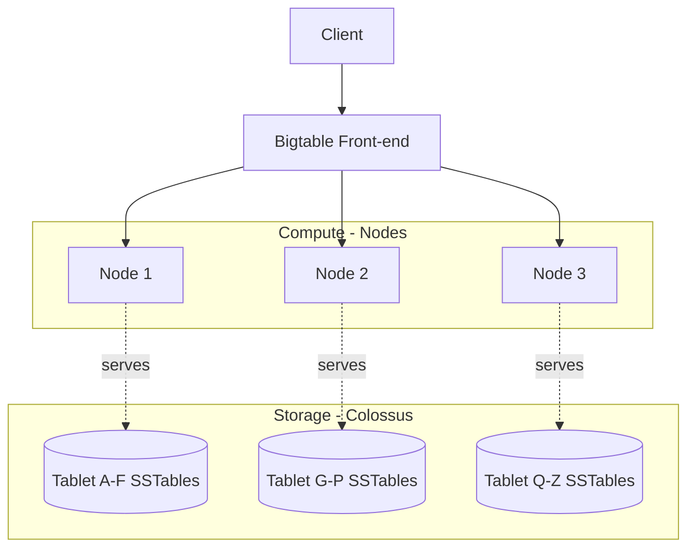

# Bigtable — Fundamentals


## 🎯 Analogy

Think of Bigtable like an infinitely wide spreadsheet with rows sorted by key: you look up a row by key in milliseconds regardless of billions of rows, but you can only efficiently query by row key or key prefix — not arbitrary columns.

---
## Plain-English Analogy

Think of it like a gigantic library where every book is filed by **one single label on its spine**, and the only fast way to find anything is to know that label or browse shelves in label order. There is no card catalog, no search by author, no "find all red books." If you label books well (e.g., `topic#author#year`), you can walk straight to a shelf and grab a whole run of related books in one motion. Label them badly (e.g., by purchase date) and every new delivery piles onto the same shelf while the rest of the library sits empty — and that one shelf becomes a bottleneck.

That single label is the **row key**. Bigtable's entire performance story — including its most famous failure mode, **hotspotting** — flows from how you design it.

## What Is Bigtable?

Cloud Bigtable is **GCP's petabyte-scale, wide-column NoSQL database** — the same technology family behind Google Search, Maps, and Gmail (the original Bigtable paper, 2006, inspired HBase and Cassandra).

Interview-ready facts:

- **Wide-column (sparse, sorted map)**, not relational: no joins, no secondary indexes, no SQL-style WHERE on arbitrary columns.
- **Single-digit millisecond** reads/writes at scale; throughput scales **linearly with nodes**.
- Lookups happen **only by row key** (point get, key range scan, or prefix scan).
- **HBase API compatible** — existing HBase applications can switch with a client-library change.
- Ideal for: time series, IoT telemetry, personalization/profile lookup, fraud features, monitoring data, financial ticks.

## The Data Model

A table is a **sorted map**: `(row key, column family:column qualifier, timestamp) → value`.

| Term | Meaning |
|---|---|
| **Row key** | The single, unique, sorted primary identifier (max ~4KB; keep it short) |
| **Column family** | Group of columns stored and GC-configured together (define upfront, keep few) |
| **Column qualifier** | The "column name" — can be created on the fly, can even carry data itself |
| **Cell** | Intersection of row + column + timestamp; multiple timestamped versions per cell |
| **Sparse** | Empty cells cost nothing — rows can have wildly different columns |

```text
Row key                      | cf:stats                     | cf:meta
-----------------------------+------------------------------+------------------
device#42#20260610-0800      | temp=21.4, hum=44            | fw=2.1
device#42#20260610-0805      | temp=21.6                    |
device#99#20260610-0800      | temp=18.0, hum=51, lux=300   | fw=1.9
```

Rows are stored in **lexicographic order of row key** — this is why key design controls everything: locality, scan efficiency, and load distribution.

## Architecture in 60 Seconds



Two facts juniors should already know:

1. **Tables are split into contiguous row ranges called tablets**, each served by exactly one node at a time.
2. **Nodes don't store data** — data lives in SSTable files on Colossus (Google's distributed file system). Nodes only *serve* tablets, so rebalancing tablets between nodes is a metadata move, not a data copy. That's why scaling and rebalancing are fast.

## Row-Key Design and Hotspotting (The #1 Topic)

Because rows are sorted, **sequential keys send all writes to one tablet → one node**, while the rest idle. This is **hotspotting**.

| Row key pattern | Verdict |
|---|---|
| `timestamp` (e.g., `20260610T080000`) | ❌ Worst case — all writes hit the newest tablet |
| Auto-incrementing ID | ❌ Same problem |
| `user_id` (well distributed) | ✅ Good |
| `device_id#reversed_timestamp` | ✅ Classic time-series pattern — spreads by device, newest-first per device |
| `hash_prefix#natural_key` | ✅ Distributes load, but kills range scans across the natural order |

Design mantra to recite: **"Start the key with something high-cardinality and evenly distributed; put the time component at the end, often reversed so recent data sorts first."**

```python
# Reversed timestamp: newest rows sort first within a device prefix
import sys, time

ts = int(time.time() * 1000)
reversed_ts = sys.maxsize - ts
row_key = f"device#{device_id}#{reversed_ts}".encode()
```

## Hands-On: Create and Use an Instance

```bash
# Create instance with one SSD cluster
gcloud bigtable instances create iot-instance \
    --display-name "IoT Telemetry" \
    --cluster-config id=iot-c1,zone=us-central1-b,nodes=3

# Create a table with a column family (using cbt CLI)
cbt -instance iot-instance createtable telemetry
cbt -instance iot-instance createfamily telemetry stats
cbt -instance iot-instance setgcpolicy telemetry stats maxversions=1
```

```python
from google.cloud import bigtable
from google.cloud.bigtable import row_filters

client = bigtable.Client(project="my-proj", admin=False)
table = client.instance("iot-instance").table("telemetry")

# Write
row = table.direct_row(b"device#42#9223370300000000000")
row.set_cell("stats", "temp", b"21.4")
row.set_cell("stats", "hum", b"44")
row.commit()

# Point read
r = table.read_row(b"device#42#9223370300000000000")
print(r.cells["stats"][b"temp"][0].value)

# Prefix scan: all recent rows for device 42
rows = table.read_rows(
    row_set=None,
    start_key=b"device#42#",
    end_key=b"device#42$",   # '$' sorts just after '#'
    filter_=row_filters.CellsColumnLimitFilter(1),
)
for r in rows:
    print(r.row_key)
```

## Garbage Collection Basics

Cells keep multiple timestamped versions. **GC policies** (per column family) bound that growth:

- `maxversions=N` — keep at most N versions
- `maxage=7d` — delete versions older than 7 days
- Combinable (union/intersection)

Junior-level caveat: GC is **lazy** — expired data disappears from reads quickly but is physically removed later during compaction, so storage metrics shrink with delay.

## When Bigtable vs Friends (First Pass)

| Need | Choose |
|---|---|
| Analytics, SQL, joins, ad-hoc queries | **BigQuery** |
| Huge-scale key-based lookups, time series, ms latency | **Bigtable** |
| App documents, mobile sync, per-user data, flexible queries | **Firestore** |
| Relational schema + SQL + global ACID transactions | **Spanner** |

One-liner: *"Bigtable is for when you know the key and need it in milliseconds at massive scale; BigQuery is for when you have a question and need SQL over everything."*

## Pricing Mental Model

You pay for: **nodes per hour** (each node ≈ up to ~10k reads or writes/sec and serves attached storage), **storage** (SSD ~5x HDD price), and **network egress**. Minimum production footprint is small (1 node works), but throughput planning = node count planning.

## Common Junior Mistakes

- Sequential row keys (timestamps) → hotspots.
- Many column families (dozens) — keep to a handful; families are the unit of GC and storage locality.
- Storing large blobs — soft limits: keep cells under ~10MB, rows under ~100MB; large media belongs in GCS with a Bigtable pointer.
- Expecting secondary indexes or transactions across rows — single-row operations are atomic; nothing bigger is.
- Using Bigtable for small datasets (<~1TB or low QPS) where Firestore or CloudSQL is simpler and cheaper.

## Quick Self-Check

1. How do you query Bigtable? → *Only by row key: point reads, ranges, prefix scans (plus filters applied server-side).*
2. What is a tablet? → *A contiguous row-key range of a table, served by exactly one node.*
3. Why is a timestamp-first row key bad? → *Sorted storage sends all new writes to one tablet/node — hotspotting.*
4. Where is data physically stored? → *SSTables on Colossus; nodes only serve tablets.*
5. What's atomic in Bigtable? → *Single-row mutations only.*
6. HBase relationship? → *Bigtable exposes an HBase-compatible client, easing HBase migrations.*

## ▶️ Try It Yourself

```python
from google.cloud import bigtable
from google.cloud.bigtable import column_family, row_filters

client = bigtable.Client(project="my-project", admin=True)
instance = client.instance("my-instance")
table = instance.table("user-events")

# Write a row (key = user_id#timestamp for time-series)
row_key = b"user42#2024-01-15T10:00:00"
row = table.direct_row(row_key)
row.set_cell("events", "event_type", "page_view")
row.set_cell("events", "page", "/products/123")
row.commit()

# Read a single row
row = table.read_row(b"user42#2024-01-15T10:00:00")
print(row.cells["events"][b"event_type"][0].value.decode())

# Scan a range of rows by key prefix (user42's events)
rows = table.read_rows(
    start_key=b"user42#",
    end_key=b"user42#z",
)
for r in rows:
    print(r.row_key.decode())
```

> **Run it:** Copy the snippet into a REPL or file and run it — no external services needed for the basic example.

---
