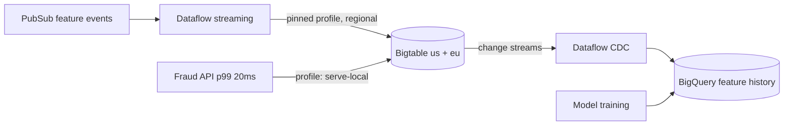

# Bigtable — Interview Scenarios

<article data-difficulty="junior">

## 🟢 Junior: Design a Row Key for Sensor Data

**Scenario:** You're storing readings from 50,000 IoT sensors, each reporting every 30 seconds. The main query is: "give me the last hour of readings for sensor X." A teammate proposes the row key `reading_timestamp` (e.g., `20260610T081530.123`) "because the data is time-ordered anyway." The interviewer asks: what's wrong with that key, and what would you use instead?

<details>
<summary>💡 Hint</summary>

Remember that Bigtable stores rows sorted by key and serves each contiguous key range from a single node. Ask yourself: with a timestamp-first key, which node receives every write happening *right now*? Then design the key starting from the main query.

</details>

<details>
<summary>✅ Solution</summary>

**The problem: hotspotting.** Rows are stored in sorted key order, split into tablets, and each tablet is served by one node. With `reading_timestamp` as the key, every new write has a key greater than all existing keys — so **all 1,666 writes/second land on the single tablet at the end of the keyspace, served by one node**, while the rest of the cluster idles. Latency spikes, and adding nodes cannot help because a single tablet can't be split across nodes by *future* keys.

**Design from the query.** "Last hour for sensor X" means: all rows for one sensor, newest first. So:

```text
Row key:  sensor_id # reversed_timestamp
Example:  s04217#9223370300000000000
```

```python
import sys, time

def make_key(sensor_id: str) -> bytes:
    reversed_ts = sys.maxsize - int(time.time() * 1000)
    return f"{sensor_id}#{reversed_ts}".encode()
```

Why it works:
- **Writes spread** across 50,000 sensor prefixes → load distributes over all tablets/nodes.
- **The query is one tight prefix scan**: start at `s04217#` and read rows until the reversed timestamp passes the one-hour mark — newest rows sort first because the timestamp is reversed.

```python
rows = table.read_rows(
    start_key=b"s04217#",
    end_key=b"s04217$",
)
for r in rows:           # arrives newest-first
    ...                  # stop after passing the 1-hour boundary
```

**Trade-off to mention voluntarily:** a query like "all sensors' readings at 08:15" is now a full-table problem — the key serves per-sensor queries. If cross-sensor time-sliced queries mattered, you'd discuss a second table or a different prefix (e.g., `region#sensor#rev_ts`). Bigtable schema design = pick the key for the dominant query and engineer around the rest.

</details>

</article>

<article data-difficulty="mid-level">

## 🟡 Mid-Level: Eventual Consistency Bit the Payments Team

**Scenario:** Your Bigtable instance has two clusters (`us-east1`, `us-west1`) with a multi-cluster routing app profile used by all services. A payments service does the following: writes a "payment_state=captured" cell, then immediately reads it back to confirm before calling the bank API. Engineers report that roughly 1 in 5,000 confirmations reads the *old* state, and occasionally a `CheckAndMutate` call fails with an error about the app profile. Explain both behaviors and redesign the access patterns.

<details>
<summary>💡 Hint</summary>

Think about what multi-cluster routing means for two consecutive requests from the same client — are they guaranteed to hit the same cluster? Then recall which routing mode is required for single-row transactions like CheckAndMutate, and why async replication makes the other mode unsafe for them.

</details>

<details>
<summary>✅ Solution</summary>

**Behavior 1 — stale read-after-write.** With **multi-cluster (route-any)** routing, the write may go to `us-east1` while the immediately following read is routed to `us-west1`. Replication between clusters is **asynchronous** — typically sub-second, but with no guarantee at any instant. So ~1/5,000 reads arrives at the replica before the write does: classic eventual consistency. Read-your-writes is only guaranteed **within a single cluster**.

**Behavior 2 — CheckAndMutate rejection.** Single-row transactions (`CheckAndMutate`, `ReadModifyWrite`) are **only allowed on single-cluster routing profiles**. With async, last-write-wins replication, two clusters could both "win" conflicting conditional mutations — so Bigtable refuses to run them on multi-cluster profiles at all.

**Redesign:**

```bash
# Profile for transactional/read-your-writes payment operations:
# pinned to one cluster, transactional writes enabled
gcloud bigtable app-profiles create payments-txn \
    --instance pay-instance \
    --route-to us-east1 \
    --transactional-writes

# Profile for latency-tolerant reads (dashboards, lookups): keep route-any
gcloud bigtable app-profiles create general-read \
    --instance pay-instance \
    --route-any
```

```python
# Payments client binds the pinned profile
table = client.instance("pay-instance").table(
    "payments", app_profile_id="payments-txn"
)
```

Additional points that lift the answer:

- **Failover for the pinned profile is manual** — document the runbook: flip `--route-to` to `us-west1` during a regional outage and accept that the last seconds of un-replicated writes may be missing (RPO > 0). If that's unacceptable for payment state, this data belongs in **Spanner**, and saying so is the senior-correct boundary call.
- The read-back-to-confirm step is also questionable: the write already returned success (durably committed on the cluster). If the confirm exists to serialize a state machine, `CheckAndMutate` on the expected prior state is the right primitive — one atomic round trip instead of write-then-read.
- If batch analytics also run on this instance, give them a third pinned profile on the *other* cluster — isolation for free from the same replication setup.

| Workload | Profile | Routing |
|---|---|---|
| Payment state machine | `payments-txn` | Single-cluster us-east1, transactional |
| General reads | `general-read` | Multi-cluster any |
| Nightly batch | `batch` | Single-cluster us-west1 |

</details>

</article>

<article data-difficulty="senior">

## 🔴 Senior: 100k Lookups/Second — Bigtable, Spanner, Firestore, or BigQuery?

**Scenario:** You're designing the feature store for a real-time fraud-detection system: ~2B entity profiles (cards, devices, merchants), 100,000 point lookups/second at p99 < 20ms, ~30,000 feature updates/second from streaming pipelines, multi-region serving (US + EU), and a data science team that wants to query "everything" for model training. One architect proposes Spanner ("we know SQL"), another Firestore ("we know the SDK"). Make the call, size it roughly, and design the full read/write/training architecture, including its consistency caveats.

<details>
<summary>💡 Hint</summary>

Score each candidate against the four hard numbers (volume, read QPS, write QPS, latency) and the access shape — is anything here actually relational or document-sync shaped? Then remember no single store serves both ms point lookups and full-corpus training scans well; think two systems and how data flows between them.

</details>

<details>
<summary>✅ Solution</summary>

**Eliminate by access shape and economics:**

| Option | Verdict | Why |
|---|---|---|
| **Firestore** | ❌ | Per-operation pricing at 100k reads + 30k writes/s is ruinous (order of $100k+/month on ops alone); write throughput patterns and doc model add friction. Built for app sync, not infrastructure-scale serving. |
| **Spanner** | ❌ as primary | Could meet latency, but you'd pay for SQL, secondary indexes, and global ACID you don't need — this workload is pure key→value. Substantially more $/QPS than Bigtable. Keep Spanner for workloads needing multi-row transactions. |
| **BigQuery** | ❌ for serving, ✅ for training | Seconds-latency analytical engine; it's the training-side answer, not the serving-side. |
| **Bigtable** | ✅ | Key-addressed, 2B rows is comfortable, linear QPS scaling, ms latency, HBase-class write throughput. This is the canonical Bigtable workload. |

**Serving design (Bigtable):**

- **Row key:** `entity_type#entity_id` (IDs are hashed/UUID-like → naturally distributed; no salting needed). Features as columns in one family `f`, GC `maxversions=1`.
- **Topology:** clusters in `us-east1` and `europe-west1`. EU clients use an app profile routed EU-first; US likewise. Streaming writers use a **pinned profile per region** writing to their local cluster; replication converges (features are idempotent upserts, last-write-wins is acceptable — *say this explicitly*, it's the consistency caveat: a fraud score may read a feature that's seconds stale cross-region; the model tolerates it, and that tolerance is a stated requirement, not an accident).
- **Sizing arithmetic (SSD, ~10k point ops/node):** US share ~60k reads + 18k writes ≈ 8 nodes; +30% failover/headroom → **~11 nodes**; EU share ~half → **~6 nodes**. Storage: 2B × ~2KB ≈ 4TB < 5TB/node × nodes — CPU-bound, not storage-bound. Order of magnitude **$15–20k/month** nodes + ~$0.7k storage. Autoscaling 60% CPU target with floors at the above.

**Write path:** Dataflow streaming jobs consume Kafka/PubSub feature events → batched `MutateRows` via the regional pinned profiles. Bulk feature backfills run against a **third, batch-pinned profile** (or off-peak windows) to protect serving block cache.

**Training path:** Bigtable **change streams → Dataflow → BigQuery**, giving the DS team a SQL-queryable, partitioned feature history without ever scanning the serving cluster. Point-in-time-correct training sets come from BigQuery snapshots, not from Bigtable.



**Caveats to volunteer (this is what makes it senior):**
1. Cross-region staleness window (seconds) — acceptable for features, would NOT be acceptable for, e.g., balance checks; that workload would go to Spanner.
2. Failover doubles surviving-cluster load — the +30% headroom and <35–50% steady CPU per cluster is deliberate.
3. Single-key celebrities (a mega-merchant) can become hot rows — cache the top-N entities in the API layer (memcache/Redis) as a shock absorber.
4. Load-test with **production key distribution**, then Key Visualizer before launch.

</details>

</article>

## Interview Tips

> **Tip 1:** "Design a Bigtable schema for X" — Always start by listing the queries, then derive the row key, and finish with the trade-off your key makes impossible (and how you'd patch it: second table, salted index, BigQuery for analytics). Key-first answers without the query list read as memorized.

> **Tip 2:** "Why is your Bigtable cluster slow?" — Give the triage order: hottest-node CPU vs average (hotspot), Key Visualizer (which range), storage >70% (throttling), tombstones after mass deletes (LSM debt), batch/serving co-tenancy (app profiles). Naming five concrete causes beats deep-diving one.

> **Tip 3:** "Bigtable vs BigQuery/Spanner/Firestore?" — Anchor on access shape, not features: known-key millisecond lookups at scale → Bigtable; ad-hoc SQL analytics → BigQuery; multi-row ACID + relational SQL → Spanner; app documents/sync → Firestore. Add one disqualifier each ("Firestore's per-op pricing dies at 100k QPS") to show you've costed them.

## ⚡ Quick-fire Q&A

**Q:** What's the only way to query Bigtable?
A: By row key — point reads, ranges, and prefix scans, with server-side filters shaping returned cells.

**Q:** What causes hotspotting and what's the fix?
A: Sequential key prefixes (timestamps, auto-increment) concentrating writes on one tablet; fix with high-cardinality leading components, time at the end (reversed), or salting as a last resort.

**Q:** What is a tablet and why does rebalancing cost so little?
A: A contiguous key range served by one node; data lives in SSTables on Colossus, so moving a tablet is metadata, not data movement.

**Q:** Why don't deletes free space immediately?
A: LSM design — deletes write tombstones; space and scan speed recover at compaction.

**Q:** Single-cluster vs multi-cluster app profile in one line each?
A: Single-cluster = read-your-writes + transactions, manual failover; multi-cluster = automatic failover + nearest routing, eventual consistency, no transactions.

**Q:** When is HDD storage acceptable?
A: Scan-heavy, latency-tolerant archives — random reads collapse to ~500 QPS/node vs ~10k on SSD.

**Q:** How do you bulk-load 1B rows?
A: Dataflow with the Bigtable connector (batched MutateRows), ideally through a batch-pinned app profile, then CheckConsistency before flipping readers.

**Q:** What numbers size a cluster?
A: ~10k point reads or writes per SSD node, ≤5TB served per node, CPU target <60–70% with failover headroom — whichever constraint binds first.
