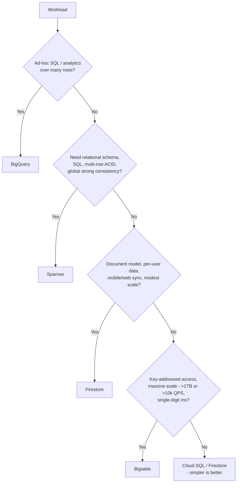

# Bigtable — Senior Deep Dive

## Storage Engine Internals: LSM, SSTables, Tablets

Bigtable is an **LSM-tree (log-structured merge) system**. The write path:

1. Mutation arrives at the node serving the tablet → appended to a **shared commit log** on Colossus (durability) → applied to the in-memory **memtable**.
2. When the memtable fills, it's flushed as an immutable, sorted **SSTable** file to Colossus (minor compaction).
3. Background **merging compactions** combine SSTables; periodic **major compactions** rewrite a tablet's SSTables into one, physically dropping tombstoned/GC-expired data.

The read path merges the memtable plus the relevant SSTables (newest-to-oldest), using bloom filters and block indexes to skip files/blocks. Consequences a senior should derive, not memorize:

- **Writes are cheap and sequential** (log append + memory) — hence the high write throughput.
- **Read amplification grows with un-compacted SSTable count** — heavy random-update workloads read more files per get.
- **Deletes are writes** (tombstones); space and scan-speed recover only at compaction.
- **Scans over churned ranges slow down** until major compaction passes — the classic "we deleted half the table and scans got slower" surprise.

### Tablets and rebalancing

A table is partitioned into **tablets** (contiguous key ranges, ~ hundreds of MB to a few GB). Each tablet is served by one node; assignment is metadata. Bigtable continuously:

- **Splits** hot or large tablets,
- **Merges** cold small ones,
- **Moves** tablets between nodes to even out CPU.

Because data is on Colossus, moving a tablet copies no data — this is why Bigtable can rebalance in seconds and why adding nodes helps within minutes *if and only if load is splittable*. A single hot row or a hot point-prefix cannot be split below one tablet → **no node count fixes a single-key hotspot**. That sentence is a senior interview marker.

## Performance Engineering

### Latency anatomy
Single-digit-ms p50 is the norm; investigate p99 via:

| p99 driver | Mechanism | Mitigation |
|---|---|---|
| Hot tablets | One node at CPU ceiling | Key redesign, salting; verify via Key Visualizer |
| Large rows/cells | Read must materialize the row | Cap row sizes; split wide rows |
| Tombstone fields | Scan passes deleted data | DropRowRange; tune GC; await compaction |
| Cold connections | Channel setup, cache misses | Connection warm-up, keep-alives, channel pools |
| Multi-cluster routing flaps | Failover to distant region | Tight health-aware profiles; regional clients |
| Batch/serving co-tenancy | Batch scan evicts block cache | Separate clusters + app profiles |

### Throughput planning
- Linear scaling is real but **per-workload**: ~10k point reads/s/node (SSD) OR ~10k writes/s/node — mixed workloads share the budget; long scans are throughput-bound (~hundreds of MB/s/node), not QPS-bound.
- Keep average CPU < 60–70% (single-cluster) or < ~35% per cluster in multi-cluster failover designs — a failover doubles the survivor's load; capacity-plan for the post-failover state.
- Storage utilization > ~70% of node-serving capacity degrades latency independent of CPU — sometimes you add nodes *for storage*, not QPS.

### Client-side mechanics that matter
- **Bulk mutations** (`MutateRows`) batch by tablet — order keys so batches don't span many tablets.
- Reuse clients; gRPC channel pools sized to concurrency; avoid per-request client construction (a top-3 real-world latency bug).
- Use **read row sets** (multi-range requests) instead of N point reads in a loop.

## Replication Topologies and Consistency

Replication is per-instance, multi-cluster, **asynchronous, eventually consistent, last-write-wins per cell**.

Design topologies:

| Topology | Purpose | Notes |
|---|---|---|
| 2 clusters, same region (different zones) | Zone HA, read scaling | Lowest replication lag |
| 2+ regions | DR + latency locality | Plan for lag (typically seconds; monitor) |
| N clusters + workload profiles | Batch/serving isolation | The most common "secret" use of replication: isolation, not DR |

Senior nuances:

- **Consistency tokens** (`CheckConsistency` API) let a batch writer wait until replicas have caught up before flipping a "data ready" flag.
- **Single-row transactions** (CheckAndMutate, ReadModifyWrite) require single-cluster routing; multi-primary conflicting transactional semantics don't exist — if you need them, you've outgrown Bigtable's model (consider Spanner).
- Failover semantics with multi-cluster-any: automatic, but **you can read stale data after failover** — call this out in any financial/inventory design.
- Replication cost: every cluster stores a full copy and needs capacity for the full write load — N replicas ≈ N× node + storage cost for writes.

## The Decision Framework: Bigtable vs BigQuery vs Firestore vs Spanner

Axes: query shape, scale, latency, consistency, cost model.

Sharp contrasts to articulate:

- **Bigtable vs BigQuery:** operational point lookups vs analytical scans. Common architecture is both: Bigtable serves features/profiles at ms latency; change streams/Dataflow sync to BigQuery for analytics.
- **Bigtable vs Spanner:** Spanner gives SQL, secondary indexes, multi-row ACID, external (strong global) consistency — at higher per-unit cost and lower raw key-value throughput per dollar. If the design needs transactions across entities or ad-hoc filters, Spanner; if it's "key in, value out, millions of times a second," Bigtable.
- **Bigtable vs Firestore:** Firestore = developer-friendly documents, queries, sync, per-operation pricing — great until sustained throughput makes per-op pricing and write limits hurt; Bigtable = infrastructure-grade, node pricing, no query engine.
- **Under ~1TB and modest QPS, Bigtable is usually the wrong answer** — its economics and ops model assume scale.

## HBase Compatibility and Migration

- Bigtable ships an **HBase-compatible Java client** (`bigtable-hbase`); HBase apps typically migrate by swapping the connection factory — no data-model rewrite, since HBase *is* the Bigtable model (it was cloned from the paper).
- Differences to flag: no coprocessors, no custom filters (only the built-in filter set), namespaces flattened, different ACL model (IAM), no HBase admin tooling against region servers.
- Migration path: HBase snapshots → export to GCS → Dataproc/Dataflow import job → validate via row-count/hash jobs → dual-write or replication-based cutover for low downtime. The widely-used pattern is **HBase replication into Bigtable via the Bigtable HBase replication endpoint**, then flip readers.

## Cost Engineering

| Lever | Impact |
|---|---|
| SSD vs HDD | HDD ~5x cheaper storage, but ~500 QPS/node random reads vs 10k — HDD only for scan-heavy archives |
| Autoscaling | Fits diurnal serving curves; min sized for storage + failover headroom |
| Replication count | Each replica is a full copy + full write capacity |
| GC policy aggressiveness | maxage/maxversions directly cut storage |
| Batch isolation cluster | Smaller than serving cluster if batch is throughput-tolerant |
| Committed use discounts | For stable node floors |

Example: serving 50k reads/s + 20k writes/s, 8TB SSD, 2-region: ≈ 7–8 nodes/cluster for QPS, check storage (8TB/5TB → ≥2 nodes; fine), +30% failover headroom → 2 × 10 nodes ≈ order of **$13–15k/month** + storage ~$1.4k. Presenting an estimate like that — QPS-driven node count, storage check, failover headroom — is exactly what senior interviews want.

## ⚡ Cheat Sheet

### Key Commands

| Action | Command |
|---|---|
| Create instance | `gcloud bigtable instances create I --cluster-config id=C,zone=Z,nodes=3` |
| Add replica | `gcloud bigtable clusters create C2 --instance I --zone Z2 --num-nodes 3` |
| Autoscale | `gcloud bigtable clusters update C --instance I --autoscaling-min-nodes 3 --autoscaling-max-nodes 12 --autoscaling-cpu-target 60` |
| App profile | `gcloud bigtable app-profiles create P --instance I --route-any` |
| Table/family | `cbt -instance I createtable T && cbt -instance I createfamily T cf` |
| GC policy | `cbt -instance I setgcpolicy T cf "maxage=30d or maxversions=1"` |
| Backup | `gcloud bigtable backups create B --instance I --cluster C --table T --retention-period 30d` |
| Hotspot debug | Key Visualizer (console) + hottest-node CPU metric |

### Limits / Numbers to Quote

| Item | Value |
|---|---|
| Point R/W per SSD node | ~10,000 QPS, ~6ms |
| HDD random reads | ~500 QPS/node |
| Storage per SSD node | up to 5TB (keep <70% for latency) |
| Row key max | 4KB (keep ≪) |
| Cell soft limit | <10MB; row <100MB (hard 256MB) |
| CPU target | <60–70%; <35%/cluster pre-failover in 2-cluster designs |
| Consistency | Single-row atomic; cross-cluster eventual, LWW per cell |

### Decision Rules

- Hot node ≫ average node CPU → **key design problem; adding nodes won't help.**
- Need multi-row ACID or ad-hoc filters → Spanner. Need SQL analytics → BigQuery. Small/document-ish → Firestore.
- Salting only after key reordering fails; buckets ≈ small multiple of nodes; remember read fan-out.
- Transactions (check-and-mutate) → single-cluster app profile, full stop.
- Batch + serving on one cluster → split clusters + app profiles before tuning anything else.
- Mass delete → `DropRowRange` or GC maxage, never row-by-row deletes.

### One-Liners to Say in the Interview

- "Bigtable is an LSM store: writes are log-appends, deletes are tombstones, and compaction is when storage and scan speed actually recover."
- "Tablets move, data doesn't — rebalancing is metadata over Colossus, which is why scaling is fast and single-key hotspots are unfixable by scaling."
- "I design the row key from the query list backwards, then run Key Visualizer under load before launch."
- "Replication buys HA and workload isolation, not consistency — it's async, last-write-wins, and transactions pin to one cluster."
- "Per-node math: ten thousand point ops, five terabytes, keep CPU under sixty — capacity planning is arithmetic, then verify."
