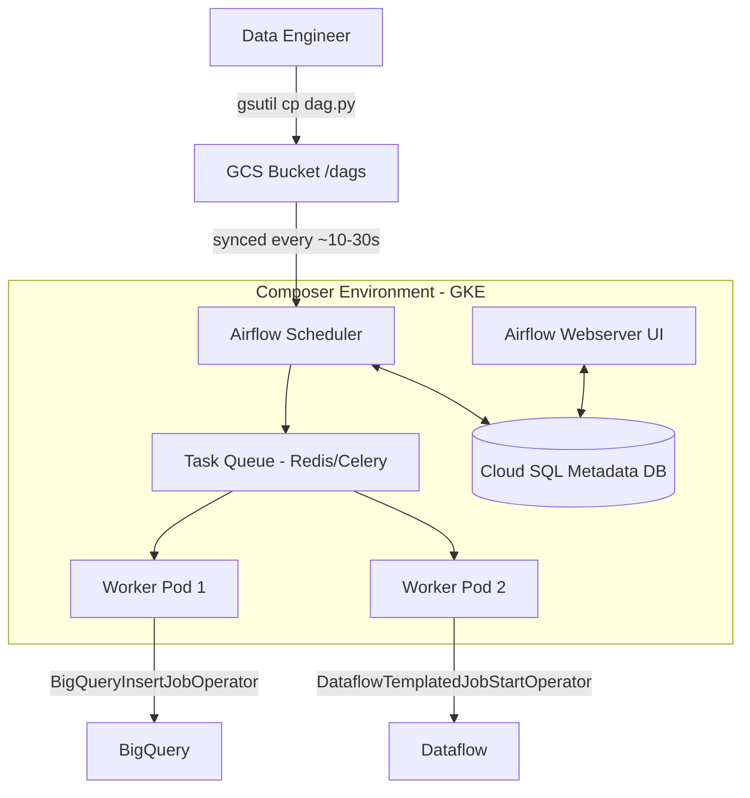

# Cloud Composer / Airflow — Fundamentals

## Plain-English Analogy

Think of it like hiring a professional kitchen manager for a restaurant. Apache Airflow is the recipe book and the scheduling whiteboard — it says "start the soup at 9, plate the salad at 11, and never serve dessert before the main course." But someone still has to keep the kitchen running: hire chefs, fix broken ovens, restock supplies. **Cloud Composer is Google running the kitchen for you.** You just hand over recipes (DAGs), and Google maintains the staff (workers), the whiteboard (scheduler), and the building (GKE cluster) underneath.

You write the *what* and *when*; Composer handles the *where* and *how it stays alive*.

## What Is Cloud Composer?

Cloud Composer is **Google Cloud's fully managed Apache Airflow service**. Key facts to state in an interview:

- It runs **open-source Apache Airflow** — your DAGs are standard Airflow Python code, portable to any Airflow deployment.
- The underlying infrastructure is a **GKE (Google Kubernetes Engine) cluster** managed by Google.
- You deploy DAGs by **copying Python files to a GCS bucket** that Composer watches.
- It integrates natively with BigQuery, Dataflow, Dataproc, GCS, Pub/Sub, and more via Google provider operators.

## Core Airflow Concepts (You Must Know These)

| Concept | What it is |
|---|---|
| **DAG** | Directed Acyclic Graph — a Python file defining tasks and their dependencies |
| **Task** | A single unit of work (run a query, move a file, call an API) |
| **Operator** | A template for a task type (`BigQueryInsertJobOperator`, `BashOperator`) |
| **Scheduler** | Decides which tasks should run and when |
| **Worker** | Executes the tasks |
| **Executor** | Strategy for distributing tasks (Composer uses **CeleryExecutor** / Celery on Kubernetes) |
| **Metadata DB** | Cloud SQL (Postgres) instance storing task state, history, connections |
| **Webserver** | The Airflow UI for monitoring and triggering |

## Architecture at a Glance



In an interview, the one-liner: *"Composer is Airflow running on a Google-managed GKE cluster, with DAGs delivered through a GCS bucket and state stored in a managed Cloud SQL database."*

## Your First DAG

```python
from datetime import datetime, timedelta
from airflow import DAG
from airflow.operators.bash import BashOperator
from airflow.providers.google.cloud.operators.bigquery import (
    BigQueryInsertJobOperator,
)

default_args = {
    "owner": "data-eng",
    "retries": 2,
    "retry_delay": timedelta(minutes=5),
}

with DAG(
    dag_id="daily_sales_load",
    schedule_interval="0 6 * * *",   # 6 AM UTC daily
    start_date=datetime(2026, 1, 1),
    catchup=False,
    default_args=default_args,
    tags=["sales", "daily"],
) as dag:

    extract = BashOperator(
        task_id="check_source_file",
        bash_command="gsutil ls gs://my-landing-bucket/sales/{{ ds }}/",
    )

    load = BigQueryInsertJobOperator(
        task_id="load_to_staging",
        configuration={
            "query": {
                "query": """
                    INSERT INTO `proj.staging.sales`
                    SELECT * FROM `proj.landing.sales_ext`
                    WHERE sale_date = '{{ ds }}'
                """,
                "useLegacySql": False,
            }
        },
    )

    extract >> load
```

Key things an interviewer listens for:
- `{{ ds }}` is a **Jinja template** for the logical (execution) date — enables idempotent backfills.
- `catchup=False` prevents Airflow from running every missed interval since `start_date`.
- `retries` belong in `default_args` so every task inherits them.

## Deploying a DAG to Composer

Deployment is literally a file copy:

```bash
# Find your environment's DAG bucket
gcloud composer environments describe my-composer-env \
    --location us-central1 \
    --format="value(config.dagGcsPrefix)"

# Output: gs://us-central1-my-composer-env-abc123-bucket/dags

# Deploy
gsutil cp daily_sales_load.py \
    gs://us-central1-my-composer-env-abc123-bucket/dags/
```

The scheduler picks up new/changed files within seconds to a couple of minutes. In real teams this copy happens through **CI/CD (Cloud Build / GitHub Actions)**, never by hand.

## Creating an Environment

```bash
gcloud composer environments create my-composer-env \
    --location us-central1 \
    --image-version composer-3-airflow-2.10.5 \
    --environment-size small
```

- `--image-version` pins both the Composer release and the Airflow version.
- `--environment-size` (small / medium / large) sets baseline CPU, memory, and storage for the scheduler, webserver, and workers.

## Composer 2 vs Composer 3 (Junior-Level View)

| Aspect | Composer 2 | Composer 3 |
|---|---|---|
| Infrastructure | GKE Autopilot in *your* project (visible) | Google-managed infra (GKE hidden from you) |
| Autoscaling | Worker autoscaling | Worker autoscaling, faster environment ops |
| Networking | You manage VPC details | Simplified; attach to your VPC declaratively |
| Airflow versions | Airflow 2 | Airflow 2 (and newer lines as released) |
| Status | Older generation | Current recommended generation |

Junior takeaway: *Composer 3 hides the GKE cluster entirely and makes environments faster to create and update; Composer 2 still shows you the GKE cluster in your project.*

## Why Use Composer Instead of Cron?

A classic junior interview question. Answer with these points:

1. **Dependencies** — cron cannot express "run B only after A succeeds."
2. **Retries and alerting** — built-in retry logic, SLA misses, email/Slack callbacks.
3. **Backfills** — re-run historical dates with one command, with templated dates.
4. **Observability** — UI showing every run, log, and duration trend.
5. **Scalability** — workers scale out; cron is one machine.

```bash
# Backfill example — rerun June 1-5 for one DAG
gcloud composer environments run my-composer-env \
    --location us-central1 \
    dags backfill -- \
    -s 2026-06-01 -e 2026-06-05 daily_sales_load
```

## Connections and Variables

Composer stores credentials and config in the Airflow metadata DB (or better, in **Secret Manager**):

```bash
# Set an Airflow variable
gcloud composer environments run my-composer-env \
    --location us-central1 \
    variables set -- my_dataset staging_v2
```

```python
from airflow.models import Variable

dataset = Variable.get("my_dataset")  # "staging_v2"
```

Interview tip: mention that **Composer environments default to using the environment's service account** for GCP operators — no keys needed for BigQuery/GCS access, just IAM roles.

## Pricing Basics

You pay for:
- **Environment compute** (scheduler, webserver, workers — sized by environment size and autoscaling)
- **Cloud SQL** metadata database
- **GCS bucket** storage for DAGs/logs
- Small environments commonly land around **$350–450/month** baseline; this matters in the "Composer vs self-managed" question covered at higher levels.

## Common Junior Mistakes

- Putting **heavy computation inside the DAG file's top level** — DAG files are parsed every few seconds; API calls or queries at module level can choke the scheduler.
- Using `datetime.now()` instead of templated `{{ ds }}` — breaks backfills and idempotency.
- Forgetting `catchup=False` and accidentally launching hundreds of historical runs.
- Treating Composer's GCS `/data` and `/dags` folders as a data lake — they are for orchestration artifacts only.

## Quick Self-Check

1. Where do you put a DAG file so Composer runs it? → *The environment's GCS bucket, under `/dags`.*
2. What database stores task state? → *A managed Cloud SQL (Postgres) instance.*
3. What runs the tasks? → *Airflow workers (Celery) on GKE pods.*
4. Why is `{{ ds }}` better than `datetime.now()`? → *It reflects the logical run date, making reruns/backfills produce identical results.*
5. What is the difference between an Operator and a Task? → *An Operator is the class/template; a Task is an instantiated Operator inside a DAG.*

## What to Say in the Interview

> "Cloud Composer is managed Apache Airflow on GCP. It runs on GKE under the hood, you deploy DAGs by syncing Python files to a GCS bucket, and it gives you native operators for BigQuery, Dataflow, and Dataproc. I'd choose it over cron for dependency management, retries, backfills, and observability — and over self-managed Airflow when the team would rather pay a few hundred dollars a month than operate Kubernetes, upgrades, and the metadata database themselves."
