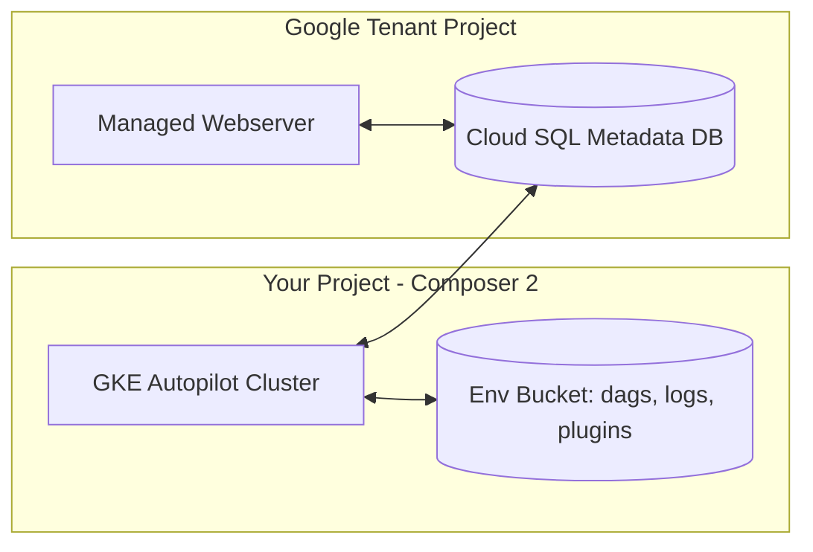

# Cloud Composer / Airflow — Intermediate

## What's Actually Inside a Composer Environment

When you create a Composer 2 environment, GCP provisions in *your* project:

- A **GKE Autopilot cluster** running scheduler pod(s), worker pods, triggerer, and a Redis queue
- A **Cloud SQL (PostgreSQL)** instance for Airflow metadata (in a Google tenant project, reached over a proxy)
- A **GCS bucket** with `dags/`, `data/`, `logs/`, `plugins/` folders
- A **Cloud Run-style managed webserver** (Composer 2) serving the Airflow UI behind IAP/IAM

In **Composer 3** the GKE cluster moves into a Google-managed tenant project — you stop seeing or paying line-items for the cluster directly and instead manage everything through Composer's API. This is the main operational difference to articulate.



## Environment Sizing and Autoscaling

Composer 2/3 use **workload configuration**: you set CPU/memory/storage per component and a min/max worker count.

```bash
gcloud composer environments create prod-orchestrator \
    --location us-central1 \
    --image-version composer-3-airflow-2.10.5 \
    --environment-size medium \
    --scheduler-cpu 2 --scheduler-memory 7.5GB --scheduler-count 2 \
    --worker-cpu 2 --worker-memory 7.5GB --worker-storage 5GB \
    --min-workers 2 --max-workers 12 \
    --web-server-cpu 1 --web-server-memory 4GB
```

How autoscaling decides: Composer monitors the **Celery queue depth** and per-worker task concurrency, adding worker pods until `max-workers` is hit, then scaling back down when idle. Key tuning parameters interact:

| Setting | Meaning | Typical pitfall |
|---|---|---|
| `worker_concurrency` | Tasks one worker runs in parallel | Too high → worker OOM kills |
| `parallelism` | Max running tasks across the whole environment | Lower than needed → silent queuing |
| `max_active_runs_per_dag` | Concurrent DAG runs | 1 for serialized loads, higher for backfills |
| `max_active_tasks_per_dag` | Concurrent tasks within one DAG | Throttles wide fan-outs |
| `min/max-workers` | Autoscaler bounds | min too low → cold-start latency spikes at the top of the hour |

Mid-level insight to mention: **most "Composer is slow" complaints are queue saturation** — `parallelism` or worker count capped while hundreds of sensor tasks occupy slots.

## Deferrable Operators and the Triggerer

Classic sensors (`mode="poke"`) hold a worker slot while sleeping. Two fixes:

```python
from airflow.providers.google.cloud.sensors.gcs import GCSObjectExistenceSensor

# Better: reschedule mode frees the slot between pokes
wait_file = GCSObjectExistenceSensor(
    task_id="wait_for_file",
    bucket="landing-bucket",
    object="sales/{{ ds }}/done.flag",
    mode="reschedule",
    poke_interval=300,
    timeout=60 * 60 * 6,
)

# Best: deferrable — async, runs on the triggerer, near-zero slot usage
wait_file_deferred = GCSObjectExistenceSensor(
    task_id="wait_for_file_deferrable",
    bucket="landing-bucket",
    object="sales/{{ ds }}/done.flag",
    deferrable=True,
)
```

The **triggerer** is a dedicated async process (asyncio event loop) that can hold thousands of deferred tasks. Composer 2/3 include it by default. This is a strong mid-level talking point: *"I move long waits to deferrable operators so worker slots aren't wasted on sleeping sensors."*

## Integrating with BigQuery and Dataflow

```python
from airflow.providers.google.cloud.operators.bigquery import (
    BigQueryInsertJobOperator,
)
from airflow.providers.google.cloud.operators.dataflow import (
    DataflowTemplatedJobStartOperator,
)
from airflow.providers.google.cloud.transfers.gcs_to_bigquery import (
    GCSToBigQueryOperator,
)

stage = GCSToBigQueryOperator(
    task_id="gcs_to_bq_staging",
    bucket="landing-bucket",
    source_objects=["sales/{{ ds }}/*.parquet"],
    destination_project_dataset_table="proj.staging.sales${{ ds_nodash }}",
    source_format="PARQUET",
    write_disposition="WRITE_TRUNCATE",
)

transform = BigQueryInsertJobOperator(
    task_id="merge_to_warehouse",
    configuration={
        "query": {
            "query": "",
            "useLegacySql": False,
        }
    },
)

enrich = DataflowTemplatedJobStartOperator(
    task_id="run_enrichment_pipeline",
    template="gs://dataflow-templates/latest/GCS_Text_to_BigQuery",
    parameters={"inputFilePattern": "gs://landing-bucket/events/{{ ds }}/*"},
    location="us-central1",
)

stage >> transform >> enrich
```

Patterns interviewers want to hear:
- Write to a **partition decorator** (`table${{ ds_nodash }}`) with `WRITE_TRUNCATE` → idempotent reruns.
- Keep SQL in **separate files** included via Jinja, not giant Python strings.
- Operators **submit jobs and poll** — the heavy lifting happens in BigQuery/Dataflow, not on Composer workers. Composer is a control plane, not a compute engine.

## Managing Dependencies (PyPI Packages)

```bash
gcloud composer environments update prod-orchestrator \
    --location us-central1 \
    --update-pypi-package "dbt-bigquery==1.8.2"
```

Pitfalls:
- Each PyPI update **rebuilds worker images** — takes 15–30+ minutes in Composer 2 (much faster in Composer 3), and a conflicting pin can fail the whole update.
- Never `pip install` inside a task to mutate the worker — use **KubernetesPodOperator** or a custom container for exotic dependencies:

```python
from airflow.providers.cncf.kubernetes.operators.pod import (
    KubernetesPodOperator,
)

heavy_job = KubernetesPodOperator(
    task_id="run_custom_container",
    name="ml-feature-build",
    namespace="composer-user-workloads",
    image="us-docker.pkg.dev/proj/repo/feature-builder:1.4.0",
    arguments=["--date", "{{ ds }}"],
)
```

## CI/CD for DAGs

A standard, defensible pipeline:

```yaml
# cloudbuild.yaml
steps:
  - id: "lint-and-test"
    name: "python:3.11"
    entrypoint: bash
    args:
      - -c
      - |
        pip install -r requirements-dev.txt
        ruff check dags/
        pytest tests/ -q          # includes a DagBag import test
  - id: "deploy-dags"
    name: "gcr.io/cloud-builders/gsutil"
    args:
      - "-m"
      - "rsync"
      - "-r"
      - "-d"
      - "dags/"
      - "gs://us-central1-prod-orchestrator-bucket/dags"
```

The **DagBag import test** is the single highest-value test:

```python
from airflow.models import DagBag

def test_no_import_errors():
    bag = DagBag(dag_folder="dags/", include_examples=False)
    assert bag.import_errors == {}, bag.import_errors
```

Note `rsync -d` deletes removed DAGs — mention you'd gate that behind review because it can delete production DAGs on a bad merge.

## Common Pitfalls (Mid-Level Checklist)

1. **Top-level code in DAG files** — every scheduler parse loop executes it. A `bq client.query()` at module level = hammering BigQuery every 30 seconds.
2. **XCom abuse** — XCom lives in the metadata DB; passing DataFrames through it bloats Cloud SQL. Pass GCS URIs instead.
3. **One mega-DAG** — 500 tasks in one DAG slows UI and scheduling; split by domain, link with `ExternalTaskSensor` or **datasets** (data-aware scheduling).
4. **Zombie tasks** — worker pod evicted mid-task (often OOM); fix by raising worker memory or lowering `worker_concurrency`.
5. **Timezone confusion** — `schedule_interval` cron is UTC by default; a "6 AM" job firing at 11 PM local is the classic symptom.
6. **Secrets in Variables** — use the **Secret Manager backend** so connections/variables resolve from Secret Manager:

```text
[secrets]
backend = airflow.providers.google.cloud.secrets.secret_manager.CloudSecretManagerBackend
backend_kwargs = {"connections_prefix": "airflow-connections", "variables_prefix": "airflow-variables"}
```

## Monitoring and Alerting

- Composer ships metrics to **Cloud Monitoring**: scheduler heartbeat, DAG parse time, queued task count, worker pod evictions.
- Alert on: `composer.googleapis.com/environment/unhealthy`, sustained queued tasks, and DAG parse time > 30s.
- Per-task alerting via `on_failure_callback`:

```python
def notify_slack(context):
    from my_alerts import post_slack
    ti = context["task_instance"]
    post_slack(f":red_circle: {ti.dag_id}.{ti.task_id} failed for {context['ds']}")

default_args = {"on_failure_callback": notify_slack}
```

## Interview Sound Bites

> "Composer is a control plane — operators submit work to BigQuery, Dataflow, or Dataproc and poll. If a worker is doing heavy compute, that's a design smell."

> "I keep DAG files import-cheap, push long waits to deferrable operators, pass data by GCS URI instead of XCom, and deploy via Cloud Build with a DagBag import test as the gate."

> "Composer 3's big win over 2 is operational: the GKE layer is fully Google-managed, environment updates and PyPI installs are much faster, and you can scale the environment more safely without touching cluster internals."
