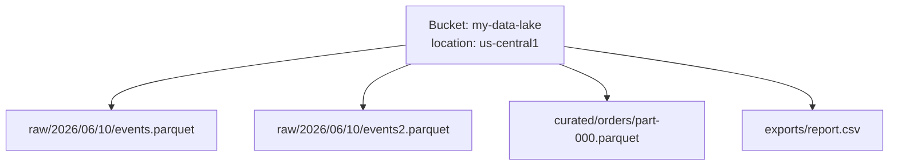
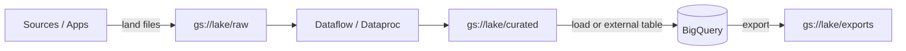

# Cloud Storage — Fundamentals

Think of it like a self-storage facility with infinite units. You rent space by what you actually store, every box gets a unique label (no two boxes in the same unit can share one), and the facility offers cheaper back rooms for boxes you rarely open — but fetching from those back rooms costs a retrieval fee. You can also hand a friend a time-limited visitor pass to pick up one specific box without giving them your keys. That's Cloud Storage (GCS): durable object storage with tiered pricing by access frequency, and fine-grained, expiring access via signed URLs.


## 🎯 Analogy

Think of GCS (Google Cloud Storage) like S3 for GCP: buckets store objects, storage classes control cost vs retrieval speed (Standard → Nearline → Coldline → Archive), and uniform bucket-level access simplifies IAM.

---
## Objects, Buckets, and the Flat Namespace

- A **bucket** is a globally-unique-named container, created in a location with a default storage class.
- An **object** is a blob (0 bytes to 5 TiB) plus metadata. Objects are **immutable** — you replace them, never edit in place.
- The namespace is **flat**: `gs://my-bucket/raw/2026/06/10/events.parquet` is one object whose *name contains slashes*. "Folders" are a UI illusion (unless you enable hierarchical namespace buckets).



### Locations

| Type | Example | Trade-off |
|------|---------|-----------|
| Region | `us-central1` | Cheapest, lowest latency to co-located compute |
| Dual-region | `nam4` (Iowa+S.Carolina) | Geo-redundant + active-active reads |
| Multi-region | `US`, `EU` | Highest availability for serving, vague locality |

Data-engineering rule of thumb: keep analytics buckets **in the same region as your compute** (BigQuery dataset, Dataproc/Dataflow region) — cross-location reads add latency and network egress cost.

## Storage Classes

All classes share the same API, same millisecond access latency, and 11-nines durability — they differ in **storage price vs retrieval cost + minimum storage duration**:

| Class | Storage $/GB/mo (approx) | Retrieval fee | Min duration | Use |
|-------|---------------------------|---------------|--------------|-----|
| Standard | ~$0.020 | None | None | Hot data, active pipelines |
| Nearline | ~$0.010 | ~$0.01/GB | 30 days | Accessed ~monthly |
| Coldline | ~$0.004 | ~$0.02/GB | 90 days | Accessed ~quarterly |
| Archive | ~$0.0012 | ~$0.05/GB | 365 days | Compliance, DR |

Key junior insight: Archive is **not** like AWS Glacier — there's no thawing delay; reads are immediate, you just pay retrieval. Deleting before the minimum duration still bills the remainder.

## Hands-On Basics

`gsutil` is legacy; prefer **`gcloud storage`** (faster, parallel by default):

```bash
# Create a bucket (region, uniform access)
gcloud storage buckets create gs://acme-data-lake \
  --location=us-central1 \
  --default-storage-class=STANDARD \
  --uniform-bucket-level-access

# Upload / download / list / copy
gcloud storage cp events.parquet gs://acme-data-lake/raw/2026/06/10/
gcloud storage ls -l gs://acme-data-lake/raw/2026/06/10/
gcloud storage cp -r gs://acme-data-lake/raw/ ./local-raw/

# Move with wildcards
gcloud storage mv 'gs://acme-data-lake/staging/*.csv' gs://acme-data-lake/raw/
```

Python:

```python
from google.cloud import storage

client = storage.Client()
bucket = client.bucket("acme-data-lake")

# Upload
blob = bucket.blob("raw/2026/06/10/events.parquet")
blob.upload_from_filename("events.parquet")

# Read without downloading to disk
data = bucket.blob("exports/report.csv").download_as_bytes()

# List with a prefix ("folder")
for b in client.list_blobs("acme-data-lake", prefix="raw/2026/06/"):
    print(b.name, b.size)
```

## Lifecycle Policies (First Look)

Automate the hot→cold→delete journey:

```bash
cat > lifecycle.json <<'EOF'
{
  "rule": [
    {
      "action": {"type": "SetStorageClass", "storageClass": "NEARLINE"},
      "condition": {"age": 30}
    },
    {
      "action": {"type": "SetStorageClass", "storageClass": "COLDLINE"},
      "condition": {"age": 90}
    },
    {
      "action": {"type": "Delete"},
      "condition": {"age": 365}
    }
  ]
}
EOF

gcloud storage buckets update gs://acme-data-lake \
  --lifecycle-file=lifecycle.json
```

This is how data lakes implement retention and cost decay with zero pipeline code.

## Signed URLs (First Look)

Grant temporary access to one object to someone with **no Google account**:

```bash
# 1-hour download link
gcloud storage sign-url gs://acme-data-lake/exports/report.csv \
  --duration=1h \
  --private-key-file=sa-key.json
```

```python
from datetime import timedelta

url = bucket.blob("exports/report.csv").generate_signed_url(
    version="v4",
    expiration=timedelta(hours=1),
    method="GET",
)
# Share `url` — anyone holding it can GET until it expires
```

Typical uses: letting a vendor download an export, letting browsers upload directly to GCS (signed PUT) without routing bytes through your backend.

## Access Control in One Paragraph

Modern buckets use **uniform bucket-level access**: IAM only, no per-object ACLs. Grant roles like `roles/storage.objectViewer` at bucket level; use IAM Conditions for prefix-level nuance; use signed URLs for temporary external access. Per-object ACLs ("fine-grained") are legacy — say "uniform + IAM" in interviews.

## GCS in the Data Engineering Picture



- **Staging/landing zone** for ingestion (files land here before processing).
- **Data lake layers** (raw/curated) in Parquet/Avro.
- **BigQuery integration**: free batch loads from GCS, external/BigLake tables querying GCS in place, exports back to GCS.
- **Dataproc**: read/write `gs://` paths directly via the GCS connector — replacing HDFS, so clusters can be ephemeral.

```sql
-- BigQuery external table over GCS files
CREATE EXTERNAL TABLE lake.ext_events
OPTIONS (
  format = 'PARQUET',
  uris = ['gs://acme-data-lake/curated/events/*.parquet']
);
```

## Common Junior Interview Questions

**Q: Object storage vs file system vs block storage?**
Objects are immutable blobs with metadata behind an HTTP API, no real directories, no in-place edits — ideal for analytics files. File systems give hierarchical mutable files; block storage backs VM disks.

**Q: Can I append to a GCS object?**
Not in place — objects are immutable. You write a new object or use **compose** to concatenate existing objects.

**Q: Which storage class for daily-accessed data?** Standard. **Monthly?** Nearline. **Yearly compliance copies?** Archive — and remember minimum-duration charges.

**Q: How durable is GCS?**
Designed for 99.999999999% (11 nines) annual durability via erasure-coded, multi-device (and multi-zone) storage. Availability varies by location type — that's what multi/dual-region buys.

**Q: How do you give a partner a file without making the bucket public?**
A V4 signed URL with a short expiration — capability-based access, no account needed.

## Recap

- Buckets + immutable objects + flat namespace; co-locate with compute.
- Four storage classes trade storage price against retrieval fees and minimum durations — same latency.
- Lifecycle rules automate transitions and deletion; signed URLs grant temporary scoped access.
- GCS is the landing zone, lake, and interchange format hub of every GCP data platform.

## ▶️ Try It Yourself

```python
from google.cloud import storage

client = storage.Client()
bucket = client.bucket("my-data-lake")

# Upload a file
blob = bucket.blob("raw/orders/2024/01/orders_20240115.parquet")
blob.upload_from_filename("/tmp/orders_20240115.parquet")
print("Uploaded to GCS")

# List objects with a prefix
for b in client.list_blobs("my-data-lake", prefix="raw/orders/2024/"):
    print(b.name, b.size)

# Download
blob.download_to_filename("/tmp/downloaded_orders.parquet")

# Generate signed URL (1-hour expiry)
import datetime
url = blob.generate_signed_url(expiration=datetime.timedelta(hours=1))
print(url)
```

> **Run it:** Copy the snippet into a REPL or file and run it — no external services needed for the basic example.

---
