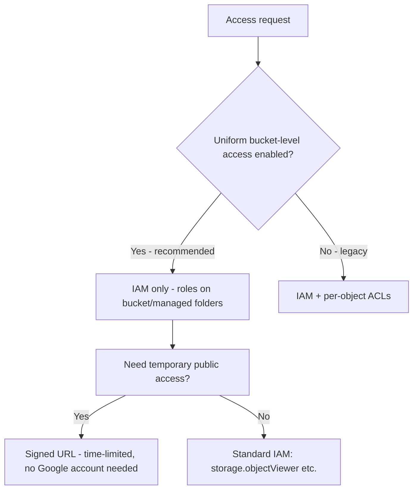

# Cloud Storage — Intermediate Concepts

Beyond buckets and objects: lifecycle automation, performance patterns, security models, and the integration details that come up in mid-level DE interviews.

## Lifecycle Management in Practice

Lifecycle rules move or delete objects automatically based on conditions. This is the #1 cost lever for data lakes on GCS.

```json
{
  "lifecycle": {
    "rule": [
      {
        "action": { "type": "SetStorageClass", "storageClass": "NEARLINE" },
        "condition": { "age": 30, "matchesPrefix": ["raw/"] }
      },
      {
        "action": { "type": "SetStorageClass", "storageClass": "COLDLINE" },
        "condition": { "age": 90, "matchesPrefix": ["raw/"] }
      },
      {
        "action": { "type": "Delete" },
        "condition": { "age": 365, "matchesPrefix": ["tmp/", "staging/"] }
      },
      {
        "action": { "type": "Delete" },
        "condition": { "numNewerVersions": 3 }
      }
    ]
  }
}
```

Apply it:

```bash
gcloud storage buckets update gs://my-data-lake --lifecycle-file=lifecycle.json
```

**Pitfalls interviewers probe:**
- **Early-deletion fees**: Nearline has a 30-day minimum, Coldline 90, Archive 365. Transitioning an object to Coldline and deleting it 10 days later still bills 90 days.
- **Retrieval costs**: Colder classes have cheaper storage but per-GB retrieval fees. A "cold" prefix that analysts query weekly can cost *more* than Standard.
- **Class transitions only go colder** via lifecycle rules — you can't lifecycle from Coldline back to Standard; you must rewrite the object.

## Autoclass — When to Use It

Autoclass moves objects between classes automatically based on access patterns, with no retrieval fees and no early-deletion fees, for a small management fee per 1,000 objects.

| | Lifecycle rules | Autoclass |
|---|---|---|
| Control | Explicit, prefix-based | Automatic, per-object |
| Retrieval fees | Yes (colder classes) | No |
| Early-deletion fees | Yes | No |
| Best for | Predictable aging (logs, raw zones) | Unpredictable access patterns |

**Interview answer:** "If access patterns are predictable, lifecycle rules are cheaper. If they're unpredictable — user uploads, ML datasets revisited at random — Autoclass removes the risk of retrieval-fee surprises."

## Performance: Request Rate and Object Naming

GCS auto-scales request throughput per prefix, but ramp-up follows a pattern: the system supports ~1,000 object writes/sec and ~5,000 reads/sec per prefix initially, then scales as load increases.

**The hotspotting trap** — sequential key names concentrate load on one shard:

```text
BAD  (sequential — all writes hit one index range):
  logs/2024-06-10-000001.json
  logs/2024-06-10-000002.json

BETTER (spread load when writing >1000 obj/sec):
  logs/3f8a/2024-06-10-000001.json
  logs/9c21/2024-06-10-000002.json
```

In practice for analytics workloads, Hive-style date partitioning (`dt=2024-06-10/`) is fine — the write rates rarely exceed per-prefix limits, and the layout matters more for query pruning than write throughput.

## Parallel Composite Uploads & Large Transfers

```bash
# Parallel composite upload for large files (splits into up to 32 parts)
gcloud storage cp bigfile.parquet gs://bucket/ \
  --parallel-composite-upload-threshold=150M

# Bulk transfer with parallelism
gcloud storage cp -r ./data gs://bucket/data/ --no-clobber
```

- Composite uploads split a file into chunks uploaded in parallel, then compose them. Caveat: composed objects have a CRC32C checksum but **no MD5**, which breaks some downstream integrity checks.
- For TB–PB scale, use **Storage Transfer Service** (managed, scheduled, retries, S3/Azure sources) instead of `gcloud storage` from a VM.

## Security Model: IAM vs ACLs vs Signed URLs



- **Uniform bucket-level access** disables object ACLs entirely — one consistent IAM policy surface. Enable it on every new bucket; interviewers treat per-object ACLs as a legacy red flag.
- **Signed URLs** grant time-boxed access to a single object to anyone holding the URL:

```python
from google.cloud import storage
from datetime import timedelta

client = storage.Client()
blob = client.bucket("exports").blob("report-2024-06.csv")

url = blob.generate_signed_url(
    version="v4",
    expiration=timedelta(hours=1),
    method="GET",
)
# Hand `url` to an external partner - no Google account required
```

- **CMEK** (customer-managed encryption keys via Cloud KMS) when compliance requires you to control key rotation/revocation. Default Google-managed encryption is always on regardless.

## Consistency Guarantees

GCS is **strongly consistent** for:
- Read-after-write (new objects immediately readable)
- Read-after-overwrite / read-after-delete
- Listing operations (a just-written object appears in list results immediately)

This matters for data pipelines: unlike pre-2020 S3, you don't need consistency workarounds — a Spark job can write objects and a downstream job can immediately list and read them.

## Integration Patterns for Data Engineering

**BigQuery external tables (BigLake):**

```sql
CREATE EXTERNAL TABLE lake.events_raw
WITH CONNECTION `project.us.gcs-conn`
OPTIONS (
  format = 'PARQUET',
  uris = ['gs://my-data-lake/events/*.parquet'],
  hive_partition_uri_prefix = 'gs://my-data-lake/events'
);
```

**Dataproc / Spark** — the GCS connector ships preinstalled; use `gs://` paths exactly like HDFS:

```python
df = spark.read.parquet("gs://my-data-lake/events/dt=2024-06-10/")
df.write.partitionBy("dt").parquet("gs://my-data-lake/events_clean/")
```

**Pub/Sub notifications** — trigger pipelines on object arrival:

```bash
gcloud storage buckets notifications create gs://landing-zone \
  --topic=new-files --event-types=OBJECT_FINALIZE
```

A common event-driven pattern: file lands → `OBJECT_FINALIZE` → Pub/Sub → Cloud Function or Dataflow job picks it up. Eliminates polling.

## Common Pitfalls

1. **Treating GCS like a filesystem.** "Folders" are prefixes; renaming a "directory" with 1M objects = 1M copy+delete operations. Design layouts you won't need to rename.
2. **Versioning without lifecycle cleanup.** Enabling versioning on a churn-heavy bucket without a `numNewerVersions` delete rule silently multiplies storage cost.
3. **Small-file explosions.** Streaming jobs writing one object per message create millions of tiny files — terrible for Spark/BigQuery scan performance and per-operation costs. Batch/compact before or after landing.
4. **Cross-region egress.** A Dataproc cluster in `us-central1` reading a bucket in `europe-west1` pays egress on every byte. Co-locate compute and storage regions.
5. **Ignoring soft delete.** Soft delete (default 7 days) retains deleted objects and bills for them; tune or disable the retention window on high-churn temp buckets.

## Key Takeaways

- Lifecycle rules for predictable aging; Autoclass for unpredictable access.
- Uniform bucket-level access + IAM always; signed URLs for external time-boxed sharing.
- Strong consistency means no pipeline workarounds — but layout and file sizing still decide performance.
- Co-locate storage with compute, compact small files, and put delete rules on temp/staging prefixes from day one.
