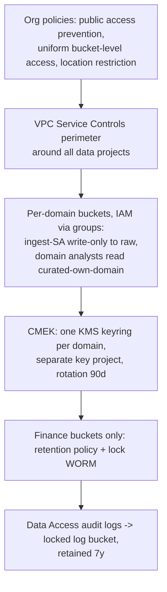

# Cloud Storage — Interview Scenarios

<article data-difficulty="junior">

## 🟢 Junior: Choosing Storage Classes for a New Data Lake

**Scenario:** Your team is setting up a new data lake on GCS. Raw files land daily and are processed within 24 hours; processed Parquet data is queried daily for 2 months, occasionally afterward; compliance requires keeping raw files for 3 years. How do you set up storage classes and lifecycle rules?

<details>
<summary>💡 Hint</summary>

Map each access pattern to a class: hot daily access, occasional access after 60 days, and almost-never-touched compliance retention. Remember the minimum storage durations (Nearline 30d, Coldline 90d, Archive 365d) and that lifecycle rules can both change class and delete.

</details>

<details>
<summary>✅ Solution</summary>

**Mapping access patterns to classes:**

| Data | Access pattern | Class strategy |
|---|---|---|
| Raw landing files | Read once within 24h, kept 3 years for compliance | Standard → Nearline @ 30d → Archive @ 90d → Delete @ 3y |
| Processed Parquet | Daily queries for ~60 days, occasional after | Standard → Nearline @ 90d (buffer beyond the 60-day hot window) |
| Temp/staging | Hours | Standard + delete rule @ 3–7 days |

**Lifecycle config for the raw bucket:**

```json
{
  "lifecycle": { "rule": [
    { "action": {"type": "SetStorageClass", "storageClass": "NEARLINE"},
      "condition": {"age": 30} },
    { "action": {"type": "SetStorageClass", "storageClass": "ARCHIVE"},
      "condition": {"age": 90} },
    { "action": {"type": "Delete"},
      "condition": {"age": 1095} }
  ]}
}
```

```bash
gcloud storage buckets update gs://lake-raw --lifecycle-file=lifecycle.json
```

**Key points to mention:**
- Separate buckets per zone (raw / curated / tmp) so lifecycle rules and IAM can't collide.
- Archive's 365-day minimum is fine here because the data sits there ~2.75 years.
- Don't tier the *curated* zone too aggressively — Nearline retrieval fees on daily-queried data would exceed the storage savings.
- Use a single region co-located with your processing (Dataproc/BigQuery) to avoid egress.

</details>

</article>

<article data-difficulty="mid-level">

## 🟡 Mid-Level: Millions of Small Files Are Killing Performance

**Scenario:** A streaming job has been writing one ~50 KB JSON object per message to `gs://lake/events/` for 8 months — there are now ~900 million objects. Spark jobs reading this prefix take hours just to start, and the GCS operations bill is significant. How do you fix the situation and prevent it recurring?

<details>
<summary>💡 Hint</summary>

There are two problems: the existing 900M-object backlog and the write pattern that creates them. Think about compaction (what tool, what target file size, how to parallelize by partition) and about buffering writes upstream so objects land large. Listing 900M objects is itself a challenge.

</details>

<details>
<summary>✅ Solution</summary>

**Why it's slow:** Spark driver must list the prefix — listing 900M objects takes ~15 minutes minimum at maximum page rate and hammers Class A operations. Then each tiny file is one read request: terrible read amplification, and footer/handshake overhead dominates.

**Step 1 — Stop the bleeding (fix the write path):**

```python
# Instead of: one object per Pub/Sub message
# Buffer through Dataflow/Spark Structured Streaming with file-size triggers
(df.writeStream
   .format("parquet")
   .option("path", "gs://lake/events_compacted/")
   .option("checkpointLocation", "gs://lake/_chk/events/")
   .trigger(processingTime="5 minutes")     # fewer, larger files
   .partitionBy("dt")
   .start())
```

Target 128 MB–1 GB per object. If the producer can't batch, land in Pub/Sub and let a streaming job do it.

**Step 2 — Compact the backlog, partition by partition:**

```python
# Run per-day to bound memory and allow incremental progress
for day in days:
    (spark.read.json(f"gs://lake/events/dt={day}/")
        .repartition(max(1, day_size_gb))        # ~1 GB output files
        .write.mode("overwrite")
        .parquet(f"gs://lake/events_compacted/dt={day}/"))
```

JSON → Parquet also cuts size ~4× and makes downstream reads columnar.

**Step 3 — Clean up old objects** with a lifecycle delete rule on the old prefix (cheaper and more reliable than issuing 900M delete calls yourself):

```json
{ "action": {"type": "Delete"}, "condition": {"age": 0, "matchesPrefix": ["events/"]} }
```

**Step 4 — Prevent recurrence:**
- Adopt a table format (Iceberg/Delta) so listing is manifest-based, not prefix-scan-based, and compaction is a built-in (`rewrite_data_files`).
- Add a data-platform check alerting when any prefix's average object size drops below ~10 MB.

**Outcome you can quote:** job startup from ~40 min of listing to seconds; operations cost drops by orders of magnitude because object count fell ~10,000×.

</details>

</article>

<article data-difficulty="senior">

## 🔴 Senior: Designing Secure Multi-Team Lake Storage for a Regulated Company

**Scenario:** You're designing GCS storage for a bank's data platform: 12 domain teams, PII in several domains, GDPR erasure requirements, SOX-style immutability for finance data, external auditors needing time-boxed read access, and a hard requirement that data never leaves approved projects. Lay out the bucket architecture, security controls, and how you satisfy the conflicting immutability-vs-erasure requirements.

<details>
<summary>💡 Hint</summary>

Think in layers: org policies → VPC Service Controls perimeter → per-domain buckets with group-based IAM → CMEK per domain → retention locks only where mandated. The GDPR-vs-WORM conflict has a standard resolution involving key management (crypto-shredding) and careful scoping of what goes into locked buckets.

</details>

<details>
<summary>✅ Solution</summary>

**Bucket topology — per domain, per zone:**

```text
projects: data-raw-prj | data-curated-prj | data-exports-prj  (separate projects = IAM + VPC-SC blast-radius boundaries)

gs://bank-raw-{domain}/        e.g. bank-raw-payments, bank-raw-customers
gs://bank-curated-{domain}/
gs://bank-exports-audit/       time-boxed external access only
```

**Layered controls:**



1. **Org policies** (cannot be forgotten per-bucket): `storage.publicAccessPrevention`, `storage.uniformBucketLevelAccess`, `gcp.resourceLocations` pinned to approved regions.
2. **VPC Service Controls** around the data projects — even a leaked service-account key cannot copy objects to a bucket outside the perimeter. Auditor access happens via an access level (corp IP + identity), not perimeter exceptions per bucket.
3. **IAM:** groups only, no user grants; ingest SAs get `objectCreator` on raw (write-only — they cannot read back); processing SAs read raw + write curated; analysts read their own domain's curated bucket. Quarterly access reviews driven from IAM policy exports.
4. **CMEK per domain** with keys in a separate key-management project administered by security, not data teams. This separates "can read the bucket" from "controls the key."

**External auditors:** short-lived signed URLs are wrong here (URL = bearer token, no identity). Instead: auditor identities in an `auditors@` group, time-bound IAM conditions (`request.time < timestamp`), access scoped to `bank-exports-audit`, where curated extracts are copied deliberately. All reads land in Data Access logs.

**The immutability vs GDPR-erasure conflict:**
- **Scope WORM narrowly.** Retention-locked buckets hold only finance records that regulators require immutable — and the design keeps *customer-identifying PII out of those objects* (tokenized references instead).
- **Crypto-shredding for PII.** PII columns are encrypted application-side with per-customer keys (or domain CMEK + tokenization vault). GDPR erasure = destroy the customer's key/token mapping; the immutable bytes become permanently unreadable. This satisfies erasure without violating the retention lock.
- For non-WORM curated tables, standard `DELETE` + table-format vacuum + soft-delete window tuned to the erasure SLA.

**What makes this answer senior:** project-level isolation as the blast-radius unit, org policies over per-bucket settings, the explicit auditor identity story, and resolving the WORM/GDPR contradiction by *data design* (tokenization + crypto-shredding) rather than claiming a setting fixes it.

</details>

</article>

---

## Interview Tips

> **Tip 1:** "How do you cut GCS costs?" — Lead with measurement (Storage Insights inventory → BigQuery), then the levers in order of typical impact: lifecycle tiering, small-file compaction, versioning cleanup, format/compression, egress co-location. Numbers beat adjectives.

> **Tip 2:** "GCS vs S3?" — Don't recite marketing. The interview-relevant differences: GCS has been strongly consistent (including listings) much longer, storage classes are switchable per-object within one bucket, Autoclass automates tiering without retrieval fees, and dual-region buckets give active-active DR with an RPO SLA.

> **Tip 3:** "How do you secure a bucket?" — Show the hierarchy: org policies (public access prevention, uniform access) → VPC-SC for exfiltration → group-based IAM → CMEK where compliance demands key control → signed URLs only for anonymous time-boxed sharing. Mentioning per-object ACLs as your primary tool is a red flag.

---

## ⚡ Quick-fire Q&A

**Q: What are the four storage classes and their minimum durations?**
A: Standard (none), Nearline (30 days), Coldline (90 days), Archive (365 days). Colder = cheaper at-rest, but adds per-GB retrieval fees and early-deletion charges.

**Q: Is GCS strongly consistent?**
A: Yes — read-after-write, read-after-delete, and list operations are all strongly consistent. A pipeline can write objects and immediately list/read them.

**Q: Lifecycle rules vs Autoclass?**
A: Lifecycle rules are explicit, prefix/age-based transitions — best for predictable aging. Autoclass moves objects automatically by access pattern, with no retrieval or early-deletion fees, for a per-object management fee — best for unpredictable access.

**Q: What is a signed URL?**
A: A time-limited URL granting access to one object to anyone holding it, without a Google account — generated with a service account's credentials. Use for external sharing; never as a substitute for IAM internally.

**Q: How do you trigger a pipeline when a file lands?**
A: Bucket notification → Pub/Sub (`OBJECT_FINALIZE` event) → Cloud Function/Cloud Run/Dataflow consumer. Use the object's generation number as an idempotency key.

**Q: Why are millions of small objects a problem?**
A: Listing and per-object request overhead dominate (Class A/B operations bill by count, not size), and Spark/BigQuery read amplification destroys performance. Fix with buffered writes and compaction to 128 MB–1 GB files.

**Q: What does uniform bucket-level access do?**
A: Disables legacy per-object ACLs so IAM is the single access-control surface. Recommended (and commonly enforced by org policy) on all buckets.

**Q: Multi-region bucket for a data lake — good idea?**
A: Usually no. Analytics compute lives in one region; multi-region adds cost and cross-region read latency/egress. Use single region co-located with compute, dual-region if DR demands it.
