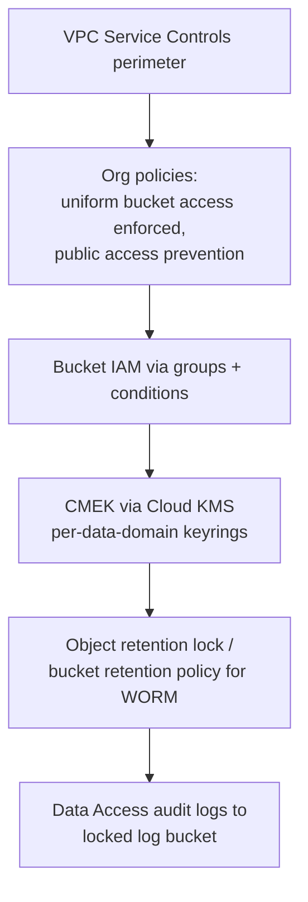

# Cloud Storage — Senior-Level Deep Dive

At senior level, GCS questions are really architecture questions: lakehouse layout, multi-region strategy, cost governance at petabyte scale, and security posture. The API is easy; the trade-offs are the interview.

## Location Strategy: Region vs Dual-Region vs Multi-Region

| | Region | Dual-region | Multi-region |
|---|---|---|---|
| Example | `us-central1` | `nam4` (Iowa+S. Carolina) | `US` |
| Durability | 11 nines | 11 nines | 11 nines |
| Availability SLA (Standard) | 99.9% | 99.95% | 99.95% |
| Write/read latency | Lowest (co-located compute) | Low, both regions local | Unpredictable — data may be far from compute |
| Cost | Cheapest | ~+40% | Between |
| Egress to compute | Free in-region | Free in either paired region | **Billed** if compute region ≠ data location bucket region |

**Senior-level answer:** analytics lakes belong in a **single region co-located with compute** (Dataproc/BigQuery/Dataflow in the same region). Multi-region buckets for analytics are an anti-pattern — you pay a premium for replication you don't need and risk inter-region read latency. Dual-region is the DR sweet spot: active-active access with a defined RPO via turbo replication (15-minute RPO SLA) when business continuity demands it.

## Lakehouse Layout and Zone Design

```text
gs://corp-lake-raw/          # immutable landing, lifecycle to Coldline @ 60d
  source=salesforce/dt=2024-06-10/...
gs://corp-lake-curated/      # Parquet/Iceberg, Standard class, no lifecycle
  events/                    # Iceberg table dir - managed by table format
gs://corp-lake-exports/      # outbound shares, 30d delete rule
gs://corp-tmp/               # Spark scratch, 3d delete rule, soft delete off
```

Separate buckets per zone — not one bucket with prefixes — because:
1. **IAM boundaries**: raw is write-only for ingestion SAs, read-only for processing SAs; curated is the inverse. Bucket-level IAM is simpler to audit than prefix conditions.
2. **Lifecycle isolation**: aggressive deletion on tmp/exports can't accidentally hit curated data.
3. **Cost attribution**: storage billing reports per bucket map cleanly to zones.
4. **Blast radius**: a misconfigured retention or a bucket-level mistake stays contained.

With **Iceberg/Delta on GCS**, lifecycle rules must NOT touch table directories — the table format owns file lifecycle (snapshot expiry, compaction). A lifecycle delete rule racing Iceberg's own GC corrupts tables. Interviewers love this edge case.

## Cost Governance at Petabyte Scale

Where the money actually goes (typical 1 PB lake):

| Line item | Driver | Lever |
|---|---|---|
| At-rest storage | Class mix | Lifecycle/Autoclass, compression, format (Parquet+ZSTD ≈ 3–5× smaller than JSON) |
| Class A ops (writes/lists) | Small files, naive `ls` | Compaction, manifest-based listing (Iceberg avoids full prefix scans) |
| Class B ops (reads) | Scan patterns | Column pruning, partition pruning |
| Retrieval fees | Cold-class reads | Audit before transitioning prefixes colder |
| Egress | Cross-region/internet | Co-location, VPC-SC aware design, CDN for serving |
| Soft delete + versions | Churn on versioned buckets | `numNewerVersions` rules, tune soft-delete window |

**The small-files tax, quantified:** 1 billion 100 KB objects vs 100 thousand 1 GB objects is the same 100 TB at rest, but listing and reading the former costs ~10,000× more in Class A/B operations and destroys Spark planning time. Compaction is a cost-optimization tool, not just a performance one.

```bash
# Find cost hotspots: storage by class and prefix
gcloud storage du gs://corp-lake-raw --summarize --readable-sizes
# Storage Insights datasets -> BigQuery for object-level inventory analysis
```

**Storage Insights** exports object metadata (class, age, size, last access via access logs) to BigQuery — build a dashboard answering "what % of Standard-class bytes haven't been read in 90 days?" That query usually funds the project.

## Security Architecture

**Layered model for a regulated environment:**



- **VPC Service Controls** is the exfiltration backstop: even a leaked SA key can't copy data to a bucket outside the perimeter. Standard in finance/health interviews.
- **Public access prevention** + **uniform bucket-level access** as org policies — not per-bucket settings someone can forget.
- **CMEK with per-domain keys** enables crypto-shredding: destroy the key, and data is unrecoverable regardless of replicas — a practical GDPR-erasure complement for immutable raw zones.
- **Retention lock (WORM)**: bucket retention policy + lock for SOX/FINRA. Once locked it cannot be reduced — model retention costs *before* locking.

## Performance Engineering

- **Throughput scaling:** per-prefix write QPS ramps up; for true high-QPS ingest (IoT firehose), randomize key prefixes or — better — buffer through Pub/Sub and write large batched objects.
- **Read path for Spark:** the GCS connector translates ranged reads; Parquet footer reads are sensitive to latency. Tune `fs.gs.inputstream.fadvise=RANDOM` for columnar formats, `SEQUENTIAL` for full-file streaming.
- **Composite objects** for parallel upload; remember composed objects lack MD5 (CRC32C only) — pipelines validating MD5 will reject them.
- **hierarchical namespace (HNS) buckets**: atomic folder rename — relevant for Hadoop-style workloads doing directory commits; pairs with the GCS connector's directory-rename-based output committers.

## DR and Data Resilience

Replication ≠ backup. Multi-region protects against infrastructure loss, not `DELETE` or ransomware. A senior answer covers both:

| Threat | Control |
|---|---|
| Region failure | Dual-region bucket (turbo replication, 15-min RPO) or async copy job |
| Accidental delete | Soft delete window + object versioning on curated zones |
| Malicious delete (compromised admin) | Retention lock, separate backup project with deny policies, cross-project copies |
| Logical corruption (bad pipeline write) | Table-format time travel (Iceberg/Delta snapshots) + raw zone immutability for replay |

The raw zone *is* the backup of the curated zone: as long as raw is immutable and retained, every curated table is rebuildable. That argument — replayability over snapshot backups — is the mark of a senior data platform answer.

## ⚡ Cheat Sheet

**Storage classes**

| Class | Min duration | Use |
|---|---|---|
| Standard | none | Hot data, active lake zones |
| Nearline | 30d | Monthly-access raw/archive |
| Coldline | 90d | Quarterly access, DR copies |
| Archive | 365d | Compliance, rarely touched |

**Decision rules**
- Predictable aging → lifecycle rules; unpredictable access → Autoclass.
- Analytics lake → single region, same region as compute. DR requirement → dual-region, not multi-region.
- One bucket per zone (raw/curated/exports/tmp); IAM at bucket level; uniform access always on.
- Never point lifecycle delete rules at Iceberg/Delta table paths — the table format owns its files.
- 1000+ writes/sec to one prefix → randomize prefixes or buffer via Pub/Sub.

**Key commands**

```bash
gcloud storage buckets update gs://b --lifecycle-file=lc.json
gcloud storage buckets update gs://b --uniform-bucket-level-access
gcloud storage cp big.parquet gs://b/ --parallel-composite-upload-threshold=150M
gcloud storage du gs://b --summarize --readable-sizes
gcloud storage buckets notifications create gs://b --topic=t --event-types=OBJECT_FINALIZE
```

**Say this in the interview**
- "GCS is strongly consistent — list-after-write included — so unlike old S3 setups, no commit-protocol workarounds are needed."
- "Multi-region for an analytics lake is an anti-pattern: you pay replication premium and egress to compute. Single region co-located, dual-region only for DR."
- "The raw zone is my backup: immutable, lifecycle-tiered, and every downstream table is replayable from it."
- "Small files are a billing problem before they're a performance problem — Class A operations scale with object count, not bytes."
