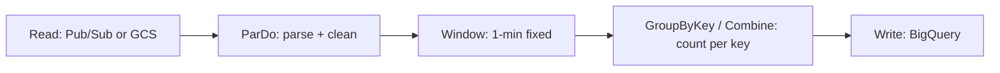
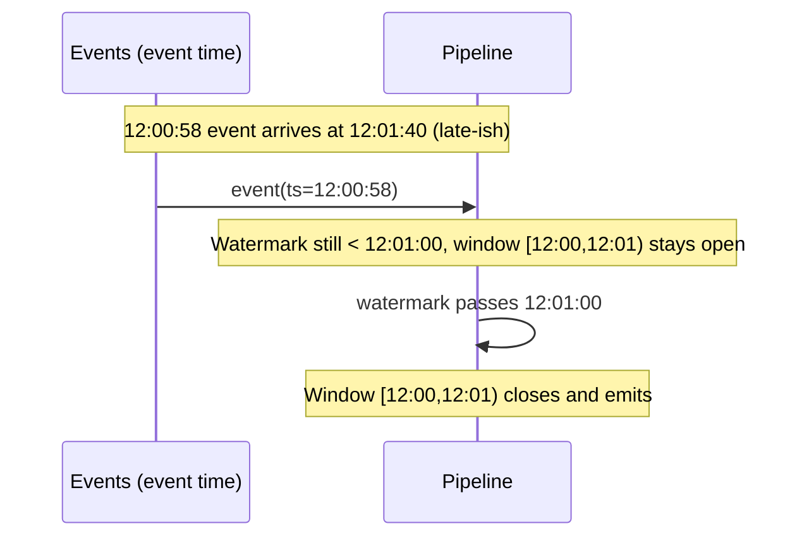
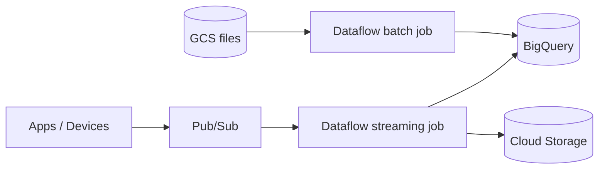

# Dataflow / Apache Beam — Fundamentals

Think of it like a conveyor-belt factory you design on paper. You sketch the assembly line — "items arrive here, this station cleans them, this one groups them into boxes of ten, this one ships them" — without ever deciding how many workers the factory employs. Then you hand the blueprint to a factory operator (Dataflow) who hires workers, speeds the belts up when boxes pile up, lets workers go when it's quiet, and keeps the line running 24/7. **Apache Beam is the blueprint language; Dataflow is the factory operator.**

## The Two Names

- **Apache Beam** — an open-source *programming model* (SDKs in Java, Python, Go) for defining data pipelines. One model for both batch and streaming.
- **Cloud Dataflow** — Google's fully managed *runner* that executes Beam pipelines: provisions workers, autoscales, rebalances work, handles failures.

The same Beam pipeline can also run on Spark, Flink, or locally (DirectRunner) — runner portability is a core selling point.

## Core Concepts

| Concept | What it is | Factory analogy |
|---------|-----------|------------------|
| **Pipeline** | The whole DAG of processing | The blueprint |
| **PCollection** | An immutable, distributed dataset (possibly unbounded) | Items on a belt |
| **PTransform** | An operation producing new PCollections | A station |
| **ParDo / DoFn** | Per-element processing (like flatMap) | A worker's task card |
| **GroupByKey / Combine** | Shuffle + aggregate by key | Sorting into bins |
| **Runner** | Engine that executes the pipeline | The factory operator |



## A First Pipeline (Python)

Batch word count, runnable locally:

```python
import apache_beam as beam
from apache_beam.options.pipeline_options import PipelineOptions

options = PipelineOptions()  # DirectRunner by default

with beam.Pipeline(options=options) as p:
    (
        p
        | "Read" >> beam.io.ReadFromText("gs://my-bucket/input.txt")
        | "Split" >> beam.FlatMap(lambda line: line.split())
        | "PairWithOne" >> beam.Map(lambda w: (w, 1))
        | "CountPerWord" >> beam.CombinePerKey(sum)
        | "Format" >> beam.Map(lambda kv: f"{kv[0]}: {kv[1]}")
        | "Write" >> beam.io.WriteToText("gs://my-bucket/output/counts")
    )
```

Run the same pipeline on Dataflow by changing only options:

```bash
python wordcount.py \
  --runner=DataflowRunner \
  --project=my-project \
  --region=us-central1 \
  --temp_location=gs://my-bucket/tmp \
  --staging_location=gs://my-bucket/staging
```

That's the key junior-level insight: **the code doesn't change between local testing and a 500-worker cluster — only the runner does.**

## Batch vs Streaming: One Model

- A **bounded** PCollection (files, a BigQuery table) → batch execution.
- An **unbounded** PCollection (Pub/Sub, Kafka) → streaming execution.

The Beam model unifies them with four questions ("**What / Where / When / How**"):

1. **What** are you computing? (transforms: sums, joins, ML)
2. **Where** in event time? (windowing)
3. **When** to emit results? (triggers + watermarks)
4. **How** do refinements relate? (accumulation mode)

## Windowing (First Look)

Unbounded streams must be chopped into finite chunks to aggregate. Window types:

| Window | Example | Use |
|--------|---------|-----|
| Fixed | Every 60 s | Per-minute metrics |
| Sliding | 5-min window, every 1 min | Moving averages |
| Session | Gap of 10 min closes session | User activity sessions |
| Global | One window forever | Batch, or custom triggers |

```python
import apache_beam as beam
from apache_beam import window

events = (
    p
    | beam.io.ReadFromPubSub(topic="projects/p/topics/clicks")
    | beam.Map(parse_event)        # must produce timestamped elements
    | beam.WindowInto(window.FixedWindows(60))
    | beam.combiners.Count.PerKey()
)
```

## Event Time vs Processing Time, and Watermarks

Two clocks:

- **Event time** — when the event actually happened (timestamp inside the data).
- **Processing time** — when the pipeline sees it.

Events arrive late and out of order (mobile clients offline, network retries). The **watermark** is the system's running estimate of "I've probably seen all events older than time T." When the watermark passes the end of a window, that window's result can be emitted.



Junior takeaway: windows close based on the **watermark** (event time), not the wall clock — that's how Beam produces correct results on out-of-order data.

## What Dataflow the Service Adds

- **Autoscaling**: worker count grows/shrinks with backlog and CPU.
- **Dynamic work rebalancing**: stragglers' remaining work is redistributed (batch).
- **Fully managed**: no cluster to create — each job gets its own ephemeral workers.
- **Exactly-once processing** within the pipeline by default (dedup of retried bundles).
- **Templates**: package a pipeline so non-developers can launch it with parameters (Google ships pre-built ones like "Pub/Sub to BigQuery").

Launch a Google-provided template without writing any code:

```bash
gcloud dataflow flex-template run pubsub-to-bq-$(date +%s) \
  --template-file-gcs-location \
    gs://dataflow-templates-us-central1/latest/flex/PubSub_to_BigQuery_Flex \
  --region us-central1 \
  --parameters \
inputTopic=projects/my-project/topics/events,\
outputTableSpec=my-project:ds.events
```

## Where Dataflow Sits in a GCP Pipeline



The canonical GCP streaming stack: **Pub/Sub → Dataflow → BigQuery**. Expect to be asked about this trio together.

## Common Junior Interview Questions

**Q: What's the difference between Beam and Dataflow?**
Beam is the open-source SDK/model for writing pipelines; Dataflow is Google's managed service that runs them. Beam pipelines are runner-portable.

**Q: What is a PCollection?**
An immutable, distributed collection of elements — bounded (batch) or unbounded (streaming) — with each element carrying a timestamp and window.

**Q: Why do we need windowing?**
You can't aggregate an infinite stream; windows divide it into finite, event-time-based chunks so GroupByKey/Combine can produce results.

**Q: What is a watermark?**
The pipeline's estimate of event-time completeness — "all data up to time T has probably arrived." It controls when windows fire.

**Q: ParDo vs Map?**
`Map` is 1-to-1 sugar; `ParDo` with a `DoFn` is the general per-element primitive — 0..N outputs per input, with setup/teardown, side inputs, and multiple outputs.

## Recap

- Beam = model (PCollections + PTransforms), Dataflow = managed runner.
- One model for batch and streaming; bounded vs unbounded is the only difference.
- Event time + watermarks + windows = correct answers on out-of-order data.
- Dataflow adds autoscaling, rebalancing, exactly-once, templates.

If you can draw Pub/Sub → Dataflow → BigQuery, define PCollection/ParDo/window/watermark, and explain event time vs processing time, you've cleared the junior bar.
