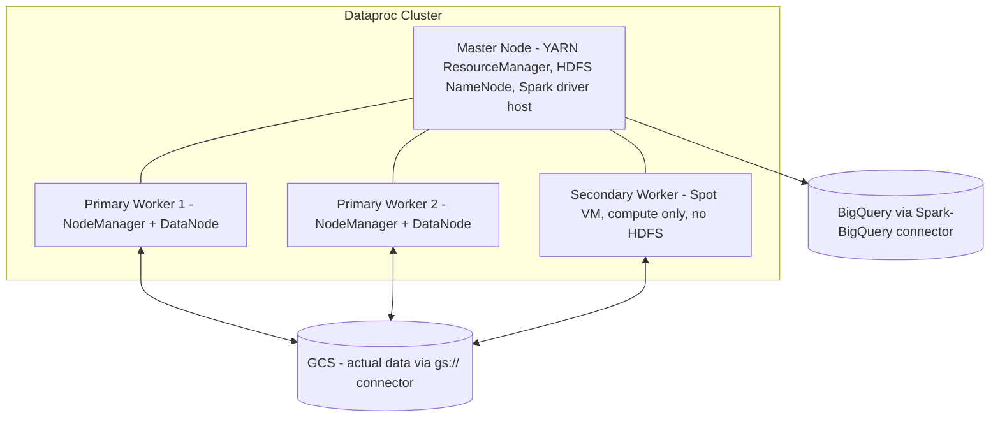

# Dataproc / Spark & Hadoop — Fundamentals


## 🎯 Analogy

Think of Dataproc like EMR for GCP: managed Hadoop/Spark clusters that spin up in 90 seconds, run your job, and can auto-delete — much cheaper than keeping a permanent cluster idle.

---
## Plain-English Analogy

Think of it like renting a fully staffed food truck instead of building a restaurant. Running your own Hadoop/Spark cluster on-premises is like owning a restaurant: you bought the building, hired the staff, and you pay for all of it even on quiet Tuesdays. **Dataproc is the food truck rental**: you call Google, and in about 90 seconds you get a truck with chefs (Spark/Hadoop pre-installed and configured), you cook your meal (run your job), and then you return the truck and stop paying. Need a bigger truck tomorrow? Rent a bigger one. Burned the food? Return the truck, rent a fresh one — no cleanup.

The killer feature is that the **ingredients live in your own warehouse (GCS), not on the truck** — so trucks are disposable.

## What Is Dataproc?

Dataproc is **GCP's managed Spark and Hadoop service**. It runs open-source big data engines — Spark, Hadoop MapReduce, Hive, Pig, Presto/Trino, Flink — on Google-managed VMs.

Key facts for interviews:

- Clusters spin up in **~90 seconds** (vs. tens of minutes for classic on-prem provisioning).
- Billing is **per-second** with a 1-minute minimum, on top of the underlying Compute Engine VM cost (Dataproc adds ~$0.01 per vCPU-hour).
- Storage is **decoupled from compute**: data lives in GCS via the GCS connector (`gs://` paths work anywhere `hdfs://` paths do).
- Two execution modes: **clusters** (you manage the cluster lifecycle) and **Dataproc Serverless** (you submit a Spark batch; Google manages everything).

## Cluster Anatomy



- **Master node(s):** run YARN ResourceManager, HDFS NameNode, job drivers. 1 master (standard) or 3 (high-availability).
- **Primary workers:** run YARN NodeManagers and HDFS DataNodes. Regular VMs.
- **Secondary workers:** optional **preemptible/Spot VMs** — cheap (~60–91% discount) compute-only nodes that never store HDFS data, so losing one doesn't lose data.

## Create a Cluster and Run a Job

```bash
# Create a small cluster
gcloud dataproc clusters create demo-cluster \
    --region us-central1 \
    --master-machine-type n2-standard-4 \
    --worker-machine-type n2-standard-4 \
    --num-workers 2 \
    --image-version 2.2-debian12

# Submit a PySpark job
gcloud dataproc jobs submit pyspark gs://my-bucket/jobs/wordcount.py \
    --cluster demo-cluster \
    --region us-central1 \
    -- gs://my-bucket/input/ gs://my-bucket/output/

# Delete the cluster when done — this is the habit interviewers look for
gcloud dataproc clusters delete demo-cluster --region us-central1 --quiet
```

A minimal PySpark job reading from and writing to GCS:

```python
import sys
from pyspark.sql import SparkSession
from pyspark.sql import functions as F

spark = SparkSession.builder.appName("wordcount").getOrCreate()

input_path, output_path = sys.argv[1], sys.argv[2]

df = spark.read.text(input_path)

counts = (
    df.select(F.explode(F.split(F.col("value"), r"\s+")).alias("word"))
    .groupBy("word")
    .count()
    .orderBy(F.desc("count"))
)

counts.write.mode("overwrite").parquet(output_path)
```

Note: no HDFS anywhere. `gs://` in, `gs://` out. That is the GCP-native pattern.

## Clusters vs Serverless

| Aspect | Dataproc Cluster | Dataproc Serverless |
|---|---|---|
| You manage | Cluster create/size/delete | Nothing — submit a batch |
| Startup | ~90s cluster + job start | Job starts when resources allocate (tens of seconds to minutes) |
| Engines | Spark, Hadoop, Hive, Trino, Flink | Spark only |
| Autoscaling | You configure policies | Automatic (Spark dynamic allocation) |
| Best for | Long-running, multi-job, Hive/Hadoop, custom setups | One-off and scheduled Spark batches |
| Billing | VM-seconds while cluster lives | DCU-seconds only while job runs |

Junior-level summary: *"If my workload is just Spark jobs, Serverless removes cluster management entirely. If I need Hadoop ecosystem tools, long-lived interactive clusters, or fine control, I use clusters."*

## The Ephemeral Cluster Pattern (Must-Know)

The single most important Dataproc concept for interviews:

> **Create a cluster per job (or per workflow), run the job, delete the cluster.**

Why it works on GCP and didn't on-prem:
1. Data is in **GCS**, not HDFS → nothing is lost when the cluster dies.
2. Hive metastore can be externalized (**Dataproc Metastore** or BigQuery) → table definitions survive.
3. 90-second startup → creation overhead is trivial.

Benefits: pay only for job duration, perfectly sized cluster per job, no configuration drift, no zombie clusters, upgrades are trivial (new cluster = new image version).

```bash
# Workflow template: create cluster -> run jobs -> delete, as one unit
gcloud dataproc workflow-templates create nightly-etl --region us-central1

gcloud dataproc workflow-templates set-managed-cluster nightly-etl \
    --region us-central1 \
    --cluster-name etl-ephemeral \
    --num-workers 4 \
    --worker-machine-type n2-standard-8

gcloud dataproc workflow-templates add-job pyspark \
    gs://my-bucket/jobs/transform.py \
    --step-id transform \
    --workflow-template nightly-etl \
    --region us-central1

gcloud dataproc workflow-templates instantiate nightly-etl --region us-central1
```

## Connectors: GCS and BigQuery

- **GCS connector** is pre-installed: any Hadoop/Spark code that reads `hdfs://` paths can read `gs://` paths. This is the foundation of compute/storage separation.
- **BigQuery connector** lets Spark read/write BigQuery tables:

```python
df = (
    spark.read.format("bigquery")
    .option("table", "proj.dataset.sales")
    .load()
)

(
    df.groupBy("region").sum("amount")
    .write.format("bigquery")
    .option("table", "proj.dataset.sales_by_region")
    .option("temporaryGcsBucket", "my-temp-bucket")
    .save()
)
```

## When Dataproc vs Dataflow vs BigQuery? (First Pass)

| Question | If yes → |
|---|---|
| Is it SQL over structured data? | **BigQuery** (simplest, serverless) |
| Existing Spark/Hadoop code, or Spark ML / complex Python logic? | **Dataproc** |
| New streaming pipeline or unified batch+stream, no Spark legacy? | **Dataflow** (Apache Beam) |
| Lift-and-shift a Hadoop estate? | **Dataproc** (HDFS→GCS, jobs mostly unchanged) |

You will go deeper on this in the senior material — at junior level, lead with "BigQuery if SQL fits; Dataproc when there's existing Spark/Hadoop; Dataflow for Beam-native streaming."

## Pricing Mental Model

```text
Cluster cost = (VM cost per hour x nodes x hours)
             + (Dataproc premium: $0.010 per vCPU per hour)
             + (persistent disk + optional GPU)

Example: 1 master + 4 workers, all n2-standard-4 (4 vCPU, ~$0.19/hr each):
  VMs:      5 x $0.19          = $0.97/hr
  Premium:  20 vCPU x $0.01    = $0.20/hr
  Total:    ~ $1.17/hr -> a 2-hour nightly job ~ $2.40/night
```

The same job on an always-on cluster: $1.17 × 24 × 30 ≈ **$842/month** vs. ephemeral ≈ **$72/month**. That 10x ratio is the story interviewers want you to tell.

## Common Junior Mistakes

- Leaving clusters running overnight/weekends ("zombie clusters") — use ephemeral clusters or `--max-idle`:

```bash
gcloud dataproc clusters create demo \
    --region us-central1 \
    --max-idle 30m \
    --max-age 6h
```

- Storing real data in HDFS on the cluster — it dies with the cluster; use GCS.
- Using preemptible VMs as **primary** workers — secondaries only.
- Hardcoding cluster hostnames in jobs — pass paths/configs as arguments.

## Quick Self-Check

1. Where should data live for Dataproc jobs? → *GCS, via the `gs://` connector.*
2. What's the ephemeral cluster pattern? → *Create → run → delete; storage decoupled in GCS makes clusters disposable.*
3. What are secondary workers? → *Optional Spot/preemptible compute-only nodes with no HDFS DataNode.*
4. Cluster vs Serverless in one line? → *Serverless = submit Spark batches with zero cluster management; clusters = full control + whole Hadoop ecosystem.*
5. What does Dataproc cost on top of VMs? → *About one cent per vCPU per hour.*

## ▶️ Try It Yourself

```bash
# Create a Dataproc cluster
gcloud dataproc clusters create orders-cluster \
  --region=us-central1 \
  --num-workers=3 \
  --worker-machine-type=n1-standard-4 \
  --image-version=2.1-debian11

# Submit a PySpark job
gcloud dataproc jobs submit pyspark gs://my-bucket/scripts/transform_orders.py \
  --cluster=orders-cluster \
  --region=us-central1 \
  -- --date=2024-01-15 --output=gs://my-bucket/silver/

# Auto-delete cluster after job (cost-efficient)
gcloud dataproc clusters delete orders-cluster --region=us-central1 --quiet
```

> **Run it:** Copy the snippet into a REPL or file and run it — no external services needed for the basic example.

---
