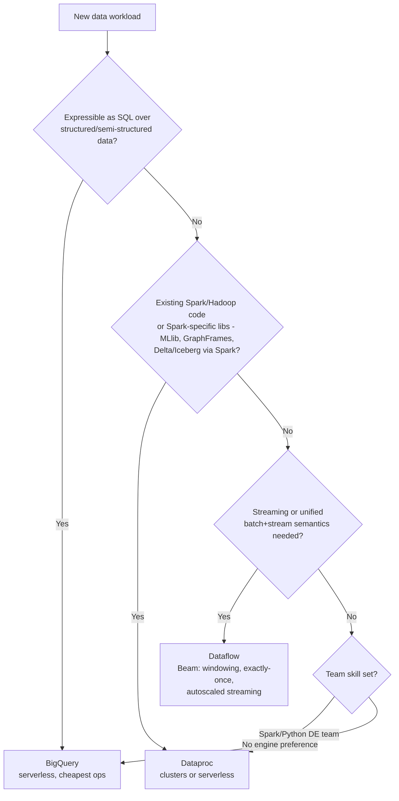

# Dataproc / Spark & Hadoop — Senior Deep Dive

## The Decision Framework: Dataproc vs Dataflow vs BigQuery

Senior candidates are expected to give a *framework*, not a feature list. Use three axes: **workload shape, team skills, and operational model**.



Nuances that separate senior answers:

- **BigQuery first** is the GCP-native bias: if 80% of a "Spark" pipeline is joins/aggregations on structured data, BigQuery SQL does it with zero infrastructure and often cheaper. Push back on Spark-by-default.
- **Dataflow vs Dataproc for streaming:** Dataflow's per-stage autoscaling, dynamic work rebalancing, and exactly-once semantics make it the default for *new* streaming. Spark Structured Streaming on Dataproc is the right call when the team already operates Spark streaming jobs or needs Spark-only libraries.
- **Dataproc's moat:** lift-and-shift Hadoop/Hive/Spark estates, Spark ML, fine-grained engine control (custom Spark builds, specific versions), and open table formats with engine portability.
- **Cost shape:** BigQuery bills per scan (on-demand) or slots; Dataflow per worker-second with fine-grained autoscaling; Dataproc per VM-second (cheapest raw compute if utilization is high, most expensive if clusters idle).

One-liner: *"SQL-shaped → BigQuery. Beam-shaped streaming → Dataflow. Spark-shaped or Hadoop-legacy → Dataproc. Then validate against team skills and ops budget."*

## Hadoop Migration to Dataproc: The Senior Playbook

The migration question — "you have a 50-node on-prem Hadoop cluster, move it to GCP" — is a staple. The playbook:

### Phase 1 — Inventory and classify
- Catalog jobs (MapReduce, Hive, Spark, Oozie), data (HDFS TBs, formats), and SLAs.
- Classify each workload: **lift-and-shift** (run as-is on Dataproc), **modernize** (Hive → BigQuery, Oozie → Composer), or **retire**.

### Phase 2 — Data first: HDFS → GCS
```bash
# Push-based transfer from the on-prem cluster
hadoop distcp \
    -m 100 \
    -update -skipcrccheck \
    hdfs://onprem-nn:8020/data/warehouse \
    gs://datalake-raw/warehouse
```
- Use Transfer Appliance/Storage Transfer Service for very large estates or thin pipes.
- Convert legacy formats opportunistically (Text/Sequence → Parquet/ORC stays valid; Parquet preferred).
- **Anti-pattern to call out:** recreating long-lived HDFS on Dataproc PDs. GCS becomes the data layer; HDFS remains only as scratch.

### Phase 3 — Metadata and orchestration
- Hive Metastore → **Dataproc Metastore** (managed HMS, importable from a MySQL dump).
- Oozie/cron → **Cloud Composer**.
- Kerberos/Ranger → IAM + (if table/column ACLs needed) BigLake or Ranger component on Dataproc.

### Phase 4 — Compute: monolith → ephemeral fleet
The architectural transformation: one shared 50-node cluster becomes **many job-scoped ephemeral clusters / serverless batches**. Each pipeline gets right-sized, isolated compute; org-wide utilization goes from ~30% (typical shared Hadoop) toward effective 90%+ (pay-per-job).

### Phase 5 — Validate and cut over
- Dual-run critical pipelines; reconcile outputs (row counts, checksums, financial totals).
- Cut over consumers; keep on-prem read-only for a quarantine period.

Migration risks to volunteer: hidden job interdependencies via HDFS paths, hardcoded `hdfs://` URIs, NameNode-dependent tooling, small-files explosions becoming GCS list-cost problems, and Kerberos-era assumptions in custom code.

## Performance Engineering on Dataproc

### Shuffle is the battleground
- Shuffle lives on **local disk**, not GCS. For shuffle-heavy jobs attach local SSDs (`--num-worker-local-ssds 2`) — NVMe SSDs deliver far higher IOPS than PD.
- **EFM (Enhanced Flexibility Mode)** redirects shuffle to primary workers so Spot secondaries are safe; the trade is more load on primaries — size them up.
- AQE (`spark.sql.adaptive.enabled`, default on modern images) fixes the two classic killers: too many tiny shuffle partitions and skewed joins.

### GCS read path
- The GCS connector's `fs.gs.inputstream.fadvise=AUTO` switches between sequential and random read modes; columnar formats benefit from random.
- Avoid `LIST`-heavy patterns: deep partition trees with thousands of dirs make job planning slow. Prefer fewer, larger partitions + Parquet predicate pushdown, or move the table to BigLake/BigQuery.
- Target file sizes 128MB–1GB; compact small files as a standing maintenance job.

### Right-sizing methodology
1. Run the job once with defaults; capture from the Spark UI: stage durations, shuffle read/write bytes, spill, max task memory.
2. Spill to disk → more executor memory or more partitions. Idle cores in long stages → fewer, bigger executors (or fix skew).
3. Scale test: same job at 2x workers — if runtime doesn't near-halve, you're bottlenecked on skew, driver, or input parallelism, and more money won't help.

### Driver and master sizing
- The Dataproc job driver runs on the master. Many concurrent jobs on one cluster → master is the bottleneck (`dataproc:dataproc.scheduler.driver-size-mb` based scheduling). High-concurrency shared clusters need large masters or, better, job-scoped clusters.

## Architecture Trade-offs Worth Articulating

| Decision | Option A | Option B | Senior guidance |
|---|---|---|---|
| Cluster model | Long-lived shared | Ephemeral per-job | Ephemeral by default; long-lived only for interactive/notebook or sub-minute-SLA repeated jobs |
| Engine mode | Clusters | Serverless | Serverless for pure Spark batch; clusters for Hadoop ecosystem, custom images, GPUs, strict control |
| Storage | HDFS on PD | GCS | GCS always for persistent data; HDFS/local SSD only for shuffle & scratch |
| Cheap compute | Spot secondaries + EFM | All on-demand | Spot for retry-tolerant batch; cap ~50%, never for streaming |
| Metadata | Dataproc Metastore | BigQuery-native tables | If consumers are SQL-first, land in BigQuery; DMS when Spark/Hive must own the catalog |
| Table format | Hive tables on Parquet | Iceberg/Delta on GCS | Open table format if multi-engine ACID matters; plain Parquet partitions otherwise |

## Cost Engineering

Realistic levers ranked by impact:

1. **Kill idle time** — ephemeral clusters / `--max-idle`. Typical shared-cluster utilization is 20–40%; this lever alone often cuts 50–70% of spend.
2. **Spot secondaries + EFM** — 60–91% off the secondary compute line.
3. **Right-size machine families** — n2d/t2d (AMD) often ~10–20% cheaper per perf; memory-optimized only when spill says so.
4. **Serverless for spiky schedules** — eliminates the min-cluster floor entirely.
5. **Committed use discounts** — only for genuinely steady baseline (e.g., a PHS, metastore, interactive cluster).

Example framing: "A 20-node n2-standard-8 cluster 24/7 ≈ $9k/month VMs + premium. Moving the 4 nightly pipelines to ephemeral right-sized clusters with 50% Spot dropped it to ~$1.8k/month with faster runtimes because each pipeline got its own tuned shape."

## Reliability and Operations

- **HA mode (3 masters)** protects long-lived clusters from master loss — irrelevant for ephemeral (just rerun).
- **Workflow Templates** give create-run-delete atomicity with built-in cleanup on failure; from Composer use `DataprocCreateBatchOperator` (serverless) or `DataprocInstantiateWorkflowTemplateOperator`.
- **Persistent History Server + GCS event logs** — non-negotiable for debugging deleted clusters.
- **Quotas:** ephemeral fleets at scale hit CPU/IP quota walls at peak; pre-request quota and stagger.
- Labels on clusters/jobs → cost attribution in billing export (`goog-dataproc-cluster-name` plus your own `team`, `pipeline` labels).

## ⚡ Cheat Sheet

### Key Commands

| Action | Command |
|---|---|
| Create cluster | `gcloud dataproc clusters create C --region R --num-workers N` |
| Ephemeral safety | `--max-idle 30m --max-age 6h` |
| Spot secondaries | `--num-secondary-workers 8 --secondary-worker-type spot` |
| EFM shuffle | `--properties "dataproc:efm.spark.shuffle=primary-worker"` |
| Submit PySpark | `gcloud dataproc jobs submit pyspark URI --cluster C --region R` |
| Serverless batch | `gcloud dataproc batches submit pyspark URI --region R --version 2.2` |
| Autoscaling | `gcloud dataproc autoscaling-policies import P --source f.yaml --region R` |
| Workflow template | `gcloud dataproc workflow-templates instantiate T --region R` |
| HDFS→GCS | `hadoop distcp -m 100 hdfs://nn/path gs://bucket/path` |

### Key Configs / Limits

| Item | Value / guidance |
|---|---|
| Dataproc premium | ~$0.01 per vCPU-hour on top of VM cost |
| Cluster startup | ~90 seconds |
| Billing granularity | Per-second, 1-min minimum |
| Serverless executor cores | 4, 8, or 16 only |
| Spot discount | ~60–91%, 30s preemption notice |
| Target GCS file size | 128MB–1GB |
| Graceful decommission | ≥ longest task; commonly 1h |
| AQE | `spark.sql.adaptive.enabled=true` (keep on) |

### Decision Rules

- **Engine:** SQL-shaped → BigQuery; Beam/streaming-native → Dataflow; Spark/Hadoop-shaped → Dataproc.
- **Mode:** pure Spark batch → Serverless; ecosystem/custom/interactive → clusters.
- **Cluster lifetime:** ephemeral unless interactive or sub-minute SLA on repeated jobs.
- **Spot:** retry-tolerant batch only, ≤ ~50% of capacity, with EFM.
- **Storage:** persistent data on GCS, always; local SSD for shuffle.
- **Autoscaling:** scale secondaries, pin primaries, graceful decommission on.

### One-Liners to Say in the Interview

- "Dataproc's core idea is disposable compute over durable GCS storage — the ephemeral cluster pattern."
- "I scale secondaries, not primaries — primaries hold HDFS and shuffle."
- "Spot plus EFM gives me cheap compute without losing shuffle to preemption."
- "Shared Hadoop clusters run at 30% utilization; job-scoped clusters bill at 100%."
- "Migration order: data to GCS first, metastore second, jobs third, then dissolve the monolith into ephemeral fleets."
- "If the pipeline is secretly SQL, I move it to BigQuery instead of tuning Spark."
