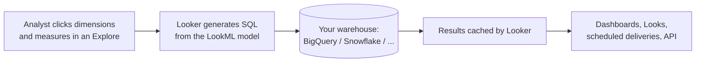

# Looker & Looker Studio — Fundamentals

**Think of it like this:** most BI tools are like giving every analyst their own calculator and a copy of the raw numbers — everyone computes "revenue" slightly differently and the Monday meeting becomes an argument about whose number is right. Looker is like installing one shared formula sheet (the LookML model) between the database and every chart: everyone's revenue is *the same* revenue, because every query is generated from the same definitions.

That "shared formula sheet" idea is the **semantic layer**, and it's why Looker matters in data engineering interviews even if you never build a dashboard: DEs increasingly own the semantic layer.

## Two Products, One Brand

| | **Looker** | **Looker Studio** (ex Data Studio) |
|---|---|---|
| What it is | Enterprise BI platform with a modeled semantic layer (LookML) | Free, lightweight dashboarding tool |
| Modeling | LookML — versioned, code-based | None — per-report field definitions |
| Governance | Central, git-backed, access controlled | Minimal |
| Query engine | Generates SQL against your warehouse | Direct connectors (BigQuery, Sheets...) |
| Typical user | Company-wide governed analytics | Quick reports, marketing dashboards, prototypes |

Interview one-liner: "Looker is governed, modeled BI as code; Looker Studio is a free canvas for quick visuals. They share a name, not an architecture."

## How Looker Works



Crucial architectural fact: **Looker stores no data**. It generates SQL, runs it in *your* warehouse, and caches results. Performance and cost problems are therefore usually *warehouse* problems — which is why DEs get pulled in.

## LookML in 60 Seconds

LookML is a declarative language describing tables (**views**), how they join (**explores**), and what fields mean (**dimensions** and **measures**).

```lookml
# orders.view.lkml
view: orders {
  sql_table_name: analytics.fct_orders ;;

  dimension: order_id {
    primary_key: yes
    type: number
    sql: ${TABLE}.order_id ;;
  }

  dimension_group: created {
    type: time
    timeframes: [date, week, month, year]
    sql: ${TABLE}.created_at ;;
  }

  dimension: status {
    type: string
    sql: ${TABLE}.status ;;
  }

  measure: total_revenue {
    type: sum
    sql: ${TABLE}.amount_usd ;;
    value_format_name: usd
  }

  measure: order_count {
    type: count
  }
}
```

```lookml
# ecommerce.model.lkml
connection: "bigquery_prod"

explore: orders {
  join: customers {
    type: left_outer
    sql_on: ${orders.customer_id} = ${customers.customer_id} ;;
    relationship: many_to_one
  }
}
```

When an analyst picks `created month`, `status`, and `total_revenue`, Looker writes the `SELECT ... GROUP BY` for them — with the join, the date truncation, and the currency formatting all coming from the model.

**Key vocabulary:**
- **View** — maps to a table (or derived query); holds dimensions and measures.
- **Explore** — an entry point for querying; defines which views join and how.
- **Dimension** — a groupable attribute (column or expression).
- **Measure** — an aggregate (SUM/COUNT/AVG...) computed at query time.
- **Look** — a saved single query/visualization. **Dashboard** — a collection of them.

## Why Data Engineers Should Care

1. **You own the tables Looker queries.** A bad explore on an unpartitioned table can scan terabytes per dashboard refresh — your BigQuery bill, your problem.
2. **The semantic layer is moving into the DE's domain.** "Define metrics once, in code, under version control" is the same philosophy as dbt; LookML predates the trend.
3. **Interview crossover questions** like "the dashboard is slow — walk me through your debugging" require knowing how Looker translates clicks to SQL.

## Looker Studio Basics

For completeness — Looker Studio connects directly to sources:

```text
BigQuery table/view  →  Looker Studio data source  →  Report
```

- Field definitions (calculated fields) live **inside each report/data source** — no shared model.
- With BigQuery, every viewer interaction can fire queries; use **extracted data sources** or BI Engine to control cost.
- Great for: prototypes, small teams, marketing/SEO dashboards. Wrong for: governed enterprise metrics.

## Quick Hands-On Mental Model

A junior-level interview may ask you to read LookML and predict the SQL:

```lookml
measure: avg_order_value {
  type: number
  sql: ${total_revenue} / NULLIF(${order_count}, 0) ;;
}
```

Generated SQL (conceptually):

```sql
SELECT
  FORMAT_TIMESTAMP('%Y-%m', created_at) AS created_month,
  SUM(amount_usd) / NULLIF(COUNT(*), 0) AS avg_order_value
FROM analytics.fct_orders
GROUP BY 1;
```

Notice the measure-built-from-measures pattern — Looker resolves the dependency graph and produces one query.

## Key Takeaways

- Looker = semantic layer + SQL generation + governance; it stores no data and pushes all compute to the warehouse.
- LookML defines views (tables), explores (join graphs), dimensions, and measures — in git-versioned code.
- One definition of every metric, reused by every dashboard — that's the core selling point.
- Looker Studio is a different, free product for lightweight reporting — know the difference crisply.
- DEs meet Looker through performance, cost, and the tables that feed the model.
