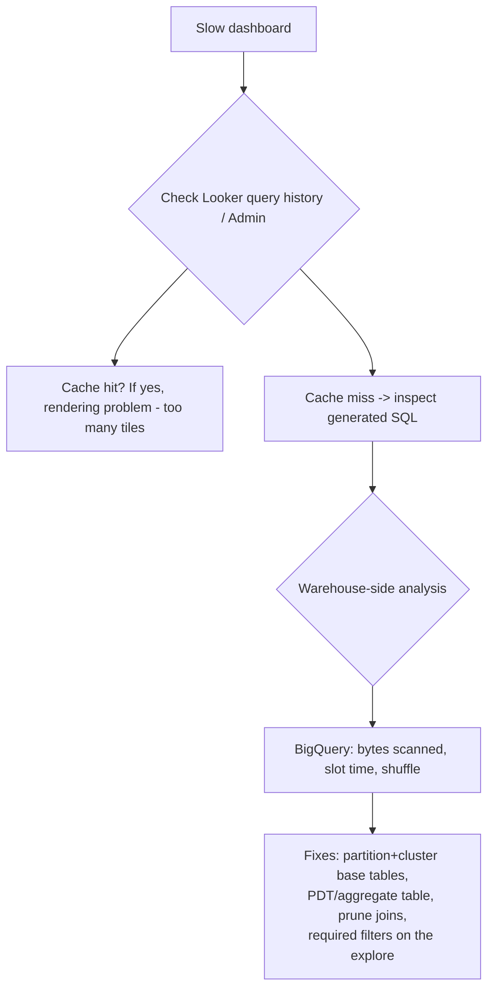

# Looker & Looker Studio — Intermediate Concepts

The mid-level material: derived tables, caching, access control, and the performance mechanics that make Looker a data engineering concern.

## Derived Tables and PDTs

A **derived table** is a view defined by a SQL query instead of a physical table.

```lookml
view: customer_facts {
  derived_table: {
    sql:
      SELECT
        customer_id,
        COUNT(*)            AS lifetime_orders,
        SUM(amount_usd)     AS lifetime_revenue,
        MIN(created_at)     AS first_order_at
      FROM analytics.fct_orders
      GROUP BY 1 ;;
  }

  dimension: customer_id { primary_key: yes }
  dimension: lifetime_orders { type: number }
  measure: avg_lifetime_revenue {
    type: average
    sql: ${TABLE}.lifetime_revenue ;;
  }
}
```

Two flavors:

| | Ephemeral derived table | **Persistent** derived table (PDT) |
|---|---|---|
| Execution | Inlined as a CTE/subquery on every query | Materialized into a scratch schema in the warehouse |
| Freshness | Always live | Rebuilt per `datagroup`/`sql_trigger` |
| Cost | Recomputed every time | Computed once per rebuild |
| Use | Cheap transformations | Expensive aggregations queried often |

Making it persistent:

```lookml
derived_table: {
  sql: ... ;;
  datagroup_trigger: nightly_etl
  partition_keys: ["created_date"]   # BigQuery: partition the PDT
  cluster_keys: ["customer_id"]
}
```

**The DE-relevant debate: PDT vs dbt model.** Same physical outcome (a materialized table). Rules of thumb:
- Transformation needed by *other* consumers (ML, exports, other BI) → **dbt/warehouse layer**.
- Aggregation specific to BI exploration, owned by analysts → PDT is acceptable.
- Watch for "PDT sprawl": critical business logic hiding in Looker scratch schemas instead of the governed transformation layer. Interviewers love asking how you'd migrate PDTs into dbt.

## Caching and Datagroups

Looker caches query results; **datagroups** define when caches invalidate and PDTs rebuild.

```lookml
datagroup: nightly_etl {
  sql_trigger: SELECT MAX(finished_at) FROM ops.etl_runs WHERE job = 'dwh_load' ;;
  max_cache_age: "24 hours"
}

explore: orders {
  persist_with: nightly_etl
}
```

Mechanics worth stating precisely in an interview:
- `sql_trigger` runs on a schedule (default every 5 min); when its scalar result **changes**, the datagroup fires: caches invalidate, PDTs rebuild.
- `max_cache_age` is the backstop — serve cached results at most this long.
- Tie the trigger to **your ETL completion table**, not a timestamp like `CURRENT_DATE`, so dashboards flip to fresh data exactly when the pipeline lands — and not before.

This is the canonical DE/BI integration point: pipeline finishes → writes a row to `ops.etl_runs` → Looker notices → caches drop → first dashboard view of the morning is both fresh and fast.

## Aggregate Awareness

Looker can route queries to pre-aggregated rollups automatically:

```lookml
explore: events {
  aggregate_table: daily_rollup {
    query: {
      dimensions: [events.event_date, events.country]
      measures: [events.event_count]
    }
    materialization: {
      datagroup_trigger: nightly_etl
    }
  }
}
```

A query asking for events by month/country hits the small rollup; a query needing user-level detail falls through to the base table. Same idea as BigQuery materialized-view smart routing — know both and say so.

## Access Control Layers

| Layer | Mechanism | Example |
|---|---|---|
| Instance/content | Roles, groups, content folders | Marketing sees only marketing folders |
| Model | `model` access via roles | Finance model restricted to finance group |
| Row-level | `access_filter` + user attributes | Region managers see their region's rows |
| Column-level | `required_access_grants` | Salary fields gated to HR grant |

Row-level security:

```lookml
explore: orders {
  access_filter: {
    field: orders.region
    user_attribute: allowed_region
  }
}
```

Looker injects `WHERE orders.region = '<user's attribute>'` into every generated query. Pair this answer with the warehouse-side alternative (BigQuery row access policies / authorized views) and the trade-off: Looker-side is BI-only enforcement; warehouse-side covers every access path but is less flexible per-user.

## Performance Debugging Workflow

"Dashboard is slow" — the structured answer:



Concrete fixes in priority order:
1. **Partition/cluster the underlying table** so generated `WHERE` clauses prune (date filters are near-universal in dashboards).
2. **`always_filter` / `sql_always_where`** on big explores to force date bounds — stops accidental full scans.
3. **Aggregate tables/PDTs** for the rollups dashboards actually display.
4. **Trim the explore's join graph** — every joined view is temptation for a 12-way join nobody needs (`fields:` parameter to restrict).
5. **Reduce dashboard tile count / merged queries** — 30 tiles = 30 queries per load.

## Looker Studio at Mid-Level

- **Extracted data sources**: snapshot up to 100 MB into Looker Studio's own storage — turns per-viewer BigQuery costs into zero, at the price of scheduled freshness.
- **BI Engine**: BigQuery-side in-memory acceleration that makes direct Looker Studio↔BQ dashboards interactive.
- **Parameters + custom queries**: pass report controls into a custom SQL data source — powerful, but every viewer interaction can rerun the query; budget accordingly.
- Governance gap is the trap: ten Looker Studio reports each redefining "active user" is exactly the problem Looker/dbt semantic layers exist to solve. Say that out loud in interviews.

## Common Pitfalls

1. **`CURRENT_DATE` as a `sql_trigger`** — fires at midnight regardless of whether ETL finished; morning dashboards show yesterday's incomplete data. Trigger on the ETL log instead.
2. **Unpartitioned PDTs on BigQuery** — a PDT rebuilt nightly scanning the full fact table costs more than the dashboards it serves. Use `partition_keys`/`cluster_keys` and incremental PDTs where supported.
3. **Symmetric aggregates surprise** — Looker handles fan-out joins correctly using HLL-based symmetric aggregates, but they're heavier SQL; many "why is this query weird" questions trace here. Requires correct `primary_key` declarations.
4. **One mega-explore** joining 15 views: slow, confusing, and every field change risks everything. Prefer purpose-built explores.

## Key Takeaways

- PDTs and aggregate tables are Looker's materialization tools — powerful, but business-critical logic belongs in the governed transformation layer (dbt), not scratch schemas.
- Datagroups tied to ETL-completion tables are the correct cache/freshness integration with your pipelines.
- Row/column security can live in Looker (flexible, BI-only) or the warehouse (universal, stricter) — know both.
- Slow dashboards: check cache → read generated SQL → fix the warehouse (partitioning, rollups, forced filters).
