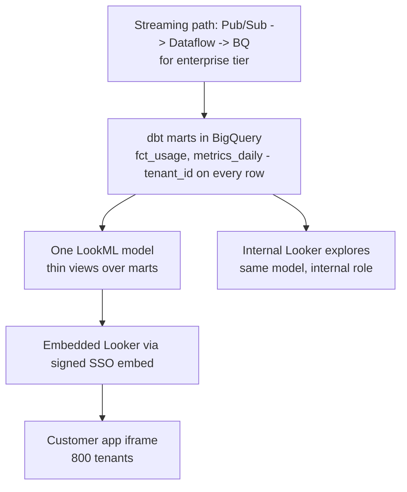

# Looker & Looker Studio — Interview Scenarios

<article data-difficulty="junior">

## 🟢 Junior: Looker or Looker Studio?

**Scenario:** A product manager asks you to recommend a BI setup. The company has a small data team, a BigQuery warehouse with dbt models, 40 dashboard consumers, and a history of "every team computes revenue differently." They've heard Looker and Looker Studio are "the same thing." What do you recommend, and how do you explain the difference?

<details>
<summary>💡 Hint</summary>

They are entirely different products sharing a brand. Think about what a semantic layer (LookML) buys you — single metric definitions, governance, git versioning — versus what a free dashboarding canvas buys you, and weigh that against team size, budget, and the "different revenue numbers" pain they already feel.

</details>

<details>
<summary>✅ Solution</summary>

**Clear the naming confusion first:**

| | Looker | Looker Studio |
|---|---|---|
| Product | Enterprise BI platform with LookML semantic layer | Free dashboarding tool |
| Metric definitions | Centralized, code-based, git-versioned | Per-report, defined by whoever builds it |
| Governance | Roles, content folders, row/column security | Minimal |
| Cost | Licensed (significant) | Free (you pay BigQuery per query) |

**The recommendation hinges on their stated pain:** "every team computes revenue differently" is precisely the problem a semantic layer solves. With Looker, `total_revenue` is defined once in LookML; all 40 consumers' charts generate SQL from that one definition.

**Balanced answer:**
- If budget allows → Looker (or another modeled BI tool): the metric-consistency pain justifies it, and they already have dbt discipline, so model-as-code will fit their culture.
- If budget doesn't allow → Looker Studio *plus discipline*: point every report at tested dbt mart tables (one official `metrics_daily` model), never raw events, and document official metric definitions. You get 70% of the governance for $0 licensing.
- Either way, the metric logic should live in dbt; the BI tool consumes it. That keeps the choice reversible.

Mentioning that the BI tool choice is *downstream* of the semantic-layer decision is what makes the answer strong, even at junior level.

</details>

</article>

<article data-difficulty="mid-level">

## 🟡 Mid-Level: The Dashboard Shows Yesterday's Data Every Morning

**Scenario:** Sales leadership complains that their Looker dashboard shows stale data until ~10am, even though the nightly ETL into BigQuery finishes at 6am. The model uses `datagroup: daily { sql_trigger: SELECT CURRENT_DATE() ;; max_cache_age: "12 hours" }`. Separately, the first person to open the dashboard each morning waits 4–5 minutes for it to load. Diagnose both problems and fix them.

<details>
<summary>💡 Hint</summary>

Walk through exactly when that `sql_trigger` fires and what's in the cache at that moment relative to the 6am ETL. Then think about what "first viewer pays the cost" implies — and which Looker feature can pre-pay it.

</details>

<details>
<summary>✅ Solution</summary>

**Problem 1 — the trigger fires at the wrong time.** `SELECT CURRENT_DATE()` changes value at **midnight**. So at midnight the datagroup fires, caches invalidate, and any query run between midnight and 6am caches *pre-ETL (yesterday's) data*. Those stale cache entries are then served all morning — until `max_cache_age` or a manual refresh clears them around 10am. The cache isn't broken; it's doing exactly what it was told.

**Fix — trigger on ETL completion, not the calendar:**

```lookml
datagroup: dwh_loaded {
  sql_trigger: SELECT MAX(finished_at)
               FROM ops.etl_runs
               WHERE job_name = 'nightly_dwh' AND status = 'success' ;;
  max_cache_age: "26 hours"   # backstop only
}

explore: sales { persist_with: dwh_loaded }
```

Now caches drop at ~6:00–6:05am (trigger checks run every few minutes), exactly when fresh data exists. The ETL should write its completion row as its final task — this is the pipeline/BI contract.

**Problem 2 — first viewer pays the warm-up.** After the 6am invalidation, the first dashboard open runs ~20 tiles of real BigQuery queries.

**Fixes, combined:**
1. **Cache warming**: schedule a delivery of the dashboard at 6:15am (to a throwaway destination or via the API). The scheduled run executes all tile queries and populates the cache — the 8am exec gets cache hits.
2. **Make the underlying queries fast anyway**: partition/cluster the fact tables (date partitioning makes dashboard date filters prune), and add an aggregate table for the daily-grain rollups the tiles display:

```lookml
aggregate_table: daily_sales {
  query: {
    dimensions: [sales.sale_date, sales.region]
    measures: [sales.revenue, sales.order_count]
  }
  materialization: { datagroup_trigger: dwh_loaded }
}
```

**Summary sentence for the interviewer:** "The datagroup was keyed to the calendar instead of the pipeline — midnight invalidation cached pre-ETL data. Trigger on the ETL log, then warm the cache with a 6:15 scheduled run and back it with an aggregate table."

</details>

</article>

<article data-difficulty="senior">

## 🔴 Senior: Designing BI Architecture for a Multi-Tenant SaaS Product

**Scenario:** Your SaaS company wants to embed analytics for 800 customer organizations inside the product: each customer sees only their own data, a few "enterprise" customers want near-real-time freshness (≤5 min), the rest are fine with hourly, and finance wants the same metric definitions used internally and externally. Data lives in BigQuery, modeled with dbt. Design the embedded BI architecture with Looker: tenancy isolation, freshness tiers, cost control, and metric consistency.

<details>
<summary>💡 Hint</summary>

Key pieces: signed embedding with user attributes for row-level isolation, one LookML model consuming the same dbt marts used internally, datagroups per freshness tier, and a cost story (caching, aggregate tables, reservations) that survives 800 tenants × N viewers. Also consider the blast radius of a mistake in row-level filtering — what enforces it besides Looker?

</details>

<details>
<summary>✅ Solution</summary>

**Architecture:**



**Tenancy isolation — layered, not single-point:**

1. **Signed embed + user attributes**: the app backend generates the signed embed URL, injecting `tenant_id` as a *locked* user attribute (user cannot edit):

```lookml
explore: usage {
  access_filter: {
    field: usage.tenant_id
    user_attribute: tenant_id
  }
}
```

2. **Defense in depth in BigQuery**: the Looker embed service account reads through **authorized views** (or row access policies) that themselves filter by a session-bound tenant parameter where feasible — so a LookML mistake alone cannot leak cross-tenant data. For the strictest enterprise contracts, per-tenant datasets are the escape hatch (trade governance overhead for hard isolation; reserve for the few who pay for it).
3. **Embed users get a minimal role**: no SQL Runner, no content creation outside their sandbox folder, no model access beyond the embedded one.

**Metric consistency:** both internal explores and the embedded model sit on the **same dbt marts** (`metrics_daily`), and LookML measures are thin aggregations over pre-computed columns. Finance's "internal = external" requirement is satisfied structurally — there is only one definition to drift from. dbt PR CI runs Looker content validation so mart changes can't silently break either surface.

**Freshness tiers without double infrastructure:**
- Standard tier: hourly micro-batch into the marts; `datagroup: hourly_load` triggered on the load log.
- Enterprise tier: streaming inserts (Pub/Sub → Dataflow) into a `*_rt` table union-ed behind the same view, with a `datagroup: rt_5min { max_cache_age: "5 minutes" }` applied to enterprise-flagged embed contexts (separate explores or model sets per tier — keeps cache policies from cross-contaminating).

**Cost control at 800 × N viewers:**
1. **Cache is the product**: hourly-tier tenants share nothing across tenants (filters differ), but each tenant's own viewers hit warm cache after the first query per hour.
2. **Aggregate tables at tenant-day grain** — embedded dashboards show rollups, so route them to a table 1000× smaller than raw events.
3. **Dedicated BigQuery reservation for the embed service account**: BI load cannot starve ETL; embed compute is a visible, capped line item. Enterprise real-time explores can get a separate small reservation.
4. **Per-tenant usage telemetry from System Activity** → bill-back or throttle abusive tenants; alert on tenants whose query mix bypasses aggregate tables.

**Failure-mode review (volunteer it):** the catastrophic risk is cross-tenant leakage — mitigated by locked user attributes + warehouse-side authorized views + an automated test that runs embed sessions for two test tenants and asserts disjoint results in CI. The expensive risk is cache-miss storms at the top of each hour — staggered datagroup triggers per tenant cohort smooth the load.

</details>

</article>

---

## Interview Tips

> **Tip 1:** "How does Looker differ from Tableau/Power BI?" — Anchor on architecture, not features: Looker generates SQL against the warehouse from a git-versioned semantic model and stores no data; the others default to imported extracts/datasets modeled per-workbook. Then pick by operating model, and note Looker's success depends on warehouse engineering — that's why it's a DE question.

> **Tip 2:** "Dashboard is slow — what do you do?" — Show the layered diagnosis: Looker query history (cache hit or miss?) → generated SQL → warehouse profile (bytes scanned, partitioning) → fix order: partition/cluster, forced filters, aggregate tables/PDTs, then dashboard design last. Jumping straight to "reduce tiles" signals a shallow toolkit.

> **Tip 3:** "Where should metric logic live — Looker or dbt?" — The mature answer is layered: heavy transformation in dbt (tested, portable, reusable by ML/notebooks), LookML as a thin governed presentation layer. Acknowledge the trade-off honestly rather than declaring one tool the winner.

---

## ⚡ Quick-fire Q&A

**Q: What is LookML?**
A: Looker's declarative modeling language: views (tables + dimensions/measures), explores (join graphs), and models (connection + explores), stored in a git repo. Looker generates SQL from it at query time.

**Q: Dimension vs measure?**
A: A dimension is a groupable attribute (column/expression); a measure is an aggregate (SUM, COUNT, AVG) computed at query time over the chosen dimensions.

**Q: What is a PDT and when do you use one?**
A: A persistent derived table — a derived query materialized into a warehouse scratch schema, rebuilt by a datagroup trigger. Use for expensive, frequently-queried, BI-specific aggregations; prefer dbt models when other consumers need the logic.

**Q: What does a datagroup do?**
A: Defines cache invalidation and PDT rebuild policy via a `sql_trigger` (fires when its result changes) plus `max_cache_age` as a backstop. Best practice: trigger on your ETL-completion log.

**Q: What is aggregate awareness?**
A: Looker automatically routes queries to pre-built rollup tables (`aggregate_table`) when the requested fields are satisfiable from them, falling back to the base table otherwise.

**Q: How do you implement row-level security in Looker?**
A: `access_filter` on the explore bound to a user attribute (e.g., region or tenant_id) — Looker injects the WHERE clause into every generated query. For defense in depth, pair with warehouse-side row access policies or authorized views.

**Q: Does Looker store your data?**
A: No — it stores metadata, the model, and query result caches. All query compute happens in the connected warehouse, which is why warehouse design dominates Looker performance and cost.

**Q: When is Looker Studio the right choice?**
A: Quick, free, lightweight reporting — prototypes, small teams, marketing dashboards — ideally pointed at governed mart tables. It lacks a shared semantic layer, so it's the wrong tool for enterprise-wide governed metrics.
