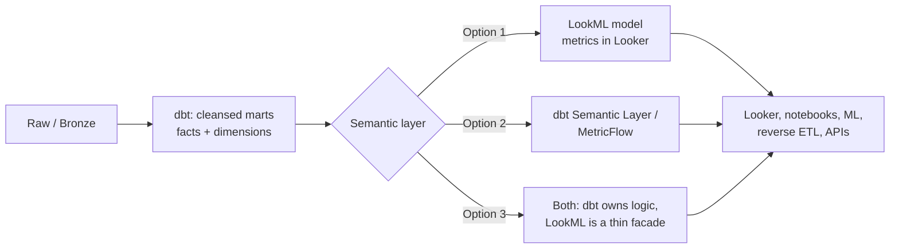

# Looker & Looker Studio — Senior-Level Deep Dive

Senior interviews don't ask you to write a measure — they ask where the semantic layer belongs in the platform, how to keep BI from bankrupting the warehouse, and how to run LookML like production software.

## The Semantic Layer as Platform Architecture

The strategic question: **where do metric definitions live?**



| Choice | Strength | Weakness |
|---|---|---|
| Metrics in LookML | Mature, governed, great exploration UX | Locked to Looker; notebooks/ML re-implement metrics |
| Metrics in dbt SL | Tool-agnostic, lives with transformations | Younger ecosystem; BI integration varies |
| Thin LookML over dbt marts | Pragmatic; logic stays portable | Discipline needed to keep LookML "thin" |

The defensible senior position: **heavy logic in dbt (tested, portable), LookML as a thin presentation/governance facade** — measures that are simple aggregations over pre-computed columns, not 40-line `sql:` blocks. Be ready to defend the opposite too: an org fully committed to Looker gains real velocity from rich LookML.

**Looker's open-SL moves** worth name-dropping: Looker Modeler / connected sheets / BI Connectors expose the LookML model to Tableau, Power BI, and SQL clients — Google's answer to "semantic layer lock-in."

## LookML as Production Software

Senior expectation: the model repo runs like any service codebase.

```text
lookml-repo/
  models/ecommerce.model.lkml
  views/ orders.view.lkml, customers.view.lkml ...
  views/refinements/            # environment- or team-specific refinements
  .lkmlstyle.yaml               # linting config
  .github/workflows/lookml-ci.yml
```

CI pipeline for LookML PRs:

```yaml
# lookml-ci.yml (sketch)
steps:
  - run: lkmlstyle check .                       # style lint
  - run: spectacles validators sql --project ecommerce --branch $BRANCH
    # Spectacles: runs every explore's generated SQL against the warehouse
  - run: spectacles validators content --project ecommerce --branch $BRANCH
    # catches dashboards/Looks broken by the change
  - run: spectacles validators assert ...        # data tests on key measures
```

- **Spectacles (or Looker's own validators via API)** turn "will this PR break 400 dashboards?" into a CI gate: SQL validator (every field still compiles against the warehouse), content validator (existing content still resolves), assert validator (metric regression tests).
- **Branching**: Looker dev mode maps to git branches; production points at main. Hotfix flow = same as code.
- **Upstream contract**: dbt CI runs Looker content validation when marts change — schema changes that would break the model fail the *dbt* PR, not Monday's dashboards. This cross-repo gate is a senior-level detail worth volunteering.

## Cost Governance: BI vs the Warehouse Bill

Dashboards are machine-generated query load; ungoverned, they dominate BigQuery spend.

**Attribution first:**

```sql
-- BigQuery INFORMATION_SCHEMA: who burns the slots?
SELECT
  user_email,
  REGEXP_EXTRACT(query, r'-- Looker Query Context.*history_slug:\s*(\w+)') AS looker_slug,
  COUNT(*) AS queries,
  ROUND(SUM(total_bytes_billed)/POW(10,12), 2) AS tb_billed
FROM `region-us`.INFORMATION_SCHEMA.JOBS_BY_PROJECT
WHERE creation_time > TIMESTAMP_SUB(CURRENT_TIMESTAMP(), INTERVAL 30 DAY)
  AND user_email LIKE '%looker%'
GROUP BY 1, 2
ORDER BY tb_billed DESC;
```

(Looker embeds query context as a SQL comment — join it back to dashboards via the System Activity model.)

**Levers, in the order they usually pay:**
1. **Partition + cluster the tables explores hit**; add `always_filter` so generated SQL always prunes.
2. **Aggregate awareness** for the rollups dashboards actually render — 95% of tiles need daily grain, not row grain.
3. **Datagroup discipline**: caches valid until ETL lands; kill `max_cache_age: 1 hour` cargo-culting on daily-refresh data.
4. **Schedule audit**: System Activity exposes hourly-refresh schedules delivering to nobody; prune them.
5. **Capacity strategy**: put Looker's service account under its own BigQuery reservation/assignment so BI contention can't starve ETL — and BI overspend is visible as its own line item.

## Scaling and Multi-Tenancy

- **Instance topology**: single instance with content/folder isolation is the default; separate instances only for hard regulatory walls (subsidiaries, regions) — cross-instance model reuse is painful.
- **Embedded analytics** (Powered by Looker): signed embed + row-level `access_filter` on tenant_id, user attributes injected at SSO. One model serves thousands of external tenants; warehouse isolation via per-tenant filters, not per-tenant schemas, until scale forces otherwise.
- **System Activity as observability**: query history, dashboard performance percentiles, content usage — export it to BigQuery and put SLOs on dashboard p95 load time like any service.

## Looker vs the Field (Senior Framing)

| Axis | Looker | Power BI | Tableau |
|---|---|---|---|
| Modeling | Code (LookML), git-native | DAX/Power Query, file-based | Workbook-embedded, Tableau Semantics emerging |
| Compute | 100% pushed to warehouse | Vertipaq import or DirectQuery | Hyper extracts or live |
| Governance at scale | Strongest (one model, CI) | Strong in MS ecosystem | Historically workbook-sprawl-prone |
| Cost profile | Warehouse pays per query | Capacity licensing | License + extract refresh compute |

Senior answer pattern: pick by **operating model** — "code-first central governance → Looker; Microsoft-stack, analyst-driven → Power BI; visualization-first analysts → Tableau" — then immediately note that the warehouse-pushdown model makes Looker's success *contingent on the data platform being well-engineered*. That's why it's a DE interview topic.

## Failure Modes at Scale (War-Story Material)

1. **The Monday 9am stampede**: caches expired over the weekend (datagroup misfire) → 400 dashboards × 20 tiles hit BigQuery simultaneously → slot exhaustion delays ETL. Fixes: ETL-completion triggers, cache warming via scheduled plans, separate reservations.
2. **PDT cascade**: PDT A references PDT B references PDT C; trigger fires → serialized rebuild chain takes 4 hours → stale-data tickets. Fix: flatten dependencies into dbt where they belong; monitor PDT build times in System Activity.
3. **Symmetric-aggregate blowup**: missing/wrong `primary_key` declarations → Looker can't trust join cardinality → HLL-heavy SQL or silently wrong sums on fan-out joins. Fix: PK hygiene + `relationship:` accuracy as a review checklist item.
4. **Explore sprawl**: 80 explores, 30 used. Quarterly content audits from System Activity usage data; deprecate ruthlessly.

## ⚡ Cheat Sheet

**Core objects**

| Object | One-liner |
|---|---|
| View | Table (or derived SQL) + its dimensions/measures |
| Explore | Join graph + entry point for querying |
| Model | Connection + set of explores |
| PDT | Derived table materialized in the warehouse scratch schema |
| Datagroup | Cache-invalidation/rebuild policy (`sql_trigger` + `max_cache_age`) |
| Aggregate table | Rollup that Looker auto-routes matching queries to |

**Decision rules**
- Business logic reused outside BI → dbt. BI-only exploration rollup → PDT/aggregate table.
- `sql_trigger` on the ETL-completion log, never on `CURRENT_DATE`.
- Always declare `primary_key` and `relationship` — symmetric aggregates depend on them.
- Big explores get `always_filter` (date) + restricted `fields:`.
- Row security: Looker `access_filter` for flexibility, warehouse policies for universal enforcement; regulated data → warehouse-side (defense in depth).

**CI for LookML**: lint (`lkmlstyle`) → SQL validator → content validator → metric asserts (Spectacles/API) → and dbt-side content validation on mart changes.

**Cost triage order**: partition/cluster → aggregate awareness → datagroup discipline → schedule audit → dedicated reservation.

**Say this in the interview**
- "Looker stores no data — every performance problem is a generated-SQL-meets-warehouse problem, which is why DEs own half of Looker."
- "We keep LookML thin: logic in dbt where it's tested and portable; Looker is the governed presentation layer."
- "Datagroups fire off our ETL-completion table, so caches drop the moment data lands — fresh and fast aren't in tension."
- "Spectacles in CI means a model PR that would break dashboards never merges."
