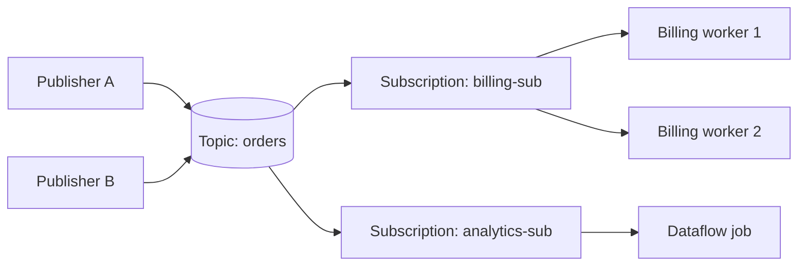
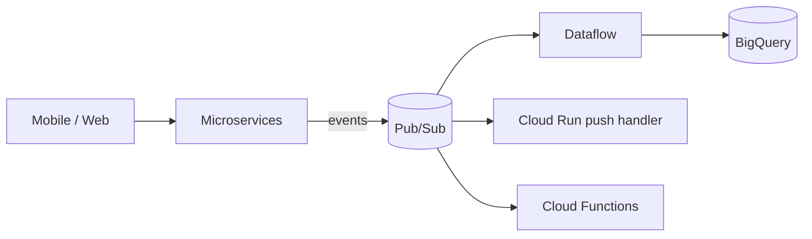

# Pub/Sub — Fundamentals

Think of it like a magazine publisher with a mailroom in between. Writers (publishers) drop finished articles into the mailroom (a topic) and walk away — they don't know or care who reads them. Readers sign up for subscriptions, and the mailroom keeps a separate stack of copies for each subscription, re-delivering any copy until the reader confirms "got it." Publisher and readers never meet, never wait for each other, and either side can be offline without breaking the other. That's Pub/Sub: a fully managed, global messaging service that decouples senders from receivers.

## Core Objects

| Object | What it is |
|--------|------------|
| **Topic** | Named channel publishers send messages to |
| **Message** | Payload (up to 10 MB) + optional attributes (key/value) + ordering key |
| **Subscription** | A named "stack of copies" — each subscription gets every message published after it was created |
| **Subscriber** | A client pulling (or receiving pushed) messages from one subscription |
| **Ack** | Subscriber's confirmation; Pub/Sub then stops re-delivering that message |

The crucial fan-out rule: **multiple subscriptions on one topic each receive all messages** (fan-out); **multiple subscribers sharing one subscription split the messages** between them (load balancing).



Billing workers 1 and 2 *share* billing-sub's messages; analytics-sub gets its own full copy of everything.

## Quick Start

```bash
# Create a topic and a subscription
gcloud pubsub topics create orders

gcloud pubsub subscriptions create billing-sub \
  --topic=orders \
  --ack-deadline=30

# Publish a message with an attribute
gcloud pubsub topics publish orders \
  --message='{"order_id": "o-123", "amount": 49.99}' \
  --attribute=region=eu

# Pull and ack
gcloud pubsub subscriptions pull billing-sub --auto-ack --limit=5
```

Python publisher and subscriber:

```python
from google.cloud import pubsub_v1

# --- Publisher ---
publisher = pubsub_v1.PublisherClient()
topic_path = publisher.topic_path("my-project", "orders")

future = publisher.publish(
    topic_path,
    data=b'{"order_id": "o-123", "amount": 49.99}',
    region="eu",                      # attribute
)
print("Published message id:", future.result())

# --- Subscriber (streaming pull) ---
subscriber = pubsub_v1.SubscriberClient()
sub_path = subscriber.subscription_path("my-project", "billing-sub")

def callback(message):
    print("Got:", message.data, message.attributes)
    message.ack()                     # confirm processing

streaming_pull = subscriber.subscribe(sub_path, callback=callback)
streaming_pull.result(timeout=60)
```

## Delivery Semantics (Junior View)

- Default delivery is **at-least-once**: a message is re-delivered until acked (or until retention expires). Duplicates are possible — after network hiccups, slow processing past the ack deadline, or subscriber crashes.
- Default ordering: **none** — messages can arrive in any order. (Ordering keys fix this; see below.)
- Therefore the golden junior rule: **subscribers must be idempotent** — processing the same message twice must be safe.

### Ack Deadlines

When a message is delivered, a countdown starts (the **ack deadline**, 10–600 s, default 10 s). If the subscriber doesn't ack in time, Pub/Sub assumes failure and redelivers. Client libraries automatically extend the deadline while you're still working ("lease management"), but if your process dies, the message comes back. Unacked messages are retained for up to 7 days by default (configurable).

## Push vs Pull

| | Pull | Push |
|---|------|------|
| Direction | Subscriber asks Pub/Sub | Pub/Sub HTTP POSTs to your endpoint |
| Receiver | Any client (VM, Dataflow, on-prem) | Must be an HTTPS endpoint (Cloud Run, App Engine, etc.) |
| Flow control | Client-controlled (great for batch-y workloads) | Pub/Sub adapts to endpoint response rate |
| Ack | Explicit `ack()` | HTTP 2xx response = ack; 4xx/5xx = nack |
| Best for | High throughput, data pipelines | Serverless event handling, low traffic |

```bash
gcloud pubsub subscriptions create webhook-sub \
  --topic=orders \
  --push-endpoint=https://my-service-abc123.a.run.app/pubsub \
  --push-auth-service-account=pubsub-invoker@my-project.iam.gserviceaccount.com
```

Rule of thumb: pipelines and high-volume consumers **pull** (Dataflow always pulls); serverless webhook-style handlers **push**.

## Ordering Keys (First Look)

Set an `ordering_key` on publish and enable ordering on the subscription: messages with the **same key** are delivered in publish order (per region). Different keys have no ordering relationship — so throughput stays parallel across keys.

```python
publisher = pubsub_v1.PublisherClient(
    publisher_options=pubsub_v1.types.PublisherOptions(
        enable_message_ordering=True)
)
publisher.publish(topic_path, b"created", ordering_key="order-123")
publisher.publish(topic_path, b"paid",    ordering_key="order-123")
publisher.publish(topic_path, b"shipped", ordering_key="order-123")
```

## Dead-Letter Topics (First Look)

If a message keeps getting nacked (bad data, a bug), it would otherwise retry until retention expires. A **dead-letter topic** moves it aside after N failed delivery attempts (5–100):

```bash
gcloud pubsub subscriptions create billing-sub \
  --topic=orders \
  --dead-letter-topic=orders-dlq \
  --max-delivery-attempts=5
```

You then attach a subscription to `orders-dlq`, alert on its depth, inspect, fix, and replay.

## Where Pub/Sub Fits



Typical uses: event-driven microservices, the ingestion front door for streaming analytics (Pub/Sub → Dataflow → BigQuery), task fan-out, and cross-service decoupling.

Also know **BigQuery subscriptions** and **Cloud Storage subscriptions** exist: Pub/Sub can write a topic's messages directly into a BigQuery table or GCS bucket — no Dataflow needed when no transformation is required.

## Common Junior Interview Questions

**Q: What happens if no subscription exists when a message is published?**
The message is effectively lost for future subscribers — a subscription only receives messages published *after* it was created. Create subscriptions before publishing matters.

**Q: Two subscribers on one subscription — do both get every message?**
No, they split the messages (load balancing). For both to get everything, give each its own subscription.

**Q: Why did my subscriber receive the same message twice?**
At-least-once delivery: ack deadline expired mid-processing, ack got lost in transit, or a redelivery raced your ack. Design idempotent handlers.

**Q: How long does Pub/Sub keep messages?**
Unacked: up to the retention period (default 7 days). Acked: gone, unless you enable "retain acked messages" or topic retention — which enables **seek/replay** to a past timestamp or snapshot.

**Q: Pub/Sub vs a task queue?**
Pub/Sub is many-to-many event distribution. For task queues with rate limiting and per-task scheduling, Cloud Tasks is the better fit.

## Recap

- Topic = channel; subscription = independent copy stream; subscribers on one subscription share work.
- At-least-once + no default ordering ⇒ idempotent consumers always.
- Ack deadline governs redelivery; dead-letter topics catch poison messages.
- Pull for pipelines, push for serverless endpoints.
- Pub/Sub → Dataflow → BigQuery is the canonical GCP streaming front door.
