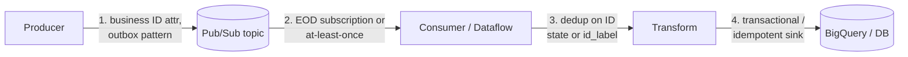

# Pub/Sub — Senior Deep Dive

Senior interviews on Pub/Sub center on architecture judgment: Pub/Sub vs Kafka vs Pub/Sub Lite trade-offs argued from first principles (storage model, ordering, consumer state), end-to-end exactly-once design, multi-region behavior, and capacity/cost engineering at scale.

## How Pub/Sub Differs From a Log (Kafka) — First Principles

Kafka is a **partitioned, ordered, replayable log**: consumers own their offsets, ordering is per partition, retention is time/size-based regardless of consumption, and consumer groups statically map partitions to consumers.

Pub/Sub is an **acked message queue with per-subscription state**: the service tracks per-message ack state, there are no partitions exposed to you, delivery order is best-effort unless ordering keys are used, and any number of subscribers elastically share a subscription with no rebalancing protocol.

Consequences worth articulating:

| Property | Kafka (log) | Pub/Sub (acked queue) |
|----------|-------------|------------------------|
| Consumer scaling | Bounded by partition count; rebalances pause consumption | Elastic; add subscribers anytime, no rebalance stalls |
| Ordering | Total per partition, free | Per ordering key, opt-in, 1 MB/s/key cap |
| Replay | Native (offsets, since data is a log) | Seek/snapshots; acked-message retention must be enabled |
| Lag semantics | Offset lag (exact) | Backlog of unacked messages (+ oldest unacked age) |
| Per-message handling | No per-message ack/nack/DLQ natively | Native ack deadline, retry policy, DLQ |
| Capacity | You provision brokers/partitions | Serverless autoscaling; quotas, no provisioning |
| Cross-region | MirrorMaker / cluster stretching — your problem | Global topic namespace; publish/subscribe from anywhere, message stored in publish region |

The deep insight: **Kafka couples ordering, partitioning, and consumer parallelism together** (the partition is the unit of all three). Pub/Sub decouples them — parallelism is unbounded, ordering is opt-in per key, and that's *why* it can be serverless: there's no partition-to-consumer assignment that needs a rebalancing protocol or capacity planning.

## Pub/Sub Lite (and Its Deprecation Lesson)

Pub/Sub Lite was the "Kafka-shaped" offering: zonal/regional, **provisioned partitions and storage**, offset-based consumption, ~5–10x cheaper at steady high throughput — and you owned capacity planning again (under-provisioned partitions throttle publishers).

**Google deprecated Pub/Sub Lite (announced 2024; shutdown March 2026).** The senior takeaway interviewers appreciate: the market mostly didn't want a half-serverless log — teams either wanted real Kafka (now served by **Google Managed Service for Apache Kafka**) or fully serverless Pub/Sub. For comparison questions, frame the modern menu as: **Pub/Sub (serverless queue) vs Managed Kafka (compatible log) vs self-run Kafka**.

### Decision Framework

| Requirement | Choice |
|-------------|--------|
| GCP-native, elastic, minimal ops, per-message DLQ/retry | Pub/Sub |
| Kafka protocol compatibility (existing apps, Connect, exactly-once transactions, compacted topics) | Managed Kafka / MSK / Confluent |
| Strict total ordering at high throughput per stream | Kafka (partition ordering has no 1 MB/s/key cap) |
| Long-tail replay as a primary feature (event sourcing) | Kafka (log retention is the native model) |
| Spiky 100x traffic with zero pre-provisioning | Pub/Sub |
| Multi-cloud portability | Kafka |

## End-to-End Exactly-Once Architecture

The full chain, stated as a senior would:



1. **Producer**: Pub/Sub has no idempotent-producer feature (unlike Kafka's `enable.idempotence` / transactions). Producer retries create real duplicates. Mitigate with a **transactional outbox** (DB transaction commits the event; a relay publishes with the row's unique ID as an attribute).
2. **Transport**: exactly-once delivery (pull, regional) removes redelivery races, but not producer dupes.
3. **Processing**: dedupe by business ID — Dataflow `id_label` (dedup window applies), or keyed state lookups, or...
4. **Sink**: the real guarantee — idempotent upsert (`MERGE` on business key) or transactional write. **Always design the sink to be safe under replay**; everything upstream is optimization.

One-liner: "Exactly-once is a property of the *whole chain*, and the cheapest place to enforce it is an idempotent sink."

## Multi-Region and DR Behavior

- Pub/Sub is a **global service**: one topic name, publishable/subscribable from any region. Messages are **stored in the region where they were published** (or restricted via message storage policy for compliance).
- A regional outage: messages stored in that region are unavailable until recovery (durably stored, synchronously replicated across zones — not lost); publishers in healthy regions keep working.
- DR design for consumers: run subscriber fleets in 2+ regions on the *same* subscription — Pub/Sub doesn't care where pulls come from; surviving region picks up everything except messages stranded in the failed region's storage.
- Message storage policy for data residency:

```bash
gcloud pubsub topics update orders \
  --message-storage-policy-allowed-regions=europe-west1,europe-west4
```

## Performance & Capacity Engineering

### Publisher Side

- **Batching** is the dominant lever: latency/throughput trade-off per batch settings.

```python
batch_settings = pubsub_v1.types.BatchSettings(
    max_messages=1000,
    max_bytes=1024 * 1024,      # 1 MB
    max_latency=0.05,           # 50 ms linger
)
publisher = pubsub_v1.PublisherClient(batch_settings=batch_settings)
```

- Compression for large payloads; claim-check via GCS above ~1 MB even though the limit is 10 MB.
- Watch publisher quota: regional publish throughput quotas are raisable but real; spread publishers across regions when global.

### Subscriber Side

- Throughput scales with subscriber processes × streams; per-stream caps (~10 MB/s) mean horizontal scaling, not bigger pipes.
- **Key metrics** (Cloud Monitoring):

| Metric | Meaning | Alert when |
|--------|---------|-----------|
| `subscription/num_undelivered_messages` | Backlog depth | Sustained growth |
| `subscription/oldest_unacked_message_age` | Worst-case lag | > SLA freshness |
| `subscription/dead_letter_message_count` | Poison rate | > baseline |
| `subscription/ack_latencies` | Handler health | p99 creeping toward deadline |
| `topic/send_request_count` by response code | Publish errors | non-OK spikes |

- Backlog + low CPU on consumers = stuck/slow downstream dependency or flow control too tight; backlog + high CPU = scale out.

### Ordering at Scale

Per-key 1 MB/s cap means ordered throughput = key cardinality × 1 MB/s (theoretical). Design keys at entity granularity (account, device). If you need *total* order over high volume, Pub/Sub is the wrong primitive — that's a Kafka single partition (with its own throughput ceiling) or a sequencer service.

## Schema Governance

Pub/Sub supports **schemas** (Avro/Protobuf) attached to topics with revisions:

```bash
gcloud pubsub schemas create order-schema \
  --type=avro \
  --definition-file=order.avsc

gcloud pubsub topics create orders \
  --schema=order-schema \
  --message-encoding=binary
```

- Publishes failing validation are rejected at the API — producer-side enforcement, unlike Kafka where the registry is client-convention.
- Schema revisions allow compatible evolution; pin subscriptions' expectations via revision ranges.
- Senior position: schema-on-topic + DLQ + filters form Pub/Sub's governance toolkit; for complex contracts, still version your payloads explicitly.

## Cost Engineering at Scale

Worked example — 50k msg/s, 2 KB average, 2 subscriptions, single region:

```text
Throughput: 50,000 × 2 KB ≈ 100 MB/s ≈ 8.2 TiB/day
Publish:    8.2 TiB/day × ~$40/TiB ≈ $330/day
Delivery:   2 subs × 8.2 TiB × $40 ≈ $660/day
Total:      ~$1,000/day ≈ $30k/month
```

Levers, in order of impact:

1. **Fewer delivered bytes**: subscription filters (filtered-out messages aren't billed as delivery), trim payloads, claim-check pattern.
2. **Fewer subscriptions on the firehose**: fan out *after* cheap processing, not at the topic.
3. **Direct subscriptions**: BigQuery/GCS subscriptions remove the Dataflow tier when there's no transform (you still pay delivery, but not Dataflow workers).
4. At very high steady throughput where cost dominates and ops is acceptable: Managed Kafka comparison becomes a legitimate exercise — that's the honest senior answer about scale economics.

## ⚡ Cheat Sheet

### Limits & Numbers

| Item | Value |
|------|-------|
| Max message size | 10 MB |
| Ack deadline | 10–600 s (default 10 s) |
| Unacked retention | up to 31 d (default 7 d) |
| Acked retention (opt-in) | up to 31 d |
| Subscription idle expiration | 31 d default — set `never` in prod |
| Ordering key publish cap | 1 MB/s per key |
| DLQ delivery attempts | 5–100 |
| Exactly-once delivery | Pull only, regional guarantee |
| Pricing | ~$40/TiB publish + ~$40/TiB per-subscription delivery |

### Commands

```bash
gcloud pubsub topics create T --schema=S --message-encoding=binary
gcloud pubsub subscriptions create S --topic=T \
  --enable-exactly-once-delivery --expiration-period=never
gcloud pubsub subscriptions seek S --time=2026-06-09T00:00:00Z
gcloud pubsub snapshots create SNAP --subscription=S
gcloud pubsub subscriptions update S --dead-letter-topic=DLQ \
  --max-delivery-attempts=5
gcloud pubsub topics update T \
  --message-storage-policy-allowed-regions=europe-west1
```

### Decision Rules

| Situation | Rule |
|-----------|------|
| Pipelines / high volume | Pull (streaming pull + flow control) |
| Serverless handlers | Push with OIDC auth |
| Poison messages | DLQ (check the service-account IAM!) + retry backoff |
| Per-entity ordering | Ordering keys, high-cardinality keys only |
| Total ordering / log semantics / Kafka APIs | Kafka (managed), not Pub/Sub |
| No-transform ingestion to BQ/GCS | BigQuery / Cloud Storage subscriptions |
| Replay capability | retain-acked + snapshots before deploys |
| Producer dupes matter | Outbox pattern + dedupe at sink |

### One-liners to Say in the Interview

- "Kafka couples partition = ordering = parallelism; Pub/Sub decouples them, which is exactly why it can be serverless and rebalance-free."
- "Exactly-once delivery removes redelivery races, but end-to-end exactly-once is earned at the sink — idempotent MERGE by business key."
- "Ordering keys cap at 1 MB/s per key, and a nack replays the whole suffix for that key — order amplifies retries."
- "Two subscribers, one subscription = work sharing; two subscriptions = fan-out. Most Pub/Sub bugs are this sentence misapplied."
- "I snapshot subscriptions before risky deploys — seek is my offset reset."
- "Pub/Sub Lite is deprecated; today the real comparison is Pub/Sub vs Managed Kafka, and it hinges on protocol compatibility, total ordering, and steady-state cost."
- "Backlog age, not backlog depth, is the SLA metric — oldest unacked message age is what pages me."
