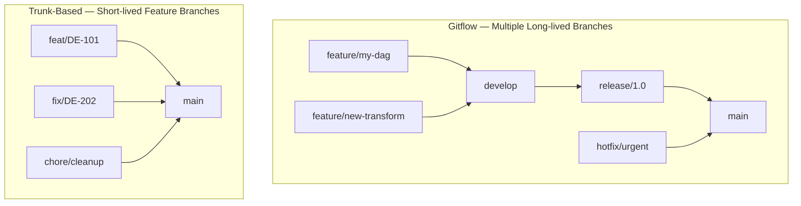

# Branching Strategies — Fundamentals


## 🎯 Analogy

Think of branching strategies like traffic management: trunk-based development is a single highway with short on/off ramps (feature flags), while GitFlow is a complex interchange with multiple dedicated lanes for features, releases, and hotfixes.

---
## The Restaurant Kitchen Analogy

A branching strategy is like a restaurant kitchen's workflow. In a chaotic kitchen (everyone commits to main), two chefs might add salt to the same dish simultaneously — disaster. Gitflow is like having a strict prep kitchen (feature branches), a main kitchen (develop), and a serving station (main/release) — structured but slow. Trunk-based development is like an open kitchen: chefs make small changes frequently, taste-testing constantly, and the dishes are always ready to serve. The right strategy depends on your kitchen's size and pace.

---

## The Two Main Approaches



---

## Gitflow

```
main ← production-ready, tagged releases
develop ← integration branch, daily merges
feature/xyz ← your work (branches from develop)
release/1.0 ← stabilization before release
hotfix/abc ← emergency fixes (branches from main)
```

**Good for:**
- Scheduled release cycles (software products with versioned releases)
- Large teams that need formal release gating
- Compliance environments with mandatory review periods

**Bad for:**
- Frequent small data pipeline changes
- Teams deploying multiple times per day
- Small teams (overhead exceeds benefit)

---

## Trunk-Based Development (Recommended for DE)

```
main ← always deployable
feat/<ticket>-<description>   (max 1-3 days)
fix/<ticket>-<description>    (hours)
chore/<description>           (hours)
```

```bash
# Typical daily workflow
git checkout main
git pull origin main                        # start fresh
git checkout -b feat/DE-423-add-revenue-v2  # short-lived branch

# Work in small commits
git commit -m "feat: add daily revenue transform function"
git commit -m "test: add unit tests for revenue transform"

# After 1-2 days: PR → review → merge
git push origin feat/DE-423-add-revenue-v2
# Open PR on GitHub → CI passes → 1 review → merge → branch deleted
```

---

## Branch Naming Conventions

```bash
# Format: type/<ticket-id>-<short-description>
feat/DE-423-revenue-v2
fix/DE-500-null-order-id
chore/update-python-312
refactor/DE-612-extract-utils
test/add-coverage-transform
ci/add-dbt-lint-step
docs/update-pipeline-readme

# Common types:
# feat     - new feature or pipeline
# fix      - bug fix
# chore    - dependency updates, non-functional changes
# refactor - code restructure, no behavior change
# test     - adding or fixing tests
# ci       - CI/CD changes
# docs     - documentation only
```

---

## Branch Protection Rules (GitHub)

```
Settings → Branches → Add branch protection rule

Target: main

Rules to enable:
✓ Require a pull request before merging
  ✓ Require 1 approving review
  ✓ Dismiss stale reviews when new commits pushed
✓ Require status checks to pass:
  - test (CI must pass)
  - dbt-compile
✓ Require branches to be up to date before merging
✓ Do not allow bypassing (even admins)
✓ Automatically delete head branches after merge
```

---

## When to Use Which

| Team/Context | Recommended Strategy |
|---|---|
| Small DE team (1-5), frequent deploys | Trunk-based |
| Mid-size team (5-20), continuous delivery | Trunk-based with required PRs |
| Large team, scheduled releases | Gitflow or scaled trunk |
| Highly regulated (finance, health) | Gitflow + mandatory review windows |
| Open source projects | Gitflow or fork-based |

## ▶️ Try It Yourself

```bash
# Trunk-based development (recommended for data teams)
git checkout main && git pull
git checkout -b feat/add-daily-revenue  # Short-lived branch
# ... make changes ...
git push -u origin feat/add-daily-revenue
# Open PR → review → merge → delete branch (all within 1-2 days)

# GitFlow (for teams with scheduled releases)
git checkout -b release/2024-Q1 develop
# Stabilize release branch...
git checkout main && git merge release/2024-Q1
git tag v2024.Q1

# Emergency hotfix
git checkout -b hotfix/fix-null-revenue main
# Fix the bug...
git checkout main && git merge hotfix/fix-null-revenue
git checkout develop && git merge hotfix/fix-null-revenue
```

> **Run it:** Copy the snippet into a REPL or file and run it — no external services needed for the basic example.

---
