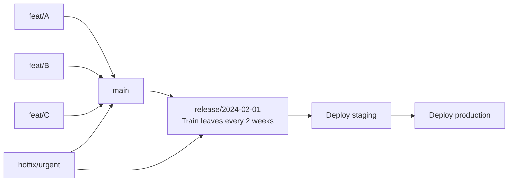

# Branching Strategies — Senior Deep Dive

## Release Train Pattern for Large DE Teams



**Release trains** work well for regulated DE environments:
- main is always green (all tests pass)
- Every 2 weeks a release branch is cut from main
- Only bug fixes enter the release branch (no new features)
- Release is tested in staging for 2 days before prod
- Urgent fixes go directly to the release branch + cherry-picked to main

---

## Forking Workflow for Open Source / Contractor Teams

```bash
# Contractor/vendor forks the repo
# They work on their fork, open PR to upstream

# Upstream team's perspective:
# Set up upstream remote (one time)
git remote add upstream https://github.com/org/main-repo.git

# Review incoming PR
gh pr checkout 142   # checkout their PR branch

# Test it
dbt test --select changed_models

# Merge via GitHub UI (squash + merge for clean history)

# Sync main with upstream
git checkout main
git pull upstream main
git push origin main
```

---

## Branch Governance Automation

```python
# Script to enforce branch naming policy via GitHub webhook
from flask import Flask, request, abort
import hmac, hashlib, re

app = Flask(__name__)

VALID_BRANCH_PATTERN = re.compile(
    r'^(main|develop|staging|release/\d{4}-\d{2}-\d{2}|'
    r'feat/[A-Z]+-\d+-[a-z-]+|fix/[A-Z]+-\d+-[a-z-]+|'
    r'hotfix/[a-z-]+|chore/[a-z-]+)$'
)

@app.route('/webhook', methods=['POST'])
def handle_push():
    event = request.headers.get('X-GitHub-Event')
    payload = request.json
    
    if event == 'create' and payload['ref_type'] == 'branch':
        branch = payload['ref']
        if not VALID_BRANCH_PATTERN.match(branch):
            # Delete the non-conforming branch via GitHub API
            delete_branch(payload['repository']['full_name'], branch)
            notify_creator(
                branch=branch,
                message=f"Branch '{branch}' doesn't follow naming convention. "
                        "Required: feat/JIRA-123-description or fix/JIRA-123-description"
            )
    return 'OK'
```

---

## Automated Release Notes from Branch History

```bash
# Generate release notes from conventional commits
# Uses git log between last tag and HEAD

generate_release_notes() {
    LAST_TAG=$(git describe --tags --abbrev=0 2>/dev/null || echo "")
    RANGE="${LAST_TAG}..HEAD"
    
    echo "## What's Changed"
    echo ""
    echo "### Features"
    git log $RANGE --oneline | grep "^[a-z]* feat" | sed 's/^/- /'
    echo ""
    echo "### Bug Fixes"
    git log $RANGE --oneline | grep "^[a-z]* fix" | sed 's/^/- /'
    echo ""
    echo "### Infrastructure"
    git log $RANGE --oneline | grep "^[a-z]* ci\|chore" | sed 's/^/- /'
}

# GitHub Actions: auto-create release with generated notes
- name: Create Release
  uses: actions/github-script@v7
  with:
    script: |
      const notes = require('child_process').execSync('bash generate_notes.sh').toString()
      await github.rest.repos.createRelease({
        owner: context.repo.owner,
        repo: context.repo.repo,
        tag_name: `v${new Date().toISOString().slice(0,10)}`,
        name: `Release ${new Date().toISOString().slice(0,10)}`,
        body: notes,
      })
```

---

## ⚡ Cheat Sheet

```bash
# Gitflow commands
git checkout -b feature/xyz develop        # start feature from develop
git checkout -b release/2024-02 develop    # create release branch
git checkout -b hotfix/critical main       # start hotfix from main

# Trunk-based commands
git checkout -b feat/DE-123-short-name main  # short-lived branch
git merge --squash feat/DE-123-short-name    # squash to one commit on merge

# Release tagging
git tag -a v2024.02.01 -m "Release: Q1 2024"
git push origin --tags

# Cherry-pick hotfix to multiple branches
git cherry-pick abc1234               # apply one commit
git cherry-pick abc1234..def5678      # apply range

# Check what's different between branches
git log main..develop --oneline       # commits in develop not in main
git diff main...feature/xyz           # changes since branching point

# Clean up stale remote branches
git fetch --prune                     # remove deleted remote tracking branches
git branch -r | grep -v HEAD | xargs git branch -dr  # delete all remote tracking

# Find when a feature was merged
git log --merges --grep="DE-423" main
```

**Key decisions to justify:**
- Trunk-based for most DE teams → less conflict, faster feedback, requires feature flags for WIP
- Gitflow for quarterly release cycles, compliance-gated deploys
- Release train for large teams where not everything is ready simultaneously
- Squash merge to keep main history clean (one commit per feature)
