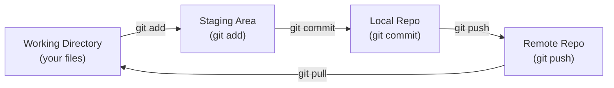

# Git Fundamentals — Fundamentals

## The Save Point Analogy

Git is like save points in a video game, but for code. Every `git commit` creates a snapshot of your project at that moment — if something breaks, you can restore any previous save point instantly. Unlike a single save slot, Git keeps every snapshot forever and lets multiple players (developers) work on the same game simultaneously without overwriting each other's progress. The "multiplayer save system" also tracks who changed what and why, which matters enormously in a data engineering team where pipelines touch production data.

---

## Core Concepts



**Working Directory** — files you can see and edit.
**Staging Area (Index)** — files you've selected for the next commit.
**Local Repository** — all your commits, stored in `.git/`.
**Remote Repository** — GitHub/GitLab copy, shared with the team.

---

## Essential Commands

```bash
# Setup
git config --global user.name "Jane Smith"
git config --global user.email "jane@company.com"

# Start a project
git init                        # new repo
git clone <url>                 # copy existing repo

# Daily workflow
git status                      # what changed?
git add pipeline.py             # stage specific file
git add .                       # stage everything
git commit -m "feat: add orders extract DAG"

# History
git log --oneline               # compact commit list
git log --oneline --graph       # branch visualization
git show <commit-hash>          # see one commit's changes
git diff                        # unstaged changes
git diff --staged               # staged changes

# Branches
git branch                      # list branches
git branch feature/new-dag      # create branch
git checkout feature/new-dag    # switch to it
git checkout -b feature/new-dag # create + switch (shorthand)
git switch feature/new-dag      # modern syntax

# Sync
git fetch                       # download remote changes (don't merge)
git pull                        # fetch + merge
git push origin feature/new-dag # push branch to remote

# Undo
git restore pipeline.py         # discard unstaged changes
git restore --staged pipeline.py # unstage a file
git revert <commit>             # undo a commit (safe — adds new commit)
git reset --hard HEAD~1         # undo last commit (DANGEROUS — loses work)
```

---

## Commit Message Convention

```bash
# Format: <type>: <short description>
# Types: feat, fix, chore, docs, refactor, test, ci

git commit -m "feat: add daily revenue aggregation DAG"
git commit -m "fix: handle null values in order amount column"
git commit -m "refactor: extract transform logic into utils module"
git commit -m "test: add unit tests for revenue calculation"
git commit -m "ci: add dbt test step to GitHub Actions workflow"
```

Good commit messages answer: **"What changed, and why?"**

---

## .gitignore for Data Projects

```gitignore
# Python
__pycache__/
*.pyc
.venv/
*.egg-info/

# Environment secrets
.env
*.env.*
secrets.yaml

# Large data files (use DVC instead)
*.csv
*.parquet
*.json.gz
data/raw/
data/processed/

# dbt
target/
dbt_packages/
logs/

# Airflow
logs/
airflow.db

# Jupyter
.ipynb_checkpoints/
```

---

## Merge vs Rebase

```bash
# Merge: creates a merge commit, preserves history
git checkout main
git merge feature/new-dag
# Result: keeps all commits from both branches + adds merge commit

# Rebase: replays your commits on top of main, linear history
git checkout feature/new-dag
git rebase main
# Result: clean linear history, no merge commit

# Rule of thumb:
# - Use merge for integrating feature branches into main
# - Use rebase to update your feature branch with latest main
# - Never rebase shared/public branches
```

---

## Git for Data Engineering Teams

| Practice | Reason |
|---|---|
| Commit DAG changes separately from data transforms | Easier to revert one piece |
| Never commit secrets or credentials | Use environment variables |
| Use `.gitignore` for large data files | Use DVC or S3 for data versioning |
| Tag releases (`git tag v1.2.0`) | Know exactly what ran in production |
| Write meaningful commit messages | Audit trail for data changes |
