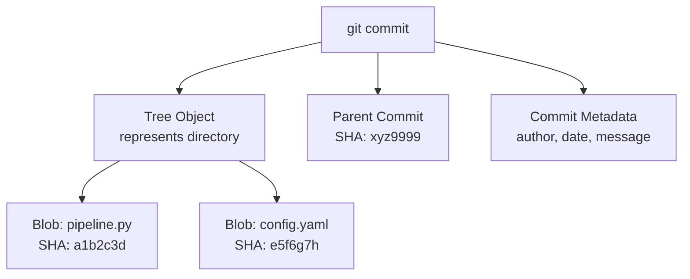

# Git Fundamentals — Senior Deep Dive

## Git Internals: What Actually Happens



Every Git object is content-addressed by SHA-1/SHA-256. This is why Git is so reliable — the hash proves the content hasn't changed.

```bash
# Inspect git objects directly
git cat-file -t HEAD              # → commit
git cat-file -p HEAD              # → tree, author, message
git ls-tree HEAD                  # → list files at HEAD
git cat-file -p HEAD:pipeline.py  # → raw file content
```

---

## Large-Scale Repository Strategies

### Git LFS (Large File Storage)

```bash
# Install and configure
git lfs install
git lfs track "*.parquet"
git lfs track "*.csv"
git lfs track "models/*.pkl"
git add .gitattributes

# Now large files are stored in LFS (pointer in git, content in LFS server)
git add data/sample.parquet
git commit -m "add sample dataset"

# Verify
git lfs ls-files
git lfs status

# Pull LFS objects for a specific path
git lfs pull --include="data/sample.parquet"
```

### Shallow Clones for CI Speed

```bash
# Only last N commits — much faster for CI
git clone --depth 1 https://github.com/org/repo.git

# Even faster for CI (no tags, no history)
git clone --depth 1 --no-tags --single-branch --branch main \
  https://github.com/org/repo.git

# In GitHub Actions (built-in)
- uses: actions/checkout@v4
  with:
    fetch-depth: 1   # shallow clone
```

---

## Signed Commits and Tags

```bash
# Setup GPG signing
git config --global user.signingkey YOUR_GPG_KEY_ID
git config --global commit.gpgsign true
git config --global tag.gpgsign true

# Signed commit
git commit -S -m "feat: add revenue pipeline"

# Signed tag (for releases)
git tag -s v2.0.0 -m "Release 2.0.0"

# Verify signatures
git log --show-signature
git tag -v v2.0.0
```

Signed commits matter for regulated environments — they prove the commit came from a verified identity.

---

## Git Hooks at Scale

```python
# .git/hooks/pre-commit (or managed via pre-commit framework)
#!/usr/bin/env python3
"""Pre-commit hook: validate dbt model names follow convention."""
import subprocess, sys, re

result = subprocess.run(
    ["git", "diff", "--cached", "--name-only", "--diff-filter=ACM"],
    capture_output=True, text=True
)

errors = []
for path in result.stdout.strip().split("\n"):
    if path.startswith("models/") and path.endswith(".sql"):
        model_name = path.split("/")[-1].replace(".sql", "")
        if not re.match(r"^(stg|int|fct|dim|rpt)_[a-z_]+$", model_name):
            errors.append(f"{path}: model name must match pattern (stg|int|fct|dim|rpt)_*")

if errors:
    print("Pre-commit check failed:")
    for e in errors:
        print(f"  ✗ {e}")
    sys.exit(1)
```

---

## Repository Health Monitoring

```bash
# Check repo size
git count-objects -vH

# Find large files in history (even deleted ones)
git rev-list --objects --all | \
  git cat-file --batch-check='%(objecttype) %(objectname) %(objectsize) %(rest)' | \
  awk '$1 == "blob"' | sort -k3 -n -r | head -20

# Remove a file from entire git history (DESTRUCTIVE!)
git filter-repo --path data/sensitive.csv --invert-paths
# Then force push (after team coordination)
```

---

## ⚡ Cheat Sheet

```bash
# Core workflow
git status                         # current state
git add -p                         # interactive staging (review hunks)
git commit -m "type: description"  # commit
git push -u origin branch-name     # push new branch

# History inspection
git log --oneline --graph --all    # visual branch graph
git log --author="Jane" --since="1 week ago"
git blame pipeline.py              # who changed each line
git log -p -- path/to/file         # history of one file

# Undoing
git revert HEAD                    # safe undo (new commit)
git reset --soft HEAD~1            # uncommit, keep staged
git reset --mixed HEAD~1           # uncommit, keep unstaged
git reset --hard HEAD~1            # ⚠️ lose changes entirely
git restore --staged file.py       # unstage

# Recovery
git reflog                         # find lost commits
git stash list                     # list stashes
git stash pop                      # restore latest stash

# Collaboration
git fetch --all --prune            # sync + remove deleted remote branches
git rebase origin/main             # update feature branch
git cherry-pick <sha>              # bring one commit over

# Large files
git lfs track "*.parquet"
git lfs ls-files

# Signed commits
git commit -S -m "message"
git log --show-signature
```
