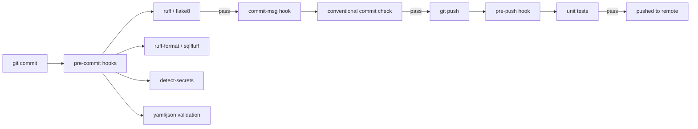

# Git Hooks and Automation — Senior Deep Dive



## Advanced pre-commit Config

```yaml
# .pre-commit-config.yaml — production DE team config
default_stages: [commit, push]

repos:
  - repo: https://github.com/astral-sh/ruff-pre-commit
    rev: v0.3.0
    hooks:
      - id: ruff
        args: [--fix]
      - id: ruff-format

  - repo: https://github.com/sqlfluff/sqlfluff
    rev: 3.0.0
    hooks:
      - id: sqlfluff-fix
        args: [--dialect, snowflake]
        stages: [commit]  # SQL format on commit
      - id: sqlfluff-lint
        args: [--dialect, snowflake]
        stages: [push]    # Stricter check before push

  - repo: https://github.com/Yelp/detect-secrets
    rev: v1.4.0
    hooks:
      - id: detect-secrets
        args: ['--baseline', '.secrets.baseline']

  # dbt-specific hooks
  - repo: local
    hooks:
      - id: dbt-compile
        name: dbt compile
        entry: bash -c 'if git diff --cached --name-only | grep -q "dbt/"; then cd dbt && dbt compile --quiet; fi'
        language: system
        pass_filenames: false
        stages: [push]  # Only on push (slow-ish)
```

## ⚡ Cheat Sheet

```bash
# Setup
pip install pre-commit
pre-commit install            # hooks on git commit
pre-commit install --hook-type commit-msg   # also for commit-msg
pre-commit install --hook-type pre-push     # also for pre-push

# Run hooks
pre-commit run --all-files   # run everything
pre-commit run ruff          # run specific hook

# Update hook versions
pre-commit autoupdate        # bumps rev: to latest

# Skip (emergency only)
SKIP=ruff git commit -m 'emergency fix'  # skip specific hook
git commit --no-verify -m 'emergency'    # skip all hooks

# Debug hook
pre-commit run ruff --verbose

# CI: run same hooks
pre-commit run --all-files --show-diff-on-failure
```
