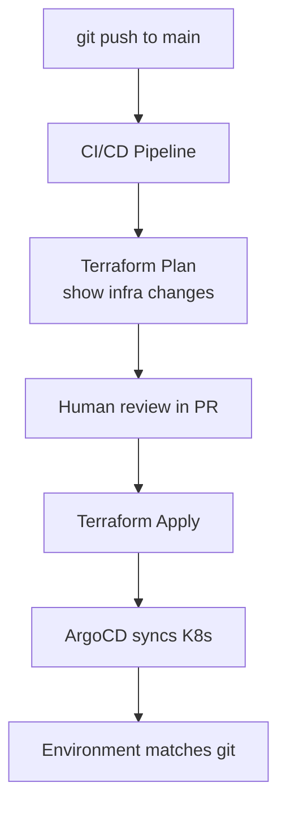

# GitOps for Data — Senior Deep Dive



## Immutable Infrastructure + GitOps

```bash
# Every environment change goes through git
# No manual changes to production

# Bad: SSH into server to fix pipeline
ssh prod-server
vi /opt/dags/revenue.py  # ← no audit trail, not in git

# Good: create PR → review → merge → auto-deploy
git checkout -b fix/revenue-null-handling
# edit dags/revenue.py
git commit -m 'fix: handle null order_id in revenue DAG'
git push && gh pr create
# → merge → CI auto-deploys → audit trail preserved
```

## Self-Service with GitOps

```python
# Data teams deploy their own pipelines via git PR
# No ticketing system or manual deployment requests

# Team workflow:
# 1. Add/modify dbt model or DAG in their directory
# 2. Open PR — CODEOWNERS auto-assigns reviewer
# 3. CI runs tests
# 4. After review + merge: auto-deployed to staging
# 5. Tag creates prod deploy with manual approval

# Platform team provides:
# - CI templates (reusable workflows)
# - ArgoCD application definitions
# - CODEOWNERS file
# Not: manual deployments for each team
```

## ⚡ Cheat Sheet

```bash
# GitOps deployment commands
git tag -a v2024.02.01 -m 'Deploy: Q1 pipeline v2'
git push origin --tags          # triggers prod deploy

# Check what's deployed
argocd app get revenue-pipeline
argocd app diff revenue-pipeline    # drift from git?
argocd app sync revenue-pipeline    # force sync

# Rollback
git revert <bad-commit>
git push origin main            # reverts auto-deploy

# Or: tag previous good version
git tag -a v2024.01.31-rollback main~1
git push origin --tags
```
