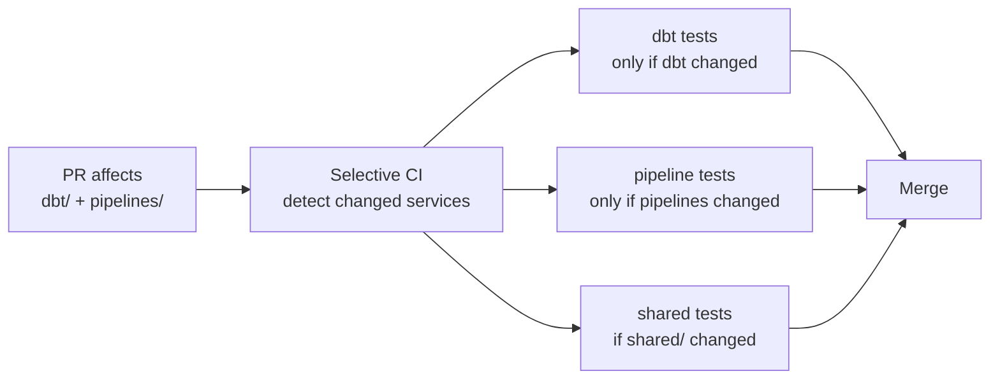

# Monorepo Patterns — Senior Deep Dive



## Dependency Graph for Selective Testing

```python
# Build a dependency map: which tests to run per changed path
DEPENDENCY_MAP = {
    "shared/": ["dbt", "revenue-pipeline", "customer-pipeline", "airflow"],
    "dbt/": ["dbt"],
    "pipelines/revenue/": ["revenue-pipeline"],
    "pipelines/customer/": ["customer-pipeline"],
    "airflow/dags/": ["airflow"],
    "infra/": ["terraform-plan"],
}

def get_required_checks(changed_files: list[str]) -> set[str]:
    required = set()
    for file in changed_files:
        for path_prefix, checks in DEPENDENCY_MAP.items():
            if file.startswith(path_prefix):
                required.update(checks)
    return required
```

## ⚡ Cheat Sheet

```bash
# Check what changed
git diff origin/main --name-only                  # all changed files
git diff origin/main --name-only -- dbt/          # only dbt changes

# Run only affected dbt models
CHANGED_MODELS=$(git diff origin/main --name-only | grep dbt/models | sed 's|.sql||;s|dbt/models/||')
dbt test --select $CHANGED_MODELS+

# Find which services depend on a shared library
grep -r 'from shared' pipelines/ --include='*.py' -l

# Monorepo CI optimization: cache by service
cache-key: ${{ hashFiles('dbt/dbt_project.yml', 'dbt/packages.yml') }}-dbt
cache-key: ${{ hashFiles('pipelines/revenue/requirements.txt') }}-revenue
```
