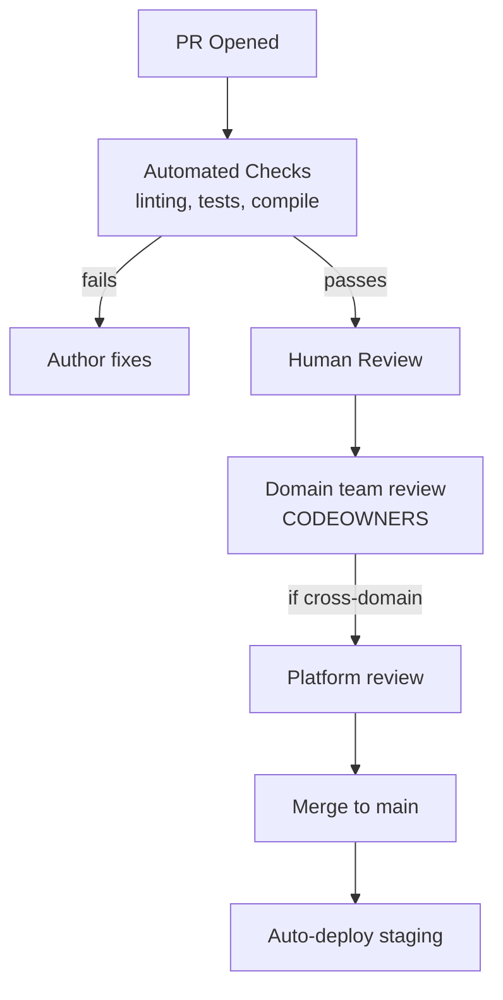

# Pull Requests and Code Review — Senior Deep Dive

## Review as a System

The goal of code review is not just bug-catching — it's knowledge sharing, standards enforcement, and team alignment. At scale, reviews must be systematized to remain effective.



---

## Review Metrics and Health

```python
# Measure code review health using GitHub API
from github import Github
from datetime import datetime, timedelta

def review_health_report(repo_name: str, days: int = 30) -> dict:
    g = Github()
    repo = g.get_repo(repo_name)
    
    since = datetime.now() - timedelta(days=days)
    prs = repo.get_pulls(state="closed", sort="updated", direction="desc")
    
    metrics = {
        "total_prs": 0,
        "avg_review_time_hours": [],
        "prs_with_no_review": 0,
        "prs_merged_by_author": 0,
    }
    
    for pr in prs:
        if pr.merged_at and pr.merged_at > since:
            metrics["total_prs"] += 1
            
            time_to_merge = (pr.merged_at - pr.created_at).total_seconds() / 3600
            metrics["avg_review_time_hours"].append(time_to_merge)
            
            reviews = pr.get_reviews()
            if reviews.totalCount == 0:
                metrics["prs_with_no_review"] += 1
            
            if pr.merged_by.login == pr.user.login:
                metrics["prs_merged_by_author"] += 1
    
    return {
        **metrics,
        "avg_review_time_hours": sum(metrics["avg_review_time_hours"]) / max(len(metrics["avg_review_time_hours"]), 1)
    }
```

---

## Layered Review Strategy for DE

```
Tier 1 — Automated (runs on every PR, blocks merge):
  - dbt compile
  - Python linting (flake8, ruff)
  - Type checking (mypy)
  - Unit tests
  - Secret scanning (detect-secrets)

Tier 2 — Domain review (1 reviewer from owning team):
  - Data model correctness
  - Business logic validation
  - dbt test coverage

Tier 3 — Platform review (required for cross-cutting changes):
  - Changes to shared models (gold/shared/)
  - Schema changes that affect multiple consumers
  - Infrastructure/Airflow changes
  - Security-sensitive changes

Tier 4 — Architecture review (for major redesigns):
  - New topic areas
  - New external systems
  - Breaking API/schema changes
```

---

## Self-Merge Prevention + Audit

```yaml
# Block author from approving their own PR
- name: Check self-approval
  uses: actions/github-script@v7
  with:
    script: |
      const { data: reviews } = await github.rest.pulls.listReviews({
        owner: context.repo.owner,
        repo: context.repo.repo,
        pull_number: context.issue.number,
      });
      
      const approvals = reviews.filter(r => r.state === 'APPROVED');
      const authorApproved = approvals.some(r => r.user.login === context.payload.pull_request.user.login);
      
      if (authorApproved) {
        core.setFailed('Author cannot approve their own PR');
      }
```

---

## ⚡ Cheat Sheet

```bash
# GitHub CLI PR workflow
gh pr create --title "feat(revenue): add daily agg" --body-file .github/pr_body.md
gh pr create --draft                          # draft (not ready)
gh pr ready                                   # mark ready for review
gh pr checks                                  # view CI status
gh pr review --approve                        # approve
gh pr review --request-changes --body "..."   # request changes
gh pr merge --squash --auto                   # auto-merge when checks pass
gh pr close                                   # close without merging

# Review commands
gh pr diff <pr-number>                        # view changes
gh pr checkout <pr-number>                    # check out locally
gh pr comment --body "LGTM"                   # add comment

# CODEOWNERS
echo "dbt/models/ @team-name" >> .github/CODEOWNERS

# PR size check
git diff origin/main --stat | tail -1

# Find PRs without review (audit)
gh pr list --state closed --json number,reviews --jq '.[] | select(.reviews | length == 0)'
```
