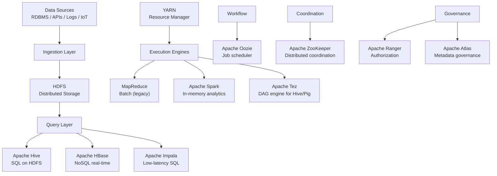
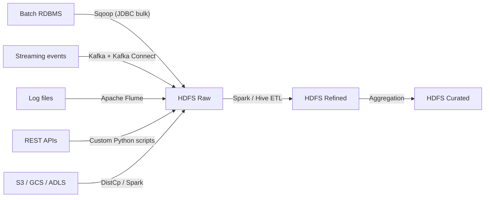
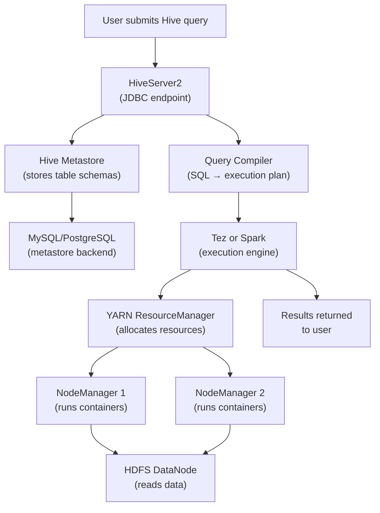
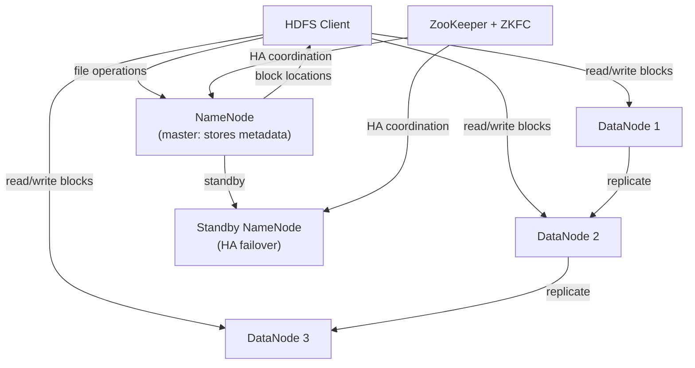
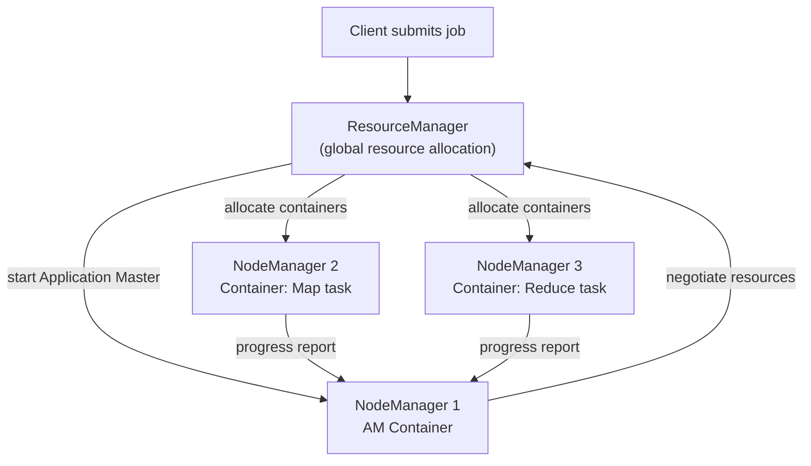

# Hadoop Ecosystem Architecture — Fundamentals


## 🎯 Analogy

Think of the Hadoop ecosystem like a city: HDFS is the land (storage), YARN is the city government (resource allocation), MapReduce/Spark are the factories (processing), Hive is the translator (SQL → jobs), and ZooKeeper is the traffic authority (coordination).

---
## The Full Hadoop Stack

The Hadoop ecosystem is a collection of tools built around the core HDFS + YARN foundation:



## Core Components Explained

| Component | Category | What it does |
|-----------|----------|-------------|
| **HDFS** | Storage | Distributed filesystem, 3x replication, NameNode + DataNodes |
| **YARN** | Resource management | Allocates CPU/memory to jobs; ResourceManager + NodeManagers |
| **MapReduce** | Execution | Batch processing framework (legacy, mostly replaced by Spark) |
| **Apache Spark** | Execution | In-memory processing; 10-100x faster than MapReduce |
| **Apache Hive** | SQL query | SQL interface to HDFS via MapReduce/Tez/Spark execution |
| **Apache HBase** | NoSQL database | Column-family store on HDFS; low-latency random reads/writes |
| **Apache Pig** | ETL scripting | Pig Latin data flow language; compiles to MapReduce/Tez |
| **Apache Sqoop** | Ingestion | Bulk transfer between RDBMS and HDFS |
| **Apache Kafka** | Messaging | Distributed event streaming; used for real-time data ingestion |
| **Apache Oozie** | Workflow | DAG-based job scheduler for Hadoop jobs |
| **Apache ZooKeeper** | Coordination | Leader election, distributed locks, service discovery |
| **Apache Flume** | Log ingestion | Collecting and moving log data to HDFS |
| **Apache Ranger** | Security | Fine-grained authorization (column/row level) |
| **Apache Atlas** | Governance | Metadata management, data lineage, data catalog |

## Data Ingestion Patterns



## Data Lake Zones

Modern Hadoop data lakes use a zone architecture:

| Zone | Also called | Contents | Access |
|------|------------|----------|--------|
| **Raw** | Landing / Bronze | Exact copy of source data, immutable | DE team only |
| **Refined** | Cleaned / Silver | Validated, cleaned, partitioned | DE team + analytics |
| **Curated** | Aggregated / Gold | Business-level aggregations, reports | Analysts, BI tools |
| **Sandbox** | Dev / Explore | Experimental, volatile | Data scientists |

```bash
# Typical HDFS zone directory structure
/data/
├── raw/                        # Bronze: source data as-is
│   ├── oracle/customers/       # Sqoop imports
│   └── kafka/events/           # Streaming raw events
├── refined/                    # Silver: cleaned and partitioned
│   ├── customers/dt=2024-01-15/
│   └── events/dt=2024-01-15/hour=00/
├── curated/                    # Gold: aggregated
│   └── customer_ltv/dt=2024-01-15/
└── sandbox/                    # Experimental
    └── user_alice/experiments/
```

## Security Overview

```
Hadoop security layers:
1. Authentication: Kerberos (who you are)
2. Authorization: Apache Ranger (what you can do)
3. Encryption:
   - In transit: TLS/SSL between daemons and clients
   - At rest: HDFS Transparent Data Encryption (TDE)
4. Audit: Ranger audit logs, Atlas lineage

Kerberos flow:
  Client → KDC (Key Distribution Center): "I am Alice"
  KDC → Client: Service Ticket (encrypted with service key)
  Client → NameNode: Service Ticket
  NameNode → verifies ticket → grants access
```

## How Components Interact



## HDFS Architecture



**Key HDFS facts:**
- Default block size: 128 MB (configurable)
- Default replication: 3 copies across different racks
- NameNode stores all metadata in memory (RAM is the critical resource)
- Secondary NameNode is NOT a backup — it checkpoints edit logs

## YARN Architecture




## ▶️ Try It Yourself

```bash
# Check the health of the entire Hadoop ecosystem
# HDFS health
hdfs dfsadmin -report | head -20

# YARN cluster status
yarn node -list | head -10
yarn queue -status default

# Check running Spark applications
yarn application -list -appTypes SPARK

# HBase cluster status
echo "status" | hbase shell 2>/dev/null | head -5

# ZooKeeper quorum status
echo ruok | nc localhost 2181   # Should return "imok"

# Full cluster metrics via Ambari or Cloudera Manager REST API
# curl http://ambari-server:8080/api/v1/clusters/MyCluster/services
```

> **Run it:** Copy the snippet into a REPL or file — no external services needed for the basic example.

---
## Interview Tips

> **Tip 1:** The most common architecture question is "describe the Hadoop ecosystem." Start with HDFS + YARN (the foundation), then add Hive + Spark (analytics), HBase (real-time), Kafka (streaming ingestion), Oozie (orchestration), and ZooKeeper (coordination). Don't try to cover everything — pick the most relevant path.

> **Tip 2:** Know the three data lake zones (raw/refined/curated) and why they exist. Raw is immutable for auditability; refined is cleaned for reuse; curated is optimized for analytics queries. Each zone has different access controls and retention policies.

> **Tip 3:** The Hive Metastore is a critical concept — it's a shared metadata catalog (backed by a relational DB like MySQL) that multiple tools use. Hive, Spark, Presto/Athena, and Impala all use the same Metastore, making it the central catalog of a Hadoop cluster.

> **Tip 4:** Kerberos is the authentication layer for Hadoop clusters. Without Kerberos, anyone who can connect to the cluster can access any data. All modern production clusters use Kerberos, and service accounts need keytabs to authenticate non-interactively.

> **Tip 5:** The difference between NameNode and Secondary NameNode confuses many people. The Secondary NameNode does NOT provide failover — it periodically merges the edit log with the filesystem image (checkpointing) to prevent the edit log from growing too large. For actual HA, use the Active/Standby NameNode configuration with ZooKeeper.

---

## 🔄 Modern Context & Migration Path

### Hadoop to Cloud / Modern Stack Mapping

| Hadoop Component | Modern Cloud Equivalent | Notes |
|---|---|---|
| HDFS | S3 (AWS) / ADLS Gen2 (Azure) / GCS (GCP) | Object storage replaces distributed filesystem; cheaper, more durable, no HDFS maintenance |
| MapReduce | Spark / Databricks / EMR Spark | Spark runs 10–100× faster; same Map/Shuffle/Reduce concepts in-memory |
| Hive (query engine) | Spark SQL / Databricks SQL / BigQuery / Athena | SQL-on-cloud; serverless options eliminate cluster management |
| Hive Metastore | AWS Glue Data Catalog / Unity Catalog / Databricks Metastore | Schema registry lives on — Spark, Athena, and Glue all use it |
| Sqoop | AWS Glue / Azure Data Factory / Airbyte / Fivetran | Managed connectors replace Sqoop JDBC jobs |
| Oozie | Apache Airflow / Prefect / AWS Step Functions | Modern orchestrators with better UI, retry logic, and alerting |
| HBase | DynamoDB (AWS) / Bigtable (GCP) / Cosmos DB (Azure) | Managed NoSQL with no HBase cluster to maintain |
| Pig | PySpark / Spark SQL | Pig Latin maps directly to Spark transformations |
| YARN | Kubernetes / YARN on EMR | K8s replaces YARN as the cluster resource manager in cloud-native setups |
| ZooKeeper | Managed coordination (built into cloud services) | Cloud services abstract away ZooKeeper; Kafka moving to KRaft |

### Cloud Migration Approaches

**Lift-and-Shift (faster, lower risk):**
- Replace HDFS paths with S3/ADLS paths
- Run existing MapReduce jobs on EMR or HDInsight (managed Hadoop)
- Swap Oozie for Airflow running on EC2/AKS
- Same code, new infrastructure — works in weeks, not months

**Re-architect (higher effort, better long-term):**
- Replace MapReduce jobs with PySpark on Databricks / EMR Serverless
- Move raw storage to Delta Lake / Iceberg on object storage
- Replace Hive queries with Databricks SQL / BigQuery / Athena
- Use managed connectors (Glue, Fivetran) instead of Sqoop
- Use Airflow on MWAA / Astronomer instead of self-managed Oozie
- Result: fully serverless or near-serverless data platform

### What Interviewers Ask

**"How would you migrate a Hadoop cluster to cloud?"**

Structure your answer in three phases:
1. **Assessment** — inventory all jobs (MapReduce, Hive, Pig, Sqoop), data volumes, SLAs, and downstream consumers. Identify dependencies and critical paths.
2. **Lift-and-shift** — move HDFS to S3/ADLS, run existing jobs on managed Hadoop (EMR/HDInsight) with minimal code changes. Validate results match on-prem.
3. **Modernize** — incrementally replace components: Hive → Spark SQL, MapReduce → PySpark, Oozie → Airflow, Sqoop → Glue/Fivetran. Decommission on-prem cluster once all workloads are validated in cloud.

Key risks to mention: data validation (compare row counts and aggregates), network egress costs during migration, Kerberos/IAM permission mapping, and testing idempotency of migrated jobs.
