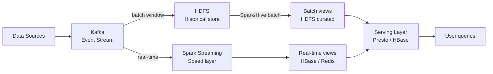
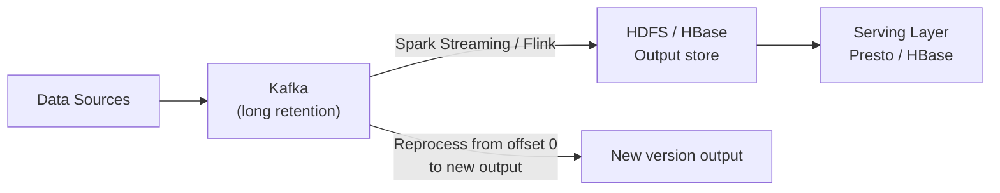
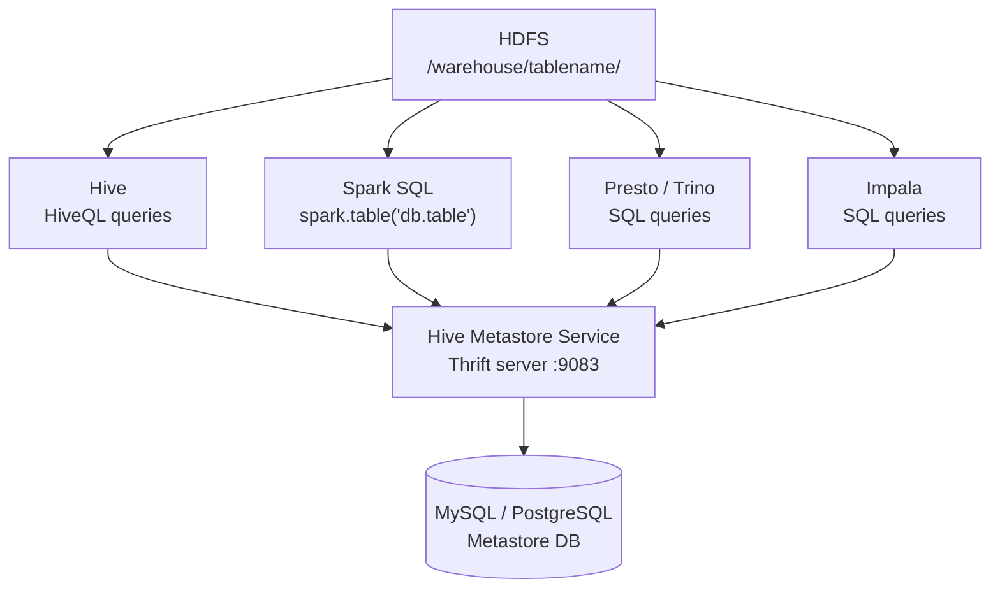
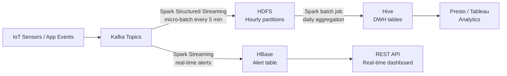

# Hadoop Ecosystem Architecture — Intermediate

## Data Pipeline Architectures on Hadoop

### Lambda Architecture

Serves both batch (accuracy) and real-time (speed) from one system:



**Lambda pros:** Fault-tolerant (batch reprocesses), simple mental model
**Lambda cons:** Dual code paths (batch and streaming logic must be kept in sync)

### Kappa Architecture

Single streaming pipeline that reprocesses when needed:



**Kappa pros:** One codebase, simpler ops
**Kappa cons:** Kafka must retain all data for reprocessing; streaming code is harder to debug

## Hadoop with Spark: Replacing MapReduce

Spark replaces MapReduce for virtually all use cases:

| Use case | MapReduce approach | Spark approach | Speedup |
|----------|-------------------|----------------|---------|
| ETL pipeline | M → R → disk → M → R | Spark DAG (in-memory) | 10-100x |
| Iterative ML | Multiple MR jobs | Spark MLlib (single app) | 100x+ |
| SQL analytics | Hive + MR | Hive + Spark engine | 3-10x |
| Streaming | Storm/MapReduce | Spark Structured Streaming | N/A |

```bash
# Configure Hive to use Spark execution engine (instead of MR/Tez)
# In hive-site.xml or at query time:
SET hive.execution.engine=spark;
SET spark.executor.memory=4g;
SET spark.executor.instances=20;

# Or use Tez (better for Hive complex queries)
SET hive.execution.engine=tez;
```

## Hive Metastore as Shared Catalog

The Hive Metastore is the central schema registry for the entire Hadoop ecosystem:



```python
# Spark accessing Hive Metastore tables
spark = SparkSession.builder \
    .appName("hive_integration") \
    .config("spark.sql.warehouse.dir", "hdfs://namenode/user/hive/warehouse") \
    .enableHiveSupport() \
    .getOrCreate()

# Query Hive table directly
df = spark.sql("SELECT * FROM raw.orders WHERE dt = '2024-01-15'")

# Or use table API
df = spark.table("refined.customer_summary")

# Write to Hive table
df.write \
    .mode("overwrite") \
    .insertInto("curated.customer_ltv")
```

```bash
# Hive Metastore configuration
# hive-site.xml:
# <property>
#   <name>javax.jdo.option.ConnectionURL</name>
#   <value>jdbc:mysql://mysql-host:3306/hive_metastore</value>
# </property>
# <property>
#   <name>hive.metastore.uris</name>
#   <value>thrift://hive-metastore-host:9083</value>
# </property>
```

## Batch vs Streaming Integration



```python
# Spark Structured Streaming: real-time Kafka to HDFS
from pyspark.sql import SparkSession
from pyspark.sql import functions as F

spark = SparkSession.builder \
    .appName("streaming_to_hdfs") \
    .getOrCreate()

# Read from Kafka
raw_stream = spark.readStream \
    .format("kafka") \
    .option("kafka.bootstrap.servers", "kafka-broker:9092") \
    .option("subscribe", "orders") \
    .option("startingOffsets", "latest") \
    .load()

# Parse JSON events
orders_stream = raw_stream.select(
    F.from_json(
        F.col("value").cast("string"),
        "order_id STRING, customer_id INT, amount DOUBLE, ts TIMESTAMP"
    ).alias("data")
).select("data.*")

# Write to HDFS partitioned by hour
query = orders_stream.writeStream \
    .format("parquet") \
    .option("path", "hdfs://namenode/data/raw/orders-streaming/") \
    .option("checkpointLocation", "hdfs://namenode/checkpoints/orders/") \
    .partitionBy("date", "hour") \
    .trigger(processingTime="5 minutes") \
    .start()

query.awaitTermination()
```

## YARN Scheduling for Mixed Workloads

YARN schedulers allocate cluster resources among competing workloads:

### Capacity Scheduler (most common)

```xml
<!-- capacity-scheduler.xml -->
<configuration>
  <!-- Root queue splits into teams -->
  <property>
    <name>yarn.scheduler.capacity.root.queues</name>
    <value>engineering,analytics,ml-team</value>
  </property>

  <!-- Engineering: 50% of cluster -->
  <property>
    <name>yarn.scheduler.capacity.root.engineering.capacity</name>
    <value>50</value>
  </property>
  <property>
    <name>yarn.scheduler.capacity.root.engineering.maximum-capacity</name>
    <value>80</value>  <!-- Can burst to 80% if others are idle -->
  </property>

  <!-- Analytics: 30% of cluster -->
  <property>
    <name>yarn.scheduler.capacity.root.analytics.capacity</name>
    <value>30</value>
  </property>
  <property>
    <name>yarn.scheduler.capacity.root.analytics.maximum-capacity</name>
    <value>60</value>
  </property>

  <!-- ML Team: 20% of cluster -->
  <property>
    <name>yarn.scheduler.capacity.root.ml-team.capacity</name>
    <value>20</value>
  </property>
</configuration>
```

```bash
# Submit a job to a specific queue
spark-submit \
  --queue analytics \
  --master yarn \
  --deploy-mode cluster \
  --executor-memory 8g \
  --num-executors 20 \
  my_job.py
```

### Fair Scheduler (multi-tenant)

```xml
<!-- fair-scheduler.xml -->
<allocations>
  <queue name="engineering">
    <weight>5</weight>        <!-- 50% relative to total weight 10 -->
    <schedulingPolicy>fair</schedulingPolicy>
  </queue>
  <queue name="analytics">
    <weight>3</weight>        <!-- 30% -->
    <minResources>10000mb,100vcores</minResources>  <!-- Guaranteed minimum -->
  </queue>
  <queue name="ml-team">
    <weight>2</weight>        <!-- 20% -->
    <maxResources>20000mb,200vcores</maxResources>
  </queue>

  <queueMaxAppsDefault>100</queueMaxAppsDefault>
  <defaultQueueSchedulingPolicy>fair</defaultQueueSchedulingPolicy>
</allocations>
```

## Cluster Sizing and Capacity Planning

### DataNode Sizing

```
Typical DataNode configuration (2024):
  CPU:     2 sockets × 16 cores = 32 physical cores
  RAM:     256 GB (most goes to YARN containers)
  Storage: 12 × 8TB HDD = 96 TB raw per node
           or 4 × 1.92TB NVMe SSD for hot data
  Network: 25 GbE (or 100 GbE for data-intensive workloads)

With 3x replication:
  100 DataNodes × 96 TB raw = 9.6 PB raw
  Usable after 3x replication = 3.2 PB

HDFS capacity rule of thumb:
  Usable HDFS = (Total raw storage) / replication_factor
  Plan for 80% utilization max (reserve for temp space, compaction)
```

### YARN Memory Planning

```
Per DataNode (256 GB RAM):
  OS + HDFS DataNode daemon: -10 GB
  Available for YARN: 246 GB

YARN container sizes (typical):
  Small (map tasks): 4 GB
  Large (reduce tasks): 8 GB
  Spark executor: 8-16 GB
  Heavy ML job: 32-64 GB

Max containers per node: 246 GB / 4 GB = ~60 small containers
```

## Interview Tips

> **Tip 1:** Lambda vs Kappa is a common architecture discussion. The key trade-off: Lambda gives you accuracy (batch reprocessing) + speed (real-time) but at the cost of maintaining two codebases. Kappa simplifies to one pipeline but requires Kafka to retain all historical data for reprocessing. The industry trend is toward Kappa with Flink or Spark Streaming.

> **Tip 2:** The Hive Metastore's role as a shared catalog is critical. When Spark reads `spark.table("db.table")`, it queries the Hive Metastore (not Hive itself) for the table location and schema, then reads directly from HDFS. Hive itself is just one consumer of the Metastore.

> **Tip 3:** YARN queue configuration is an operational maturity question. Know the Capacity Scheduler's key parameters: `capacity` (guaranteed), `maximum-capacity` (burst limit), and `maximum-applications`. Fair Scheduler is simpler for true multi-tenancy (all queues share equally by default).

> **Tip 4:** For cluster sizing questions, use the "rule of 3" for HDFS: total raw storage divided by 3 (replication) gives usable storage. Then apply 80% utilization target. For compute: 32 cores per node, 246 GB per node usable for YARN. With 100 nodes: 3200 vCores, 24.6 TB RAM.

> **Tip 5:** Spark Structured Streaming's checkpoint mechanism is critical for exactly-once semantics. The checkpoint stores the Kafka offset that was last successfully written. On restart, Spark replays from exactly that offset. Without checkpointing, you get at-least-once (potential duplicates) or at-most-once (potential data loss).
