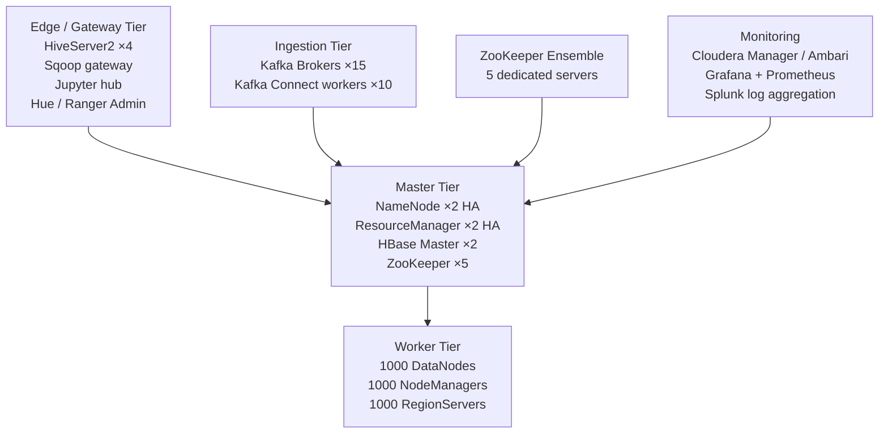

# Hadoop Ecosystem Architecture — Real-World Patterns

## Enterprise Hadoop Cluster at Scale (1000+ Nodes)

A large-scale Hadoop deployment architecture:



### NameNode Memory Planning at Scale

```bash
# NameNode memory (files + blocks = metadata in RAM)
# Rule of thumb: 1 GB RAM per million files
# 1 billion files → 1 TB RAM (impractical!)

# Solutions for large namespace:
# 1. Federation: multiple NameNodes, each owns a portion of namespace
# hdfs-site.xml:
# dfs.nameservices = ns1,ns2
# dfs.federation.namenode.ns1.address = nn1.corp:8020
# dfs.federation.namenode.ns2.address = nn2.corp:8020
# ns1 owns /user, /data/raw
# ns2 owns /data/refined, /data/curated

# 2. View File System (ViewFS): client-side mount table
# fs.viewfs.mounttable.default.link./user = hdfs://ns1/user
# fs.viewfs.mounttable.default.link./data = hdfs://ns2/data

# 3. Use cloud storage (S3) to eliminate NameNode entirely
```

## Data Governance Implementation with Ranger + Atlas

```
End-to-end governance workflow:

1. Data Producer (Sqoop import):
   - Sqoop writes to HDFS /data/raw/customers/
   - Atlas Sqoop hook captures: "Sqoop job imported from Oracle.CUSTOMERS to /data/raw/customers/"
   - Atlas creates lineage: Oracle.CUSTOMERS → HDFS /data/raw/customers

2. ETL Transform (Spark):
   - Spark reads /data/raw/customers, writes /data/refined/customers/
   - Atlas Spark listener captures table-level lineage
   - Atlas creates: raw.customers → [spark job: clean_customers.py] → refined.customers

3. Analytics Query (Hive):
   - Analyst queries refined.customers in HiveServer2
   - Ranger plugin: checks policy → analyst in analytics group → ALLOW (but mask email)
   - Ranger audit: logs "alice queried refined.customers, 1000 rows returned, email masked"

4. Classification:
   - Atlas auto-classifies columns based on regex rules:
     - Columns matching *email* → tagged PII
     - Columns matching *ssn*, *tax_id* → tagged PCI
   - Ranger policy: "Deny select on PCI-tagged columns for non-privileged roles"
```

```bash
# Atlas hook configuration in hive-site.xml
# <property>
#   <name>hive.exec.post.hooks</name>
#   <value>org.apache.atlas.hive.hook.HiveHook</value>
# </property>

# Ranger audit to HDFS (for long-term retention)
# In ranger-admin-site.xml:
# xasecure.audit.destination.hdfs=true
# xasecure.audit.destination.hdfs.dir=hdfs://namenode/ranger/audit
```

## Disaster Recovery for Hadoop

### Cross-Datacenter Replication

```
DR Architecture:
  Primary DC (Active): 1000 nodes, full pipeline
  Secondary DC (DR): 500 nodes, receive replicated data

  HDFS Replication (for data):
    DistCp scheduled via Oozie: hourly sync of critical datasets
    HDFS ReplicationManager: continuous async replication of critical paths

  HBase Replication (for real-time tables):
    HBase cluster-to-cluster replication (WAL-based)
    RPO: ~5 minutes, RTO: ~10 minutes
```

```bash
# HDFS DistCp cross-datacenter replication
hadoop distcp \
  -m 100 \                              # 100 parallel copiers
  -bandwidth 500 \                       # 500 MB/s per mapper
  -update \                             # Only copy changed files
  -skipcrccheck \                       # Skip CRC (cross-cluster)
  -strategy dynamic \                   # Balance work automatically
  hdfs://primary-nn:8020/data/refined/ \
  hdfs://dr-nn:8020/data/refined/

# Schedule via Oozie coordinator (hourly)
# coordinator.xml: frequency="${coord:hours(1)}"

# HBase replication: enable on primary cluster
hbase shell << 'EOF'
add_peer '1', CLUSTER_KEY => "dr-zk1,dr-zk2,dr-zk3:2181:/hbase"
enable_table_replication 'orders'
enable_table_replication 'customers'
status 'replication'
EOF
```

### RTO/RPO Targets

```
Dataset tier     | RPO (max data loss) | RTO (max downtime) | Replication method
-----------------|---------------------|--------------------|-----------------
Critical (HBase) | 5 minutes          | 10 minutes         | HBase async replication
Hot HDFS data    | 1 hour             | 30 minutes         | DistCp hourly
Daily batch data | 24 hours           | 2 hours            | DistCp daily
Archive data     | N/A                | 24 hours           | S3 cross-region copy
```

## Cost Optimization

### Tiered Storage

```bash
# HDFS Tiered Storage (hot vs cold data)
# Hot: SSD storage policy for frequently accessed data
hdfs storagepolicies -setStoragePolicy -path /data/refined/orders -policy HOT

# Warm: mostly disk with some SSD
hdfs storagepolicies -setStoragePolicy -path /data/raw/orders -policy WARM

# Cold: archive (only disk, no SSD)
hdfs storagepolicies -setStoragePolicy -path /data/archive -policy COLD

# List policies
hdfs storagepolicies -listPolicies

# Check storage stats
hdfs dfsadmin -report | grep -E "DFS Used|Non DFS Used"
```

### EMR Spot Instances for Cost Reduction

```python
# Terraform / Boto3: EMR cluster with spot instances
import boto3

emr = boto3.client('emr', region_name='us-east-1')

cluster = emr.run_job_flow(
    Name='daily-etl-cluster',
    ReleaseLabel='emr-6.15.0',
    Instances={
        'InstanceGroups': [
            {
                # Master: On-Demand (no spot for master)
                'Name': 'Master',
                'InstanceRole': 'MASTER',
                'InstanceType': 'r5.2xlarge',
                'InstanceCount': 1,
                'Market': 'ON_DEMAND'
            },
            {
                # Core: On-Demand (HDFS data integrity)
                'Name': 'Core',
                'InstanceRole': 'CORE',
                'InstanceType': 'r5.4xlarge',
                'InstanceCount': 5,
                'Market': 'ON_DEMAND'
            },
            {
                # Task: Spot (pure compute, no HDFS data)
                'Name': 'Task',
                'InstanceRole': 'TASK',
                'InstanceType': 'r5.4xlarge',
                'InstanceCount': 20,
                'Market': 'SPOT',
                'BidPrice': 'OnDemandPrice'  # Bid at on-demand price
            }
        ],
        'Ec2SubnetId': 'subnet-xxx',
        'KeepJobFlowAliveWhenNoSteps': False
    },
    Applications=[
        {'Name': 'Spark'}, {'Name': 'Hive'}, {'Name': 'Hadoop'}
    ],
    AutoTerminationPolicy={'IdleTimeout': 3600},  # Terminate after 1hr idle
    Tags=[{'Key': 'Team', 'Value': 'DataEngineering'}]
)
```

**Cost savings: Task node spot instances typically save 60-80% vs on-demand.**

### Small File Problem and Compaction

```bash
# HDFS small file problem: millions of files → NameNode OOM
# Solution: compact small files into larger ones

# Hive: INSERT OVERWRITE with larger blocks
hive -e "
SET hive.merge.mapredfiles=true;
SET hive.merge.smallfiles.avgsize=256000000;  -- 256MB
SET hive.merge.size.per.task=256000000;
SET hive.exec.dynamic.partition=true;

INSERT OVERWRITE TABLE refined.events PARTITION(dt='2024-01-15')
SELECT * FROM raw.events WHERE dt='2024-01-15';
"

# Spark: repartition and write with optimal partitions
df = spark.read.parquet("/data/raw/events/dt=2024-01-15/")
target_file_size_bytes = 256 * 1024 * 1024  # 256 MB
rows_per_file = target_file_size_bytes // 1000  # estimate

num_partitions = max(1, df.count() // rows_per_file)
df.repartition(num_partitions).write.mode("overwrite").parquet("/data/refined/events/dt=2024-01-15/")
```

## Migrating Legacy Hadoop Jobs to Databricks/Spark on Cloud

```
Migration framework (used at scale):

Phase 1: Inventory (Week 1-2)
  - Catalog all Hive tables with data sizes
  - List all Oozie workflows and their schedules
  - Identify Pig/MR scripts to migrate
  - Map data dependencies (what reads from what)

Phase 2: Data layer migration (Month 1-2)
  - Set up S3 bucket structure mirroring HDFS zones
  - DistCp all data from HDFS to S3
  - Create Glue Data Catalog / Unity Catalog entries
  - Validate row counts and checksums

Phase 3: Compute migration (Month 2-4)
  - Convert Pig scripts to PySpark
  - Convert Hive scripts to Spark SQL
  - Replace Oozie with Airflow DAGs (MWAA)
  - Run parallel: old Oozie + new Airflow for 2 weeks

Phase 4: Cutover (Month 4)
  - Switch downstream consumers to new Databricks jobs
  - Redirect Sqoop imports to write to S3
  - Decommission old Oozie coordinators
  - Archive old HDFS data

Phase 5: Decommission (Month 5-6)
  - Drain YARN queues
  - Shut down DataNodes incrementally
  - Decommission NameNodes
  - Return hardware or terminate EC2 instances
```

## Interview Tips

> **Tip 1:** HDFS NameNode Federation is the production answer to "how do you scale HDFS beyond the NameNode RAM limit?" Each NameNode federation member manages a portion of the namespace. ViewFS provides transparent access across federated namespaces. Migrating to S3 eliminates this entirely.

> **Tip 2:** Disaster recovery questions should be answered with concrete RPO/RTO numbers. "We replicate critical HBase tables with async replication, giving us 5-minute RPO and 10-minute RTO. Batch HDFS data is replicated hourly via DistCp." Vague answers ("we back things up") won't satisfy senior interviewers.

> **Tip 3:** The small file problem is a classic Hadoop performance killer. Symptoms: slow NameNode, slow job startup, excessive mapper count. Solutions: use Hive's `hive.merge.mapredfiles=true`, Spark's `coalesce(N)` or `repartition(N)` on write, or a periodic compaction job.

> **Tip 4:** Spot/Preemptible instances for Hadoop on cloud is a key cost optimization. The rule: Master and Core nodes must be on-demand (HDFS data integrity). Task nodes (compute only, no HDFS blocks) can safely use spot. With proper YARN preemption handling, spot interruptions cause task retries, not data loss.

> **Tip 5:** When asked about migrating to Databricks or Spark on cloud, lead with the data layer first (HDFS → S3), then compute (MapReduce/Pig → Spark), then orchestration (Oozie → Airflow). Always validate each phase before proceeding. The biggest risk is silent data corruption during large-scale DistCp migrations — always compare checksums.
