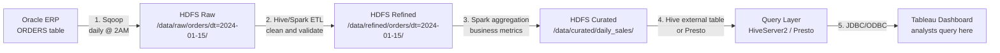

# Scenario Questions — Hadoop Ecosystem Architecture

<article data-difficulty="junior">

## 🟢 Junior: Describe Data Flow from Source to Analytics in a Hadoop Data Lake

**Scenario:** You join a new company with a Hadoop data lake. Your manager asks you to explain the end-to-end data flow: how does data from the company's Oracle ERP database end up in a Tableau dashboard? Describe each step, the tools involved, and the HDFS zones used.

<details><summary>💡 Hint</summary>

Think about: ingestion (Sqoop), storage zones (raw/refined/curated), processing (Hive/Spark), serving (Presto/Hive), and visualization. Describe what transforms the data at each step.

</details>

<details><summary>✅ Solution</summary>

**End-to-End Data Flow:**



**Step-by-step explanation:**

**Step 1: Ingestion (Sqoop)**
```bash
# Runs daily via Oozie coordinator at 2 AM
sqoop import \
  --connect jdbc:oracle:thin:@//oracle-host:1521/ERP \
  --username etl_user \
  --password-file hdfs:///user/etl/oracle.pass \
  --table ORDERS \
  --where "TRUNC(CREATED_DATE) = SYSDATE - 1" \
  --target-dir /data/raw/orders/dt=2024-01-15 \
  --num-mappers 8 \
  --as-parquetfile \
  --compression-codec snappy
```
Result: Raw Parquet files in HDFS, exact copy of Oracle data for that day.

**Step 2: Cleaning and Validation (Spark ETL)**
```python
# Spark job: clean_orders.py
spark = SparkSession.builder.appName("clean_orders").getOrCreate()

raw = spark.read.parquet("/data/raw/orders/dt=2024-01-15/")

cleaned = raw.filter("order_amount > 0") \
    .filter("order_status IS NOT NULL") \
    .withColumn("order_date", to_date("created_at")) \
    .withColumn("amount_usd", col("amount") * col("exchange_rate")) \
    .drop("internal_id", "sys_timestamp")

cleaned.write.mode("overwrite").parquet("/data/refined/orders/dt=2024-01-15/")
```
Result: Cleaned, enriched data in Refined zone.

**Step 3: Business Aggregations (Spark)**
```python
# daily_sales_agg.py
refined = spark.read.parquet("/data/refined/orders/dt=2024-01-15/")

daily_sales = refined.groupBy("region", "product_category").agg(
    count("order_id").alias("order_count"),
    sum("amount_usd").alias("total_revenue"),
    avg("amount_usd").alias("avg_order_value")
)

daily_sales.write.mode("overwrite").parquet("/data/curated/daily_sales/dt=2024-01-15/")
```
Result: Business-ready aggregates in Curated zone.

**Step 4: Query Layer (Hive Metastore)**
```sql
-- Hive external table over Curated zone
CREATE EXTERNAL TABLE IF NOT EXISTS curated.daily_sales (
  region STRING,
  product_category STRING,
  order_count BIGINT,
  total_revenue DOUBLE,
  avg_order_value DOUBLE
)
PARTITIONED BY (dt STRING)
STORED AS PARQUET
LOCATION '/data/curated/daily_sales/';

ALTER TABLE curated.daily_sales ADD PARTITION (dt='2024-01-15');
```

**Step 5: Tableau connects via JDBC to HiveServer2 or Presto**
```
Tableau Data Source:
  Connection type: Hive / Presto
  Host: hiveserver2.corp or presto.corp
  Port: 10000 / 8080
  Database: curated
  Table: daily_sales
```

**Zone summary:**

| Zone | Path | Who owns it | Retention |
|------|------|-------------|-----------|
| Raw | /data/raw/ | DE team | 90 days (audit) |
| Refined | /data/refined/ | DE team | 1 year |
| Curated | /data/curated/ | Analytics | 3 years |

</details>
</article>

<article data-difficulty="mid-level">

## 🟡 Mid-Level: Design a Multi-Tenant Hadoop Cluster with Fair Scheduling and Security

**Scenario:** Your company has three teams sharing a 200-node Hadoop cluster: Data Engineering (heavy Spark ETL), Analytics (Hive queries), and ML Team (Spark ML training). Design the multi-tenancy configuration including:
- YARN queue structure with fair allocation
- HDFS namespace isolation
- Security model (authentication + authorization)
- Priority handling (critical DE jobs vs ad-hoc analytics)

<details><summary>✅ Solution</summary>

**YARN Capacity Scheduler Configuration:**

```xml
<!-- capacity-scheduler.xml -->
<configuration>
  <property>
    <name>yarn.scheduler.capacity.root.queues</name>
    <value>engineering,analytics,ml-team</value>
  </property>

  <!-- Data Engineering: 50% guaranteed, 80% max (critical ETL) -->
  <property>
    <name>yarn.scheduler.capacity.root.engineering.capacity</name>
    <value>50</value>
  </property>
  <property>
    <name>yarn.scheduler.capacity.root.engineering.maximum-capacity</name>
    <value>80</value>
  </property>
  <property>
    <name>yarn.scheduler.capacity.root.engineering.user-limit-factor</name>
    <value>2</value>
  </property>

  <!-- Sub-queues in Engineering: prod vs dev -->
  <property>
    <name>yarn.scheduler.capacity.root.engineering.queues</name>
    <value>prod,dev</value>
  </property>
  <property>
    <name>yarn.scheduler.capacity.root.engineering.prod.capacity</name>
    <value>80</value>  <!-- 80% of engineering's 50% = 40% cluster -->
  </property>
  <property>
    <name>yarn.scheduler.capacity.root.engineering.dev.capacity</name>
    <value>20</value>
  </property>
  <property>
    <name>yarn.scheduler.capacity.root.engineering.prod.priority</name>
    <value>10</value>  <!-- Higher priority = preempts lower -->
  </property>

  <!-- Analytics: 30% guaranteed -->
  <property>
    <name>yarn.scheduler.capacity.root.analytics.capacity</name>
    <value>30</value>
  </property>
  <property>
    <name>yarn.scheduler.capacity.root.analytics.maximum-capacity</name>
    <value>60</value>
  </property>
  <property>
    <name>yarn.scheduler.capacity.root.analytics.priority</name>
    <value>5</value>
  </property>

  <!-- ML Team: 20% guaranteed -->
  <property>
    <name>yarn.scheduler.capacity.root.ml-team.capacity</name>
    <value>20</value>
  </property>
  <property>
    <name>yarn.scheduler.capacity.root.ml-team.maximum-capacity</name>
    <value>70</value>
  </property>
  <property>
    <name>yarn.scheduler.capacity.root.ml-team.priority</name>
    <value>3</value>
  </property>

  <!-- Preemption: allow prod jobs to preempt analytics/ml -->
  <property>
    <name>yarn.resourcemanager.scheduler.monitor.enable</name>
    <value>true</value>
  </property>
  <property>
    <name>yarn.resourcemanager.monitor.capacity.preemption.enabled</name>
    <value>true</value>
  </property>
</configuration>
```

**HDFS Namespace Isolation:**
```bash
# Create team directories with appropriate permissions
hdfs dfs -mkdir /user/engineering /user/analytics /user/ml-team

# HDFS POSIX permissions
hdfs dfs -chown -R etl-service:engineering /data/raw /data/refined
hdfs dfs -chmod -R 750 /data/raw          # Only engineering group
hdfs dfs -chmod -R 755 /data/refined      # Readable by all
hdfs dfs -chmod -R 755 /data/curated      # Readable by all

# HDFS Quotas per team workspace
hdfs dfsadmin -setSpaceQuota 100T /user/engineering
hdfs dfsadmin -setSpaceQuota 20T /user/analytics
hdfs dfsadmin -setSpaceQuota 50T /user/ml-team

# Namespace quota (prevent metadata explosion)
hdfs dfsadmin -setQuota 10000000 /user/analytics  # Max 10M files
```

**Security Model:**

```
Authentication (Kerberos):
  Each team has its own service account:
  - etl@CORP.COM (engineering jobs)
  - analyst@CORP.COM (analytics queries)
  - ml-svc@CORP.COM (ML training jobs)

  Interactive users:
  - alice@CORP.COM, bob@CORP.COM (engineers)
  - carol@CORP.COM (analyst)

Authorization (Ranger):
  Policy 1: Engineering team access
    - DB: raw.*, refined.* → CRUD
    - HDFS: /data/raw/*, /data/refined/* → Read/Write
    - Queue: engineering.prod, engineering.dev

  Policy 2: Analytics team access
    - DB: refined.*, curated.* → SELECT only
    - HDFS: /data/refined/*, /data/curated/* → Read only
    - Column masking: email → MASK_HASH, ssn → MASK
    - Queue: analytics

  Policy 3: ML team access
    - DB: refined.features.* → SELECT
    - HDFS: /user/ml-team/, /data/refined/features/ → Read/Write
    - Queue: ml-team
```

**Submitting to correct queues:**
```bash
# Engineering prod job
spark-submit \
  --queue engineering.prod \
  --conf spark.yarn.priority=10 \
  etl_job.py

# Analytics query via HiveServer2
beeline -u "jdbc:hive2://hiveserver2:10000" \
        -n carol@CORP.COM \
        --hiveconf tez.queue.name=analytics \
        -e "SELECT * FROM curated.daily_sales"

# ML training job
spark-submit \
  --queue ml-team \
  --executor-memory 32g \
  --num-executors 50 \
  train_model.py
```

</details>
</article>

<article data-difficulty="senior">

## 🔴 Senior: Design a Migration Plan from On-Prem Hadoop to Cloud-Native Architecture with Zero Data Loss

**Scenario:** Your company has a 500-node on-premises Hadoop cluster with:
- 15 PB of HDFS data
- 200 Oozie workflows (daily/hourly coordinators)
- 50 Hive databases, 3000 tables
- HBase cluster with 10 TB of real-time data
- 25 Sqoop import jobs from various RDBMS sources
- Kerberos security with Apache Ranger

Design a zero-data-loss migration to AWS (S3 + EMR + MWAA + DynamoDB) with:
- Maximum 4-hour maintenance window for cutover
- Clear rollback plan at each phase
- Cost comparison before/after

<details><summary>✅ Solution</summary>

**Target Architecture:**

```mermaid
graph LR
    A["Oracle/MySQL<br>Sources"] -->|"Glue/Airbyte<br>replaces Sqoop"| B["S3 Data Lake<br>15 PB"]
    C["Kafka MSK<br>replaces Flume"| B
    B --> D["EMR Spark<br>replaces Hive+YARN"]
    B --> E["Athena<br>serverless SQL"]
    D -->|"writes"| B
    F["MWAA Airflow<br>replaces Oozie"] --> D
    F --> E
    G["DynamoDB<br>replaces HBase"] --> H["Application Layer"]
    B --> H
    I["Lake Formation<br>replaces Ranger"] --> B
    J["Glue Data Catalog<br>replaces Hive Metastore"] --> D
    J --> E
```

**Migration Timeline (16 weeks):**

```
Weeks 1-2: Assessment and Setup
  - Inventory all 200 Oozie workflows, classify by complexity
  - Catalog all 3000 Hive tables (size, format, owner, query frequency)
  - Set up AWS environment:
    * S3 buckets (raw, refined, curated) with lifecycle policies
    * EMR cluster (right-sized for workloads)
    * MWAA environment
    * Glue Data Catalog
    * Lake Formation permissions
    * DynamoDB tables (replicate HBase schema)
  - Create AWS Direct Connect (10 Gbps) for data transfer

Weeks 3-6: Data Migration (HDFS → S3)
  - Run S3DistCp continuously (15 PB / 10 Gbps ≈ 3-4 weeks)
  - Validate each transferred dataset:
    * Row count match
    * Checksum validation on sample files
  - Keep on-prem as source of truth during this phase

Weeks 7-9: Compute Migration
  - Convert Pig scripts to PySpark (automated tooling where possible)
  - Convert Oozie workflows to Airflow DAGs (1:1 mapping)
  - Set up Sqoop replacement (AWS Glue jobs for RDBMS imports)
  - Test each converted job with production-scale data

Weeks 10-12: HBase → DynamoDB Migration
  - Export HBase to S3 (HBase snapshot to S3)
  - Transform to DynamoDB format via Spark EMR job
  - Enable DynamoDB Streams for CDC
  - Run parallel writes: prod writes to HBase AND DynamoDB
  - Validate read consistency

Weeks 13-15: Parallel Run and Validation
  - Run ALL workflows on both Oozie (on-prem) and MWAA (AWS)
  - Compare output datasets daily:
    * Row counts
    * Aggregation checksums
    * Business metric validation (total revenue, order counts)
  - SRE: monitor both environments in Grafana

Week 16: Cutover Week
  Day 1-5: Drain and prep
    - Switch RDBMS sources to write to AWS Glue (not Sqoop)
    - Last full validation run
  Day 6 (Saturday, 10 PM): 4-hour maintenance window
    - T+0: Announce maintenance, freeze source DB writes
    - T+5m: Final DistCp for any remaining files
    - T+15m: Validate S3 vs HDFS checksums (automated)
    - T+30m: Switch Kafka consumers to write to S3 (not HDFS)
    - T+60m: Disable all Oozie coordinators
    - T+60m: Enable all MWAA DAGs
    - T+90m: Switch HBase reads to DynamoDB in application config
    - T+120m: Smoke test: run key queries on Athena, verify metrics
    - T+180m: Remove read access from on-prem Hadoop for new users
    - T+240m: Maintenance window closes
```

**Rollback Plan (per phase):**

```
HDFS → S3 phase: S3 is read-only copy, HDFS is still source of truth → instant rollback

Compute migration: Oozie still running in parallel → disable MWAA, re-enable Oozie

HBase → DynamoDB: Dual-write active → disable DynamoDB write, apps revert to HBase

Cutover week: On-prem Hadoop kept alive for 30 days post-cutover
  If critical issue found:
    1. Re-enable Oozie coordinators
    2. Switch Kafka back to HDFS
    3. Switch app config back to HBase
    4. ETA: 30-minute rollback window
```

**Cost Comparison:**

```
On-Premises (annual):
  500 nodes × $10K/node/year (hardware amortized) = $5M
  Electricity + cooling: $1M
  Software licenses (Cloudera): $2M
  Operations (5 FTE cluster admins): $750K
  Total: ~$8.75M/year

AWS (annual estimate):
  S3 storage: 15 PB × $0.023/GB/month × 12 = $4.2M
  EMR (50 r5.4xlarge, spot for task nodes): $1.8M
  MWAA: $0.49/hour × 8760 = $4,292 ≈ negligible
  DynamoDB: 10 TB + 5M writes/day: $0.6M
  Direct Connect: $0.1M
  Data transfer out: $0.15M
  Total: ~$6.85M/year

Savings: $8.75M - $6.85M = $1.9M/year (~22% reduction)

Additional benefits (unquantified):
  - Elastic scaling (no capacity planning)
  - Automatic upgrades (EMR managed)
  - 0 cluster admin FTE needed (save $450K/year)
  - EMR auto-scaling for burst workloads
```

**Zero Data Loss Guarantees:**
```
1. S3 write-once semantics (no partial writes)
2. S3 Cross-Region Replication (us-east-1 → us-west-2)
3. DynamoDB point-in-time recovery enabled
4. AWS Backup for all critical datasets
5. Checksum validation at each transfer step
6. 30-day on-prem retention post-cutover for emergency rollback
```

</details>
</article>
