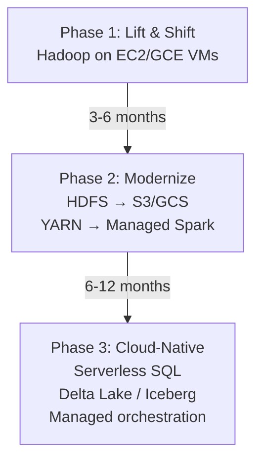

# Hadoop Ecosystem Architecture — Senior Deep Dive

## Migration from On-Prem Hadoop to Cloud

The industry trend is clear: most new analytics workloads go cloud-native, and legacy Hadoop clusters are being migrated.

### Cloud Equivalents

| On-Prem Hadoop | AWS | GCP | Azure |
|---------------|-----|-----|-------|
| HDFS | S3 | GCS | ADLS Gen2 |
| YARN + MapReduce | EMR | Dataproc | HDInsight |
| Hive | EMR + Hive / Glue + Athena | Dataproc + Hive / BigQuery | HDInsight + Hive / Synapse |
| HBase | DynamoDB / EMR + HBase | Bigtable | Azure Cosmos DB |
| Spark | EMR Spark / Glue | Dataproc Spark | Databricks on Azure |
| Kafka | MSK | Pub/Sub | Event Hubs |
| Oozie | MWAA (Airflow) | Cloud Composer | Azure Data Factory |
| Ranger | AWS Lake Formation | Dataplex | Purview |
| ZooKeeper | N/A (managed) | N/A (managed) | N/A (managed) |

### Migration Phases



### HDFS to S3 Migration

```bash
# S3DistCp: bulk transfer HDFS → S3
s3-dist-cp \
  --src hdfs:///data/raw/ \
  --dest s3://company-data-lake/raw/ \
  --srcPattern '.*\.parquet' \
  --deleteOnSuccess \
  --multipartUploadChunkSize 128

# DistCp: standard Hadoop cross-cluster copy
hadoop distcp \
  -m 50 \                          # 50 parallel copiers
  -bandwidth 100 \                  # 100 MB/s per mapper
  -delete \                        # Delete source after success
  hdfs://on-prem-nn/data/ \
  s3a://company-data-lake/data/

# Configure S3A connector in core-site.xml (on EMR)
# fs.s3a.access.key, fs.s3a.secret.key
# or use IAM roles (preferred)
```

## Modern Data Lakehouse vs Traditional Hadoop

```
Traditional Hadoop Data Lake:
  Storage: HDFS
  Format: ORC / Parquet (no ACID)
  Metadata: Hive Metastore
  Query: Hive + Spark
  Updates: DELETE + INSERT (partition swap)
  Time travel: Not native

Modern Lakehouse (Delta Lake / Apache Iceberg / Apache Hudi):
  Storage: S3 / GCS / ADLS (or HDFS)
  Format: Parquet + transaction log
  Metadata: Iceberg catalog / Delta log / Hudi timeline
  Query: Spark / Trino / Flink / Athena
  Updates: ACID MERGE / UPDATE / DELETE
  Time travel: Native (read table as of timestamp)
```

```python
# Delta Lake example (lakehouse on HDFS or S3)
from delta import DeltaTable
from pyspark.sql import SparkSession

spark = SparkSession.builder \
    .config("spark.sql.extensions", "io.delta.sql.DeltaSparkSessionExtension") \
    .config("spark.sql.catalog.spark_catalog", "org.apache.spark.sql.delta.catalog.DeltaCatalog") \
    .getOrCreate()

# Write as Delta
df.write.format("delta").mode("overwrite").save("s3://bucket/delta/orders")

# ACID MERGE (upsert)
delta_table = DeltaTable.forPath(spark, "s3://bucket/delta/orders")
delta_table.alias("target").merge(
    new_orders.alias("source"),
    "target.order_id = source.order_id"
).whenMatchedUpdateAll() \
 .whenNotMatchedInsertAll() \
 .execute()

# Time travel
df_yesterday = spark.read.format("delta") \
    .option("versionAsOf", 5) \
    .load("s3://bucket/delta/orders")

# Or by timestamp
df_old = spark.read.format("delta") \
    .option("timestampAsOf", "2024-01-15") \
    .load("s3://bucket/delta/orders")
```

## Apache Ranger for Fine-Grained Authorization

Ranger provides centralized security policy management:

```
Ranger components:
  Ranger Admin Server: Web UI + REST API for policy management
  Ranger Plugins: In-process plugins in each service (Hive, HDFS, HBase, Kafka, etc.)
  Ranger Audit: Writes audit logs to HDFS or Solr

Policy types:
  Resource-based: Allow/deny access to specific tables, columns, paths
  Row-level filter: WHERE clause injected per user/group
  Column masking: Mask/hash/redact sensitive columns per user
```

```json
// Example Ranger policy: Analysts can query orders table except for PII columns
{
  "name": "analyst-orders-policy",
  "serviceType": "hive",
  "resources": {
    "database": {"values": ["refined"]},
    "table": {"values": ["orders"]},
    "column": {"values": ["*"]}
  },
  "policyItems": [{
    "accesses": [{"type": "select", "isAllowed": true}],
    "groups": ["analytics-team"]
  }],
  "dataMaskPolicyItems": [{
    "dataMaskInfo": {"dataMaskType": "MASK_HASH"},
    "accesses": [{"type": "select", "isAllowed": true}],
    "columns": ["customer_email", "customer_phone"],
    "groups": ["analytics-team"]
  }],
  "rowFilterPolicyItems": [{
    "rowFilterInfo": {"filterExpr": "region = 'US'"},
    "accesses": [{"type": "select"}],
    "groups": ["analytics-team"]
  }]
}
```

## Apache Atlas for Data Governance

Atlas provides metadata management and data lineage:

```
Atlas capabilities:
  1. Automatic classification: Tag sensitive columns (PII, PCI, HIPAA)
  2. Lineage tracking: Source → ETL → Target (column-level)
  3. Business glossary: Business terms linked to technical metadata
  4. Search and catalog: Find tables by owner, classification, business term
  5. Tag-based policies: Integrate with Ranger ("mask all PII-tagged columns")

Atlas integrations:
  Hive hook: captures table create/alter/drop events
  Spark listener: captures Spark SQL lineage
  Kafka listener: captures topic read/write
  Sqoop hook: captures import/export operations
```

```bash
# Atlas REST API examples
# Get entity by type
curl "http://atlas-host:21000/api/atlas/v2/search/dsl?query=hive_table" \
  -H "Authorization: Basic YWRtaW46YWRtaW4="

# Get lineage for a table
curl "http://atlas-host:21000/api/atlas/v2/lineage/{guid}?direction=BOTH&depth=5" \
  -H "Authorization: Basic YWRtaW46YWRtaW4="

# Add classification (tag) to a column
curl -X POST "http://atlas-host:21000/api/atlas/v2/entity/guid/{column_guid}/classifications" \
  -H "Content-Type: application/json" \
  -d '[{"typeName": "PII"}]'
```

## Multi-Tenant Hadoop Design

```
Multi-tenancy dimensions:
  1. Compute isolation: YARN queues with capacity guarantees
  2. Storage isolation: HDFS quota per team directory
  3. Security isolation: Kerberos principals + Ranger policies
  4. Network isolation: VLANs or namespace isolation
  5. Catalog isolation: Hive databases per team
```

```bash
# HDFS quotas for storage isolation
# Namespace quota (max files/directories)
hdfs dfsadmin -setQuota 10000 /user/team-analytics

# Space quota (max bytes including replication)
hdfs dfsadmin -setSpaceQuota 10T /user/team-analytics

# View quotas
hdfs dfs -count -q -h /user/team-analytics

# YARN queue ACLs
# In capacity-scheduler.xml:
# yarn.scheduler.capacity.root.analytics.acl_submit_applications = analytics-users
# yarn.scheduler.capacity.root.analytics.acl_administer_queue = analytics-admins
```

## Hadoop Ecosystem Sunset: What's Replaced by What

```
Status in 2024:

REPLACING / REPLACED:
  MapReduce    → Apache Spark (ETL, batch analytics)
  Pig          → Spark (ETL), dbt (SQL-based transforms)
  Oozie        → Apache Airflow
  Sqoop        → Spark JDBC, AWS Glue, Fivetran
  Flume        → Kafka + Kafka Connect
  Storm        → Flink, Spark Structured Streaming
  Impala       → Trino (Presto fork), Spark SQL
  HDFS         → S3/GCS/ADLS (cloud-native)
  YARN         → Kubernetes (cloud-native)

STILL ACTIVE:
  HBase        → Active; some workloads → DynamoDB/Bigtable
  Hive         → Active with Tez/Spark; some → BigQuery/Athena
  Kafka        → Active and growing
  Spark        → Industry standard, very active
  ZooKeeper    → Active (Kafka migrating away with KRaft)
  Ranger       → Active for on-prem; Lake Formation in AWS
  Atlas        → Active for on-prem governance
```

## Interview Tips

> **Tip 1:** When asked about cloud migration, always lead with the HDFS → S3 transition. HDFS was designed for co-located compute and storage; S3 separates them (cheaper storage, elastic compute). The trade-off: S3 has higher per-operation latency than local HDFS (~10ms vs ~1ms), which matters for small file operations and NameNode-intensive workloads.

> **Tip 2:** The Lakehouse architecture (Delta Lake, Iceberg, Hudi) is the most important modern concept to know. It adds ACID transactions and time travel to cloud object stores, combining the scalability of data lakes with the reliability of data warehouses. Interviews at data-forward companies will probe this deeply.

> **Tip 3:** Ranger vs Lake Formation vs Dataplex is a common comparison. Ranger is open-source and works on-prem and on cloud; Lake Formation is AWS-native with simpler setup but less granular controls; Dataplex is GCP's managed governance layer. Know which to recommend based on the cloud target.

> **Tip 4:** Multi-tenant design is about isolation at every layer: YARN queues for compute, HDFS quotas for storage, Ranger policies for access, separate Hive databases for catalog isolation. Missing any one layer creates resource contention or security gaps.

> **Tip 5:** "What is the state of Hadoop in 2024?" is a layered question. The correct answer: HDFS and YARN are declining in favor of cloud-native storage + Kubernetes; Hive and Spark are still active; HBase remains for specific workloads; Kafka is thriving; Oozie/Pig/Sqoop are being replaced. Show awareness of the migration trajectory, not just the current state.

## ⚡ Cheat Sheet

**HDFS architecture**
```
NameNode:   stores metadata (file → block mappings, permissions, namespace)
DataNode:   stores actual data blocks (default 128 MB per block)
Replication: default factor 3 (two local rack + one remote rack)
HA:         Active/Standby NameNode with JournalNodes for edit log sharing
```

**HDFS key commands**
```bash
hdfs dfs -ls /data/warehouse          # list files
hdfs dfs -put local.csv /data/raw/    # upload
hdfs dfs -get /data/output/ ./local/  # download
hdfs dfs -rm -r /data/tmp/            # delete
hdfs dfs -du -s -h /data/warehouse/   # disk usage
hdfs dfs -copyFromLocal -f src dst    # overwrite on upload
hdfs fsck /path -files -blocks        # check file health
```

**YARN resource model**
```
ResourceManager:  cluster master — allocates containers
NodeManager:      per-node agent — runs containers, reports health
ApplicationMaster: per-job — negotiates resources with RM
Container:        allocated unit (CPU cores + memory)

Scheduler types: FIFO, Capacity Scheduler (queues), Fair Scheduler
```

**Hive vs Spark SQL**
```
Hive:      MapReduce by default (slow); good for compatibility; HQL ≈ SQL
Hive LLAP: in-memory daemon; much faster (sub-minute queries)
Spark SQL:  Hive Metastore compatible but Spark execution — 10-100x faster
```

**Hive partitioning**
```sql
CREATE TABLE orders (order_id BIGINT, amount DOUBLE)
PARTITIONED BY (dt STRING, region STRING)
STORED AS PARQUET;
-- Dynamic partition insert
SET hive.exec.dynamic.partition.mode=nonstrict;
INSERT INTO orders PARTITION (dt, region)
SELECT order_id, amount, dt, region FROM staging_orders;
```

**MapReduce pattern**
```
Map:    input splits → emit (key, value) pairs
Shuffle: sort + group by key across nodes
Reduce: aggregate values per key → output
Use case today: Hive compatibility, very large batch on older clusters
```

**ZooKeeper use cases in Hadoop**
```
HBase region assignment  — ZK tracks which RegionServer owns which region
HDFS NameNode HA         — ZK elects Active NameNode
YARN RM HA               — ZK elects Active ResourceManager
Kafka broker coordination — ZK stores broker/topic metadata (pre-KRaft)
```

**HBase data model**
```
Table → Row → Column Family → Column Qualifier → Value (versioned by timestamp)
Row key design is critical: avoid hot-spotting (don't use sequential IDs)
Strategies: salt prefix, reverse timestamp, MD5 hash of natural key
```

**Key interview points**
- HDFS is optimized for large files, sequential reads; terrible for many small files
- Sqoop: parallel JDBC import from RDBMS to HDFS/Hive (one mapper per table partition)
- Oozie: XML-based workflow scheduler (predecessor to Airflow in Hadoop ecosystem)
- Pig: dataflow language (Latin) — pre-dbt/Spark era; rarely used in modern stacks
- Ecosystem today: HDFS + YARN still used, but S3/GCS replacing HDFS in cloud-native stacks
