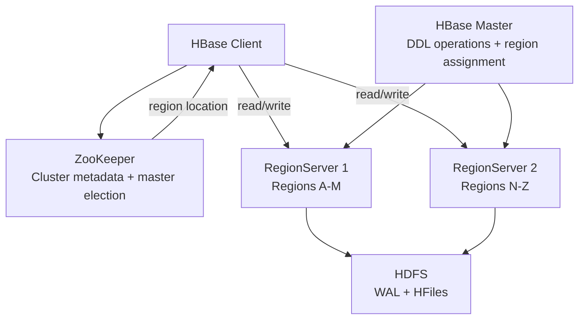

# HBase Fundamentals

## What is HBase?

Apache HBase is a distributed, scalable, NoSQL database built on top of HDFS. It provides random, real-time read/write access to large datasets, filling the gap that HDFS (batch-only) leaves for online workloads.

**Key characteristics:**
- **Wide-column store**: Tables have rows and column families, but individual columns are defined per row (sparse)
- **Sorted by row key**: All rows are sorted lexicographically by row key
- **Consistent reads/writes**: Strong consistency within a row
- **Linear scalability**: Add RegionServers to scale out

## HBase Data Model

```
Table: user_activity
Row Key          | cf:page_views | cf:purchases | cf:last_seen
-----------------+---------------+--------------+-------------
user_001         | 1500          | 45           | 2024-01-15
user_002         | 230           |              | 2024-01-14
user_003         | 8900          | 120          | 2024-01-15
```

### Key Concepts

**Row Key**: Unique identifier for each row. All rows are sorted by row key. The row key is the ONLY indexed column.

**Column Family**: Group of columns stored together on disk. Defined at table creation time. Example: `profile:`, `activity:`, `metrics:`

**Column Qualifier**: The actual column name within a family. Can be created dynamically (schema-free within a column family).

**Cell**: The value at (rowkey, column_family, column_qualifier, timestamp). HBase stores multiple versions per cell (by timestamp).

**Timestamp**: Each cell value is versioned by timestamp (milliseconds by default). Older versions can be retrieved.

## HBase Architecture



### HBase Master
- Manages RegionServer assignments
- Handles DDL operations (create/delete tables)
- Monitors RegionServer health via ZooKeeper
- NOT in the read/write data path (clients talk directly to RegionServers)

### RegionServer
- Serves 10-1000 regions per server
- Handles reads and writes for its regions
- Performs minor/major compaction
- Reports to Master via ZooKeeper heartbeat

### Regions
- A contiguous range of rows in a table
- Initially one region per table; splits when a region exceeds `hbase.hregion.max.filesize` (10 GB default)
- Each region is served by exactly ONE RegionServer at a time

### ZooKeeper Role in HBase
- Stores location of `hbase:meta` table (which maps rows to RegionServers)
- Master leader election (HA)
- RegionServer heartbeats (dead RS detection)
- Distributed locking

## HBase Shell Commands

```bash
# Start HBase shell
hbase shell

# Table operations
create 'user_activity', 'cf'       # Create table with one column family
create 'user_activity', {NAME => 'profile', VERSIONS => 3}, {NAME => 'activity', TTL => 604800}

list                                 # List all tables
describe 'user_activity'            # Table structure
disable 'user_activity'             # Disable before alter/delete
enable 'user_activity'              # Re-enable table
drop 'user_activity'                # Delete table (must be disabled first)
exists 'user_activity'

# Data operations
put 'user_activity', 'user_001', 'cf:page_views', '1500'  # row, column_family:qualifier, value
put 'user_activity', 'user_001', 'cf:purchases', '45'

get 'user_activity', 'user_001'                        # Get all columns for row
get 'user_activity', 'user_001', 'cf:page_views'      # Specific column
get 'user_activity', 'user_001', {COLUMN => 'cf:page_views', VERSIONS => 3}  # Multiple versions

scan 'user_activity'                                   # Scan all rows
scan 'user_activity', {STARTROW => 'user_001', ENDROW => 'user_010'}
scan 'user_activity', {COLUMNS => ['cf:page_views'], LIMIT => 100}
scan 'user_activity', {FILTER => "ValueFilter(=, 'binaryprefix:145')"}

delete 'user_activity', 'user_001', 'cf:page_views'   # Delete specific cell
deleteall 'user_activity', 'user_001'                  # Delete entire row

count 'user_activity'              # Row count (slow on large tables)

# Admin operations
status 'detailed'                  # Cluster status
balance_switch true                # Enable/disable load balancer
major_compact 'user_activity'     # Trigger major compaction
```

## Row Key Design

The row key is the most critical design decision in HBase. It determines:
- **Data distribution** across RegionServers (hot spots)
- **Read performance** (adjacent keys are stored together)
- **Scan efficiency** (range scans use row key ordering)

### Anti-Pattern: Sequential Row Keys (Hot Spotting)
```
BAD row keys (sequential):
2024-01-15_event_1
2024-01-15_event_2
2024-01-15_event_3

All new writes go to the LAST region → single RegionServer bottleneck!
```

### Solution: Salting or Reversing
```
Salted: Prepend random bucket number
hash(key) % N_BUCKETS + "_" + original_key

Reversed timestamps: Use (MAX_LONG - timestamp) so newest rows sort first
For user event lookup by user, newest first:
user_001_9999999999999 (= Long.MAX_VALUE - epoch_ms for 2024-01-15)
user_001_9999999998765 (older event)

→ Scan user_001 prefix → get events newest-first without reversing scan
```

### Good Row Key Patterns
```bash
# User profile lookup: user_id (UUID ensures distribution)
put 'profiles', 'a7f3d2c1-4b5e-8f9a-...', 'info:name', 'Alice'

# Time-series with user: userId_reversedTimestamp
# Enables: scan all events for a user, newest first
put 'user_events', 'user_001_9223370399254' 'cf:event', 'click'

# Composite key for sensor data: sensorId_date_hour
# Enables: get all readings for a sensor in a time range
put 'sensor_data', 'sensor_42_2024-01-15_14' 'cf:temp', '72.5'
```

## HBase Java API

```java
import org.apache.hadoop.hbase.*;
import org.apache.hadoop.hbase.client.*;
import org.apache.hadoop.hbase.util.Bytes;

Configuration conf = HBaseConfiguration.create();
conf.set("hbase.zookeeper.quorum", "zk1,zk2,zk3");
conf.set("hbase.zookeeper.property.clientPort", "2181");

try (Connection connection = ConnectionFactory.createConnection(conf);
     Table table = connection.getTable(TableName.valueOf("user_activity"))) {

    // PUT: write data
    Put put = new Put(Bytes.toBytes("user_001"));
    put.addColumn(
        Bytes.toBytes("cf"),          // column family
        Bytes.toBytes("page_views"),  // qualifier
        Bytes.toBytes("1500")         // value
    );
    table.put(put);

    // GET: read a row
    Get get = new Get(Bytes.toBytes("user_001"));
    get.addColumn(Bytes.toBytes("cf"), Bytes.toBytes("page_views"));
    Result result = table.get(get);
    byte[] value = result.getValue(Bytes.toBytes("cf"), Bytes.toBytes("page_views"));
    System.out.println("page_views: " + Bytes.toString(value));

    // SCAN: range scan
    Scan scan = new Scan();
    scan.withStartRow(Bytes.toBytes("user_001"));
    scan.withStopRow(Bytes.toBytes("user_010"));
    scan.addFamily(Bytes.toBytes("cf"));
    scan.setCaching(1000);  // Fetch 1000 rows per RPC
    scan.setBatch(100);     // Max 100 cells per Result object

    try (ResultScanner scanner = table.getScanner(scan)) {
        for (Result r : scanner) {
            System.out.println("Row: " + Bytes.toString(r.getRow()));
        }
    }

    // DELETE: remove a cell
    Delete delete = new Delete(Bytes.toBytes("user_001"));
    delete.addColumn(Bytes.toBytes("cf"), Bytes.toBytes("page_views"));
    table.delete(delete);
}
```

## HBase vs Relational Databases

| Feature | HBase | RDBMS (MySQL/PostgreSQL) |
|---------|-------|--------------------------|
| Data model | Wide-column, NoSQL | Tables with fixed schema |
| Schema | Flexible (add columns anytime) | Rigid (ALTER TABLE) |
| Joins | No native joins | Full JOIN support |
| ACID | Row-level only | Full ACID across rows |
| Query | Row key + scan only | Full SQL |
| Scale | Horizontal (petabytes) | Vertical (mostly) |
| Latency | Low (ms for gets) | Low (ms for indexed) |
| Analytics | Poor (scan-heavy) | Good (indexes, query planner) |
| Best for | High-volume key lookups | Relational, transactional |

## Interview Tips

> **Tip 1:** Row key design is the most critical HBase design question. Always ask: "What are the access patterns?" If the answer is "get by user_id" → use user_id as row key. If "get all events for user in time range" → use userId_reversedTimestamp as compound key. The row key must match the primary access pattern.

> **Tip 2:** Know why HBase is NOT suitable for: complex queries (no SQL, no joins), OLTP with multi-row transactions, or small datasets (Cassandra/DynamoDB are simpler for < 100 GB). HBase excels at: hundreds of millions of rows with low-latency get-by-key access.

> **Tip 3:** Explain the "hot spot" problem clearly — sequential timestamps or auto-increment IDs as row keys cause all writes to go to one RegionServer. Solutions: salting (prepend hash bucket), reversing timestamps (Long.MAX_VALUE - timestamp), or using random UUIDs.

> **Tip 4:** Know that clients talk directly to RegionServers for data (not through HBase Master). The Master only handles DDL and region assignments. The client first looks up the `-ROOT-` / `hbase:meta` table via ZooKeeper to find which RegionServer has the target row, then connects directly.

> **Tip 5:** Column families are a storage-level concept — different column families are stored in separate HFiles on HDFS. Mixing hot and cold data in the same column family wastes I/O. Best practice: create separate column families for different access patterns (e.g., `profile:` for rarely-changed user data, `events:` for high-write event data).
