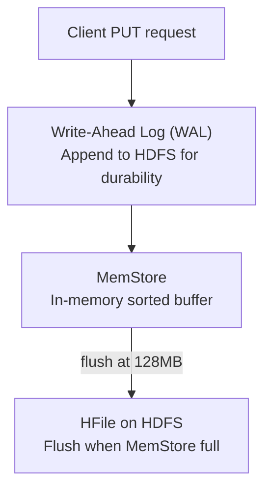
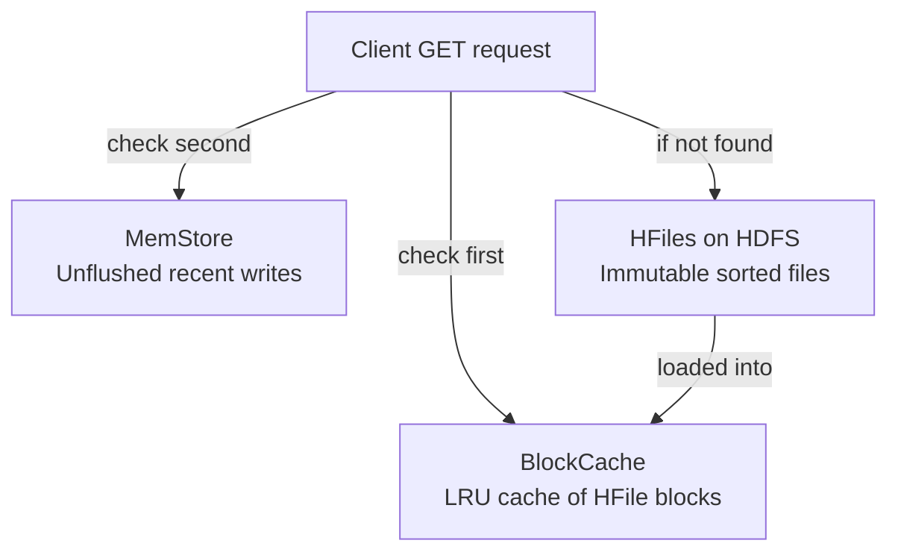

# HBase Intermediate Concepts

## Read and Write Path

### Write Path


**Detailed write flow:**
1. Client sends PUT to the responsible RegionServer
2. RegionServer appends to **WAL** (Write-Ahead Log) on HDFS — durability guarantee
3. Data is written to **MemStore** (in-memory sorted buffer per column family per region)
4. Write acknowledged to client after WAL + MemStore write
5. When MemStore reaches `hbase.hregion.memstore.flush.size` (128 MB), flush to HFile on HDFS
6. WAL segments for flushed data can be archived/cleaned

### Read Path


**Detailed read flow:**
1. Check **BlockCache** (off-heap LRU cache, default BucketCache)
2. Check **MemStore** (in-memory recent writes not yet flushed)
3. Check **HFiles** (multiple files per region, newest first)
4. Merge results across MemStore and all HFiles (sorted by timestamp)
5. Return latest version (or specified number of versions)

### BlockCache Types
```xml
<!-- hbase-site.xml -->
<!-- L1: On-heap LRU cache -->
<property>
  <name>hfile.block.cache.size</name>
  <value>0.4</value>  <!-- 40% of JVM heap for BlockCache -->
</property>

<!-- L2: Off-heap BucketCache (preferred for large caches) -->
<property>
  <name>hbase.bucketcache.ioengine</name>
  <value>offheap</value>
</property>
<property>
  <name>hbase.bucketcache.size</name>
  <value>8192</value>  <!-- 8 GB off-heap BlockCache -->
</property>
```

## Compaction

Over time, many small HFiles accumulate from MemStore flushes. Compaction merges them.

### Minor Compaction
- Merges a small set of adjacent HFiles (typically 3-10)
- Does NOT remove deleted cells or expired TTL data
- Runs frequently (triggered by too many HFiles per store)

```xml
<property>
  <name>hbase.hstore.compaction.min</name>
  <value>3</value>  <!-- Trigger minor compact when 3+ HFiles exist -->
</property>
<property>
  <name>hbase.hstore.compaction.max</name>
  <value>10</value>  <!-- Max files in a single minor compaction -->
</property>
```

### Major Compaction
- Merges ALL HFiles for a region into ONE
- Removes deleted cells, expired TTL data, old versions
- Very I/O intensive — schedule during off-peak hours
- Default: runs every 7 days (random jitter to avoid thundering herd)

```xml
<property>
  <name>hbase.hregion.majorcompaction</name>
  <value>604800000</value>  <!-- 7 days in ms; set to 0 to disable automatic -->
</property>
```

```bash
# Manually trigger compaction
hbase shell
major_compact 'table_name'
major_compact 'table_name', 'region_name'  # Specific region
compact 'table_name'  # Minor compact

# Throttle compaction throughput
hbase shell
hbck -fix  # Check and fix HBase inconsistencies
```

### Compaction Impact on Performance
| Phase | Read Performance | Write Performance |
|-------|-----------------|------------------|
| Many HFiles (pre-compact) | Degraded (must check many files) | OK |
| During major compaction | Possible latency spikes | Degraded (I/O competition) |
| After major compaction | Best (single HFile) | OK |

## Bloom Filters

Bloom filters are probabilistic data structures that tell you "this row key is definitely NOT in this HFile" — avoiding unnecessary disk reads:

```xml
<property>
  <name>hbase.table.bloom.filter.type</name>
  <value>ROW</value>  <!-- ROW, ROWCOL, or NONE -->
</property>
```

- **ROW bloom filter**: Check if a row exists in an HFile before reading it
- **ROWCOL bloom filter**: Check if a specific (row, column) exists — more precise but larger
- Reduces disk I/O for GET operations on rows that don't exist in older HFiles

```bash
# Create table with bloom filters
create 'user_activity', {NAME => 'cf', BLOOMFILTER => 'ROW'}
create 'events', {NAME => 'cf', BLOOMFILTER => 'ROWCOL'}
```

## TTL (Time-To-Live)

HBase can automatically delete old data based on cell age:

```bash
# Set TTL on column family (in seconds)
create 'session_data', {NAME => 'cf', TTL => 86400}  # 1 day TTL
# Cells older than 1 day are automatically deleted during major compaction

# Alter existing table
disable 'session_data'
alter 'session_data', {NAME => 'cf', TTL => 3600}  # 1 hour TTL
enable 'session_data'
```

## Filters

HBase filters reduce data transferred from server to client:

```java
import org.apache.hadoop.hbase.filter.*;

// SingleColumnValueFilter: filter rows based on a column value
SingleColumnValueFilter filter = new SingleColumnValueFilter(
    Bytes.toBytes("cf"),
    Bytes.toBytes("status"),
    CompareOperator.EQUAL,
    Bytes.toBytes("active")
);
filter.setFilterIfMissing(true);  // Skip rows where column is absent

// PrefixFilter: only rows with matching row key prefix
PrefixFilter prefixFilter = new PrefixFilter(Bytes.toBytes("user_001"));

// PageFilter: limit number of rows returned
PageFilter pageFilter = new PageFilter(100);  // Return at most 100 rows

// FilterList: combine multiple filters
FilterList filterList = new FilterList(FilterList.Operator.MUST_PASS_ALL);
filterList.addFilter(prefixFilter);
filterList.addFilter(new SingleColumnValueFilter(...));

// Apply to scan
Scan scan = new Scan();
scan.setFilter(filterList);
```

## RegionServer Memory Configuration

```xml
<!-- hbase-site.xml -->

<!-- Total RS heap size set in hbase-env.sh: HBASE_HEAPSIZE=16g -->

<!-- MemStore allocations -->
<property>
  <name>hbase.regionserver.global.memstore.size</name>
  <value>0.4</value>  <!-- 40% of heap for all MemStores across regions -->
</property>
<property>
  <name>hbase.regionserver.global.memstore.size.lower.limit</name>
  <value>0.38</value>  <!-- Start flushing when memstore hits 38% -->
</property>

<!-- BlockCache -->
<property>
  <name>hfile.block.cache.size</name>
  <value>0.4</value>  <!-- 40% of heap for BlockCache -->
</property>

<!-- Remaining 20% for RegionServer overhead, WAL buffers, etc. -->
```

## Coprocessors

Coprocessors are HBase's equivalent of stored procedures — code that runs server-side:

### Observer Coprocessors (Triggers)
```java
// Pre/post hooks on table operations
public class AuditObserver extends BaseRegionObserver {
    @Override
    public void prePut(ObserverContext<RegionCoprocessorEnvironment> e,
                       Put put, WALEdit edit, Durability durability) throws IOException {
        // Log every write to audit table
        byte[] rowKey = put.getRow();
        // Write audit record...
    }

    @Override
    public void postDelete(ObserverContext<RegionCoprocessorEnvironment> e,
                           Delete delete, WALEdit edit, Durability durability) throws IOException {
        // Post-deletion hook
    }
}
```

### Endpoint Coprocessors (Aggregations)
```java
// Server-side aggregation (like stored procedures)
// Example: count rows, sum values without transferring all data to client
// Used for: distributed aggregations, secondary indexes

// Register coprocessor
HTableDescriptor desc = new HTableDescriptor(TableName.valueOf("user_activity"));
desc.addCoprocessor("com.example.AuditObserver");
admin.createTable(desc);
```

## HBase vs Cassandra vs DynamoDB

| Feature | HBase | Cassandra | DynamoDB |
|---------|-------|-----------|----------|
| Consistency | Strong | Tunable | Eventual/Strong |
| HDFS dependency | Yes | No | No (managed) |
| Query model | Row key scans | Partition key + sort key | Partition key + sort key |
| Secondary indexes | Via coprocessors | Native (limited) | Native (GSI/LSI) |
| Scalability | Excellent | Excellent | Excellent |
| Ops complexity | High | Medium | Low (managed) |
| Total Cost of Ownership | Low (commodity HW) | Medium | High (per-request) |
| Best for | Hadoop ecosystem | Multi-region, no SPOF | Serverless, AWS native |

## Interview Tips

> **Tip 1:** Explain the three-level caching hierarchy in HBase reads: BlockCache (in-memory HFile blocks) → MemStore (unflushed recent writes) → HFiles (HDFS). Get operations check all three. For a hot dataset where all reads hit BlockCache, HBase can serve thousands of GETs/second.

> **Tip 2:** Compaction is a common interview topic. Distinguish: minor compaction (merge some HFiles, quick, runs frequently, doesn't clean tombstones) vs major compaction (merge ALL HFiles, slow, removes deletes/expired TTL). Production clusters should disable automatic major compaction (`hbase.hregion.majorcompaction=0`) and schedule it manually during low-traffic periods.

> **Tip 3:** Bloom filters are an important optimization. Without them, a GET for a non-existent row must read every HFile looking for the row. With ROW bloom filters, the lookup returns "definitely not here" immediately for HFiles that don't contain the row — dramatic I/O savings.

> **Tip 4:** WAL is critical for durability. If a RegionServer crashes before flushing MemStore to HDFS, the WAL allows replay of uncommitted writes. This is why HBase is described as "HDFS-backed with WAL for durability" — data is only truly durable after WAL append succeeds.

> **Tip 5:** The HBase vs Cassandra comparison is a classic interview question. Key differentiators: HBase requires HDFS (Hadoop dependency, strong consistency per row), Cassandra is standalone (no Hadoop needed, tunable consistency, no single master). For Hadoop-native workloads, HBase. For greenfield low-latency NoSQL, Cassandra.
