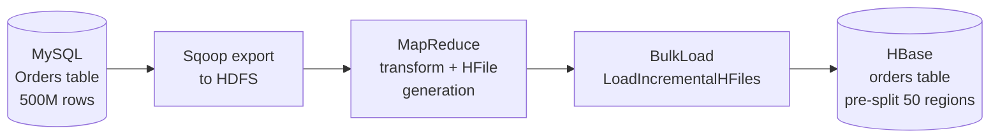

# HBase — Real-World Production Examples

## Use Case 1: User Profile Store (Facebook Messenger Scale)

Facebook used HBase to store billions of messages. Key design decisions:

### Schema Design

```
Table: messages
Row key: {user_id_reversed}_{reversed_timestamp}
Column Families:
  m: (message data)    — short TTL, frequent access
  meta: (metadata)     — longer retention, less frequent

Example rows:
321resu_9999998765432  m:body="Hello!"  m:from="user456"  meta:status="read"
321resu_9999998765001  m:body="Hi"      m:from="user789"  meta:status="unread"
```

### Access Patterns Served

```python
import happybase

conn = happybase.Connection('hbase-master', port=9090)
table = conn.table('messages')

# Get latest 50 messages for user (most recent first — reversed timestamp)
user_id = "user123"
reversed_id = user_id[::-1]

rows = table.scan(
    row_start=f"{reversed_id}_".encode(),
    row_stop=f"{reversed_id}`".encode(),   # ` is one after _ in ASCII
    limit=50,
    columns=[b'm:body', b'm:from', b'meta:status']
)

for row_key, data in rows:
    print(data[b'm:body'].decode())
```

---

## Use Case 2: Time-Series Metrics (OpenTSDB Pattern)

OpenTSDB is built on HBase and stores billions of time-series data points (used by Yahoo, StumbleUpon).

### OpenTSDB Row Key Structure

```
{metric_name_hash(3B)}_{timestamp_hour(4B)}_{tag_pairs}
```

Example: CPU usage for host=web01, region=us-east
```
0A1B2C_5F3E4100_686F73743D77656230315F726567696F6E3D75732D65617374
```

**Why hour-granularity timestamp?** Groups ~3600 data points (1-second resolution) into one row. Efficient for time-range scans without millions of tiny rows.

### Writing Metrics

```python
import struct
import happybase

conn = happybase.Connection('hbase-tsdb')
table = conn.table('tsdb')

def write_metric(metric: str, timestamp: int, value: float, tags: dict):
    hour_ts = (timestamp // 3600) * 3600
    offset = timestamp - hour_ts  # seconds within the hour (0-3599)

    metric_hash = hash_metric(metric)[:3]
    tag_bytes = encode_tags(tags)
    row_key = metric_hash + struct.pack('>I', hour_ts) + tag_bytes

    # Column qualifier = offset within hour (2 bytes)
    col = struct.pack('>H', offset)
    table.put(row_key, {b'd:' + col: struct.pack('>d', value)})

write_metric('cpu.usage', 1704067200, 73.5, {'host': 'web01', 'region': 'us-east'})
```

---

## Use Case 3: Real-Time Fraud Detection Feature Store

```
Table: user_features
Row key: {user_id}
Column Families:
  txn:  (transaction features, TTL=24h)
  hist: (historical aggregates, no TTL)
  risk: (computed risk scores)

Columns:
  txn:count_1h    = "47"
  txn:amount_1h   = "12450.00"
  txn:countries   = "US,UK"
  hist:avg_daily  = "3200.00"
  hist:home_country = "US"
  risk:score      = "0.87"
  risk:updated_at = "1704067200"
```

### Real-Time Update on Transaction

```python
def update_user_features(user_id: str, amount: float, country: str):
    table = conn.table('user_features')

    # Atomic increment for counters (no read-modify-write race condition)
    table.counter_inc(user_id.encode(), b'txn:count_1h', 1)

    # Append to country set (read-modify-write for non-atomic fields)
    with table.batch(transaction=False) as batch:
        batch.put(user_id.encode(), {
            b'txn:amount_1h': str(amount).encode(),
            b'txn:updated':   str(int(time.time())).encode(),
        })
```

---

## Production Operations Playbook

### Monitoring Critical Metrics

```bash
# Check region server status
echo "status 'detailed'" | hbase shell

# Key JMX metrics to monitor (via Grafana/Prometheus HBase exporter):
# - hbase.regionserver.Server.readRequestCount    (reads/sec)
# - hbase.regionserver.Server.writeRequestCount   (writes/sec)
# - hbase.regionserver.Server.memStoreSize        (should stay < 40% heap)
# - hbase.regionserver.Server.blockCacheHitRatio  (target > 90%)
# - hbase.master.AssignmentManager.ritCount       (Regions In Transition — should be 0)
```

### Handling Region Server Failure

```bash
# 1. HBase Master auto-reassigns regions from dead RS within ~30s
# 2. WAL replay ensures no data loss
# 3. Monitor RIT (Regions In Transition) — should resolve quickly

# If RIT gets stuck:
echo "hbck -fixAssignments" | hbase shell  # HBase 1.x
# HBase 2.x: HBCK2 tool
hbase hbck2 assigns <region_name>
```

### Capacity Planning

```
Storage estimate:
  Raw data size × replication factor × overhead factor
  = 1TB × 3 × 1.3 (HFile index + bloom filters)
  = ~4TB HDFS storage per 1TB logical data

Region sizing:
  Target 10-50 regions per Region Server
  Each region: ~10GB (hbase.hregion.max.filesize)
  RS with 100GB data: ~10 regions (good)
  RS with 1TB data: ~100 regions (consider adding RS)
```

---

## Migration Pattern: RDBMS to HBase



```bash
# Step 1: Export from MySQL via Sqoop
sqoop import \
  --connect jdbc:mysql://mysql-host/orders_db \
  --table orders \
  --target-dir /tmp/orders_export \
  --num-mappers 16 \
  --fields-terminated-by '\t'

# Step 2: Transform and generate HFiles
hadoop jar hbase-mapreduce.jar importtsv \
  -Dimporttsv.bulk.output=/tmp/hfiles \
  -Dimporttsv.columns=HBASE_ROW_KEY,cf:order_date,cf:amount,cf:status \
  orders /tmp/orders_export

# Step 3: Bulk load (takes seconds even for billions of rows)
hbase org.apache.hadoop.hbase.mapreduce.LoadIncrementalHFiles \
  /tmp/hfiles orders
```

---

## Interview Tips

> **Tip 1:** "How did you handle a hotspot in production?" — "We identified the hotspot via RS write request metrics in Grafana. The root cause was sequential user IDs as row key prefix. We added a 2-digit salt (hash(user_id) % 100) and did a rolling migration using BulkLoad — zero downtime."

> **Tip 2:** "How do you expire old data in HBase?" — "Set TTL on the column family: `alter 'events', {NAME => 'cf', TTL => 86400}` for 24-hour retention. Major compaction physically removes expired cells. For selective expiry, use application-level tombstones or a separate cleanup job."

> **Tip 3:** "What's the difference between HBase Delete and a tombstone?" — "HBase deletes are tombstone markers — the cell isn't removed immediately, it's just flagged. Physical removal happens during major compaction. This means deleted data is still on disk and consuming space until next major compaction."
