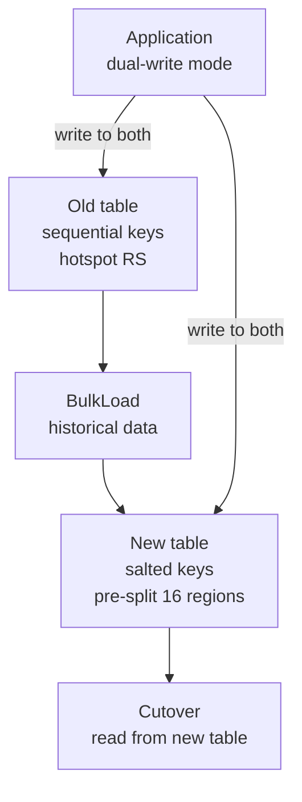

# Scenario Questions — HBase

<article data-difficulty="junior">

## 🟢 Junior: Design a Row Key for User Events

**Scenario:** You need to store clickstream events for an e-commerce site in HBase. Each event has a user_id, event_type, and timestamp. The most common query is "get all events for user X in the last 24 hours." Design the row key and column family structure.

<details>
<summary>💡 Hint</summary>
Think about which field should come first in the row key to support your primary query pattern. What's the relationship between row key ordering and scan efficiency?
</details>

<details>
<summary>✅ Solution</summary>

**Row key:** `{user_id}_{reversed_timestamp}`

Using reversed timestamp (`Long.MAX_VALUE - timestamp`) ensures the most recent events sort first for each user.

```python
import time
import happybase

MAX_TS = 9999999999999

def make_row_key(user_id: str, ts_ms: int) -> str:
    reversed_ts = MAX_TS - ts_ms
    return f"{user_id}_{reversed_ts:013d}"

# Schema
conn = happybase.Connection('hbase-host')
# Table: user_events
# Column family: e (event data, TTL=7 days)
#   e:type      = "click"
#   e:page      = "/product/123"
#   e:session   = "sess_abc"

# Write event
def write_event(user_id, event_type, page, session):
    ts = int(time.time() * 1000)
    row_key = make_row_key(user_id, ts)
    table = conn.table('user_events')
    table.put(row_key.encode(), {
        b'e:type':    event_type.encode(),
        b'e:page':    page.encode(),
        b'e:session': session.encode(),
    })

# Read last 24h events for user
def get_recent_events(user_id: str):
    table = conn.table('user_events')
    cutoff = int((time.time() - 86400) * 1000)  # 24h ago
    cutoff_reversed = MAX_TS - cutoff

    return list(table.scan(
        row_start=f"{user_id}_".encode(),
        row_stop=f"{user_id}_{cutoff_reversed:013d}".encode(),
        columns=[b'e:type', b'e:page'],
    ))
```

**Column family TTL** — set 7-day auto-expiry on column family `e`:
```bash
echo "alter 'user_events', {NAME => 'e', TTL => 604800}" | hbase shell
```

</details>

</article>

<article data-difficulty="mid-level">

## 🟡 Mid-Level: Diagnose and Fix a Hotspot

**Scenario:** Your HBase cluster has 10 Region Servers but monitoring shows one RS handling 80% of all write traffic (CPU at 95%, others idle). The table stores IoT sensor readings keyed by `{sensor_id}_{timestamp}`. Sensor IDs are sequential integers (sensor_00001, sensor_00002...). Diagnose why and fix it without downtime.

<details>
<summary>💡 Hint</summary>
Sequential keys always route to the same region. Consider how you can redistribute writes while keeping reads efficient. BulkLoad allows migration without taking the table offline.
</details>

<details>
<summary>✅ Solution</summary>

**Root cause:** Sequential sensor IDs mean new sensors always land in the same region (the "last" region alphabetically). All writes go to one RS.

**Fix: Add salt prefix**

```python
import hashlib

def salted_row_key(sensor_id: str, timestamp: int) -> str:
    # 16 salt buckets spread across region servers
    salt = int(hashlib.md5(sensor_id.encode()).hexdigest(), 16) % 16
    return f"{salt:02d}_{sensor_id}_{timestamp}"

# sensor_00001 → "07_sensor_00001_1704067200"
# sensor_00002 → "0b_sensor_00002_1704067200"
# sensor_00003 → "03_sensor_00003_1704067200"
```

**Migration without downtime:**



1. **Create new table** with 16 pre-split regions
2. **BulkLoad** historical data from old table (transform row keys via MapReduce)
3. **Dual-write** from application during transition
4. **Verify** row counts match, then cut reads over to new table
5. **Decommission** old table

**Read pattern adjustment** (scatter-gather for range scans):
```python
def get_sensor_readings(sensor_id: str, start_ts: int, end_ts: int):
    # Must query all 16 salt buckets
    results = []
    with ThreadPoolExecutor(max_workers=16) as executor:
        futures = []
        for salt in range(16):
            prefix = f"{salt:02d}_{sensor_id}_"
            futures.append(executor.submit(scan_bucket, prefix, start_ts, end_ts))
        for f in futures:
            results.extend(f.result())
    return sorted(results, key=lambda r: r['timestamp'])
```

</details>

</article>

<article data-difficulty="senior">

## 🔴 Senior: Design HBase Schema for a Multi-Tenant Analytics Platform

**Scenario:** You're building a multi-tenant analytics platform where 500 enterprise customers each have up to 10 million events/day stored in HBase. Requirements: (1) strict tenant isolation — one tenant's slow scan cannot impact another, (2) each tenant can query their last 90 days of data by event type, (3) support for ~50K writes/second total, (4) automated data expiry per tenant (some pay for 30 days, others 90 days), (5) ability to delete all data for a tenant within 1 hour (GDPR). Design the complete HBase schema and operational strategy.

<details>
<summary>💡 Hint</summary>
Consider whether to use one table per tenant or a shared table with tenant prefix. Think about how TTL works at the column family level and how GDPR delete maps to HBase operations.
</details>

<details>
<summary>✅ Solution</summary>

**Architecture Decision: One table per tenant**

Shared table with tenant prefix causes cross-tenant scan interference. Separate tables give full isolation — each table gets its own set of regions and region servers.

```python
def create_tenant_table(tenant_id: str, retention_days: int):
    """Provision HBase table for a new tenant."""
    import subprocess

    # Pre-split into 20 regions (salt 00-19)
    splits = ','.join([f"'{i:02d}'" for i in range(1, 20)])

    hbase_cmd = f"""
    create 'events_{tenant_id}',
      {{NAME => 'e', TTL => {retention_days * 86400}, COMPRESSION => 'SNAPPY',
       BLOOMFILTER => 'ROW', DATA_BLOCK_ENCODING => 'FAST_DIFF'}},
      {{NAME => 'meta', TTL => {retention_days * 86400}}},
      SPLITS => [{splits}]
    """
    subprocess.run(['hbase', 'shell'], input=hbase_cmd.encode())
```

**Row key design:**

```
{salt:02d}_{event_type_hash:02d}_{reversed_timestamp:013d}_{event_id:uuid}

Example:
07_4a_9999998765432_550e8400-e29b-41d4-a716-446655440000
```

- Salt (00-19): distributes writes across 20 regions
- event_type_hash: enables efficient scan by event type within a salt bucket
- reversed_timestamp: latest events first within each event_type
- event_id: ensures uniqueness (UUID)

**Query by event type (last 7 days):**

```python
def query_events_by_type(tenant_id: str, event_type: str,
                          days: int = 7) -> list:
    table = conn.table(f'events_{tenant_id}')
    type_hash = f"{hash(event_type) % 256:02x}"
    cutoff_ts = MAX_TS - int((time.time() - days * 86400) * 1000)

    results = []
    # Scan each salt bucket for this event type
    with ThreadPoolExecutor(max_workers=20) as ex:
        futures = [
            ex.submit(
                lambda s: list(table.scan(
                    row_start=f"{s:02d}_{type_hash}_".encode(),
                    row_stop=f"{s:02d}_{type_hash}_{cutoff_ts:013d}".encode(),
                )),
                salt
            )
            for salt in range(20)
        ]
        for f in futures:
            results.extend(f.result())
    return results
```

**GDPR deletion strategy (complete in under 1 hour):**

```python
def delete_tenant(tenant_id: str):
    """
    Drop the entire table — fastest possible deletion.
    HBase table drop = HDFS directory delete = seconds regardless of data volume.
    """
    import subprocess

    # 1. Disable table (prevents new writes, takes ~seconds)
    subprocess.run(['hbase', 'shell'],
                   input=f"disable 'events_{tenant_id}'".encode())

    # 2. Drop table (deletes HDFS data, takes ~seconds even for TBs)
    subprocess.run(['hbase', 'shell'],
                   input=f"drop 'events_{tenant_id}'".encode())

    # 3. Remove tenant metadata from registry
    registry.delete_tenant(tenant_id)

    # Total time: < 30 seconds for any data volume
```

**Tenant isolation via YARN + RS pinning:**

```xml
<!-- Assign high-value tenants to dedicated Region Server groups -->
<property>
  <name>hbase.rsgroup.enabled</name>
  <value>true</value>
</property>
```

```bash
# Move premium tenant tables to dedicated RS group
echo "
addRSGroup 'premium'
moveServers ['rs-11:16020','rs-12:16020','rs-13:16020'], 'premium'
moveTables ['events_enterprise_001','events_enterprise_002'], 'premium'
" | hbase shell
```

**Capacity summary for 500 tenants at 50K writes/sec:**

| Metric | Calculation | Result |
|--------|-------------|--------|
| Average write rate per tenant | 50K / 500 | 100 writes/sec |
| Peak tenant (10x avg) | 100 × 10 | 1000 writes/sec |
| Data per tenant per day | 10M events × 500B avg | ~5GB/day |
| Total at 90-day retention | 500 × 5GB × 90 | ~225TB |
| HDFS with 3× replication | 225TB × 3 | ~675TB |
| Region servers needed | 675TB / (4TB per RS) | ~170 RS nodes |

</details>

</article>

---

## ⚡ Quick-fire Q&A

**Q: What is HBase and what problem does it solve?**
A: HBase is a distributed, column-family NoSQL database built on top of HDFS. It solves the problem of low-latency random read/write access to massive datasets that HDFS alone cannot provide, supporting millions of rows with millisecond-level lookups by row key.

**Q: How is HBase data modeled?**
A: HBase organizes data as a sparse, multi-dimensional sorted map indexed by row key, column family, column qualifier, and timestamp. Each cell stores multiple versioned values. Data is physically grouped by column family and stored in HFiles on HDFS.

**Q: What is a Region in HBase?**
A: A Region is a contiguous range of row keys stored together on a RegionServer. As data grows, HBase automatically splits Regions to distribute load. Each Region is served by exactly one RegionServer at a time, enabling horizontal scaling.

**Q: How does HBase achieve low-latency writes?**
A: Writes go first to an in-memory MemStore and a Write-Ahead Log (WAL) for durability. Once the MemStore reaches a threshold, it is flushed to disk as an immutable HFile. This LSM-tree (Log-Structured Merge-tree) design makes writes sequential and fast.

**Q: What is compaction in HBase and why does it matter?**
A: As MemStores flush, many small HFiles accumulate per Region. Minor compaction merges a few HFiles into one. Major compaction merges all HFiles in a Region and removes deleted/expired cells. Without compaction, read performance degrades due to scanning many files.

**Q: How do you design a good HBase row key?**
A: Design row keys to distribute writes evenly across RegionServers (avoid sequential IDs that cause hotspotting), and to support your primary access pattern (range scans vs. point lookups). Common techniques include salting, hashing, or reversing timestamp-based keys.

**Q: What is the difference between HBase and Cassandra?**
A: Both are wide-column NoSQL stores, but HBase runs on HDFS and integrates tightly with the Hadoop ecosystem, favoring strong consistency. Cassandra is a standalone distributed database optimized for high write throughput and multi-datacenter replication with tunable consistency.

**Q: When would you choose HBase over a relational database?**
A: Choose HBase for workloads requiring: very high write throughput at massive scale (billions of rows), sparse data with many null columns, time-series data with row-key-based range scans, or tight integration with Hadoop/Spark batch processing on the same data.

---

## 💼 Interview Tips

- Row key design is the most common HBase interview topic — be ready to explain hotspotting, salting, and how to design keys for both your write distribution and read access patterns.
- Distinguish HBase from HDFS clearly: HDFS is a file system for batch I/O; HBase adds a database layer for random access. Many candidates blur this distinction.
- Mention the LSM-tree write path (MemStore → WAL → HFile) — understanding the write path demonstrates you know why HBase is fast for writes but requires compaction for read efficiency.
- Be honest about HBase's operational complexity — it requires ZooKeeper for coordination, tuning of compaction policies, and careful Region pre-splitting at scale. Senior interviewers appreciate realistic assessments.
- Know when NOT to use HBase: avoid it for complex multi-table joins, ad-hoc SQL analytics, or workloads that fit in a traditional RDBMS. Recommending the right tool matters as much as knowing HBase internals.
- Connect HBase to cloud alternatives: on AWS, DynamoDB or Bigtable (GCP) serve similar use cases as managed services with less operational overhead — showing awareness of cloud equivalents is expected in 2024+ interviews.
