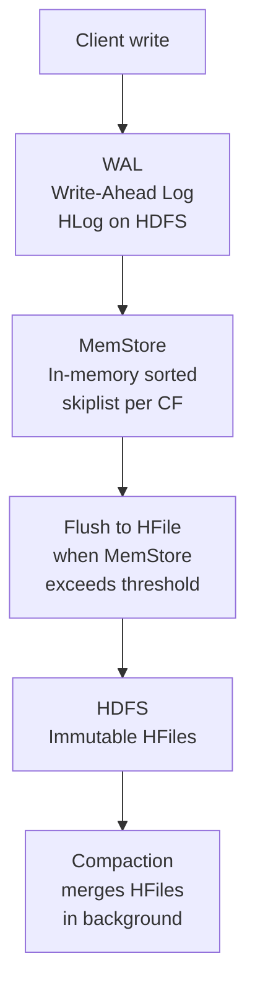
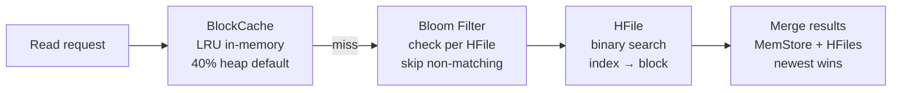

# HBase — Senior-Level Deep Dive

## Row Key Design: The Most Critical Decision

Row key design in HBase determines read performance, write distribution, and storage efficiency. A poor row key causes hotspotting — all writes landing on a single region server.

### Anti-Pattern: Sequential Keys (Hotspot)

```
row key: 2024-01-01T00:00:01_user123
         2024-01-01T00:00:02_user124
         2024-01-01T00:00:03_user125
```

All writes go to the LAST region (sequential timestamps always append to the end). One region server handles 100% of write load.

### Pattern 1: Salted Keys

Prefix with a hash bucket to spread writes:

```python
import hashlib

def make_row_key(user_id: str, timestamp: str) -> str:
    salt = int(hashlib.md5(user_id.encode()).hexdigest(), 16) % 16
    return f"{salt:02d}_{user_id}_{timestamp}"

# user123 → "07_user123_2024-01-01T00:00:01"
# user456 → "0b_user456_2024-01-01T00:00:02"
# Writes spread across 16 buckets (region servers)
```

**Tradeoff:** Scans require querying all 16 buckets in parallel (scatter-gather). Acceptable if point lookups dominate.

### Pattern 2: Reversed Timestamp

For time-series "get latest N" queries:

```python
import time

MAX_LONG = 9999999999999
reversed_ts = MAX_LONG - int(time.time() * 1000)
row_key = f"{user_id}_{reversed_ts:013d}"
# Latest events sort FIRST for a given user — efficient Scan with LIMIT
```

### Pattern 3: Composite Key with Business Entity

```
{region}_{store_id}_{reversed_ts}
us-east_store-42_9999998765432
us-west_store-07_9999998765431
```

Queries by region are contiguous, enabling efficient Scan with start/stop row.

---

## Internal Architecture: Read and Write Paths

### Write Path (Detail)



- **WAL first** — guarantees durability even if MemStore is lost on crash
- **MemStore** — one per column family, sorted by row key
- **Flush** — triggered at 128MB (hbase.hregion.memstore.flush.size)
- **HFile** — immutable, sorted, indexed SSTable format

### Read Path (Detail)



**BlockCache types:**
- `LruBlockCache` — JVM heap, subject to GC pressure
- `BucketCache` — off-heap or file-backed, avoids GC, preferred for production
- `CombinedBlockCache` — index/bloom in LRU, data in BucketCache (best of both)

---

## Compaction Deep Dive

### Minor Compaction

Merges a small number of HFiles (typically 3–10) into one larger HFile. Fast, runs frequently, does NOT remove deleted cells.

```
HFile1 (10MB) + HFile2 (8MB) + HFile3 (12MB) → HFile4 (30MB)
```

### Major Compaction

Merges ALL HFiles in a region into one. Removes deleted cells (tombstones), expired TTL data, and old versions. Expensive — typically scheduled off-peak.

```bash
# Trigger major compaction for a table
echo "major_compact 'orders'" | hbase shell

# Trigger for specific region
echo "major_compact 'region_name'" | hbase shell
```

**Configuration:**
```xml
<!-- Major compaction interval (default 7 days) -->
<property>
  <name>hbase.hregion.majorcompaction</name>
  <value>604800000</value>
</property>
<!-- Set to 0 to disable automatic major compaction (manual only) -->
```

---

## Coprocessors

Coprocessors run code inside Region Servers — analogous to stored procedures in RDBMS.

### Observer Coprocessors (Triggers)

```java
public class AuditObserver extends BaseRegionObserver {
    @Override
    public void postPut(ObserverContext<RegionCoprocessorEnvironment> e,
                        Put put, WALEdit edit, Durability durability) {
        // Fires after every Put — log audit trail
        String row = Bytes.toString(put.getRow());
        LOG.info("Row written: " + row + " at " + System.currentTimeMillis());
    }
}
```

**Use cases:** Audit logging, secondary index maintenance, referential integrity checks.

### Endpoint Coprocessors (Aggregations)

Push computation to region servers — avoid moving all data to client:

```java
// Server-side sum — instead of scanning all rows to client
public class SumEndpoint extends SumService {
    @Override
    public long sum(RpcController controller, SumRequest request) {
        // Scan local region, compute sum, return scalar
        long total = 0;
        Scan scan = new Scan();
        // ... iterate and sum
        return total;
    }
}
```

**Use cases:** Aggregations (SUM, COUNT, AVG) without full table scans across the network.

---

## Region Splitting Strategies

| Strategy | Behavior | Best For |
|----------|----------|----------|
| `ConstantSizeRegionSplitPolicy` | Split at fixed size (default 10GB) | Simple, predictable |
| `IncreasingToUpperBoundRegionSplitPolicy` | Small splits early, grows to max | Default — avoids too many splits at start |
| `KeyPrefixRegionSplitPolicy` | Split on key prefix boundary | Keeps related rows in same region |
| Pre-split at table creation | Define split points upfront | High-throughput tables where you know key distribution |

### Pre-splitting Example

```bash
# Create table with 10 pre-split regions for salt buckets 00-09
echo "create 'events', 'cf', SPLITS => ['01','02','03','04','05','06','07','08','09']" | hbase shell
```

---

## HBase vs Alternatives

| Feature | HBase | Cassandra | DynamoDB | BigTable |
|---------|-------|-----------|----------|---------|
| Consistency | Strong (per row) | Tunable (eventual default) | Eventual / Strong | Strong |
| Write throughput | Very high | Very high | Very high (managed) | Very high |
| Read latency | Low (with cache) | Low | Low (managed) | Low |
| Secondary indexes | None native | Materialized views | GSI/LSI | None native |
| Ecosystem | Hadoop/HDFS native | Standalone | AWS native | GCP native |
| Multi-row transactions | No | Lightweight (CAS) | Transactions | No |
| Operational complexity | High | Medium | Low (managed) | Low (managed) |

---

## Performance Tuning

```xml
<!-- hbase-site.xml key settings -->

<!-- BlockCache: 40% of heap for reads -->
<property>
  <name>hfile.block.cache.size</name>
  <value>0.4</value>
</property>

<!-- MemStore: 40% of heap for writes -->
<property>
  <name>hbase.regionserver.global.memstore.size</name>
  <value>0.4</value>
</property>

<!-- Increase handler threads for concurrent requests -->
<property>
  <name>hbase.regionserver.handler.count</name>
  <value>150</value>
</property>

<!-- HFile block size: 64KB for random reads, 256KB for scans -->
<property>
  <name>hbase.mapreduce.hfileoutputformat.blocksize</name>
  <value>65536</value>
</property>
```

### BulkLoad for High-Volume Ingestion

```bash
# Generate HFiles directly (bypass Region Server write path)
# 10x faster than Put API for initial loads

# Step 1: Generate sorted HFiles via MapReduce
hbase org.apache.hadoop.hbase.mapreduce.ImportTsv \
  -Dimporttsv.bulk.output=/tmp/hfiles \
  -Dimporttsv.columns=HBASE_ROW_KEY,cf:col1,cf:col2 \
  my_table /data/input.tsv

# Step 2: Load HFiles into HBase (atomic region assignment)
hbase org.apache.hadoop.hbase.mapreduce.LoadIncrementalHFiles \
  /tmp/hfiles my_table
```

---

## Interview Tips

> **Tip 1:** "How do you prevent hotspotting?" — "Design row keys to distribute writes: use salted prefixes (hash % N), reverse timestamps for time-series, or composite keys with high-cardinality first component. Pre-split the table on these boundaries at creation time."

> **Tip 2:** "When would you use HBase over Cassandra?" — "HBase when you're already on Hadoop/HDFS ecosystem and need strong consistency, complex server-side logic via coprocessors, or integration with Hive/Spark. Cassandra for multi-datacenter active-active replication and when you want to avoid HDFS dependency."

> **Tip 3:** "How does HBase handle reads across many HFiles?" — "Bloom filters skip HFiles that don't contain the row key. BlockCache serves hot data from memory. For worst case (cold cache, many HFiles), compaction reduces HFile count — major compaction brings it to 1 per region."

> **Tip 4:** "What is the WAL and why does it matter?" — "Write-Ahead Log — every write is persisted to HDFS before acknowledging to the client. If a RegionServer crashes, the WAL replays to reconstruct in-flight MemStore data. Without WAL, acknowledged writes in MemStore could be lost."

> **Tip 5:** "How do you do aggregations efficiently in HBase?" — "Endpoint coprocessors push SUM/COUNT computation to each Region Server, return scalar results to client. Avoids full table scan over network. Alternatively, maintain a separate summary row updated on each write via Observer coprocessor."

## ⚡ Cheat Sheet

**HDFS architecture**
```
NameNode:   stores metadata (file → block mappings, permissions, namespace)
DataNode:   stores actual data blocks (default 128 MB per block)
Replication: default factor 3 (two local rack + one remote rack)
HA:         Active/Standby NameNode with JournalNodes for edit log sharing
```

**HDFS key commands**
```bash
hdfs dfs -ls /data/warehouse          # list files
hdfs dfs -put local.csv /data/raw/    # upload
hdfs dfs -get /data/output/ ./local/  # download
hdfs dfs -rm -r /data/tmp/            # delete
hdfs dfs -du -s -h /data/warehouse/   # disk usage
hdfs dfs -copyFromLocal -f src dst    # overwrite on upload
hdfs fsck /path -files -blocks        # check file health
```

**YARN resource model**
```
ResourceManager:  cluster master — allocates containers
NodeManager:      per-node agent — runs containers, reports health
ApplicationMaster: per-job — negotiates resources with RM
Container:        allocated unit (CPU cores + memory)

Scheduler types: FIFO, Capacity Scheduler (queues), Fair Scheduler
```

**Hive vs Spark SQL**
```
Hive:      MapReduce by default (slow); good for compatibility; HQL ≈ SQL
Hive LLAP: in-memory daemon; much faster (sub-minute queries)
Spark SQL:  Hive Metastore compatible but Spark execution — 10-100x faster
```

**Hive partitioning**
```sql
CREATE TABLE orders (order_id BIGINT, amount DOUBLE)
PARTITIONED BY (dt STRING, region STRING)
STORED AS PARQUET;
-- Dynamic partition insert
SET hive.exec.dynamic.partition.mode=nonstrict;
INSERT INTO orders PARTITION (dt, region)
SELECT order_id, amount, dt, region FROM staging_orders;
```

**MapReduce pattern**
```
Map:    input splits → emit (key, value) pairs
Shuffle: sort + group by key across nodes
Reduce: aggregate values per key → output
Use case today: Hive compatibility, very large batch on older clusters
```

**ZooKeeper use cases in Hadoop**
```
HBase region assignment  — ZK tracks which RegionServer owns which region
HDFS NameNode HA         — ZK elects Active NameNode
YARN RM HA               — ZK elects Active ResourceManager
Kafka broker coordination — ZK stores broker/topic metadata (pre-KRaft)
```

**HBase data model**
```
Table → Row → Column Family → Column Qualifier → Value (versioned by timestamp)
Row key design is critical: avoid hot-spotting (don't use sequential IDs)
Strategies: salt prefix, reverse timestamp, MD5 hash of natural key
```

**Key interview points**
- HDFS is optimized for large files, sequential reads; terrible for many small files
- Sqoop: parallel JDBC import from RDBMS to HDFS/Hive (one mapper per table partition)
- Oozie: XML-based workflow scheduler (predecessor to Airflow in Hadoop ecosystem)
- Pig: dataflow language (Latin) — pre-dbt/Spark era; rarely used in modern stacks
- Ecosystem today: HDFS + YARN still used, but S3/GCS replacing HDFS in cloud-native stacks
