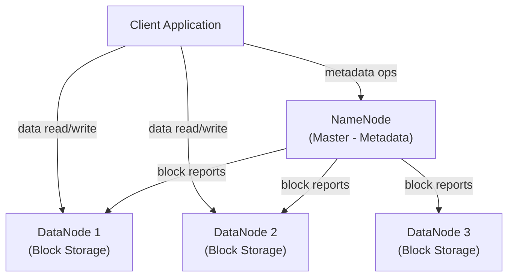
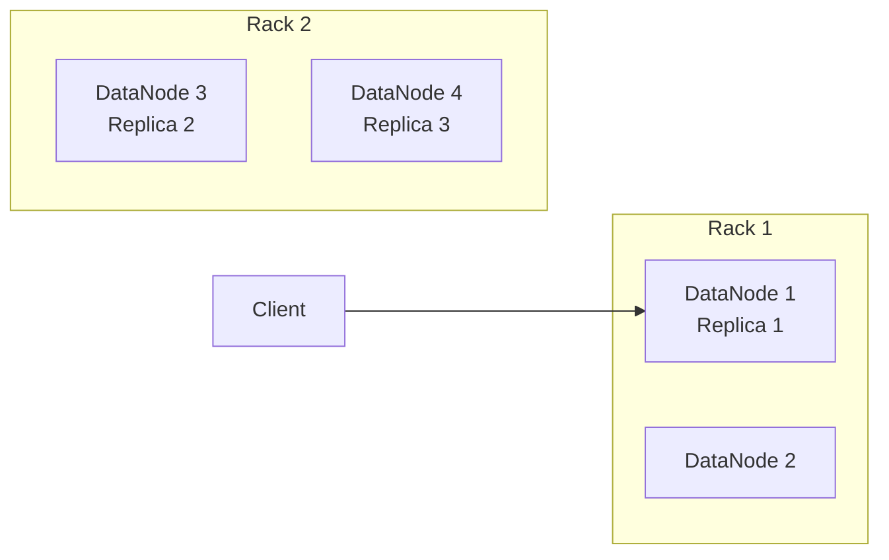
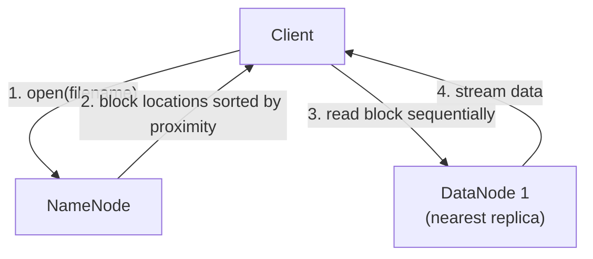
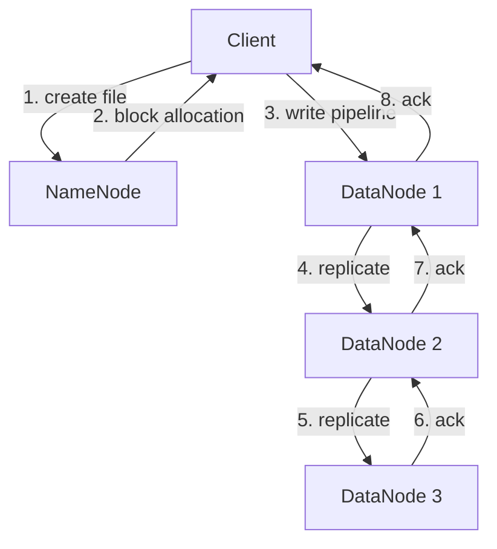

# HDFS Fundamentals


## 🎯 Analogy

Think of HDFS like a distributed filing cabinet spread across hundreds of machines: every file is split into 128 MB blocks, each block is replicated 3 times on different machines, and the NameNode is the index telling you where each block lives.

---
## What is HDFS?

Hadoop Distributed File System (HDFS) is a distributed, scalable, and fault-tolerant file system designed to run on commodity hardware. It is the primary storage layer for Hadoop and is optimized for storing very large files with streaming data access patterns.

HDFS follows a **write-once, read-many** model — files are written once and read many times. This makes it ideal for batch analytics but not for frequent random writes.

## Core Architecture



### NameNode (Master)
- Stores the **file system namespace** (directory tree, file-to-block mapping)
- Tracks which DataNodes hold which blocks
- Does NOT store actual data — only metadata
- Keeps metadata in memory for fast access
- Persists metadata to disk via `fsimage` (snapshot) and `edits` (transaction log)

### DataNode (Worker)
- Stores actual data blocks on local disk
- Sends **block reports** to NameNode periodically (every 6 hours by default)
- Sends **heartbeats** to NameNode every 3 seconds
- If no heartbeat for 10 minutes, NameNode marks the DataNode as dead and re-replicates its blocks

## Block Storage

### Default Block Size
HDFS splits files into fixed-size **blocks** (default: **128 MB** in Hadoop 2.x+, was 64 MB in Hadoop 1.x).

```
File: sales_data.csv (500 MB)
  → Block 0: bytes 0–128 MB
  → Block 1: bytes 128–256 MB
  → Block 2: bytes 256–384 MB
  → Block 3: bytes 384–500 MB (partial block, only uses actual bytes)
```

### Why Large Blocks?
- Reduces metadata overhead (fewer blocks = fewer entries in NameNode memory)
- Optimizes for sequential reads (streaming throughput over random access)
- Reduces seek time as a percentage of total transfer time

### Replication Factor
Each block is replicated across multiple DataNodes (default: **3 replicas**).

```
Block A → DataNode 1 (rack 1), DataNode 4 (rack 2), DataNode 5 (rack 2)
Block B → DataNode 2 (rack 1), DataNode 3 (rack 1), DataNode 6 (rack 3)
```

The replication factor can be set per-file:
```bash
# Set replication factor for a specific file
hdfs dfs -setrep -w 2 /user/data/archive/old_logs.gz

# Check replication status
hdfs fsck /user/data/sales/ -files -blocks -locations
```

## Rack Awareness

HDFS places replicas across racks to survive rack-level failures:



**Default placement policy:**
1. First replica → same node as writer (or random if writer is not a DataNode)
2. Second replica → different rack
3. Third replica → same rack as second, different node

This balances fault tolerance (survives one rack failure) with network bandwidth (two replicas in same rack for faster intra-rack transfer).

## HDFS Commands

### Basic File Operations
```bash
# List files
hdfs dfs -ls /user/hive/warehouse/

# Create directory
hdfs dfs -mkdir -p /user/data/year=2024/month=01

# Copy local file to HDFS
hdfs dfs -put /local/data/sales.csv /user/data/

# Copy HDFS file to local
hdfs dfs -get /user/data/sales.csv /local/output/

# Copy within HDFS
hdfs dfs -cp /user/data/sales.csv /user/backup/

# Move within HDFS
hdfs dfs -mv /user/data/old_sales.csv /user/archive/

# Delete file
hdfs dfs -rm /user/data/temp_file.csv

# Delete directory recursively
hdfs dfs -rm -r /user/data/old_partition/

# View file content
hdfs dfs -cat /user/data/small_file.txt
hdfs dfs -tail /user/data/log.txt
```

### Storage Information
```bash
# Check disk usage
hdfs dfs -du -h /user/data/

# Check disk usage summary
hdfs dfs -du -s -h /user/data/

# HDFS filesystem stats
hdfs dfsadmin -report

# Check file health
hdfs fsck /user/data/ -files -blocks -locations
```

## Read Path

When a client reads a file from HDFS:



1. Client calls `open()` on HDFS client
2. NameNode returns block locations sorted by network distance
3. Client connects to nearest DataNode and reads blocks sequentially
4. Client automatically fails over to next replica if DataNode fails

## Write Path



1. Client requests block allocation from NameNode
2. NameNode selects 3 DataNodes based on rack awareness
3. Client writes to DataNode 1, which pipelines to DataNode 2, then DataNode 3
4. Acknowledgment flows back through the pipeline

## The Small Files Problem

HDFS is designed for large files. Small files cause issues:

| Issue | Impact |
|-------|--------|
| NameNode memory | Each file/block = ~150 bytes in NameNode RAM; millions of small files exhaust memory |
| MapReduce overhead | Each small file = one map task = excessive task overhead |
| Seek time | Many small reads = poor throughput vs. sequential large reads |

### Solutions for Small Files
```bash
# Use HAR (Hadoop Archive) to pack small files
hadoop archive -archiveName smallfiles.har -p /user/data/small/ /user/archives/

# Use SequenceFile to pack small files into one
# SequenceFile stores key-value pairs, where key=filename, value=content

# Merge small files with CombineFileInputFormat in MapReduce
# or use coalesce() / repartition() in Spark
```

## Key Configuration Parameters

| Parameter | Default | Description |
|-----------|---------|-------------|
| `dfs.blocksize` | 134217728 (128 MB) | Default block size |
| `dfs.replication` | 3 | Default replication factor |
| `dfs.namenode.handler.count` | 10 | NameNode RPC server threads |
| `dfs.datanode.data.dir` | varies | DataNode storage directories |
| `dfs.heartbeat.interval` | 3s | DataNode heartbeat interval |
| `dfs.namenode.heartbeat.recheck-interval` | 5 min | Time before marking DN dead |

## HDFS vs Traditional File Systems

| Feature | HDFS | POSIX (ext4, NFS) |
|---------|------|-------------------|
| File size | Optimized for GB/TB files | Any size |
| Access pattern | Sequential streaming | Random access |
| Write model | Write-once, append-only | Read/write anytime |
| Fault tolerance | Built-in replication | Depends on storage layer |
| Scalability | Petabytes across thousands of nodes | Limited by single server |
| Latency | High (not suitable for OLTP) | Low |


## ▶️ Try It Yourself

```bash
# HDFS basic commands (similar to Unix)
hdfs dfs -ls /user/hadoop/data/
hdfs dfs -mkdir -p /data/raw/orders/2024/
hdfs dfs -put local_orders.csv /data/raw/orders/2024/
hdfs dfs -get /data/raw/orders/2024/orders.csv ./

# Check replication and block info
hdfs fsck /data/raw/orders/ -files -blocks -locations

# Check HDFS health
hdfs dfsadmin -report

# Run a Spark job on HDFS data
spark-submit --master yarn   --deploy-mode cluster   transform.py   hdfs:///data/raw/orders/2024/   hdfs:///data/silver/orders/2024/
```

> **Run it:** Copy the snippet into a REPL or file — no external services needed for the basic example.

---
## Interview Tips

> **Tip 1:** When asked "what happens when a NameNode fails?" — explain the difference between Hadoop 1.x (single NameNode = SPOF) vs Hadoop 2.x+ (Active/Standby NameNode with JournalNodes for HA). This shows depth of knowledge.

> **Tip 2:** Always mention that the NameNode keeps the entire namespace in RAM. For a cluster with 100 million files/blocks, this can require 20+ GB of heap — a common real-world constraint.

> **Tip 3:** When discussing replication, mention that you can tune it per file — e.g., set replication=1 for temporary intermediate data to save storage, while keeping critical data at replication=3.

> **Tip 4:** The "small files problem" is a very common interview question. Know the three solutions: HAR files, SequenceFiles, and using CombineFileInputFormat or Spark coalesce to merge before writing.

> **Tip 5:** HDFS is NOT suitable for low-latency access. If an interviewer asks about real-time serving, steer toward HBase, Cassandra, or object stores with caching layers.
