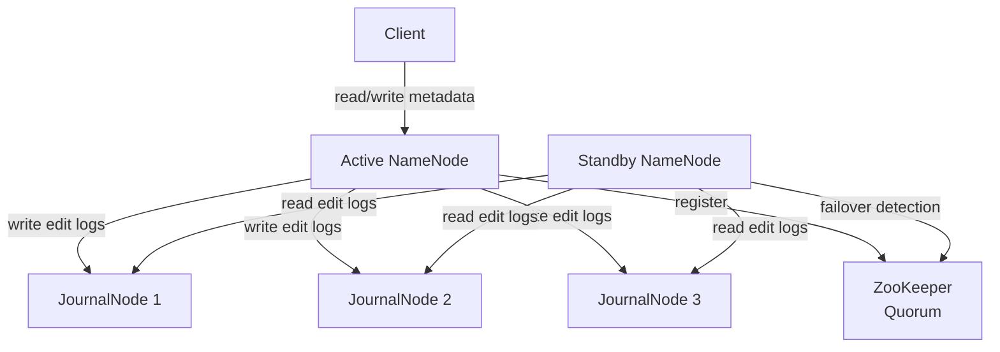
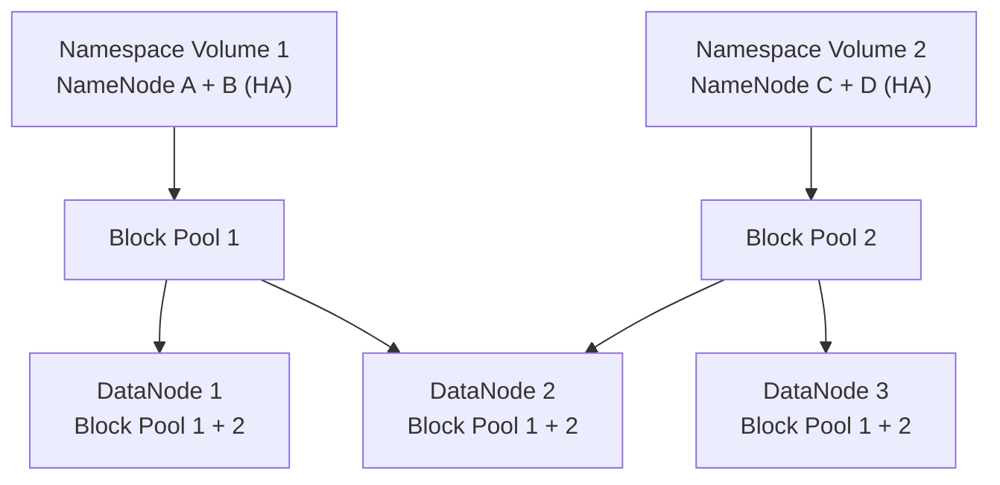
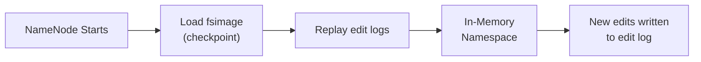

# HDFS Intermediate Concepts

## HDFS High Availability (HA)

### The Single Point of Failure Problem
In Hadoop 1.x, the NameNode was a single point of failure. If it crashed, the entire cluster became unavailable until the NameNode restarted (could take 30+ minutes for large clusters loading fsimage).

### Active/Standby NameNode Architecture



### JournalNodes
- Quorum-based storage (2N+1 nodes; typically 3 or 5)
- Active NameNode writes edit logs to **majority** of JournalNodes
- Standby NameNode continuously reads and replays edit logs
- On failover, Standby becomes Active within seconds

### Automatic Failover with ZKFC
```xml
<!-- core-site.xml -->
<property>
  <name>ha.zookeeper.quorum</name>
  <value>zk1:2181,zk2:2181,zk3:2181</value>
</property>

<!-- hdfs-site.xml -->
<property>
  <name>dfs.nameservices</name>
  <value>mycluster</value>
</property>
<property>
  <name>dfs.ha.namenodes.mycluster</name>
  <value>nn1,nn2</value>
</property>
<property>
  <name>dfs.ha.automatic-failover.enabled</name>
  <value>true</value>
</property>
```

The **ZooKeeper Failover Controller (ZKFC)** runs alongside each NameNode and:
1. Monitors NameNode health
2. Maintains a ZooKeeper session
3. Triggers failover when Active NameNode fails
4. Implements **fencing** to prevent split-brain (e.g., SSH fencing to kill the old Active)

## HDFS Federation

### Problem with Single Namespace
Even with HA, a single NameNode namespace has limits:
- NameNode heap limits the total number of files/blocks (~50-100 million files per NameNode)
- Single namespace = horizontal scalability bottleneck

### Federation Architecture



- Multiple independent NameNode namespaces share the same DataNode cluster
- Each namespace manages its own **block pool** (subset of blocks on each DataNode)
- DataNodes serve multiple block pools simultaneously
- Different teams/applications can use different namespaces (e.g., `/user/team_a` on NS1, `/user/team_b` on NS2)

```xml
<!-- hdfs-site.xml for Federation -->
<property>
  <name>dfs.nameservices</name>
  <value>ns1,ns2</value>
</property>
<property>
  <name>dfs.namenode.rpc-address.ns1.nn1</name>
  <value>namenode1:8020</value>
</property>
<property>
  <name>dfs.namenode.rpc-address.ns2.nn1</name>
  <value>namenode3:8020</value>
</property>
```

## Erasure Coding

### Traditional Replication Cost
Replication factor 3 = **200% storage overhead** (3x the original data).

### Erasure Coding (EC)
Erasure coding provides fault tolerance with much less storage overhead.

**Reed-Solomon RS(6,3)** (default in Hadoop 3.x):
- Data is split into **6 data blocks** + **3 parity blocks** = 9 total blocks
- Can survive loss of any **3 blocks** (same fault tolerance as 3x replication)
- Storage overhead: **50%** (9/6) vs 200% for replication

```bash
# Enable erasure coding on a directory
hdfs ec -setPolicy -path /user/cold-data/ -policy RS-6-3-1024k

# List EC policies
hdfs ec -listPolicies

# Check EC policy on path
hdfs ec -getPolicy -path /user/cold-data/
```

| Policy | Data Blocks | Parity Blocks | Overhead | Fault Tolerance |
|--------|-------------|---------------|----------|-----------------|
| RS-6-3-1024k | 6 | 3 | 50% | 3 node failures |
| RS-3-2-1024k | 3 | 2 | 67% | 2 node failures |
| RS-10-4-1024k | 10 | 4 | 40% | 4 node failures |
| REPLICATION-3 | 1 | 2 copies | 200% | 2 node failures |

**When to use EC vs Replication:**
- EC is best for **cold/warm data** that is infrequently accessed (read performance is lower due to decode overhead)
- Replication is better for **hot data** and MapReduce/Spark locality (data-local task scheduling works better with replication)

## HDFS Snapshots

Snapshots provide point-in-time read-only copies of HDFS directories without copying data (uses hardlinks internally).

```bash
# Allow snapshots on a directory
hdfs dfsadmin -allowSnapshot /user/data/warehouse

# Create snapshot
hdfs dfs -createSnapshot /user/data/warehouse snap_2024_01_15

# List snapshots
hdfs dfs -ls /user/data/warehouse/.snapshot/

# Compare snapshot with current
hdfs snapshotDiff /user/data/warehouse snap_2024_01_15 .

# Restore from snapshot (copy snapshot back)
hdfs dfs -cp /user/data/warehouse/.snapshot/snap_2024_01_15/table1 /user/data/warehouse/table1

# Delete snapshot
hdfs dfs -deleteSnapshot /user/data/warehouse snap_2024_01_15
```

## HDFS Quotas

Control storage consumption per directory:

```bash
# Set space quota (in bytes)
hdfs dfsadmin -setSpaceQuota 1099511627776 /user/team_a  # 1 TB

# Set namespace (file count) quota
hdfs dfsadmin -setQuota 100000 /user/team_a

# Check quota usage
hdfs dfs -count -q -h /user/team_a

# Clear quota
hdfs dfsadmin -clrSpaceQuota /user/team_a
```

## NameNode Memory Sizing

Each file/directory/block in HDFS requires approximately **150 bytes** of NameNode heap.

```
Cluster with 100 million files, avg 2 blocks each:
→ 100M files × 150 bytes = 15 GB
→ 200M blocks × 150 bytes = 30 GB
→ Total NameNode heap needed ≈ 45 GB
```

### fsimage and Edit Logs



- **fsimage**: Full snapshot of namespace at checkpoint time
- **edits**: Sequential log of all changes since last checkpoint
- **Secondary NameNode** (Hadoop 1.x): Periodically merges edits into fsimage (NOT a hot standby)
- **Standby NameNode** (Hadoop 2.x+): Does checkpointing AND serves as hot standby

```bash
# Manually trigger checkpoint from Standby NameNode
hdfs dfsadmin -saveNamespace

# Enter safe mode (read-only state during startup)
hdfs dfsadmin -safemode enter
hdfs dfsadmin -safemode get
hdfs dfsadmin -safemode leave
```

## Data Locality

HDFS + MapReduce/Spark exploit **data locality** — move compute to data, not data to compute.

| Locality Level | Description | Performance |
|----------------|-------------|-------------|
| **Node-local** | Task runs on same node as data | Best |
| **Rack-local** | Task runs on same rack as data | Good |
| **Off-rack** | Data must cross rack switch | Worst |

```bash
# Check block locations for a file
hdfs fsck /user/data/sales.parquet -files -blocks -locations

# Output shows:
# /user/data/sales.parquet 134217728 bytes, 1 block(s), replication=3:
# .....blk_1234 len=134217728 repl=3 [DN1:50010, DN4:50010, DN7:50010]
```

## HDFS Balancer

Over time, DataNodes become unequally loaded (some have more blocks than others). The balancer redistributes blocks.

```bash
# Run HDFS balancer
hdfs balancer -threshold 10

# Run with bandwidth limit (to avoid impacting cluster)
hdfs dfsadmin -setBalancerBandwidth 104857600  # 100 MB/s
hdfs balancer -threshold 5

# Check DataNode utilization
hdfs dfsadmin -report | grep -E "Configured|DFS Used"
```

## Trash and Data Recovery

```bash
# Files deleted go to .Trash (configurable retention)
hdfs dfs -rm /user/data/important.csv
# Moves to /user/<username>/.Trash/Current/

# Restore from trash
hdfs dfs -mv /user/john/.Trash/Current/important.csv /user/data/

# Skip trash (permanent delete)
hdfs dfs -rm -skipTrash /user/data/temp.csv

# Configure trash retention in core-site.xml
# fs.trash.interval = 1440 (minutes = 24 hours)
```

## Interview Tips

> **Tip 1:** Know the difference between Secondary NameNode (Hadoop 1.x — just does checkpointing, NOT a failover node) and Standby NameNode (Hadoop 2.x+ — true hot standby that also does checkpointing). This is a very common interview misconception.

> **Tip 2:** When asked about HDFS HA, explain all three components: Active/Standby NameNodes, JournalNodes (for shared edit log), and ZKFC with ZooKeeper (for automatic failover and fencing).

> **Tip 3:** Erasure coding is a Hadoop 3.x feature. If asked about storage cost reduction, mention it but note the read performance tradeoff — decoding requires reading all N data blocks plus potentially parity blocks, adding CPU overhead.

> **Tip 4:** Federation is often confused with HA. HA addresses availability (one namespace, two NNs). Federation addresses scalability (multiple namespaces, shared DataNodes). A production cluster can use both simultaneously.

> **Tip 5:** The balancer is critical for cluster health. Mention that heavily skewed DataNode utilization degrades write performance (new blocks prefer less-utilized nodes) and can cause disk full errors on overloaded nodes.
