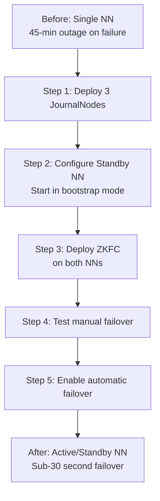
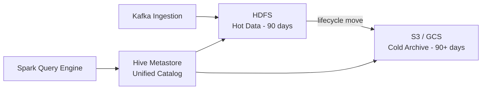

# HDFS Real-World Patterns and Case Studies

## Designing an HDFS Cluster for a Data Lakehouse

### Requirements Analysis
Before sizing an HDFS cluster, gather:
- Total data volume today and 3-year projected growth
- Daily ingestion rate
- Hotness ratio (% data accessed in last 30 days)
- SLA for data availability (99.9% vs 99.99%)
- Compliance requirements (encryption, audit logging)

### Cluster Sizing Example

```
Scenario: E-commerce data lake
- Current data: 500 TB
- Growth: 20 TB/month
- 3-year projection: 500 + (36 × 20) = 1,220 TB ≈ 1.2 PB
- Replication factor: 3 → Raw storage needed: 3.6 PB
- With 20% overhead: 4.3 PB

DataNode sizing (assuming 12 × 8TB SATA HDDs per server):
- Per DataNode: 12 × 8 TB × 0.9 (format overhead) ≈ 86 TB usable
- DataNodes needed: 4,320 TB / 86 TB ≈ 51 DataNodes
- Round up to 60 DataNodes (headroom for hot spare replacement)

NameNode sizing:
- Estimated files: 50 million (data + metadata + temp files)
- NameNode heap: 50M × 150 bytes = 7.5 GB per 50M files
- With blocks (avg 3 blocks/file): additional 22.5 GB
- Total: ~30 GB heap → provision 64 GB RAM server
```

### Directory Structure Best Practices
```bash
# Organized by data classification
/raw/                          # Landing zone (ingested as-is)
  /raw/source_a/YYYY/MM/DD/
  /raw/source_b/YYYY/MM/DD/

/processed/                    # Cleaned, standardized
  /processed/domain_a/table_name/year=YYYY/month=MM/

/curated/                      # Business-ready, enriched
  /curated/finance/revenue/
  /curated/marketing/campaigns/

/tmp/                          # Temporary processing (TTL: 7 days)
/archive/                      # Cold data > 2 years old

# Permissions
hdfs dfs -chmod 1777 /tmp
hdfs dfs -chmod 755 /raw /processed /curated
hdfs dfs -chown -R hdfs:hadoop /raw
```

## Real-World Pattern: Incremental Data Management

### Partitioned Landing Zone
```bash
# Ingest daily partitions
DATE=$(date +%Y/%m/%d)
hdfs dfs -mkdir -p /raw/transactions/${DATE}

# Load today's data
hdfs dfs -put /local/export/transactions_${DATE}.csv \
  /raw/transactions/${DATE}/

# Keep only last 90 days in raw (lifecycle management)
# Run as daily cron:
CUTOFF_DATE=$(date -d "90 days ago" +%Y/%m/%d)
hdfs dfs -rm -r /raw/transactions/${CUTOFF_DATE}
```

### Atomicity with Rename
HDFS renames within the same namespace are **atomic** (just a metadata operation). Use this for atomic partition writes:

```bash
# Write to staging, then atomically move to production
STAGING=/tmp/staging/transactions/year=2024/month=01/day=15
PROD=/curated/transactions/year=2024/month=01/day=15

# Write data to staging
spark-submit --class WriteTransactions myapp.jar --output ${STAGING}

# Atomically publish partition
hdfs dfs -rm -r ${PROD}  # Remove old if exists
hdfs dfs -mv ${STAGING} ${PROD}  # Atomic rename
```

## Case Study: Migrating to HDFS HA

### Problem
A company runs a 200-node Hadoop cluster with a single NameNode. The NameNode restarts take 45 minutes (large fsimage), causing 45-minute outages during planned maintenance and unplanned failures.

### Solution Implementation



**Key steps:**
```bash
# 1. Format shared edits on JournalNodes
hdfs namenode -initializeSharedEdits

# 2. Bootstrap Standby NameNode from Active
hdfs namenode -bootstrapStandby

# 3. Start ZKFC
hdfs zkfc -formatZK
hadoop-daemon.sh start zkfc

# 4. Test manual failover
hdfs haadmin -failover nn1 nn2

# 5. Verify (NN2 should now be active)
hdfs haadmin -getServiceState nn1  # → standby
hdfs haadmin -getServiceState nn2  # → active
```

**Result**: Failover time reduced from 45 minutes to under 30 seconds.

## Case Study: Small Files Problem at Scale

### Problem
An IoT company writes sensor readings as individual files (one per device per minute). After 6 months:
- 180 million files in HDFS
- NameNode heap at 95% (frequent GC pauses)
- MapReduce jobs spawning 180M map tasks per run

### Solution: SequenceFile Compaction Job

```python
# PySpark job to compact small files into SequenceFiles
from pyspark import SparkContext
from pyspark.sql import SparkSession

spark = SparkSession.builder \
    .appName("SmallFileCompaction") \
    .config("spark.hadoop.mapreduce.input.fileinputformat.input.dir.recursive", "true") \
    .getOrCreate()

# Read all small files in a day's partition
sc = spark.sparkContext
files_rdd = sc.wholeTextFiles("hdfs:///raw/sensors/2024/01/15/")

# files_rdd: (filename, content) pairs
# Write as sequence file (compacted)
files_rdd.saveAsSequenceFile("hdfs:///processed/sensors/2024/01/15/compacted/")

# Result: 180M files → ~500 SequenceFiles (one per reducer)
```

**Before/After:**
| Metric | Before | After |
|--------|--------|-------|
| File count | 180 million | 500 |
| NameNode heap usage | 95% | 12% |
| Map tasks per job | 180 million | 500 |
| Job runtime | 8 hours | 45 minutes |

## Case Study: HDFS Storage Tiering for Cost Optimization

### Problem
A media company stores video files in HDFS. 80% of content is never accessed after 30 days but consumes expensive SSD storage.

### Solution: Hot/Warm/Cold Tiering

```bash
# Classify data by age with storage policies

# Hot tier (SSD) - last 7 days
hdfs storagepolicies -setStoragePolicy -path /media/videos/hot/ -policy ALL_SSD

# Warm tier (HDD) - 7-90 days
hdfs storagepolicies -setStoragePolicy -path /media/videos/warm/ -policy HOT

# Cold tier (Archive drives) - 90+ days
hdfs storagepolicies -setStoragePolicy -path /media/videos/cold/ -policy COLD

# Daily lifecycle script
#!/bin/bash
# Move 90-day-old content to cold
find_date=$(date -d "90 days ago" +%Y-%m-%d)
hdfs dfs -mv /media/videos/warm/${find_date} /media/videos/cold/
hdfs mover -p /media/videos/cold/  # Trigger block migration to ARCHIVE storage
```

**Cost savings**: 60% reduction in storage costs by moving cold data to ARCHIVE-class drives.

## HDFS in a Cloud-Adjacent Architecture

### Hybrid Hadoop + Cloud Object Store

Many organizations use HDFS for hot/active data and cloud object stores (S3, GCS) for archive:



```bash
# Configure S3A filesystem in core-site.xml
# hadoop.fs.s3a.access.key, hadoop.fs.s3a.secret.key

# Distcp to move data from HDFS to S3
hadoop distcp \
  -Dmapreduce.job.queuename=distcp \
  -bandwidth 100 \
  -strategy dynamic \
  hdfs:///curated/transactions/year=2022/ \
  s3a://company-archive/transactions/year=2022/

# After successful copy, delete from HDFS
hdfs dfs -rm -r /curated/transactions/year=2022/
```

## Monitoring HDFS in Production

### Key Metrics to Watch

```bash
# NameNode JMX metrics (exposed via HTTP)
curl -s http://namenode:50070/jmx?qry=Hadoop:service=NameNode,name=FSNamesystemState

# Key metrics to alert on:
# - CapacityRemainingGB < 10% of total
# - UnderReplicatedBlocks > 0 (trigger investigation)
# - CorruptBlocks > 0 (critical alert)
# - MissingBlocks > 0 (data loss!)
# - NumLiveDataNodes drops unexpectedly
# - RpcQueueTimeAvgTime > 100ms (NN RPC congestion)
```

### Grafana Dashboard Metrics
```
hdfs_namenode_capacity_remaining_gb
hdfs_namenode_under_replicated_blocks
hdfs_namenode_corrupt_blocks
hdfs_namenode_missing_blocks
hdfs_namenode_num_live_data_nodes
hdfs_namenode_rpc_queue_time_avg_time
hdfs_datanode_bytes_written_total
hdfs_datanode_bytes_read_total
```

## HDFS DistCp for Large-Scale Data Movement

```bash
# Basic DistCp (distributed copy using MapReduce)
hadoop distcp hdfs://cluster1/data/ hdfs://cluster2/data/

# Incremental sync (only new/modified files)
hadoop distcp -update hdfs://cluster1/data/ hdfs://cluster2/data/

# Preserve ACLs and extended attributes
hadoop distcp -pa hdfs://cluster1/data/ hdfs://cluster2/data/

# Cross-cluster with specific bandwidth limit
hadoop distcp \
  -Dmapreduce.map.memory.mb=4096 \
  -m 100 \
  -bandwidth 50 \
  hdfs://namenode1:8020/source/ \
  hdfs://namenode2:8020/dest/

# Snapshot-based DistCp (efficient incremental)
hdfs dfs -createSnapshot /source/ snap1
hadoop distcp \
  -diff snap_prev snap1 \
  -update \
  hdfs://cluster1/source/ \
  hdfs://cluster2/dest/
```

## Interview Tips

> **Tip 1:** Real-world HDFS administration involves proactive monitoring. Mention specific metrics: CorruptBlocks (critical — means data loss risk), MissingBlocks (data loss confirmed), and UnderReplicatedBlocks (elevated risk). Shows operational maturity.

> **Tip 2:** The atomic rename pattern for partition publishing is crucial. Explain that `hdfs dfs -mv` is O(1) for metadata and atomic within a namespace, making it the standard pattern for transactionally publishing Hive partitions from Spark jobs.

> **Tip 3:** DistCp is the standard tool for cross-cluster data movement. Mention the `-diff` option with snapshots for efficient incremental copies — this shows you know advanced operational techniques.

> **Tip 4:** When discussing cloud migration, note that S3 (or GCS/ADLS) can replace HDFS for most batch workloads, but HDFS still has advantages for: data locality with Spark, low-latency sequential reads, and environments where data transfer costs to cloud would be prohibitive.

> **Tip 5:** For the small files problem in production, mention that the right solution depends on scale: Spark coalesce for compute-time merging, SequenceFile compaction jobs for archive, and upstream fixes (batching IoT writes, using Parquet with larger row group sizes) to prevent the problem from recurring.
