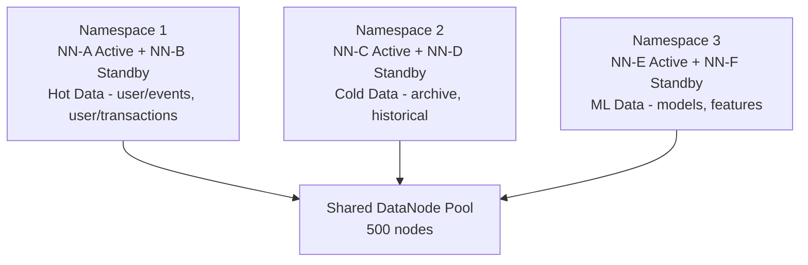

# Scenario Questions — HDFS

<article data-difficulty="junior">

## 🟢 Junior: The Missing Data Mystery

**Scenario:** You join a data engineering team and notice that a Spark job is failing with `FileNotFoundException` on HDFS. The file `/user/data/sales/2024/01/15/part-00000.parquet` definitely existed yesterday. The HDFS admin says no one deleted it manually. What are the possible causes and how do you investigate?

<details>
<summary>💡 Hint</summary>
Think about HDFS block states, replication, DataNode health, and Trash. Also consider whether the file might have been moved rather than deleted.
</details>

<details>
<summary>✅ Solution</summary>

**Step 1: Verify the file is actually gone**
```bash
hdfs dfs -ls /user/data/sales/2024/01/15/
hdfs dfs -stat /user/data/sales/2024/01/15/part-00000.parquet
```

**Step 2: Check Trash**
```bash
# Files deleted via `hdfs dfs -rm` go to Trash by default
hdfs dfs -ls /user/<username>/.Trash/Current/user/data/sales/2024/01/15/
```

**Step 3: Check HDFS health for the file**
```bash
hdfs fsck /user/data/sales/2024/01/15/ -files -blocks -locations
# Look for: CORRUPT FILES, MISSING BLOCKS, Under replicated blocks
```

**Step 4: Check NameNode audit logs**
```bash
# NameNode audit log captures all file operations
grep "part-00000.parquet" /var/log/hadoop/hdfs/hdfs-audit.log
# Shows: who deleted/moved the file and when
```

**Step 5: Check DataNode health**
```bash
hdfs dfsadmin -report | grep "Dead datanodes"
# If DataNodes died with the only replicas, block may be truly lost
```

**Possible Causes:**
| Cause | Investigation | Resolution |
|-------|--------------|------------|
| Accidentally deleted | Check Trash | Restore from Trash |
| DataNode failure with low replication | Check fsck output | Restore from backup |
| Job cleaned up its own output | Check Spark logs | Fix job logic |
| Quota exceeded, write failed | Check quota | Clear space, re-run |

**Key Lesson:** Always set `fs.trash.interval` > 0 (e.g., 10080 = 7 days) in production to have a safety net.

</details>

</article>

<article data-difficulty="mid-level">

## 🟡 Mid-Level: Designing HDFS Storage for a Multi-Tenant Analytics Platform

**Scenario:** Your company is building a shared Hadoop cluster for 5 business units (Finance, Marketing, Engineering, HR, Operations). Each team has different data volumes (10 TB to 200 TB), different sensitivity requirements (HR data is PII), and wants isolation so one team's runaway jobs don't fill up the cluster for others. Design the HDFS layout, permissions, and quotas.

<details>
<summary>💡 Hint</summary>
Think about directory structure, Unix permissions vs ACLs, HDFS quotas (space and namespace), encryption zones for PII, and how to handle shared datasets that multiple teams need to read.
</details>

<details>
<summary>✅ Solution</summary>

**Directory Structure:**
```bash
/data/
  /data/finance/          # Owner: finance-team group
  /data/marketing/        # Owner: marketing-team group
  /data/engineering/      # Owner: eng-team group
  /data/hr/               # Encrypted zone (PII)
  /data/operations/       # Owner: ops-team group
  /data/shared/           # Read-only shared datasets
    /data/shared/reference/
    /data/shared/lookup/
/tmp/
  /tmp/finance/
  /tmp/marketing/
  ... (per-team scratch space)
```

**Permission Setup:**
```bash
# Create team groups in OS (synced from LDAP)
# finance-team, marketing-team, eng-team, hr-team, ops-team

# Set directory ownership and permissions
hdfs dfs -chown -R hdfs:finance-team /data/finance
hdfs dfs -chmod 770 /data/finance    # Team has rwx, others none

# HR gets encryption zone
hadoop key create hr-master-key
hdfs crypto -createZone -keyName hr-master-key -path /data/hr
hdfs dfs -chown -R hdfs:hr-team /data/hr
hdfs dfs -chmod 700 /data/hr         # HR only

# Shared data - read-only for all
hdfs dfs -chmod 755 /data/shared
hdfs dfs -setfacl -m group:finance-team:r-x /data/shared
hdfs dfs -setfacl -m group:marketing-team:r-x /data/shared
```

**Storage Quotas:**
```bash
# Space quotas per team
hdfs dfsadmin -setSpaceQuota 644245094400 /data/finance      # 600 GB (200 TB × 3 replication)
hdfs dfsadmin -setSpaceQuota 322122547200 /data/marketing    # 300 GB
hdfs dfsadmin -setSpaceQuota 107374182400 /data/engineering  # 100 GB
hdfs dfsadmin -setSpaceQuota 32212254720  /data/hr           # 30 GB
hdfs dfsadmin -setSpaceQuota 53687091200  /data/operations   # 50 GB

# Namespace quotas (limit file count to protect NameNode)
hdfs dfsadmin -setQuota 10000000 /data/finance     # 10M files max
hdfs dfsadmin -setQuota 5000000 /data/marketing

# Tmp space quotas (prevent runaway jobs)
hdfs dfsadmin -setSpaceQuota 107374182400 /tmp/finance  # 100 GB scratch

# Monitor quotas
hdfs dfs -count -q -h /data/finance
```

**Isolation via YARN Queues (companion to HDFS quotas):**
```xml
<!-- capacity-scheduler.xml: Each team gets dedicated YARN queue -->
<property>
  <name>yarn.scheduler.capacity.root.finance.capacity</name>
  <value>40</value>
</property>
```

**Shared Dataset Access Pattern:**
```bash
# Engineering writes enrichment tables to shared/
hdfs dfs -chown -R hdfs:eng-team /data/shared/reference
hdfs dfs -chmod 755 /data/shared/reference
hdfs dfs -setfacl -m default:other::r-x /data/shared/reference
# All users can read, only eng-team writes
```

**Monitoring:**
```bash
# Daily quota report script
for team in finance marketing engineering hr operations; do
  echo "=== ${team} ==="
  hdfs dfs -count -q -h /data/${team}
done
```

</details>

</article>

<article data-difficulty="senior">

## 🔴 Senior: NameNode OOM in Production — Root Cause and Long-Term Fix

**Scenario:** At 2 AM, your 500-node production Hadoop cluster's Active NameNode crashes with `OutOfMemoryError: Java heap space`. The Standby NameNode takes over (30-second failover), but you're worried it will also crash. Investigation shows 800 million files in HDFS. The cluster serves 50+ Spark and Hive jobs 24/7. Design an immediate remediation plan and a long-term architectural fix.

<details>
<summary>💡 Hint</summary>
Think about immediate mitigation (buying time), medium-term fixes (compacting files, increasing heap), and long-term architecture (HDFS Federation, preventing small file accumulation). Also consider what triggers an OOM — GC overhead, burst of new files, memory leak in a specific NN operation.
</details>

<details>
<summary>✅ Solution</summary>

**Immediate Actions (next 2 hours):**

```bash
# 1. Verify Standby is healthy
hdfs haadmin -getServiceState nn2   # Should show 'active'
hdfs haadmin -getServiceState nn1   # Should show 'standby'

# 2. Increase Standby NN heap temporarily
# In hadoop-env.sh on nn1:
# HDFS_NAMENODE_OPTS="-Xmx80g -Xms80g -XX:+UseG1GC ..."
# Restart nn1 in standby mode (doesn't disrupt service)
hadoop-daemon.sh stop namenode
# Edit hadoop-env.sh → increase heap
hadoop-daemon.sh start namenode
# Wait for bootstrapStandby to catch up

# 3. Emergency: reduce file count immediately
# Find directories with most files:
hdfs dfs -count -r /  | sort -rn -k2 | head -20

# Compact temp/intermediate files aggressively
hdfs dfs -rm -r /tmp/spark-*      # Remove old Spark shuffle
hdfs dfs -rm -r /user/*/staging/  # Spark job staging dirs
```

**Root Cause Analysis:**

```bash
# Check NN heap dump (generated before OOM if configured)
jmap -heap <nn_pid>  # From surviving NameNode logs

# Count files by directory to find hot spots
hdfs dfs -count -r /user | sort -rn -k2 | head -30

# 800M files × 150 bytes = 120 GB minimum heap
# With overhead: needs ~180-200 GB heap (impractical on single JVM)
```

**Medium-Term Fixes (next 2 weeks):**

```bash
# 1. Aggressive small file compaction
spark-submit --class FileCompactor \
  --conf spark.sql.shuffle.partitions=500 \
  file-compactor.jar \
  --input /user/events/ \
  --output /user/events_compacted/ \
  --target-file-size 128mb

# 2. Configure automatic Spark output coalescing
# In Spark jobs:
df.coalesce(200).write.parquet("/output/path/")

# 3. Set file count quotas to prevent recurrence
hdfs dfsadmin -setQuota 50000000 /user  # 50M files total limit

# 4. HAR archival for cold partitions
hadoop archive -archiveName 2022.har \
  -p /user/events/ year=2022 \
  /user/events_archive/
```

**Long-Term Architecture: HDFS Federation**



```xml
<!-- ViewFS: unified namespace across federation -->
<!-- core-site.xml on all clients -->
<property>
  <name>fs.defaultFS</name>
  <value>viewfs://ClusterX</value>
</property>
<property>
  <name>fs.viewfs.mounttable.ClusterX.link./user</name>
  <value>hdfs://ns1/user</value>
</property>
<property>
  <name>fs.viewfs.mounttable.ClusterX.link./archive</name>
  <value>hdfs://ns2/archive</value>
</property>
<property>
  <name>fs.viewfs.mounttable.ClusterX.link./ml</name>
  <value>hdfs://ns3/ml</value>
</property>
```

**Prevention — Upstream Fixes:**
```python
# Enforce output file size in all Spark jobs via custom wrapper
def write_parquet(df, path, target_partitions=None):
    if target_partitions is None:
        # Aim for ~128 MB files
        size_bytes = df.count() * 100  # rough estimate
        target_partitions = max(1, int(size_bytes / (128 * 1024 * 1024)))
    df.coalesce(target_partitions).write.mode("overwrite").parquet(path)

# Automated cleanup job (runs daily)
# Deletes Spark staging dirs, temp files older than 24 hours
```

**Result Summary:**
- Immediate: Standby NN with increased heap survives
- Medium-term: File count reduced from 800M to 50M via compaction
- Long-term: Federation splits namespace across 3 NameNodes, each handling ~150M files comfortably
- Prevention: Coding standards + automated cleanup prevent recurrence

</details>

</article>
