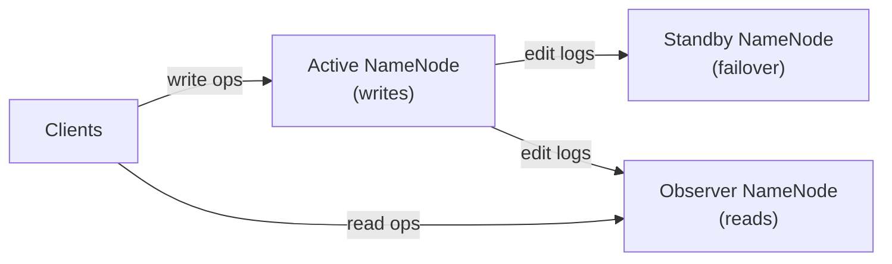

# HDFS Senior Deep Dive

## NameNode Internals

### In-Memory Data Structures

The NameNode maintains the entire namespace in memory using two primary data structures:

**INodeMap**: Maps inode ID → INode objects
- `INodeFile`: Stores file metadata + array of BlockInfo objects
- `INodeDirectory`: Stores directory metadata + list of children

**BlocksMap**: Maps Block ID → BlockInfo
- BlockInfo stores: which file owns it, which DataNodes hold replicas, replication state

```
Memory layout (simplified):
INodeMap {
  inode_1001 → INodeDirectory("/user/data", permissions, children=[1002, 1003])
  inode_1002 → INodeFile("sales.parquet", size=2GB, blocks=[blk_A, blk_B, ...])
  inode_1003 → INodeFile("logs.gz", size=500MB, blocks=[blk_C, blk_D])
}

BlocksMap {
  blk_A → BlockInfo(inode=1002, replicas=[DN1, DN4, DN7], state=COMPLETE)
  blk_B → BlockInfo(inode=1002, replicas=[DN2, DN5, DN8], state=COMPLETE)
}
```

### Safe Mode Deep Dive

NameNode enters safe mode on startup and waits until:
1. Minimum replication threshold is met (default: 99.9% of blocks have at least 1 replica)
2. Minimum DataNode threshold is met (configurable)
3. Extension period has passed (30 seconds by default)

```xml
<!-- hdfs-site.xml -->
<property>
  <name>dfs.namenode.safemode.threshold-pct</name>
  <value>0.999</value>
</property>
<property>
  <name>dfs.namenode.safemode.min.datanodes</name>
  <value>0</value>
</property>
<property>
  <name>dfs.namenode.safemode.extension</name>
  <value>30000</value>
</property>
```

### RPC Server Architecture
The NameNode exposes multiple RPC servers:
- **ClientProtocol RPC** (port 8020/9000): File system operations from clients
- **DatanodeProtocol RPC**: Heartbeats and block reports from DataNodes
- **NamenodeProtocol RPC**: Standby NN fetching edits, tools

```xml
<property>
  <name>dfs.namenode.handler.count</name>
  <value>100</value>  <!-- Increase for large clusters -->
</property>
<property>
  <name>dfs.namenode.service.handler.count</name>
  <value>10</value>  <!-- For DataNode/NN RPC -->
</property>
```

## Block Report and Heartbeat Internals

### Full Block Report
- Sent on DataNode startup and every **6 hours**
- Contains list of all blocks on the DataNode
- NameNode reconciles against BlocksMap to detect:
  - **Under-replicated blocks**: Schedules replication to additional DataNodes
  - **Over-replicated blocks**: Schedules deletion of excess replicas
  - **Corrupt blocks**: Detected via checksum mismatch, triggers re-replication

### Incremental Block Report
- Sent immediately when a block is added/removed/received
- Reduces NameNode load vs. waiting for full block report

### Heartbeat Processing
```
Every 3 seconds per DataNode:
  → NameNode receives heartbeat
  → Returns commands back to DataNode (piggyback):
    - Replicate block X to DN5
    - Delete block Y (over-replicated)
    - Re-register (if NN restarted)
    - Shutdown (admin command)
```

## DataNode Write Pipeline Deep Dive

### Packet-Level Streaming
Data flows through the pipeline in **packets** (64 KB by default), not the full block:

```
Client → DN1: [packet 1][packet 2][packet 3]...[last packet]
              ↓ simultaneously
         DN1 → DN2: [packet 1][packet 2]...
                    ↓ simultaneously
              DN2 → DN3: [packet 1][packet 2]...
```

This pipelining means total write time ≈ time to write to DN1 + small overhead (not 3x).

### Write Pipeline Failure Recovery
If a DataNode fails mid-write:
1. Pipeline is broken
2. Client waits for acks from surviving nodes
3. Failed DN is removed from pipeline
4. New DN is added to pipeline (if replication factor allows)
5. Block is marked as "under-replicated" for later re-replication

```xml
<!-- Control pipeline recovery behavior -->
<property>
  <name>dfs.client.block.write.retries</name>
  <value>3</value>
</property>
```

## HDFS Performance Tuning

### Short-Circuit Reads
When the HDFS client is on the same node as a DataNode, data can be read directly from disk (bypassing DataNode RPC):

```xml
<!-- hdfs-site.xml -->
<property>
  <name>dfs.client.read.shortcircuit</name>
  <value>true</value>
</property>
<property>
  <name>dfs.domain.socket.path</name>
  <value>/var/lib/hadoop-hdfs/dn_socket</value>
</property>
```

### Read-Ahead and Zero-Copy
```xml
<property>
  <name>dfs.datanode.readahead.bytes</name>
  <value>4194304</value>  <!-- 4 MB read-ahead -->
</property>
```

Zero-copy reads (using `sendfile` syscall) allow DataNode to transfer data from disk to network without copying through JVM heap:
```java
// In custom Hadoop client code
FileChannel channel = FileInputStream(file).getChannel();
channel.transferTo(0, channel.size(), socketChannel); // zero-copy
```

### DataNode Configuration
```xml
<!-- Multiple disks for DataNode (JBOD - Just a Bunch Of Disks) -->
<property>
  <name>dfs.datanode.data.dir</name>
  <value>/data/disk1/hdfs,/data/disk2/hdfs,/data/disk3/hdfs,/data/disk4/hdfs</value>
</property>

<!-- Storage policies: DISK, SSD, ARCHIVE, RAM_DISK -->
<property>
  <name>dfs.storage.policy.enabled</name>
  <value>true</value>
</property>
```

### Storage Tiering
```bash
# Set storage policy for hot data (SSD)
hdfs storagepolicies -setStoragePolicy -path /user/hot-data/ -policy HOT

# Set storage policy for cold data (archive)
hdfs storagepolicies -setStoragePolicy -path /user/cold-data/ -policy COLD

# Move blocks to correct storage tier
hdfs mover -p /user/cold-data/

# List policies
hdfs storagepolicies -listPolicies
```

| Policy | Storage Types | Replication | Use Case |
|--------|---------------|-------------|----------|
| HOT | DISK | 3 | Default, frequently accessed |
| WARM | DISK + ARCHIVE | 2 disk, 1 archive | Occasionally accessed |
| COLD | ARCHIVE | 3 | Rarely accessed, cheap storage |
| ONE_SSD | SSD + DISK | 1 SSD, 2 disk | Low-latency reads needed |
| ALL_SSD | SSD | 3 | High-performance |
| LAZY_PERSIST | RAM_DISK | 1 | Temporary, in-memory |

## HDFS Security

### Kerberos Authentication
```xml
<!-- core-site.xml -->
<property>
  <name>hadoop.security.authentication</name>
  <value>kerberos</value>
</property>
<property>
  <name>hadoop.security.authorization</name>
  <value>true</value>
</property>

<!-- hdfs-site.xml -->
<property>
  <name>dfs.block.access.token.enable</name>
  <value>true</value>
</property>
```

```bash
# Authenticate with Kerberos
kinit -kt /etc/security/keytabs/hdfs.keytab hdfs/namenode@REALM.COM

# Use HDFS after authentication
hdfs dfs -ls /
```

### HDFS ACLs (Access Control Lists)
```bash
# Set ACL
hdfs dfs -setfacl -m user:alice:rwx /user/shared/data

# Set default ACL (inherited by new files)
hdfs dfs -setfacl -m default:group:analytics:r-x /user/shared/data

# Get ACL
hdfs dfs -getfacl /user/shared/data

# Remove ACL
hdfs dfs -removefacl -m user:alice /user/shared/data
```

### Encryption at Rest (Transparent Data Encryption)
```bash
# Create encryption zone key
hadoop key create hdfs-encryption-key

# Create encryption zone
hdfs crypto -createZone -keyName hdfs-encryption-key -path /user/sensitive/

# Verify encryption zone
hdfs crypto -listZones

# Files written to /user/sensitive/ are automatically encrypted/decrypted
hdfs dfs -put sensitive_data.csv /user/sensitive/
```

## NameNode GC Tuning

The NameNode JVM requires careful GC tuning for large clusters:

```bash
# In hadoop-env.sh
export HDFS_NAMENODE_OPTS="-Xmx40g -Xms40g \
  -XX:+UseG1GC \
  -XX:G1HeapRegionSize=32m \
  -XX:MaxGCPauseMillis=200 \
  -XX:InitiatingHeapOccupancyPercent=35 \
  -XX:+ParallelRefProcEnabled \
  -XX:ErrorFile=/var/log/hadoop/namenode_hs_err.log \
  -XX:+PrintGCDetails \
  -XX:+PrintGCDateStamps \
  -Xloggc:/var/log/hadoop/namenode-gc.log"
```

**G1GC is preferred** over CMS for NameNode because:
- Region-based heap management reduces GC pause times
- Better handles large heaps (20GB+) common in large clusters
- Predictable pause time goals

## HDFS Observer NameNode (Hadoop 3.4+)

For read-heavy workloads, the Observer NameNode allows reads to be served by additional NameNodes (beyond Active/Standby):



```xml
<property>
  <name>dfs.ha.namenodes.mycluster</name>
  <value>nn1,nn2,nn3</value>
</property>
<property>
  <name>dfs.namenode.state.context.enabled</name>
  <value>true</value>
</property>
```

## Common Production Issues

### Issue 1: NameNode RPC Queue Buildup
**Symptom**: Slow HDFS operations, `ipc.Server: 1 calls in queue` in logs
**Cause**: Too many concurrent clients, insufficient handler threads
**Fix**: Increase `dfs.namenode.handler.count` (rule of thumb: 20 × log(cluster size))

### Issue 2: Missing Blocks After DataNode Failure
```bash
# Check under-replicated blocks
hdfs dfsadmin -report | grep "Under replicated"
hdfs fsck / | grep -E "Under replicated|Missing"

# Force immediate re-replication
hdfs dfsadmin -setReplicationSafeModeThreshold 0
```

### Issue 3: DataNode Disk Full
```bash
# Check DataNode disk usage
hdfs dfsadmin -report | grep -A5 "Name: <DN_IP>"

# Increase disk space or reduce replication factor temporarily
hdfs dfs -setrep -w 2 /user/data/large_archive/

# Run balancer to redistribute
hdfs balancer -threshold 5
```

## Interview Tips

> **Tip 1:** When asked about NameNode scalability, discuss the full picture: HA (availability), Federation (namespace scalability), Observer NN (read scalability), and JVM heap sizing. Show you understand each dimension of scaling.

> **Tip 2:** Explain the Block Report reconciliation process in detail — it demonstrates you understand how HDFS maintains consistency (under-replicated → replicate, over-replicated → delete, corrupt → re-replicate from good replica).

> **Tip 3:** For a senior role, discuss the tradeoffs of Erasure Coding: 50% storage overhead (vs 200% for 3x replication) but higher CPU cost for encode/decode and worse data locality for compute frameworks like Spark.

> **Tip 4:** Short-circuit reads are often overlooked but important for performance. When Spark runs on YARN and tasks are data-local, short-circuit reads bypass the DataNode RPC server entirely for significant throughput gains.

> **Tip 5:** Know the production failure scenarios: NameNode RPC queue saturation, DataNode disk full causing under-replication, and GC pauses causing NameNode timeouts leading to spurious DataNode removals.
