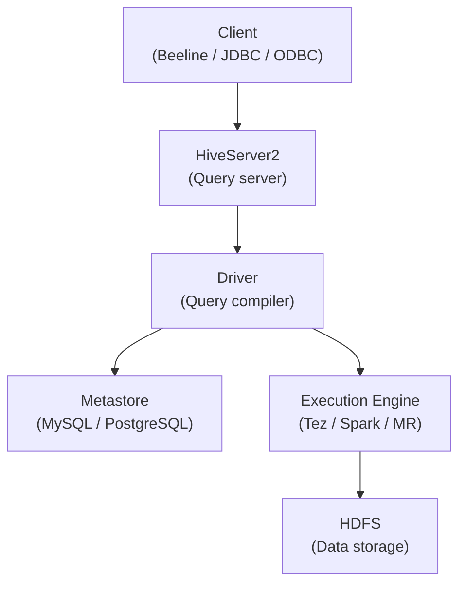

# Hive Fundamentals

## What is Hive?

Apache Hive is a data warehouse built on top of Hadoop that provides SQL-like query capability (HiveQL) over data stored in HDFS. It translates SQL queries into MapReduce, Tez, or Spark jobs, making large-scale data processing accessible without writing Java code.

**Key Characteristics:**
- **SQL interface**: HiveQL is nearly identical to SQL (with extensions for HDFS-specific features)
- **Schema-on-read**: Schema is applied when data is read, not when written
- **Batch processing**: Optimized for large analytical queries, not OLTP
- **Metastore**: Centralized metadata repository (table schemas, partition info, statistics)

## Hive Architecture



### HiveServer2 (HS2)
- Accepts client connections via Thrift, JDBC, ODBC
- Supports concurrent sessions and multi-tenancy
- Can be configured with HA (multiple HS2 instances behind a load balancer)

### Hive Metastore
- Stores schema information: databases, tables, columns, data types
- Stores partition information (which HDFS paths map to which partition keys)
- Typically backed by a relational database (MySQL, PostgreSQL)
- Can run embedded (in-process) or as a standalone service
- Shared across Hive, Spark SQL, Presto/Trino, Impala

### Driver
- Parses HiveQL
- Generates logical plan
- Optimizes (semantic analysis, logical optimization)
- Generates physical plan (MapReduce/Tez DAG)

## HiveQL Basics

### Database and Table DDL
```sql
-- Create database
CREATE DATABASE IF NOT EXISTS analytics
COMMENT 'Analytics data warehouse'
LOCATION '/user/hive/warehouse/analytics.db';

-- Create external table (data lives outside warehouse dir)
CREATE EXTERNAL TABLE IF NOT EXISTS raw_events (
    event_id    BIGINT,
    user_id     STRING,
    event_type  STRING,
    timestamp   TIMESTAMP,
    properties  MAP<STRING, STRING>
)
ROW FORMAT DELIMITED
FIELDS TERMINATED BY ','
STORED AS TEXTFILE
LOCATION '/raw/events/';

-- Create managed table (Hive owns the data)
CREATE TABLE user_sessions (
    session_id  STRING,
    user_id     STRING,
    start_time  TIMESTAMP,
    duration_sec INT,
    page_views  INT
)
STORED AS ORC;

-- Describe table
DESCRIBE EXTENDED user_sessions;
DESCRIBE FORMATTED user_sessions;  -- More detail including storage info
```

### Data Types
```sql
-- Primitive types
TINYINT, SMALLINT, INT, BIGINT
FLOAT, DOUBLE, DECIMAL(p, s)
STRING, VARCHAR(n), CHAR(n)
BOOLEAN
TIMESTAMP, DATE

-- Complex types
ARRAY<STRING>                    -- Array of strings
MAP<STRING, INT>                 -- Key-value map
STRUCT<name:STRING, age:INT>     -- Named fields
```

### DML Operations
```sql
-- Insert from select
INSERT INTO TABLE user_sessions
SELECT
    session_id,
    user_id,
    MIN(timestamp) as start_time,
    DATEDIFF(MAX(timestamp), MIN(timestamp)) as duration_sec,
    COUNT(*) as page_views
FROM raw_events
WHERE event_type = 'page_view'
GROUP BY session_id, user_id;

-- Insert overwrite (replace all data)
INSERT OVERWRITE TABLE daily_summary
SELECT
    DATE(event_time) as event_date,
    COUNT(*) as total_events,
    COUNT(DISTINCT user_id) as unique_users
FROM events
GROUP BY DATE(event_time);

-- Load data from HDFS or local
LOAD DATA INPATH '/raw/sales/2024-01-15.csv' INTO TABLE sales;
LOAD DATA LOCAL INPATH '/home/user/data.csv' INTO TABLE staging;

-- CTAS (Create Table As Select)
CREATE TABLE enriched_orders AS
SELECT o.*, c.name, c.email
FROM orders o
JOIN customers c ON o.customer_id = c.id;
```

## Partitioning

Partitioning physically organizes data in HDFS by partition key values, enabling partition pruning to skip irrelevant data.

```sql
-- Create partitioned table
CREATE TABLE web_logs (
    log_id      BIGINT,
    user_id     STRING,
    url         STRING,
    status_code INT,
    response_ms INT
)
PARTITIONED BY (log_date DATE, region STRING)
STORED AS ORC;

-- Insert with partition
INSERT INTO TABLE web_logs PARTITION (log_date='2024-01-15', region='us-east')
SELECT log_id, user_id, url, status_code, response_ms
FROM raw_logs
WHERE log_date = '2024-01-15' AND region = 'us-east';

-- Dynamic partitioning (auto-detect partition values from data)
SET hive.exec.dynamic.partition = true;
SET hive.exec.dynamic.partition.mode = nonstrict;  -- Allow all partitions dynamic

INSERT INTO TABLE web_logs PARTITION (log_date, region)
SELECT log_id, user_id, url, status_code, response_ms, log_date, region
FROM raw_logs;

-- Query with partition pruning
SELECT COUNT(*) FROM web_logs
WHERE log_date = '2024-01-15'  -- Only reads /web_logs/log_date=2024-01-15/
  AND region = 'us-east';      -- Reads /web_logs/log_date=2024-01-15/region=us-east/

-- Show partitions
SHOW PARTITIONS web_logs;

-- Add partition manually (for external tables)
ALTER TABLE web_logs ADD PARTITION (log_date='2024-01-15', region='eu-west')
LOCATION '/raw/logs/2024/01/15/eu-west/';
```

## Bucketing

Bucketing divides data within a partition into fixed-size bucket files based on hash of a column:

```sql
-- Create bucketed table
CREATE TABLE user_purchases (
    user_id     STRING,
    product_id  STRING,
    amount      DOUBLE
)
CLUSTERED BY (user_id) INTO 32 BUCKETS
STORED AS ORC;

-- Benefits:
-- 1. Efficient joins on bucketed columns (bucket-merge join)
-- 2. Efficient sampling (SELECT * FROM users TABLESAMPLE(BUCKET 1 OUT OF 32))
-- 3. More uniform file sizes within partitions
```

## File Formats

```sql
-- TextFile (default, human readable, no compression by default)
STORED AS TEXTFILE;

-- SequenceFile (binary key-value, splittable)
STORED AS SEQUENCEFILE;

-- ORC (Optimized Row Columnar) - best for Hive
STORED AS ORC;
-- Columnar → only reads needed columns
-- Built-in compression (Zlib or Snappy per stripe)
-- Statistics (min, max, count) per column per stripe → skip stripes
-- ACID support for Hive

-- Parquet - best for cross-engine compatibility
STORED AS PARQUET;
-- Columnar → only reads needed columns
-- Compatible with Spark, Impala, Presto, Athena, BigQuery

-- Avro - best for schema evolution and streaming
STORED AS AVRO;
-- Row-based (not columnar)
-- Rich schema evolution support
-- Great for Kafka integration

-- Convert existing table to ORC
CREATE TABLE web_logs_orc
STORED AS ORC AS
SELECT * FROM web_logs_text;
```

| Format | Columnar | Compression | Splittable | Best For |
|--------|----------|-------------|------------|----------|
| TextFile | No | Optional | Yes (line) | Simple ingestion |
| ORC | Yes | Yes (built-in) | Yes | Hive analytics |
| Parquet | Yes | Yes (snappy) | Yes | Multi-engine |
| Avro | No | Optional | No | Schema evolution |
| SequenceFile | No | Yes | Yes | MR intermediate |

## Execution Engines

```sql
-- Use MapReduce (legacy, slow)
SET hive.execution.engine=mr;

-- Use Tez (default for modern Hive, 2-5x faster than MR)
SET hive.execution.engine=tez;

-- Use Spark (best for complex queries)
SET hive.execution.engine=spark;

-- Check current engine
SET hive.execution.engine;
```

## Common Query Patterns

```sql
-- Aggregations
SELECT
    product_category,
    COUNT(*) as orders,
    SUM(amount) as revenue,
    AVG(amount) as avg_order,
    PERCENTILE_APPROX(amount, 0.95) as p95_amount
FROM orders
WHERE order_date >= '2024-01-01'
GROUP BY product_category
HAVING COUNT(*) > 100
ORDER BY revenue DESC
LIMIT 20;

-- Window functions
SELECT
    user_id,
    order_date,
    amount,
    SUM(amount) OVER (PARTITION BY user_id ORDER BY order_date) as cumulative_spend,
    LAG(amount, 1) OVER (PARTITION BY user_id ORDER BY order_date) as prev_order_amount
FROM orders;

-- Lateral view (explode arrays/maps)
SELECT user_id, tag
FROM user_profiles
LATERAL VIEW EXPLODE(interest_tags) tag_table AS tag;
```

## Interview Tips

> **Tip 1:** Know the difference between managed and external tables. Managed tables: Hive owns the data (DROP TABLE also deletes HDFS data). External tables: Hive only manages metadata (DROP TABLE keeps HDFS data). Always use EXTERNAL tables for shared/production data — this prevents accidental data deletion.

> **Tip 2:** Partitioning is the most important Hive optimization. Explain partition pruning: without WHERE on partition column, Hive scans ALL partitions. With WHERE clause matching partition key, it reads only relevant HDFS directories — can be 100x faster on time-partitioned tables.

> **Tip 3:** When asked "what is the Hive Metastore?", explain it's the critical centralized metadata service shared across the entire Hadoop ecosystem (Hive, Spark SQL, Presto, Flink). It stores table schemas, partition locations, statistics. It's typically backed by MySQL/PostgreSQL. Its availability is crucial — if Metastore is down, no query can run.

> **Tip 4:** ORC vs Parquet: ORC is slightly better for Hive-native workloads (better predicate pushdown with Bloom filters, ACID support). Parquet is better for cross-engine workloads (Spark, Athena, BigQuery, Presto all natively read Parquet). In modern data stacks, Parquet is more common for this interoperability.

> **Tip 5:** Dynamic partitioning is powerful but dangerous — if a source table has 10,000 distinct partition values, dynamic partition insert creates 10,000 partition directories and potentially creates too many small files. Always check cardinality of partition columns before using dynamic partitioning.
