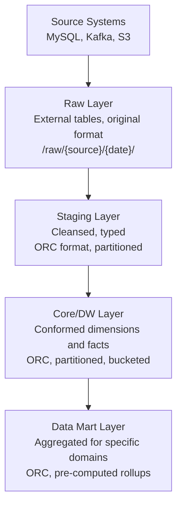

# Hive Real-World Patterns

## Building a Production Data Warehouse on Hive

### Layered Architecture



```sql
-- Raw layer: external table pointing to ingested data
CREATE EXTERNAL TABLE raw.transactions (
    raw_json STRING  -- store as raw JSON for flexibility
)
PARTITIONED BY (ingestion_date STRING)
STORED AS TEXTFILE
LOCATION '/raw/transactions/';

-- Stage layer: parsed, typed, validated
CREATE TABLE stg.transactions (
    transaction_id  BIGINT,
    user_id         STRING,
    amount          DECIMAL(18, 2),
    currency        STRING,
    status          STRING,
    created_at      TIMESTAMP
)
PARTITIONED BY (txn_date DATE)
STORED AS ORC
TBLPROPERTIES ('orc.compress'='SNAPPY');

-- Core layer: enriched fact table
CREATE TABLE dw.fact_transactions (
    transaction_id  BIGINT,
    user_sk         BIGINT,  -- Surrogate key to dim_user
    date_sk         INT,     -- Surrogate key to dim_date
    amount_usd      DECIMAL(18, 2),  -- Normalized to USD
    status          STRING
)
PARTITIONED BY (txn_year INT, txn_month INT)
CLUSTERED BY (user_sk) INTO 64 BUCKETS
STORED AS ORC;
```

## Slowly Changing Dimensions (SCD) in Hive

### SCD Type 2 Implementation
```sql
-- Track customer history with effective dates
CREATE TABLE dw.dim_customer (
    customer_sk     BIGINT,          -- Surrogate key
    customer_id     STRING,          -- Natural key
    customer_name   STRING,
    email           STRING,
    tier            STRING,          -- 'gold', 'silver', 'bronze'
    effective_date  DATE,
    expiry_date     DATE,            -- NULL for current record
    is_current      BOOLEAN
)
STORED AS ORC;

-- Insert new record / expire old when tier changes
-- Step 1: Expire changed records
INSERT INTO dw.dim_customer
SELECT
    customer_sk,
    customer_id,
    customer_name,
    email,
    tier,
    effective_date,
    '2024-01-15' as expiry_date,  -- Today
    FALSE as is_current
FROM dw.dim_customer c
JOIN incoming_customers ic ON c.customer_id = ic.customer_id
WHERE c.is_current = TRUE
  AND c.tier != ic.tier;  -- Tier changed

-- Step 2: Insert new current records
INSERT INTO dw.dim_customer
SELECT
    ROW_NUMBER() OVER () + (SELECT MAX(customer_sk) FROM dw.dim_customer) as customer_sk,
    ic.customer_id,
    ic.customer_name,
    ic.email,
    ic.tier,
    '2024-01-15' as effective_date,
    NULL as expiry_date,
    TRUE as is_current
FROM incoming_customers ic
JOIN dw.dim_customer c ON ic.customer_id = c.customer_id
WHERE c.is_current = TRUE
  AND c.tier != ic.tier;
```

## Case Study: Query Performance Optimization

### Problem
A daily Hive job that joins 5 tables takes 6 hours. The query runs on 10 TB of data.

### Diagnostic Process
```sql
-- Step 1: EXPLAIN to understand the query plan
EXPLAIN
SELECT
    d.fiscal_quarter,
    p.category,
    SUM(f.amount) as revenue
FROM fact_sales f
JOIN dim_date d ON f.date_sk = d.date_sk
JOIN dim_product p ON f.product_sk = p.product_sk
JOIN dim_customer c ON f.customer_sk = c.customer_sk
WHERE d.fiscal_year = 2024
GROUP BY d.fiscal_quarter, p.category;

-- Step 2: Collect statistics
ANALYZE TABLE fact_sales COMPUTE STATISTICS;
ANALYZE TABLE fact_sales COMPUTE STATISTICS FOR COLUMNS date_sk, product_sk, customer_sk, amount;
ANALYZE TABLE dim_date COMPUTE STATISTICS;
ANALYZE TABLE dim_product COMPUTE STATISTICS;
ANALYZE TABLE dim_customer COMPUTE STATISTICS;

-- Step 3: Re-run EXPLAIN to see if join order changed
-- CBO may now reorder: broadcast dim_date (1K rows) and dim_product (50K rows)
-- instead of shuffling them as large tables
```

### Optimizations Applied
```sql
-- 1. Enable all optimizations
SET hive.cbo.enable=true;
SET hive.vectorized.execution.enabled=true;
SET hive.auto.convert.join=true;
SET hive.mapjoin.smalltable.filesize=50000000;  -- 50 MB for dim tables
SET hive.exec.parallel=true;
SET hive.optimize.skewjoin=true;

-- 2. Pre-filter fact table with partition pruning
-- If fact_sales is partitioned by year-month, the WHERE clause reduces scan 12x

-- 3. Use Tez with container reuse
SET hive.execution.engine=tez;

-- 4. Result: 6 hours → 45 minutes
```

## Case Study: Migrating from Hive MR to Tez

### Migration Steps
```bash
# Step 1: Enable Tez execution engine on HiveServer2
# In hive-site.xml:
# hive.execution.engine=tez

# Step 2: Validate with representative queries
beeline -u "jdbc:hive2://hs2-host:10000" << 'EOF'
SET hive.execution.engine=tez;
EXPLAIN SELECT COUNT(*) FROM fact_transactions WHERE txn_date > '2024-01-01';
SELECT COUNT(*) FROM fact_transactions WHERE txn_date > '2024-01-01';
EOF

# Step 3: Compare results between MR and Tez
# Run same query with both engines, compare output checksums
hive -e "SET hive.execution.engine=mr; SELECT * FROM result_table ORDER BY id" | md5sum
hive -e "SET hive.execution.engine=tez; SELECT * FROM result_table ORDER BY id" | md5sum

# Step 4: Performance comparison report
for QUERY_FILE in queries/*.hql; do
  echo "=== $QUERY_FILE ==="
  START=$(date +%s)
  beeline -u "jdbc:hive2://hs2:10000" -f $QUERY_FILE
  END=$(date +%s)
  echo "Tez time: $((END - START)) seconds"
done
```

## Hive Partitioning Anti-Patterns in Production

### Over-Partitioning
```sql
-- BAD: Partitioning by user_id creates millions of partitions
-- Each partition = directory in HDFS = metadata entry in Metastore
CREATE TABLE user_events (...)
PARTITIONED BY (user_id STRING);  -- DON'T DO THIS if millions of users!

-- GOOD: Partition by date (bounded cardinality) + bucket by user_id
CREATE TABLE user_events (...)
PARTITIONED BY (event_date DATE)  -- ~365 partitions per year
CLUSTERED BY (user_id) INTO 64 BUCKETS;  -- Buckets within each partition

-- Rule of thumb: partition columns should have < 10,000 distinct values
-- and data per partition should be > 256 MB (at least one HDFS block)
```

### Partition Discovery
```bash
# When files are added to HDFS outside of Hive (e.g., by Spark or distcp)
# Hive Metastore doesn't know about them until repaired

# Discover new partitions
MSCK REPAIR TABLE web_logs;

# More efficient for external tables with many partitions:
# Add only the new partition explicitly
ALTER TABLE web_logs ADD IF NOT EXISTS PARTITION (log_date='2024-01-15')
LOCATION '/raw/logs/2024/01/15/';

# Automate in shell script after Spark writes:
PARTITIONS=("2024/01/15" "2024/01/16")
for P in "${PARTITIONS[@]}"; do
  DATE=$(echo $P | tr '/' '-')
  beeline -u "jdbc:hive2://hs2:10000" \
    -e "ALTER TABLE web_logs ADD IF NOT EXISTS PARTITION (log_date='$DATE') LOCATION '/raw/logs/$P/'"
done
```

## Hive vs Modern Alternatives

| Aspect | Hive | Spark SQL | Presto/Trino | Athena |
|--------|------|-----------|-------------|--------|
| Latency | Minutes | Seconds | Seconds | Seconds |
| Scale | Petabytes | Petabytes | Petabytes | Petabytes |
| SQL support | HiveQL | ANSI SQL | ANSI SQL | ANSI SQL |
| Streaming | No | Yes | No | No |
| ACID | Yes | Via Delta/Iceberg | No | No |
| Setup | Complex | Medium | Medium | None (serverless) |
| Cost model | Cluster (fixed) | Cluster (fixed) | Cluster (fixed) | Per-query (variable) |
| Best for | Stable ETL, Hadoop | ML, complex analytics | Ad-hoc queries | Cloud ad-hoc |

## Interview Tips

> **Tip 1:** In production Hive warehouses, the biggest operational challenge is partition management at scale. Tables with millions of partitions cause Metastore performance issues (slow SHOW PARTITIONS, slow MSCK REPAIR). The solution is bounded cardinality partition columns (date, not user_id) and regular partition lifecycle management (drop old partitions).

> **Tip 2:** SCD Type 2 implementation in Hive is a classic interview question. Emphasize the two-step process: (1) expire changed rows by setting expiry_date, (2) insert new current rows. With ACID tables you can do UPDATE + INSERT or MERGE in a single statement.

> **Tip 3:** When asked "would you use Hive for a new project?", be honest: for a new project on modern cloud infrastructure, you'd likely use Spark SQL with Delta Lake/Iceberg on S3, serving via Trino. Hive on Hadoop remains relevant for existing on-prem workloads and where the ACID transaction model is needed without Spark.

> **Tip 4:** The Metastore is the most under-appreciated component. It's a single point of failure for the entire analytics ecosystem. Production best practices: multiple Metastore instances behind a load balancer, regular backups of the underlying MySQL/PostgreSQL database, and monitoring connection pool saturation.

> **Tip 5:** For query optimization stories in interviews, use the EXPLAIN → Statistics → Re-EXPLAIN pattern. This shows you know the systematic process, not just "I enabled vectorization and it got faster." The systematic approach demonstrates engineering discipline.
