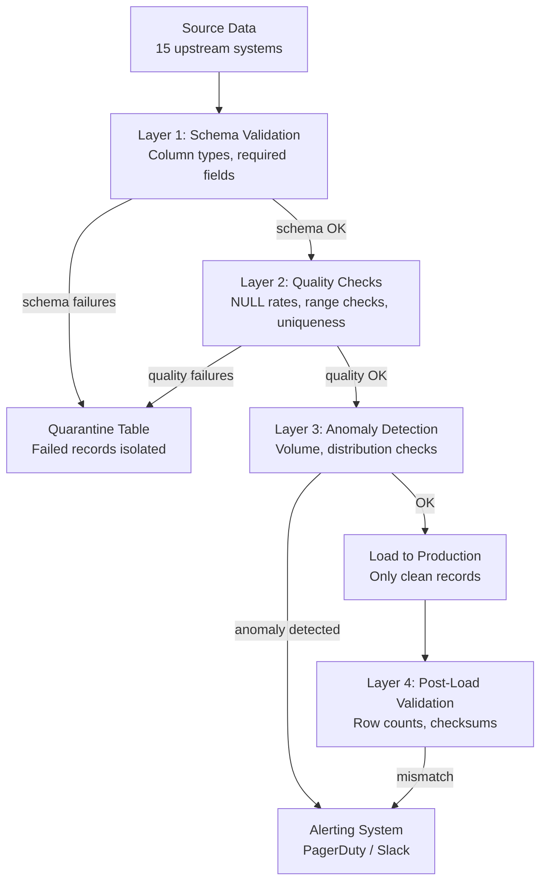

# Scenario Questions — Hive

<article data-difficulty="junior">

## 🟢 Junior: Query Taking Too Long

**Scenario:** A data analyst runs the following query and it takes 2 hours to complete on a 500-node cluster. The `orders` table has 10 years of data (1 TB total) partitioned by `order_date`. The analyst wants to analyze only January 2024 data. Identify the problem and fix it.

```sql
SELECT
    product_id,
    COUNT(*) as order_count,
    SUM(amount) as total_revenue
FROM orders
WHERE YEAR(order_date) = 2024 AND MONTH(order_date) = 1
GROUP BY product_id;
```

<details>
<summary>💡 Hint</summary>
Look carefully at the WHERE clause. The `orders` table is partitioned by `order_date`. What happens when you apply functions to partition columns in a WHERE clause?
</details>

<details>
<summary>✅ Solution</summary>

**Problem: Function on Partition Column Prevents Partition Pruning**

When you apply `YEAR()` or `MONTH()` functions to the `order_date` partition column, Hive cannot use partition pruning. It must scan ALL partitions (10 years of data = all 1 TB) and then apply the function filter at the scan level.

**Proof:**
```sql
-- Check the EXPLAIN plan
EXPLAIN SELECT product_id, COUNT(*), SUM(amount)
FROM orders
WHERE YEAR(order_date) = 2024 AND MONTH(order_date) = 1
GROUP BY product_id;

-- Look for: "TableScan: orders, partitions: ALL_PARTITIONS"
-- vs the correct: "TableScan: orders, partitions: 31 partitions"
```

**Fix: Use Direct Partition Column Comparisons**
```sql
-- Option 1: Range comparison (best for DATE type)
SELECT
    product_id,
    COUNT(*) as order_count,
    SUM(amount) as total_revenue
FROM orders
WHERE order_date >= '2024-01-01'
  AND order_date < '2024-02-01'
GROUP BY product_id;

-- Option 2: IN clause for specific dates
-- (only if querying a few specific dates)
WHERE order_date IN ('2024-01-01', '2024-01-02', ...)  -- Not practical for 31 days

-- Option 3: If partitioned as STRING 'YYYY-MM-DD'
WHERE order_date LIKE '2024-01-%'
-- Note: LIKE with prefix is usually partition-pruning-safe but less reliable
```

**Performance Impact:**
| Query | Partitions Scanned | Runtime |
|-------|-------------------|---------|
| With `YEAR()` function | ALL (3,650+ partitions) | 2 hours |
| With range comparison | 31 partitions | ~4 minutes |

**Additional Optimization:**
```sql
-- Also collect statistics for better query planning
ANALYZE TABLE orders PARTITION(order_date >= '2024-01-01' AND order_date < '2024-02-01')
COMPUTE STATISTICS;

-- Enable vectorization for the aggregation
SET hive.vectorized.execution.enabled=true;
```

**Key Rule:** Never apply functions to partition columns in WHERE clauses. Always use direct comparisons, range predicates, or IN clauses against the raw partition values.

</details>

</article>

<article data-difficulty="mid-level">

## 🟡 Mid-Level: Designing a Slowly Changing Dimension Table

**Scenario:** Your company's CRM system tracks customer loyalty tiers (Bronze, Silver, Gold, Platinum). Customers change tiers frequently. The data team needs to analyze historical orders with the customer's tier AT THE TIME OF PURCHASE (not current tier). Design the Hive table structure and the daily ETL process to support this requirement.

<details>
<summary>💡 Hint</summary>
This is a classic SCD Type 2 problem. You need to track the full history of tier changes with effective dates. Consider how to join orders to the correct tier based on the order timestamp falling between a tier's effective_date and expiry_date.
</details>

<details>
<summary>✅ Solution</summary>

**Table Design (SCD Type 2):**
```sql
-- Dimension table with history
CREATE TABLE dw.dim_customer (
    customer_sk     BIGINT COMMENT 'Surrogate key (unique per record)',
    customer_id     STRING COMMENT 'Natural key from CRM',
    customer_name   STRING,
    email           STRING,
    tier            STRING,         -- 'bronze', 'silver', 'gold', 'platinum'
    effective_date  DATE COMMENT 'When this tier record became active',
    expiry_date     DATE COMMENT 'When this record expired (NULL = current)',
    is_current      BOOLEAN
)
STORED AS ORC
TBLPROPERTIES ('transactional'='true');  -- ACID for UPDATE/MERGE

-- Sequence for surrogate keys (use SEQUENCE or max+rownum trick)
```

**Daily ETL Process:**

```sql
-- Step 1: Load today's CRM snapshot into staging
CREATE TABLE stg.customer_snapshot (
    customer_id   STRING,
    customer_name STRING,
    email         STRING,
    tier          STRING
) STORED AS ORC;

-- (Load from CRM via Sqoop or Kafka)

-- Step 2: Identify changed records
CREATE TABLE stg.customer_changes AS
SELECT s.*
FROM stg.customer_snapshot s
JOIN dw.dim_customer c ON s.customer_id = c.customer_id AND c.is_current = TRUE
WHERE c.tier != s.tier;  -- Tier changed

-- Step 3: Identify new customers
CREATE TABLE stg.customer_new AS
SELECT s.*
FROM stg.customer_snapshot s
LEFT JOIN dw.dim_customer c ON s.customer_id = c.customer_id AND c.is_current = TRUE
WHERE c.customer_id IS NULL;

-- Step 4: Expire changed records (set expiry_date, is_current=FALSE)
MERGE INTO dw.dim_customer AS target
USING stg.customer_changes AS changes
ON target.customer_id = changes.customer_id AND target.is_current = TRUE
WHEN MATCHED THEN
  UPDATE SET
    expiry_date = CURRENT_DATE,
    is_current = FALSE;

-- Step 5: Insert new current records for changed customers
INSERT INTO dw.dim_customer
SELECT
    (SELECT COALESCE(MAX(customer_sk), 0) FROM dw.dim_customer) +
      ROW_NUMBER() OVER (ORDER BY customer_id) as customer_sk,
    customer_id,
    customer_name,
    email,
    tier,
    CURRENT_DATE as effective_date,
    NULL as expiry_date,
    TRUE as is_current
FROM stg.customer_changes;

-- Step 6: Insert brand new customers
INSERT INTO dw.dim_customer
SELECT
    (SELECT COALESCE(MAX(customer_sk), 0) FROM dw.dim_customer) +
      ROW_NUMBER() OVER (ORDER BY customer_id) as customer_sk,
    customer_id,
    customer_name,
    email,
    tier,
    CURRENT_DATE as effective_date,
    NULL as expiry_date,
    TRUE as is_current
FROM stg.customer_new;
```

**Querying Historical Orders with Correct Tier:**
```sql
-- Join orders to the tier that was active when the order was placed
SELECT
    o.order_id,
    o.order_date,
    o.amount,
    c.tier as tier_at_purchase,  -- Tier when order was placed
    c.customer_name
FROM fact_orders o
JOIN dw.dim_customer c
  ON o.customer_id = c.customer_id
  AND o.order_date >= c.effective_date
  AND (o.order_date < c.expiry_date OR c.expiry_date IS NULL);

-- Example: order on 2024-01-10, customer was 'silver' from 2023-06-01 to 2024-02-15
-- → joins to the silver record, not current gold tier
```

**Validation Query:**
```sql
-- Ensure no gaps or overlaps in customer history
SELECT
    customer_id,
    COUNT(*) as record_count,
    MIN(effective_date) as first_seen,
    MAX(COALESCE(expiry_date, CURRENT_DATE)) as last_seen
FROM dw.dim_customer
GROUP BY customer_id
HAVING COUNT(*) > 1  -- Only multi-record customers
ORDER BY customer_id;
```

</details>

</article>

<article data-difficulty="senior">

## 🔴 Senior: Data Quality Pipeline for a Hive Warehouse

**Scenario:** Your Hive data warehouse ingests data from 15 source systems daily. Recently, a bug in the upstream ETL caused 3 million records with NULL `user_id` values to be loaded into the `fact_transactions` table. This corrupted 6 downstream aggregation tables and 4 reports. The data team spent 2 days on manual cleanup. Design a comprehensive data quality framework for the Hive warehouse that prevents this from happening again.

<details>
<summary>💡 Hint</summary>
Think about multiple layers: input validation (before loading), constraint enforcement (during load), post-load checks (after each job), anomaly detection (trend-based alerts), and quarantine/recovery patterns. Also consider how to make the framework reusable across all 15 sources.
</details>

<details>
<summary>✅ Solution</summary>

**Framework Architecture:**



**Layer 1: Schema Validation (before Hive load)**

```python
# Python validation script run before Hive INSERT
import subprocess

def validate_schema(df, rules):
    errors = []
    for col, rule in rules.items():
        if rule.get('not_null'):
            null_count = df.filter(df[col].isNull()).count()
            if null_count > 0:
                errors.append(f"Column {col}: {null_count} NULL values (not allowed)")
        if rule.get('type'):
            # Verify column can be cast to expected type
            try:
                df.select(df[col].cast(rule['type']))
            except Exception as e:
                errors.append(f"Column {col}: type mismatch - {e}")
    return errors

# Define rules per source
TRANSACTION_RULES = {
    'user_id': {'not_null': True, 'type': 'string'},
    'amount': {'not_null': True, 'type': 'decimal(18,2)', 'min': 0},
    'status': {'not_null': True, 'allowed_values': ['PENDING', 'COMPLETED', 'FAILED']},
    'transaction_date': {'not_null': True, 'type': 'date'}
}

errors = validate_schema(incoming_df, TRANSACTION_RULES)
if errors:
    # Load to quarantine, halt main pipeline
    incoming_df.write.mode('append').parquet(f'/quarantine/transactions/{date}/')
    send_alert(f"Validation failed: {errors}")
    sys.exit(1)
```

**Layer 2: Quality Check Tables**

```sql
-- Create quality checks table
CREATE TABLE dq.quality_checks (
    check_id        BIGINT,
    table_name      STRING,
    partition_value STRING,
    check_name      STRING,
    check_type      STRING,    -- 'null_check', 'range_check', 'uniqueness', 'volume'
    threshold       DOUBLE,
    actual_value    DOUBLE,
    passed          BOOLEAN,
    check_time      TIMESTAMP
)
STORED AS ORC;

-- Run checks and insert results
INSERT INTO dq.quality_checks
SELECT
    UNIX_TIMESTAMP() * 1000 + ROW_NUMBER() OVER () as check_id,
    'fact_transactions' as table_name,
    '2024-01-15' as partition_value,
    'user_id_null_rate' as check_name,
    'null_check' as check_type,
    0.001 as threshold,  -- Allow 0.1% null rate
    CAST(SUM(CASE WHEN user_id IS NULL THEN 1 ELSE 0 END) AS DOUBLE) / COUNT(*) as actual_value,
    (CAST(SUM(CASE WHEN user_id IS NULL THEN 1 ELSE 0 END) AS DOUBLE) / COUNT(*)) < 0.001 as passed,
    CURRENT_TIMESTAMP
FROM fact_transactions
WHERE txn_date = '2024-01-15';

-- Row count anomaly detection
INSERT INTO dq.quality_checks
SELECT
    UNIX_TIMESTAMP() * 1000 + 1 as check_id,
    'fact_transactions' as table_name,
    '2024-01-15' as partition_value,
    'daily_row_count' as check_name,
    'volume_check' as check_type,
    avg_7day_count * 0.5 as threshold,  -- Must have at least 50% of 7-day avg
    today_count as actual_value,
    (today_count >= avg_7day_count * 0.5) as passed,
    CURRENT_TIMESTAMP
FROM (
    SELECT
        (SELECT COUNT(*) FROM fact_transactions WHERE txn_date = '2024-01-15') as today_count,
        (SELECT AVG(cnt) FROM (
            SELECT txn_date, COUNT(*) as cnt FROM fact_transactions
            WHERE txn_date >= DATE_SUB('2024-01-15', 7)
              AND txn_date < '2024-01-15'
            GROUP BY txn_date
        ) daily_counts) as avg_7day_count
) counts;

-- Fail-fast: if any check fails, halt downstream jobs
SELECT CASE WHEN COUNT(*) > 0 THEN 'FAIL' ELSE 'PASS' END
FROM dq.quality_checks
WHERE table_name = 'fact_transactions'
  AND partition_value = '2024-01-15'
  AND passed = FALSE;
```

**Layer 3: Quarantine and Recovery**

```sql
-- Quarantine table mirrors production schema + failure reason
CREATE TABLE quarantine.fact_transactions LIKE fact_transactions;
ALTER TABLE quarantine.fact_transactions ADD COLUMNS (
    failure_reason STRING,
    quarantine_time TIMESTAMP
);

-- Move bad records to quarantine instead of dropping them
INSERT INTO quarantine.fact_transactions
SELECT *, 'user_id is NULL', CURRENT_TIMESTAMP
FROM incoming_transactions_stg
WHERE user_id IS NULL;

-- Load only clean records to production
INSERT INTO fact_transactions PARTITION (txn_date)
SELECT *
FROM incoming_transactions_stg
WHERE user_id IS NOT NULL;

-- Recovery: after fixing source, reprocess quarantine
-- Fix source → reload to staging → validate → move from quarantine to production
```

**Layer 4: Alerting Integration**

```bash
#!/bin/bash
# Post-pipeline check script

FAILED_CHECKS=$(beeline -u "jdbc:hive2://hs2:10000" -e "
SELECT COUNT(*)
FROM dq.quality_checks
WHERE table_name = 'fact_transactions'
  AND partition_value = '${RUN_DATE}'
  AND passed = FALSE" | tail -1)

if [ "$FAILED_CHECKS" -gt 0 ]; then
  # Send PagerDuty alert
  curl -X POST https://events.pagerduty.com/v2/enqueue \
    -H "Content-Type: application/json" \
    -d "{
      \"routing_key\": \"${PD_INTEGRATION_KEY}\",
      \"event_action\": \"trigger\",
      \"payload\": {
        \"summary\": \"DQ Check Failed: fact_transactions ${RUN_DATE}\",
        \"severity\": \"error\",
        \"custom_details\": {\"failed_checks\": \"${FAILED_CHECKS}\"}
      }
    }"
  exit 1
fi
```

**Result:** Null user_id scenario would have been caught at Layer 2 (null_check with 0% threshold for user_id), quarantined automatically, and the pipeline would have halted before loading to production. Alert sent to on-call engineer immediately.

</details>

</article>

---

## ⚡ Quick-fire Q&A

**Q: What is Apache Hive and what problem does it solve?**
A: Hive is a data warehouse system on top of Hadoop that provides SQL-like query interface (HiveQL) to data stored in HDFS. It allows analysts familiar with SQL to query large datasets without writing MapReduce or Spark jobs directly.

**Q: How does Hive execute a query?**
A: Hive parses HiveQL, generates a logical plan, optimizes it, and compiles it to a physical execution plan — historically MapReduce jobs, and with Tez or Spark as execution engines in modern Hive. The metastore provides table/partition metadata; HDFS provides the actual data.

**Q: What is the Hive Metastore?**
A: The Hive Metastore is a relational database (typically MySQL or PostgreSQL) that stores metadata about Hive tables — schema, partition definitions, storage locations, SerDe configurations. It is shared across tools (Spark, Presto, Athena) for unified metadata management.

**Q: What is the difference between internal and external Hive tables?**
A: Internal (managed) tables store data inside Hive's warehouse directory; dropping the table deletes the data. External tables point to data at a user-specified HDFS path; dropping the table removes only the metadata, preserving the data files.

**Q: How does Hive partitioning improve query performance?**
A: Partitioned tables organize data into subdirectories by partition key values (e.g., date=2024-01-01). Queries with WHERE clauses on partition keys trigger partition pruning, reading only relevant subdirectories and skipping the rest of the dataset entirely.

**Q: What is a SerDe in Hive?**
A: SerDe (Serializer/Deserializer) defines how Hive reads and writes data to/from HDFS. Different SerDes support different file formats — ORC, Parquet, JSON, CSV, Avro. The SerDe is specified in the table's storage properties.

**Q: What is the difference between ORC and Parquet formats in Hive?**
A: Both are columnar, compressed formats that dramatically improve Hive query performance. ORC originated in the Hive ecosystem with built-in ACID support; Parquet is more widely adopted across the broader Hadoop/Spark/cloud ecosystem. ORC has better compression for Hive; Parquet is preferred for cross-tool interoperability.

**Q: How does Hive support ACID transactions?**
A: Hive ACID (on ORC tables with bucketing) supports INSERT, UPDATE, DELETE, and MERGE operations. It uses delta directories and a compaction process to merge deltas into base files. It's primarily used for SCD Type 2 and CDC use cases within the Hive ecosystem.

---

## 💼 Interview Tips

- Distinguish internal vs. external tables clearly — always recommending external tables in production (data survives accidental table drops) is a key operational best practice interviewers expect.
- Explain partition pruning with specificity — "Hive reads only matching partition directories" is more impressive than "partitioning makes queries faster."
- Know the Hive Metastore as a shared component — Spark, Presto, Athena, and Glue all integrate with it; showing this cross-tool awareness demonstrates architectural breadth.
- Be ready to discuss Hive's limitations: it's slow for interactive queries (use Presto/Athena instead), lacks strong ACID guarantees by default, and doesn't support row-level updates without ORC ACID.
- For senior roles, connect Hive to modern cloud equivalents: AWS Glue Data Catalog = managed Hive Metastore; AWS Athena = serverless Hive/Presto on S3. Showing migration awareness is valued.
- Avoid recommending Hive for new greenfield projects without qualification — explain that Spark SQL + Delta Lake or cloud warehouses are preferred, but Hive expertise remains relevant for legacy system support.
