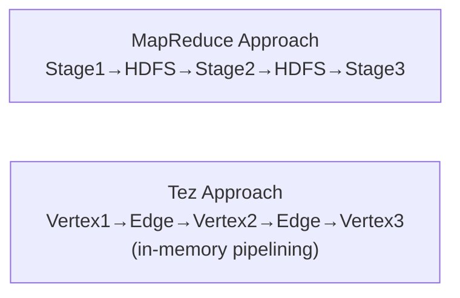
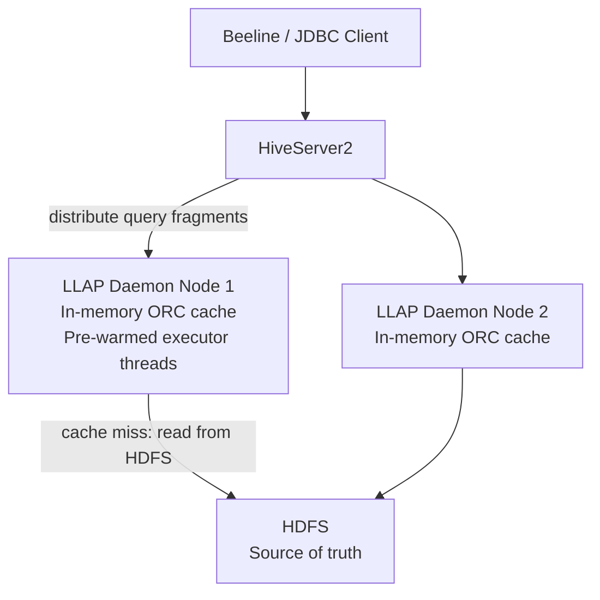

# Hive Senior Deep Dive

## Hive Query Execution Internals

### Query Compilation Pipeline
```
HiveQL Text
    ↓ Parsing (ANTLR grammar)
Abstract Syntax Tree (AST)
    ↓ Semantic Analysis (resolve columns, types, table refs)
QueryBlock (QB) tree
    ↓ Logical Plan Generation
Operator DAG (TS → SEL → FIL → GBY → RS → GBY → FS)
    ↓ Logical Optimization (predicate pushdown, constant folding, column pruning)
Optimized Operator DAG
    ↓ Physical Planning (translate to Tez/MR vertices)
Physical Plan (TezWork / MapReduceWork)
    ↓ Execution
```

**Key Operators:**
- `TS` = TableScan — reads HDFS data
- `FIL` = Filter — WHERE clause
- `SEL` = Select — column selection
- `GBY` = GroupBy — aggregation (appears twice: pre-shuffle and post-shuffle)
- `RS` = ReduceSink — partition, sort for shuffle
- `JOIN` = Join — join operation
- `FS` = FileSink — writes output

```sql
-- Examine execution plan
EXPLAIN SELECT customer_id, SUM(amount) FROM orders GROUP BY customer_id;

-- Extended plan with physical details
EXPLAIN EXTENDED SELECT ...;

-- Vectorization analysis
EXPLAIN VECTORIZATION SELECT ...;

-- Dependency graph
EXPLAIN DEPENDENCY SELECT ...;

-- Authorization information
EXPLAIN AUTHORIZATION SELECT ...;
```

## Tez Execution Engine Deep Dive

Tez models queries as DAGs (Directed Acyclic Graphs) avoiding redundant HDFS writes between stages:



### Tez Configuration
```xml
<!-- hive-site.xml with Tez optimizations -->
<property>
  <name>hive.execution.engine</name>
  <value>tez</value>
</property>

<!-- Container reuse: don't start new JVM for each task -->
<property>
  <name>tez.am.container.reuse.enabled</name>
  <value>true</value>
</property>
<property>
  <name>tez.am.container.reuse.rack-fallback.enabled</name>
  <value>true</value>
</property>

<!-- Memory per container -->
<property>
  <name>hive.tez.container.size</name>
  <value>4096</value>
</property>
<property>
  <name>hive.tez.java.opts</name>
  <value>-Xmx3277m -XX:+UseG1GC</value>
</property>

<!-- Llap (Live Long and Process) for repeated queries -->
<property>
  <name>hive.llap.daemon.yarn.container.mb</name>
  <value>40960</value>  <!-- 40 GB LLAP daemon memory -->
</property>
<property>
  <name>hive.llap.io.enabled</name>
  <value>true</value>  <!-- LLAP in-memory columnar cache -->
</property>
```

## Hive LLAP (Live Long and Process)

LLAP is a long-lived daemon that caches data in memory and processes queries without JVM startup overhead:



```bash
# Start LLAP service
hive --service llap \
  --instances 4 \
  --size 40g \
  --cache 10g \
  --executors 8 \
  --loglevel INFO \
  --output /tmp/llap_start/

# Use LLAP in queries
SET hive.llap.execution.mode=all;
```

**LLAP benefits:**
- Sub-second response for repeated queries (data cached in LLAP daemon memory)
- No JVM startup per query (daemon is always running)
- Columnar cache avoids re-reading HDFS for hot data
- Suitable for BI dashboards with repeated aggregations

## Handling Data Skew

### Detecting Skew
```sql
-- Check key distribution before writing skew-prone queries
SELECT customer_id, COUNT(*) as order_count
FROM orders
GROUP BY customer_id
ORDER BY order_count DESC
LIMIT 20;
-- If top customer has 10M orders vs avg 100 → severe skew
```

### Hive Skew Join
```sql
-- Automatic skew join detection and handling
SET hive.optimize.skewjoin=true;
SET hive.skewjoin.key=100000;  -- Keys with >100K rows are "skewed"

-- Hive handles skewed keys with a second MapReduce job
-- Normal keys: processed in join reducer
-- Skewed keys: broadcast join in map phase
```

### Salting for GroupBy Skew
```sql
-- Problem: SUM(amount) GROUP BY customer_id when customer "VIP" has 50% of rows
-- All VIP rows go to same reducer

-- Solution: Two-pass aggregation with salt
-- Pass 1: Distribute by (customer_id, random_salt)
INSERT OVERWRITE TABLE pre_agg
SELECT
    customer_id,
    FLOOR(RAND() * 10) as salt,  -- Random salt 0-9
    SUM(amount) as partial_sum,
    COUNT(*) as partial_count
FROM orders
GROUP BY customer_id, FLOOR(RAND() * 10);

-- Pass 2: Final aggregation (now each customer_id has 10 partial records)
SELECT customer_id, SUM(partial_sum) as total_amount, SUM(partial_count) as total_orders
FROM pre_agg
GROUP BY customer_id;
```

## UDF Development

### Simple UDF (one input, one output)
```java
import org.apache.hadoop.hive.ql.exec.UDF;
import org.apache.hadoop.io.Text;

public class MaskEmail extends UDF {
    public Text evaluate(Text email) {
        if (email == null) return null;
        String emailStr = email.toString();
        int atIndex = emailStr.indexOf('@');
        if (atIndex < 1) return email;

        // Show first char and domain, mask the rest
        return new Text(emailStr.charAt(0) + "***" + emailStr.substring(atIndex));
    }
}
```

### Generic UDF (complex types, multiple overloads)
```java
import org.apache.hadoop.hive.ql.udf.generic.GenericUDF;
import org.apache.hadoop.hive.serde2.objectinspector.*;

public class JsonExtract extends GenericUDF {
    private StringObjectInspector jsonOI;
    private StringObjectInspector pathOI;

    @Override
    public ObjectInspector initialize(ObjectInspector[] arguments) throws UDFArgumentException {
        if (arguments.length != 2) {
            throw new UDFArgumentException("json_extract requires exactly 2 arguments");
        }
        jsonOI = (StringObjectInspector) arguments[0];
        pathOI = (StringObjectInspector) arguments[1];
        return PrimitiveObjectInspectorFactory.javaStringObjectInspector;
    }

    @Override
    public Object evaluate(DeferredObject[] arguments) throws HiveException {
        String json = jsonOI.getPrimitiveJavaObject(arguments[0].get());
        String path = pathOI.getPrimitiveJavaObject(arguments[1].get());
        if (json == null || path == null) return null;
        // Parse JSON and extract value at path
        return JsonPath.read(json, path).toString();
    }

    @Override
    public String getDisplayString(String[] children) {
        return "json_extract(" + children[0] + ", " + children[1] + ")";
    }
}
```

### UDAF (User-Defined Aggregate Function)
```java
// UDAF for calculating geometric mean
@Description(name="geo_mean", value="Computes geometric mean of a column")
public class GeometricMeanUDAF extends AbstractGenericUDAFResolver {
    @Override
    public GenericUDAFEvaluator getEvaluator(TypeInfo[] parameters) {
        return new GeometricMeanEvaluator();
    }

    public static class GeometricMeanEvaluator extends GenericUDAFEvaluator {
        // Implements: init(), iterate(), terminatePartial(), merge(), terminate()
        // iterate: accumulate values
        // terminatePartial: return partial state (sum of logs, count)
        // merge: combine partial states from combiners
        // terminate: compute final value (exp(sum_of_logs / count))
    }
}
```

```sql
-- Register and use UDFs
ADD JAR hdfs:///user/hive/udf/my-udfs.jar;
CREATE TEMPORARY FUNCTION mask_email AS 'com.example.MaskEmail';
CREATE FUNCTION geo_mean AS 'com.example.GeometricMeanUDAF';

-- Use in queries
SELECT user_id, mask_email(email) as masked_email FROM users;
SELECT product_id, geo_mean(daily_sales) as geo_mean_sales FROM daily_revenue GROUP BY product_id;
```

## Metastore Tuning and Schema Management

```xml
<!-- hive-site.xml: Metastore connection pool tuning -->
<property>
  <name>datanucleus.connectionPool.maxPoolSize</name>
  <value>50</value>  <!-- Connections to Metastore DB -->
</property>
<property>
  <name>hive.metastore.client.socket.timeout</name>
  <value>300s</value>
</property>

<!-- Schema cache to reduce Metastore load -->
<property>
  <name>hive.metastore.cache.pinobjtypes</name>
  <value>Table,StorageDescriptor,SerDeInfo,Partition,Database,Type,FieldSchema,Order</value>
</property>
```

```bash
# Repair table (discover new HDFS partitions added outside Hive)
MSCK REPAIR TABLE web_logs;  -- Discovers and registers new partitions

# Drop stale partitions
ALTER TABLE web_logs DROP PARTITION (log_date < '2022-01-01');

# Upgrade Metastore schema after Hive version upgrade
schematool -initSchema -dbType mysql   # Initialize schema
schematool -upgradeSchema -dbType mysql  # Upgrade existing schema
schematool -validate -dbType mysql      # Validate schema
```

## Production Query Anti-Patterns

```sql
-- ANTI-PATTERN 1: SELECT * on large tables
-- Bad:
SELECT * FROM orders;
-- Good:
SELECT order_id, customer_id, amount FROM orders WHERE order_date = '2024-01-15';

-- ANTI-PATTERN 2: No partition filter
-- Bad (full table scan across all partitions):
SELECT * FROM web_logs WHERE user_id = 'U12345';
-- Good:
SELECT * FROM web_logs WHERE log_date = '2024-01-15' AND user_id = 'U12345';

-- ANTI-PATTERN 3: OR conditions preventing partition pruning
-- Bad:
SELECT * FROM web_logs WHERE log_date = '2024-01-14' OR log_date = '2024-01-15';
-- Good:
SELECT * FROM web_logs WHERE log_date IN ('2024-01-14', '2024-01-15');
-- Or use UNION ALL with explicit partition filters

-- ANTI-PATTERN 4: Cartesian join
-- Bad (missing JOIN condition → Cartesian product):
SELECT * FROM orders, customers;
-- Hive prevents this with: hive.mapred.mode=strict

-- ANTI-PATTERN 5: Highly nested subqueries
-- Bad (3+ levels of nesting):
SELECT * FROM (SELECT * FROM (SELECT * FROM ...));
-- Good: Use CTEs for readability and sometimes performance
WITH base AS (...),
enriched AS (SELECT * FROM base JOIN dim ...),
final AS (SELECT ... FROM enriched)
SELECT * FROM final;
```

## Interview Tips

> **Tip 1:** When asked about Hive performance, lead with the query plan: `EXPLAIN` is your first tool. Map the bottleneck to the operator: is it the TableScan (missing partition filter)? The Join (wrong join type, no stats for CBO)? The GroupBy (skew)? Each bottleneck has a different fix.

> **Tip 2:** LLAP is Hive's answer to interactive query engines like Presto/Impala. If an interviewer asks "how do you make Hive fast enough for BI dashboards?", LLAP is the answer — persistent daemons with in-memory columnar cache eliminate the startup overhead and HDFS read overhead for repeated queries.

> **Tip 3:** UDF development — know the difference between UDF (one-to-one), UDAF (many-to-one, aggregation), and UDTF (one-to-many, like EXPLODE). For production UDFs, discuss the importance of null handling, determinism (can the UDF be pushed down?), and thread safety.

> **Tip 4:** Skew handling in Hive is more complex than in Spark. Hive's `hive.optimize.skewjoin` runs TWO MapReduce jobs — one for normal keys and one for skewed keys (using a different join strategy). The two results are then merged. Knowing this two-pass internals shows deep understanding.

> **Tip 5:** Metastore is often the bottleneck in large clusters with thousands of partitions. `MSCK REPAIR TABLE` is O(N) for N partitions and can take hours on tables with millions of partitions. Modern solutions: use Hive with HMS backed by fast PostgreSQL (not MySQL), or migrate to Iceberg/Delta Lake which have better partition metadata handling.

## ⚡ Cheat Sheet

**HDFS architecture**
```
NameNode:   stores metadata (file → block mappings, permissions, namespace)
DataNode:   stores actual data blocks (default 128 MB per block)
Replication: default factor 3 (two local rack + one remote rack)
HA:         Active/Standby NameNode with JournalNodes for edit log sharing
```

**HDFS key commands**
```bash
hdfs dfs -ls /data/warehouse          # list files
hdfs dfs -put local.csv /data/raw/    # upload
hdfs dfs -get /data/output/ ./local/  # download
hdfs dfs -rm -r /data/tmp/            # delete
hdfs dfs -du -s -h /data/warehouse/   # disk usage
hdfs dfs -copyFromLocal -f src dst    # overwrite on upload
hdfs fsck /path -files -blocks        # check file health
```

**YARN resource model**
```
ResourceManager:  cluster master — allocates containers
NodeManager:      per-node agent — runs containers, reports health
ApplicationMaster: per-job — negotiates resources with RM
Container:        allocated unit (CPU cores + memory)

Scheduler types: FIFO, Capacity Scheduler (queues), Fair Scheduler
```

**Hive vs Spark SQL**
```
Hive:      MapReduce by default (slow); good for compatibility; HQL ≈ SQL
Hive LLAP: in-memory daemon; much faster (sub-minute queries)
Spark SQL:  Hive Metastore compatible but Spark execution — 10-100x faster
```

**Hive partitioning**
```sql
CREATE TABLE orders (order_id BIGINT, amount DOUBLE)
PARTITIONED BY (dt STRING, region STRING)
STORED AS PARQUET;
-- Dynamic partition insert
SET hive.exec.dynamic.partition.mode=nonstrict;
INSERT INTO orders PARTITION (dt, region)
SELECT order_id, amount, dt, region FROM staging_orders;
```

**MapReduce pattern**
```
Map:    input splits → emit (key, value) pairs
Shuffle: sort + group by key across nodes
Reduce: aggregate values per key → output
Use case today: Hive compatibility, very large batch on older clusters
```

**ZooKeeper use cases in Hadoop**
```
HBase region assignment  — ZK tracks which RegionServer owns which region
HDFS NameNode HA         — ZK elects Active NameNode
YARN RM HA               — ZK elects Active ResourceManager
Kafka broker coordination — ZK stores broker/topic metadata (pre-KRaft)
```

**HBase data model**
```
Table → Row → Column Family → Column Qualifier → Value (versioned by timestamp)
Row key design is critical: avoid hot-spotting (don't use sequential IDs)
Strategies: salt prefix, reverse timestamp, MD5 hash of natural key
```

**Key interview points**
- HDFS is optimized for large files, sequential reads; terrible for many small files
- Sqoop: parallel JDBC import from RDBMS to HDFS/Hive (one mapper per table partition)
- Oozie: XML-based workflow scheduler (predecessor to Airflow in Hadoop ecosystem)
- Pig: dataflow language (Latin) — pre-dbt/Spark era; rarely used in modern stacks
- Ecosystem today: HDFS + YARN still used, but S3/GCS replacing HDFS in cloud-native stacks
