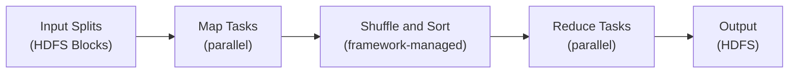

# MapReduce Fundamentals

## What is MapReduce?

MapReduce is a programming model and framework for processing large datasets in parallel across a cluster. It abstracts away the complexity of distributed computing by breaking jobs into two phases:

- **Map**: Transform/filter input data into key-value pairs
- **Reduce**: Aggregate key-value pairs by key

The framework handles: parallelization, fault tolerance, data distribution, and load balancing.

## MapReduce Execution Phases



### Phase 1: Map
- Input split → one Map task
- Map function processes each record and emits (key, value) pairs
- Output is written to local disk (not HDFS)

### Phase 2: Shuffle and Sort
- Framework groups all values for the same key together
- Copies map output to reducer nodes (across network)
- Sorts by key within each reducer's input
- Most expensive phase (network I/O bound)

### Phase 3: Reduce
- Receives sorted (key, [list of values]) pairs
- Aggregates/combines values per key
- Writes final output to HDFS

## Classic Word Count Example

### Java Implementation
```java
import org.apache.hadoop.conf.Configuration;
import org.apache.hadoop.fs.Path;
import org.apache.hadoop.io.IntWritable;
import org.apache.hadoop.io.Text;
import org.apache.hadoop.mapreduce.Job;
import org.apache.hadoop.mapreduce.Mapper;
import org.apache.hadoop.mapreduce.Reducer;
import org.apache.hadoop.mapreduce.lib.input.FileInputFormat;
import org.apache.hadoop.mapreduce.lib.output.FileOutputFormat;
import java.io.IOException;
import java.util.StringTokenizer;

public class WordCount {

    // Mapper: input (LongWritable offset, Text line) → output (Text word, IntWritable 1)
    public static class TokenizerMapper
        extends Mapper<Object, Text, Text, IntWritable> {

        private final static IntWritable one = new IntWritable(1);
        private Text word = new Text();

        public void map(Object key, Text value, Context context)
            throws IOException, InterruptedException {
            StringTokenizer itr = new StringTokenizer(value.toString());
            while (itr.hasMoreTokens()) {
                word.set(itr.nextToken());
                context.write(word, one);  // Emit (word, 1)
            }
        }
    }

    // Reducer: input (Text word, Iterable<IntWritable> counts) → output (Text word, IntWritable total)
    public static class IntSumReducer
        extends Reducer<Text, IntWritable, Text, IntWritable> {

        private IntWritable result = new IntWritable();

        public void reduce(Text key, Iterable<IntWritable> values, Context context)
            throws IOException, InterruptedException {
            int sum = 0;
            for (IntWritable val : values) {
                sum += val.get();
            }
            result.set(sum);
            context.write(key, result);  // Emit (word, total_count)
        }
    }

    public static void main(String[] args) throws Exception {
        Configuration conf = new Configuration();
        Job job = Job.getInstance(conf, "word count");
        job.setJarByClass(WordCount.class);
        job.setMapperClass(TokenizerMapper.class);
        job.setCombinerClass(IntSumReducer.class);  // Optional combiner
        job.setReducerClass(IntSumReducer.class);
        job.setOutputKeyClass(Text.class);
        job.setOutputValueClass(IntWritable.class);
        FileInputFormat.addInputPath(job, new Path(args[0]));
        FileOutputFormat.setOutputPath(job, new Path(args[1]));
        System.exit(job.waitForCompletion(true) ? 0 : 1);
    }
}
```

### Python Streaming (no Java required)
```python
# mapper.py
#!/usr/bin/env python3
import sys

for line in sys.stdin:
    line = line.strip()
    words = line.split()
    for word in words:
        print(f"{word}\t1")  # Emit tab-separated key-value
```

```python
# reducer.py
#!/usr/bin/env python3
import sys

current_word = None
current_count = 0

for line in sys.stdin:
    line = line.strip()
    word, count = line.split('\t', 1)
    count = int(count)

    if current_word == word:
        current_count += count
    else:
        if current_word:
            print(f"{current_word}\t{current_count}")
        current_word = word
        current_count = count

if current_word:
    print(f"{current_word}\t{current_count}")
```

```bash
# Run with Hadoop Streaming
hadoop jar $HADOOP_HOME/share/hadoop/tools/lib/hadoop-streaming-*.jar \
  -input /user/data/text/ \
  -output /user/output/wordcount/ \
  -mapper mapper.py \
  -reducer reducer.py \
  -file mapper.py \
  -file reducer.py
```

## Input Splits

MapReduce reads input through **InputFormat** classes:

| InputFormat | Use Case | Split Behavior |
|-------------|----------|----------------|
| `TextInputFormat` | Text files (default) | One record = one line |
| `KeyValueTextInputFormat` | Tab-separated key-value | One record = one line |
| `SequenceFileInputFormat` | Binary sequence files | Reads key-value pairs |
| `NLineInputFormat` | N lines per split | Configurable N lines |
| `CombineFileInputFormat` | Small files | Combines many small files |

```java
// Customize split size
job.setInputFormatClass(TextInputFormat.class);
FileInputFormat.setMinInputSplitSize(job, 256 * 1024 * 1024L); // 256 MB min
FileInputFormat.setMaxInputSplitSize(job, 512 * 1024 * 1024L); // 512 MB max
```

## Combiner: Local Aggregation

The **Combiner** is a mini-reducer that runs on the Map output before shuffle. It reduces network I/O:

```
Without Combiner:
  Mapper on DN1 emits: (hadoop,1),(hadoop,1),(hadoop,1),(spark,1),(spark,1)
  → 5 records sent over network

With Combiner (same as Reducer):
  Local combine: (hadoop,3),(spark,2)
  → 2 records sent over network (60% reduction)
```

```java
// Add combiner to job
job.setCombinerClass(IntSumReducer.class);
// Note: Combiner must be commutative AND associative (sum/count/max/min OK; average NOT OK)
```

## Partitioner

The **Partitioner** determines which reducer receives each key:

```java
// Default: HashPartitioner
// partition = (key.hashCode() & Integer.MAX_VALUE) % numReduceTasks

// Custom partitioner (e.g., range partition for sorted output)
public class RangePartitioner extends Partitioner<Text, IntWritable> {
    @Override
    public int getPartition(Text key, IntWritable value, int numPartitions) {
        char firstChar = key.toString().charAt(0);
        if (firstChar <= 'H') return 0 % numPartitions;
        if (firstChar <= 'P') return 1 % numPartitions;
        return 2 % numPartitions;
    }
}

job.setPartitionerClass(RangePartitioner.class);
job.setNumReduceTasks(3);
```

## Running MapReduce Jobs

```bash
# Submit job
hadoop jar myapp.jar com.example.WordCount /input /output

# Submit with resource parameters
hadoop jar myapp.jar com.example.WordCount \
  -D mapreduce.map.memory.mb=2048 \
  -D mapreduce.reduce.memory.mb=4096 \
  -D mapreduce.job.reduces=10 \
  /input /output

# Monitor job
mapred job -list                    # List running jobs
mapred job -status job_1234_0001   # Job status
mapred job -kill job_1234_0001     # Kill job

# Job history
mapred job -history job_1234_0001
```

## MapReduce vs Spark

| Feature | MapReduce | Spark |
|---------|-----------|-------|
| Processing model | Disk-based (reads/writes HDFS between stages) | In-memory (RDD/DataFrame) |
| Speed | Slower (disk I/O between stages) | 10-100x faster for iterative jobs |
| Language | Java (primary), Streaming for others | Scala, Python, Java, R |
| Fault tolerance | Re-run failed tasks from HDFS | RDD lineage recomputation |
| Ease of use | Verbose Java code | Concise, high-level APIs |
| Streaming | Batch only | Structured Streaming |
| SQL | Hive (translates to MR) | Spark SQL |
| Memory efficiency | Excellent (disk spill) | Can OOM if data > memory |
| Use case | Simple ETL, stable production | Complex analytics, ML, streaming |

## Key Configuration Parameters

```xml
<!-- mapred-site.xml -->
<property>
  <name>mapreduce.map.memory.mb</name>
  <value>1024</value>
</property>
<property>
  <name>mapreduce.reduce.memory.mb</name>
  <value>2048</value>
</property>
<property>
  <name>mapreduce.map.java.opts</name>
  <value>-Xmx819m</value>  <!-- 80% of map container memory -->
</property>
<property>
  <name>mapreduce.job.reduces</name>
  <value>1</value>  <!-- Number of reducer tasks -->
</property>
<property>
  <name>mapreduce.task.timeout</name>
  <value>600000</value>  <!-- 10 minutes -->
</property>
```

## Interview Tips

> **Tip 1:** Always clarify that the Combiner is NOT guaranteed to run — the framework may skip it (e.g., if map output fits in memory without spilling). Therefore, Combiner logic must be safe to run 0 or more times. Only use it for associative and commutative operations.

> **Tip 2:** Know the difference between number of map tasks and number of reduce tasks: map tasks = number of input splits (roughly one per 128 MB HDFS block), reduce tasks = configured via `mapreduce.job.reduces` (default: 1). Always set reduces > 1 for large jobs.

> **Tip 3:** The Shuffle phase is the most expensive and hardest to tune. Key factors: number of map outputs, compression (always enable `mapreduce.map.output.compress=true`), and sort buffer size (`mapreduce.task.io.sort.mb`).

> **Tip 4:** When explaining MapReduce vs Spark, don't just say "Spark is faster." Explain WHY: MapReduce writes to HDFS between every stage (map output → shuffle → reduce output), whereas Spark keeps data in memory across transformations. For iterative algorithms (ML), this difference is enormous.

> **Tip 5:** Python Streaming is important to know — many data teams use it for quick scripting without Java. The framework handles the coordination; your scripts just read stdin and write stdout.

---

## 🔄 Modern Context & Migration Path

### Why MapReduce Is Being Replaced by Spark

MapReduce writes intermediate results to HDFS after every Map phase and every Reduce phase. For multi-stage pipelines or iterative algorithms, this means repeated disk writes and reads between each stage. Spark keeps data in memory across transformations — the same logical pipeline that takes 10 minutes in MapReduce often runs in 10–60 seconds in Spark. Beyond speed:

- **API simplicity:** Spark's DataFrame/SQL API is far more expressive than writing Mapper and Reducer classes in Java
- **Unified engine:** Spark handles batch, streaming, ML, and graph workloads; MapReduce handles batch only
- **Ecosystem:** Spark integrates natively with Delta Lake, MLlib, Structured Streaming, and all major cloud platforms

### When You Still Encounter MapReduce

| Scenario | Why MapReduce persists |
|---|---|
| Legacy Hive on MapReduce | Old Hive installations configured with `hive.execution.engine=mr` |
| Old enterprise Hadoop clusters | Org hasn't migrated; Spark not approved/installed |
| Compliance-locked environments | Specific certified Hadoop distributions freeze the stack |
| HBase bulk load jobs | `HFileOutputFormat2` / `importtsv` use MapReduce |
| Historical job maintenance | Existing MapReduce jobs in production with no business case to rewrite |

### Interview Framing

> "MapReduce taught the industry how to do distributed data processing at scale — the Map/Shuffle/Reduce pattern is a fundamental contribution. Spark is MapReduce done right: the same concepts (map, shuffle, reduce) but executed in-memory with a better API. Understanding MapReduce makes you a better Spark developer because you understand what's happening under the hood during shuffles and why wide transformations are expensive."

### Migration Pattern: Word Count

**MapReduce (Python Streaming):**
```python
# mapper.py
import sys
for line in sys.stdin:
    for word in line.strip().split():
        print(f"{word}\t1")

# reducer.py
import sys
current_word, count = None, 0
for line in sys.stdin:
    word, val = line.strip().split("\t")
    if word == current_word:
        count += int(val)
    else:
        if current_word:
            print(f"{current_word}\t{count}")
        current_word, count = word, int(val)
if current_word:
    print(f"{current_word}\t{count}")
```

**Equivalent PySpark:**
```python
from pyspark.sql import SparkSession
from pyspark.sql import functions as F

spark = SparkSession.builder.getOrCreate()

word_counts = (
    spark.read.text("hdfs:///input/")
    .select(F.explode(F.split("value", r"\s+")).alias("word"))
    .filter(F.col("word") != "")
    .groupBy("word")
    .count()
    .orderBy("count", ascending=False)
)
word_counts.write.csv("hdfs:///output/")
```

The PySpark version is shorter, more readable, runs in-memory across stages, and can be extended to read from S3/ADLS/GCS with a one-line change to the input path.
