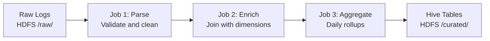

# MapReduce Real-World Patterns

## Production ETL Pipeline Pattern

### Multi-Stage MapReduce Pipeline



```java
// Orchestrating multi-stage pipeline
public class LogPipeline extends Configured implements Tool {
    public int run(String[] args) throws Exception {
        String inputPath = args[0];
        String outputBase = args[1];

        // Stage 1: Parse and validate
        Job parseJob = createParseJob(inputPath, outputBase + "/parsed");
        if (!parseJob.waitForCompletion(true)) {
            System.err.println("Parse job failed");
            return 1;
        }

        // Stage 2: Enrich with dimension data
        Job enrichJob = createEnrichJob(
            outputBase + "/parsed",
            outputBase + "/enriched"
        );
        if (!enrichJob.waitForCompletion(true)) {
            System.err.println("Enrich job failed");
            return 1;
        }

        // Stage 3: Aggregate
        Job aggJob = createAggregateJob(
            outputBase + "/enriched",
            outputBase + "/aggregated"
        );
        return aggJob.waitForCompletion(true) ? 0 : 1;
    }
}
```

## Case Study: Large-Scale Log Analysis

### Problem
A web company processes 10 TB of access logs daily. Requirements:
- Count unique users per page per hour
- Calculate p95 response times per endpoint
- Detect anomalous traffic patterns

### Solution Architecture
```bash
# Input: /raw/weblogs/2024/01/15/*.gz
# Log format: timestamp|user_id|endpoint|response_time|status_code

# Job 1: Parse and sessionize
hadoop jar analytics.jar ParseLogs \
  -D mapreduce.job.reduces=100 \
  -D mapreduce.map.output.compress=true \
  /raw/weblogs/2024/01/15/ \
  /tmp/parsed_logs/2024/01/15/

# Job 2: Compute per-endpoint stats
hadoop jar analytics.jar EndpointStats \
  -D mapreduce.job.reduces=50 \
  /tmp/parsed_logs/2024/01/15/ \
  /curated/endpoint_stats/date=2024-01-15/
```

```java
// Mapper: parse log line, emit (endpoint+hour, response_time)
public class LogMapper extends Mapper<LongWritable, Text, Text, LongWritable> {
    @Override
    public void map(LongWritable key, Text value, Context context)
        throws IOException, InterruptedException {
        String[] fields = value.toString().split("\\|");
        if (fields.length < 5) {
            context.getCounter("Errors", "malformed").increment(1);
            return;
        }
        try {
            String timestamp = fields[0].substring(0, 13); // YYYY-MM-DD HH
            String endpoint = fields[2];
            long responseTime = Long.parseLong(fields[3]);

            context.write(
                new Text(endpoint + "\t" + timestamp),
                new LongWritable(responseTime)
            );
            context.getCounter("Stats", "records_processed").increment(1);
        } catch (NumberFormatException e) {
            context.getCounter("Errors", "bad_response_time").increment(1);
        }
    }
}

// Reducer: compute p95 and count
public class StatsReducer extends Reducer<Text, LongWritable, Text, Text> {
    @Override
    public void reduce(Text key, Iterable<LongWritable> values, Context context)
        throws IOException, InterruptedException {
        List<Long> times = new ArrayList<>();
        for (LongWritable v : values) {
            times.add(v.get());
        }
        Collections.sort(times);

        long count = times.size();
        long p95Index = (long)(count * 0.95);
        long p95 = times.get((int) Math.min(p95Index, count - 1));
        long avg = times.stream().mapToLong(Long::longValue).sum() / count;

        context.write(key, new Text(count + "\t" + avg + "\t" + p95));
    }
}
```

## Case Study: Incremental Processing

### Challenge: Processing Only New Data
Daily ETL should only process files added since last run.

```java
// Solution: Use modification time filtering
public static void addInputPathsWithFilter(Job job, String basePath,
    long lastProcessedTime) throws IOException {
    FileSystem fs = FileSystem.get(job.getConfiguration());
    FileStatus[] files = fs.listStatus(new Path(basePath));

    for (FileStatus file : files) {
        if (file.getModificationTime() > lastProcessedTime) {
            FileInputFormat.addInputPath(job, file.getPath());
        }
    }
}

// Store last processed time in HDFS
// /meta/last_processed_timestamp → Unix epoch ms
```

```bash
# Shell-based incremental using Oozie coordinator or cron
#!/bin/bash
LAST_RUN=$(hdfs dfs -cat /meta/etl_checkpoint)
TODAY=$(date +%Y%m%d)

hadoop jar etl.jar IncrementalETL \
  -D etl.last.run.timestamp=${LAST_RUN} \
  /raw/events/ \
  /processed/events/date=${TODAY}/

# Update checkpoint after success
echo $(date +%s000) | hdfs dfs -put - /meta/etl_checkpoint
```

## Pattern: MapReduce for Data Sampling

When full dataset is too large to process, use MapReduce for distributed sampling:

```java
// Reservoir sampling in mapper (Bernoulli sampling)
public class SamplingMapper extends Mapper<LongWritable, Text, NullWritable, Text> {
    private double samplingRate;

    @Override
    protected void setup(Context context) {
        samplingRate = context.getConfiguration().getDouble("sampling.rate", 0.01);
    }

    @Override
    public void map(LongWritable key, Text value, Context context)
        throws IOException, InterruptedException {
        if (Math.random() < samplingRate) {
            context.write(NullWritable.get(), value);
        }
    }
}

// Run with 1% sample
hadoop jar sampling.jar Sampler \
  -D sampling.rate=0.01 \
  -D mapreduce.job.reduces=0 \  // Map-only job
  /input/large_dataset/ \
  /output/sample_1pct/
```

## Pattern: Custom InputFormat for Domain Data

```java
// Custom InputFormat for reading binary sensor data
public class SensorInputFormat extends FileInputFormat<LongWritable, SensorReading> {

    @Override
    public RecordReader<LongWritable, SensorReading> createRecordReader(
        InputSplit split, TaskAttemptContext context) {
        return new SensorRecordReader();
    }

    @Override
    protected boolean isSplitable(JobContext context, Path filename) {
        return false; // Binary format not splittable at arbitrary byte boundaries
    }
}

public class SensorRecordReader extends RecordReader<LongWritable, SensorReading> {
    private DataInputStream dis;
    private LongWritable currentKey = new LongWritable();
    private SensorReading currentValue = new SensorReading();
    private long pos = 0;
    private long length;

    @Override
    public void initialize(InputSplit split, TaskAttemptContext context)
        throws IOException {
        FileSplit fileSplit = (FileSplit) split;
        Path path = fileSplit.getPath();
        FileSystem fs = path.getFileSystem(context.getConfiguration());
        dis = new DataInputStream(fs.open(path));
        length = fileSplit.getLength();
    }

    @Override
    public boolean nextKeyValue() throws IOException {
        if (pos >= length) return false;
        // Read fixed-size binary record (e.g., 32 bytes per sensor reading)
        byte[] buffer = new byte[32];
        int bytesRead = dis.read(buffer);
        if (bytesRead < 32) return false;
        currentKey.set(pos);
        currentValue.fromBytes(buffer);
        pos += 32;
        return true;
    }

    @Override
    public float getProgress() {
        return length == 0 ? 1.0f : (float) pos / length;
    }
}
```

## MapReduce in a Modern Data Stack

### Integration with Hive
Hive translates HQL to MapReduce (or Tez/Spark):

```bash
# Force Hive to use MapReduce execution engine
SET hive.execution.engine=mr;

# HiveQL query → multiple MR jobs
SELECT
  product_category,
  COUNT(*) as order_count,
  SUM(amount) as total_revenue
FROM orders
JOIN products ON orders.product_id = products.id
WHERE order_date >= '2024-01-01'
GROUP BY product_category
ORDER BY total_revenue DESC;

# This generates:
# Job 1: Map orders and products, shuffle by product_id, join in reducer
# Job 2: Group by category, aggregate
# Job 3: Sort by total_revenue (ORDER BY requires single reducer)
```

### Monitoring Production MapReduce Jobs

```bash
# YARN ResourceManager UI: http://resourcemanager:8088/cluster
# Job History Server: http://historyserver:19888/jobhistory

# CLI monitoring
while true; do
  STATUS=$(mapred job -status job_12345_0001 2>/dev/null | grep "map()")
  echo "$(date): ${STATUS}"
  sleep 30
done

# Check for failed tasks
mapred job -list-attempt-ids job_12345_0001 FAILED MAP
mapred job -logs job_12345_0001 -task attempt_12345_0001_m_000042_0

# Key metrics to alert on:
# - Job runtime > 2x median → possible skew
# - GC time > 10% of task time → insufficient heap
# - Shuffle bytes much larger than map output → combiner not working
# - Many failed+retried tasks → data corruption or node issues
```

## Interview Tips

> **Tip 1:** When describing production experience, mention the full operational picture: submitting jobs, monitoring via YARN UI and History Server, handling failures (distinguish between task failure vs job failure — tasks retry 4x before failing the job), and using counters for observability.

> **Tip 2:** Discuss how Hive over MapReduce relates to modern Hive over Tez: the same HQL query can run 3-5x faster on Tez (DAG-based, avoids materializing intermediate data to HDFS between MR stages). This shows understanding of the evolution of the stack.

> **Tip 3:** For incremental processing patterns, mention that modern solutions use partition discovery (Hive partitions by date) or Apache Hudi/Delta Lake's change data capture. MapReduce-based incremental processing via file modification time is fragile and being replaced.

> **Tip 4:** Custom InputFormats are important for enterprise use — not all data is CSV or line-delimited text. Mention use cases: binary formats (Avro without special support), database dumps with custom delimiters, fixed-width files from mainframes.

> **Tip 5:** In interviews about "why would you still use MapReduce in 2024?", the honest answer is: mostly for legacy workloads, Hive-on-MR that's not yet migrated to Tez/Spark, and as a fallback when Spark OOMs on very large datasets that need disk-based processing. Be candid about when to prefer Spark.
