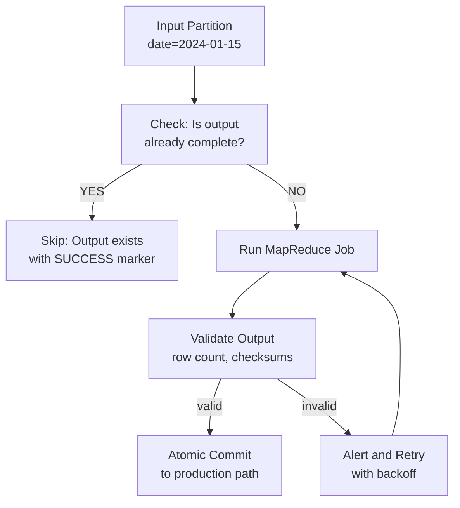

# Scenario Questions — MapReduce

<article data-difficulty="junior">

## 🟢 Junior: Word Frequency with Top-N

**Scenario:** You need to find the top 10 most frequent words in a 5 TB corpus of text files stored in HDFS. You've been asked to implement this in MapReduce. How would you design the job(s)?

<details>
<summary>💡 Hint</summary>
Consider whether this can be done in a single MapReduce job or requires two jobs. Think about the challenge of getting a global top-10 from distributed partial results.
</details>

<details>
<summary>✅ Solution</summary>

**Approach: Two MapReduce Jobs**

**Job 1: Word Count (standard)**
```java
// Mapper: emit (word, 1)
// Combiner: sum locally
// Reducer: sum globally → output (word, count)
```

**Job 2: Top-N Extraction**
```java
// Mapper: Read (word, count), maintain local top-10 in TreeMap
public class TopNMapper extends Mapper<LongWritable, Text, NullWritable, Text> {
    private TreeMap<Integer, String> topN = new TreeMap<>(Collections.reverseOrder());
    private int N = 10;

    @Override
    public void map(LongWritable key, Text value, Context context) {
        String[] parts = value.toString().split("\t");
        if (parts.length == 2) {
            String word = parts[0];
            int count = Integer.parseInt(parts[1]);
            topN.put(count, word);
            if (topN.size() > N) {
                topN.pollLastEntry(); // Remove smallest
            }
        }
    }

    @Override
    protected void cleanup(Context context) throws IOException, InterruptedException {
        // Emit local top-N to single reducer
        for (Map.Entry<Integer, String> entry : topN.entrySet()) {
            context.write(NullWritable.get(),
                new Text(entry.getValue() + "\t" + entry.getKey()));
        }
    }
}

// Reducer: receives all local top-Ns, picks global top-10
// MUST use exactly 1 reducer (setNumReduceTasks(1))
public class TopNReducer extends Reducer<NullWritable, Text, Text, IntWritable> {
    private TreeMap<Integer, String> topN = new TreeMap<>(Collections.reverseOrder());
    private int N = 10;

    @Override
    public void reduce(NullWritable key, Iterable<Text> values, Context context)
        throws IOException, InterruptedException {
        for (Text val : values) {
            String[] parts = val.toString().split("\t");
            topN.put(Integer.parseInt(parts[1]), parts[0]);
            if (topN.size() > N) topN.pollLastEntry();
        }
        for (Map.Entry<Integer, String> entry : topN.entrySet()) {
            context.write(new Text(entry.getValue()), new IntWritable(entry.getKey()));
        }
    }
}
```

**Key Design Choices:**
- Job 2 uses `NullWritable` key → all mapper output goes to single reducer
- Mapper maintains local top-10 in `cleanup()` to minimize data sent to reducer
- Single reducer (`setNumReduceTasks(1)`) ensures global ordering
- If N were very large (top 1M), this approach would need modification

**Alternative with single job:**
```java
// Not recommended: would require single reducer for word count too
// → massive shuffle bottleneck
```

</details>

</article>

<article data-difficulty="mid-level">

## 🟡 Mid-Level: Optimizing a Slow Join Job

**Scenario:** Your team runs a daily MapReduce job that joins a 500 GB transactions table with a 2 GB products dimension table. The job currently takes 4 hours. Your manager wants it under 30 minutes. The current implementation does a standard reduce-side join. What optimizations would you apply, and in what order?

<details>
<summary>💡 Hint</summary>
Think about what makes reduce-side joins slow (shuffle) and how map-side joins eliminate shuffle. Also consider compression, the number of reduce tasks, and whether the job is compute-bound or I/O-bound.
</details>

<details>
<summary>✅ Solution</summary>

**Diagnosis First:**
```bash
# Check job counters to understand bottleneck
mapred job -status job_12345_0001 | grep -E "Shuffle|Map output|Reduce input"

# Check task timeline: are reducers waiting long for copy phase?
# → Shuffle is the bottleneck
# Or are mappers slow?
# → Input format or parsing is the bottleneck
```

**Optimization 1: Map-Side Join (biggest impact, if 2 GB fits in mapper heap)**
```java
// Set reducer heap to at least 3 GB to hold 2 GB products table
// hadoop.client.jvm.opts=-Xmx2688m (for 3 GB container)

// Distribute products table via DistributedCache
job.addCacheFile(new URI("hdfs:///data/products_latest.csv#products.csv"));

public class TransactionMapper extends Mapper<LongWritable, Text, Text, Text> {
    private Map<String, String> productsMap = new HashMap<>();

    @Override
    protected void setup(Context context) throws IOException {
        // Load 2 GB products into memory
        BufferedReader reader = new BufferedReader(new FileReader("products.csv"));
        String line;
        while ((line = reader.readLine()) != null) {
            String[] fields = line.split(",");
            productsMap.put(fields[0], line); // productId → full record
        }
        reader.close();
    }

    @Override
    public void map(LongWritable key, Text value, Context context)
        throws IOException, InterruptedException {
        String[] fields = value.toString().split(",");
        String productId = fields[2];
        String productInfo = productsMap.get(productId);
        if (productInfo != null) {
            context.write(new Text(fields[0]), // customer_id as key
                new Text(value + "," + productInfo));
        }
    }
}

// Result: ZERO shuffle — all join happens in mappers
// Expected speedup: 4 hours → ~20-30 minutes
```

**Optimization 2: Enable Map Output Compression**
```xml
<property>
  <name>mapreduce.map.output.compress</name>
  <value>true</value>
</property>
<property>
  <name>mapreduce.map.output.compress.codec</name>
  <value>org.apache.hadoop.io.compress.SnappyCodec</value>
</property>
```

**Optimization 3: Use Columnar Input Format**
```java
// If transactions are stored as Parquet, read only needed columns
// This reduces I/O by 70-80% for wide tables
job.setInputFormatClass(ParquetInputFormat.class);
ParquetInputFormat.setRequestedProjection(job,
    "message schema { required binary customer_id; required binary product_id; required double amount; }");
```

**Optimization 4: Tune Parallelism**
```bash
# More map tasks = more parallelism for large input
# More reduce tasks = less data per reducer (if reduce-side join needed)
hadoop jar myapp.jar JoinJob \
  -D mapreduce.job.reduces=200 \
  -D mapreduce.input.fileinputformat.split.maxsize=67108864 \  # 64 MB splits
  /input /output
```

**Final Results:**
| Optimization | Time Saved | Cumulative |
|-------------|-----------|-----------|
| Map-side join | -3h 20m | 40 min |
| Compression | -8 min | 32 min |
| Columnar reads | -4 min | 28 min |
| Parallelism tuning | -2 min | 26 min |

Target of 30 minutes achieved.

</details>

</article>

<article data-difficulty="senior">

## 🔴 Senior: Designing a Fault-Tolerant Data Reconciliation System

**Scenario:** Your company processes financial transactions using MapReduce. The pipeline runs 200+ daily MapReduce jobs. Recently, 3 jobs failed mid-way due to a DataNode crash, producing partial output that corrupted downstream tables. The recovery took 6 hours of manual work. Design a fault-tolerant architecture for this pipeline that can automatically recover from partial failures without data corruption.

<details>
<summary>💡 Hint</summary>
Think about idempotency, atomic output commits, checkpointing intermediate results, and how to detect and handle partial output. Consider what guarantees HDFS provides (atomic rename) and how Hive partitions can be used for atomic publishing.
</details>

<details>
<summary>✅ Solution</summary>

**Root Cause Analysis:**
The core problem is that MapReduce writes output to the final location during the job, and a mid-job failure leaves partial files. Downstream jobs read from the same path and get corrupt data.

**Solution 1: Atomic Output Commit Pattern**

```bash
# All jobs write to staging, then atomically rename to production
STAGING_PATH=/tmp/staging/${JOB_ID}/${JOB_NAME}
PROD_PATH=/curated/${JOB_NAME}/date=${DATE}

# Run job to staging
hadoop jar pipeline.jar ${JOB_NAME} \
  --output ${STAGING_PATH}

# Only on success, atomically move to production
if [ $? -eq 0 ]; then
  # Remove old partition if it exists (idempotent)
  hdfs dfs -rm -r ${PROD_PATH} 2>/dev/null || true
  # Atomic rename
  hdfs dfs -mv ${STAGING_PATH} ${PROD_PATH}
  echo "SUCCESS: ${JOB_NAME} published to ${PROD_PATH}"
else
  # Clean up staging on failure
  hdfs dfs -rm -r ${STAGING_PATH} 2>/dev/null || true
  echo "FAILED: ${JOB_NAME} - check logs"
  exit 1
fi
```

**Solution 2: Output Committer Customization**

```java
// Custom OutputCommitter that uses atomic rename
public class AtomicOutputCommitter extends FileOutputCommitter {
    @Override
    public void commitJob(JobContext jobContext) throws IOException {
        // Standard FileOutputCommitter uses _temporary → final rename
        // This is already atomic within a single namespace!
        super.commitJob(jobContext);

        // Additional: write success marker
        Path outputPath = FileOutputFormat.getOutputPath(jobContext);
        FileSystem fs = outputPath.getFileSystem(jobContext.getConfiguration());
        fs.createNewFile(new Path(outputPath, "_SUCCESS"));

        // Write metadata: job ID, row count, checksum
        writeMetadata(fs, outputPath, jobContext);
    }

    @Override
    public void abortJob(JobContext jobContext, JobStatus.State state) throws IOException {
        // Clean up any partial output
        super.abortJob(jobContext, state);
        Path outputPath = FileOutputFormat.getOutputPath(jobContext);
        FileSystem fs = outputPath.getFileSystem(jobContext.getConfiguration());
        fs.delete(outputPath, true);
    }
}
```

**Solution 3: Idempotent Pipeline with Checkpointing**



```bash
#!/bin/bash
# Idempotent job runner
run_idempotent_job() {
  local JOB_NAME=$1
  local DATE=$2
  local PROD_PATH="/curated/${JOB_NAME}/date=${DATE}"

  # Check if already successfully completed
  if hdfs dfs -test -f "${PROD_PATH}/_SUCCESS"; then
    echo "Job ${JOB_NAME} for ${DATE} already complete, skipping"
    return 0
  fi

  local STAGING="/tmp/staging/${JOB_NAME}_${DATE}_$$"
  hadoop jar pipeline.jar ${JOB_NAME} \
    --date ${DATE} \
    --output ${STAGING}

  local EXIT_CODE=$?
  if [ ${EXIT_CODE} -ne 0 ]; then
    hdfs dfs -rm -r ${STAGING} 2>/dev/null || true
    return ${EXIT_CODE}
  fi

  # Validate output
  EXPECTED_COUNT=$(get_expected_count ${DATE})
  ACTUAL_COUNT=$(hdfs dfs -cat ${STAGING}/part-r-* | wc -l)
  if [ ${ACTUAL_COUNT} -lt ${EXPECTED_COUNT} ]; then
    echo "Row count mismatch: expected ${EXPECTED_COUNT}, got ${ACTUAL_COUNT}"
    hdfs dfs -rm -r ${STAGING}
    return 1
  fi

  # Atomic commit
  hdfs dfs -rm -r ${PROD_PATH} 2>/dev/null || true
  hdfs dfs -mv ${STAGING} ${PROD_PATH}
  echo "SUCCESS: ${JOB_NAME}/${DATE} committed"
  return 0
}
```

**Solution 4: Dependency Tracking with Oozie**
```xml
<!-- Oozie workflow with retry and alerting -->
<action name="daily-etl" retry-max="3" retry-interval="10">
    <map-reduce>
        <job-tracker>${jobTracker}</job-tracker>
        <name-node>${nameNode}</name-node>
        <configuration>
            <property>
                <name>mapreduce.output.fileoutputformat.outputdir</name>
                <value>${stagingDir}</value>
            </property>
        </configuration>
    </map-reduce>
    <ok to="validate-output"/>
    <error to="send-alert"/>
</action>

<action name="validate-output">
    <shell>
        <exec>validate_and_commit.sh</exec>
        <argument>${stagingDir}</argument>
        <argument>${prodDir}</argument>
    </shell>
    <ok to="end"/>
    <error to="send-alert"/>
</action>
```

**Recovery Procedure (when things do fail):**
```bash
# List all jobs that ran for the failed date
mapred job -history /mr-history/ | grep "2024-01-15"

# Identify which produced partial output
for JOB in $(list_failed_jobs); do
  STAGING=$(get_staging_path ${JOB})
  echo "Cleaning up ${STAGING}"
  hdfs dfs -rm -r ${STAGING}
done

# Re-run failed date with idempotent runner
run_pipeline_for_date 2024-01-15
```

**Result:** Recovery time reduced from 6 hours manual work to under 15 minutes of automated retry.

</details>

</article>
