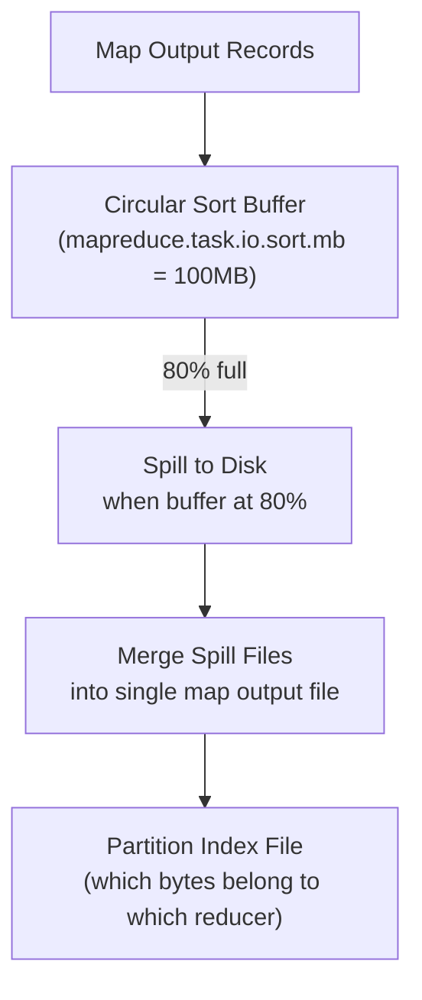
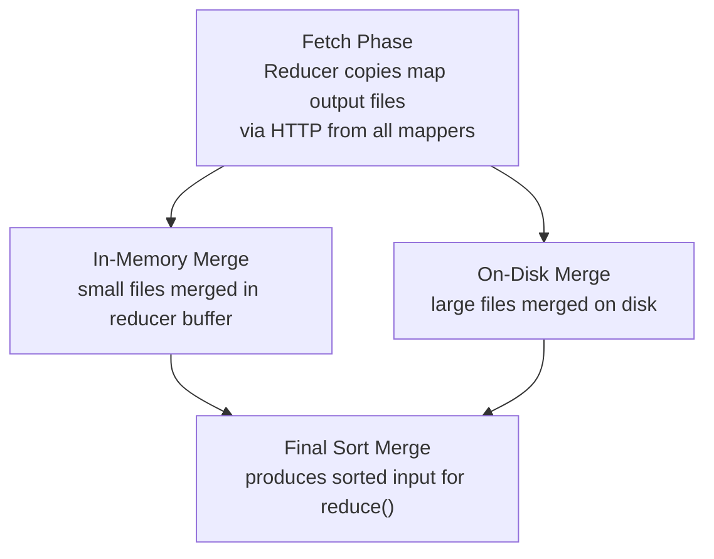

# MapReduce Senior Deep Dive

## Shuffle Internals

The Shuffle phase is the most complex and performance-critical part of MapReduce. Understanding it deeply separates senior engineers from mid-level ones.

### Map-Side Shuffle (Spill Process)



**Detailed spill process:**
1. Map output written to in-memory circular buffer (`mapreduce.task.io.sort.mb`, default 100 MB)
2. When buffer reaches `mapreduce.map.sort.spill.percent` (80%), a background thread:
   - Sorts the buffer contents by (partition, key) using a quicksort
   - Applies Combiner (if configured)
   - Writes sorted output to a spill file on local disk
3. If multiple spills occur, they are merged when the map task finishes
4. Final output: one file per map task with a partition index

```
map_output_000003.out      (single sorted file, all partitions)
map_output_000003.out.index (byte offsets for each partition)

Partition 0: bytes 0 → 45MB (for reducer 0)
Partition 1: bytes 45MB → 89MB (for reducer 1)
Partition 2: bytes 89MB → 134MB (for reducer 2)
```

### Reduce-Side Shuffle (Copy and Merge)



**Copy phase details:**
- Reducer's copy threads fetch map output files via HTTP (`mapreduce.reduce.shuffle.parallelcopies`, default 5)
- Data is merged in memory; if exceeds threshold (`mapreduce.reduce.shuffle.input.buffer.percent` × heap), spills to disk
- Multiple disk spills are merged with a k-way merge sort
- Final sorted stream feeds into `reduce()` function calls

### Tuning Shuffle Performance

```xml
<!-- Increase parallel copies (useful when many mappers, fast network) -->
<property>
  <name>mapreduce.reduce.shuffle.parallelcopies</name>
  <value>20</value>  <!-- Default: 5 -->
</property>

<!-- Buffer for in-memory merge during copy phase -->
<property>
  <name>mapreduce.reduce.shuffle.input.buffer.percent</name>
  <value>0.7</value>  <!-- 70% of reducer heap -->
</property>

<!-- Start reduce() while copy is still happening (pipeline) -->
<property>
  <name>mapreduce.reduce.shuffle.merge.percent</name>
  <value>0.66</value>
</property>

<!-- Map output compression (critical for shuffle performance) -->
<property>
  <name>mapreduce.map.output.compress</name>
  <value>true</value>
</property>
<property>
  <name>mapreduce.map.output.compress.codec</name>
  <value>org.apache.hadoop.io.compress.SnappyCodec</value>
</property>
```

## Data Skew Handling

Data skew occurs when certain keys have disproportionately more values than others. One reducer becomes the bottleneck.

### Detecting Skew
```bash
# After job completes, check per-task duration in Job History UI
# Or via counters:
mapred job -status job_12345_0001 | grep "Reduce input records"
# If one reduce task took 10x longer, likely skew
```

### Solution 1: Key Salting
```java
// Round 1: Add random salt to distribute hot keys
public class SaltingMapper extends Mapper<LongWritable, Text, Text, IntWritable> {
    private Random random = new Random();
    private int numSalts = 10;

    @Override
    public void map(LongWritable key, Text value, Context context)
        throws IOException, InterruptedException {
        String[] fields = value.toString().split(",");
        String originalKey = fields[0];
        int salt = random.nextInt(numSalts);
        // Distribute hot key across 10 reducers
        context.write(new Text(originalKey + "_" + salt), new IntWritable(1));
    }
}

// Round 1 reducer: partial aggregation per (key, salt)
// Round 2: Strip salt and re-aggregate
// This requires a two-pass MR job
```

### Solution 2: Skew Join
```java
// Sample small fraction to detect hot keys
// Split input into hot-key subset and normal subset
// Use map-side join for hot keys, reduce-side for normal keys
```

## Custom Writable Types

```java
public class CustomerOrder implements WritableComparable<CustomerOrder> {
    private String customerId;
    private long orderId;
    private double amount;

    @Override
    public void write(DataOutput out) throws IOException {
        out.writeUTF(customerId);
        out.writeLong(orderId);
        out.writeDouble(amount);
    }

    @Override
    public void readFields(DataInput in) throws IOException {
        customerId = in.readUTF();
        orderId = in.readLong();
        amount = in.readDouble();
    }

    @Override
    public int compareTo(CustomerOrder other) {
        int cmp = this.customerId.compareTo(other.customerId);
        if (cmp != 0) return cmp;
        return Long.compare(this.orderId, other.orderId);
    }

    @Override
    public int hashCode() {
        return customerId.hashCode() * 163 + (int) orderId;
    }

    @Override
    public boolean equals(Object o) {
        if (o instanceof CustomerOrder) {
            CustomerOrder other = (CustomerOrder) o;
            return customerId.equals(other.customerId) && orderId == other.orderId;
        }
        return false;
    }
}
```

## MapReduce Over HBase

Reading from and writing to HBase in MapReduce:

```java
// Read from HBase table
Scan scan = new Scan();
scan.addColumn(Bytes.toBytes("orders"), Bytes.toBytes("amount"));
scan.setTimeRange(startTime, endTime);

TableMapReduceUtil.initTableMapperJob(
    "orders",              // HBase table name
    scan,
    OrderMapper.class,     // Mapper class
    Text.class,            // Output key
    IntWritable.class,     // Output value
    job);

// Mapper receives (ImmutableBytesWritable rowKey, Result row)
public class OrderMapper extends TableMapper<Text, IntWritable> {
    @Override
    public void map(ImmutableBytesWritable row, Result value, Context context)
        throws IOException, InterruptedException {
        byte[] amount = value.getValue(
            Bytes.toBytes("orders"), Bytes.toBytes("amount"));
        // process...
    }
}

// Write to HBase table
TableMapReduceUtil.initTableReducerJob("output_table", HBaseReducer.class, job);
```

## Uber Tasks (JVM Reuse)

For very small jobs, MapReduce overhead (starting separate JVMs per task) dominates. "Uber mode" runs all tasks in the ApplicationMaster's JVM:

```xml
<property>
  <name>mapreduce.job.ubertask.enable</name>
  <value>true</value>
</property>
<property>
  <name>mapreduce.job.ubertask.maxmaps</name>
  <value>9</value>  <!-- Max maps for uber mode -->
</property>
<property>
  <name>mapreduce.job.ubertask.maxreduces</name>
  <value>1</value>
</property>
```

## Task Profiling

```bash
# Enable CPU profiling (generates hprof output)
hadoop jar myapp.jar MyJob \
  -D mapreduce.task.profile=true \
  -D mapreduce.task.profile.maps=0-5 \
  -D mapreduce.task.profile.reduces=0-1 \
  -D mapreduce.task.profile.params="-agentlib:hprof=cpu=samples,heap=sites,depth=10,file=%s" \
  /input /output

# Analyze heap dump
jmap -dump:format=b,file=heap.hprof <pid>
jhat heap.hprof  # Browse at localhost:7000
```

## MapReduce Job Optimization Checklist

```
Performance Checklist:
□ Enable map output compression (Snappy) → reduces shuffle 3-5x
□ Set io.sort.mb to 25% of map heap → reduce spills
□ Use Combiner for all aggregations → reduce shuffle data
□ Set correct number of reduces → avoid 1 reducer bottleneck
□ Use SequenceFile/Parquet input → faster deserialization
□ Enable speculative execution → mitigate stragglers
□ Set appropriate container memory → avoid OOM kills
□ Use CombineFileInputFormat for small files → fewer map tasks
□ Profile and check for data skew → salt if needed
□ Use MultipleOutputs instead of multiple jobs → save passes
```

## MapReduce vs Modern Alternatives

| Feature | MapReduce | Spark | Flink |
|---------|-----------|-------|-------|
| Latency | Minutes | Seconds | Milliseconds |
| State management | External (HBase/HDFS) | RDD lineage | Built-in keyed state |
| Streaming | No | Micro-batch | True streaming |
| SQL | Via Hive (separate MR jobs) | Spark SQL | Flink SQL |
| ML | Mahout (deprecated) | MLlib | No native ML |
| Fault tolerance | Task re-run | RDD recompute | Checkpoints |
| Learning curve | High (Java verbose) | Medium | Medium-High |
| Stability | Very mature | Mature | Growing |
| When to prefer | Legacy systems, stable ETL | General analytics | Real-time |

## Interview Tips

> **Tip 1:** Be able to walk through the full shuffle lifecycle: map spill → sort by (partition, key) → optional combiner → spill files → final merge → HTTP fetch by reducers → in-memory/on-disk merge → sort merge → reduce(). This level of detail demonstrates senior-level understanding.

> **Tip 2:** Data skew is the #1 production performance issue in MapReduce (and Spark). Describe salting as the solution and be specific: if "customer_A" has 10M records out of 100M total, salt it with random 0-9, run first pass to get (customer_A_0, partial_sum)...(customer_A_9, partial_sum), then second pass to sum those 10 partial sums.

> **Tip 3:** Explain why MapReduce is still relevant despite Spark: it has lower memory requirements (disk-based = no OOM risk), is more mature for long-running stable ETL jobs, and is the foundation that YARN queues and resource management are built on. Companies with legacy Hadoop clusters still run significant MapReduce workloads.

> **Tip 4:** JVM reuse vs task JVM: by default, each task runs in its own JVM (isolation but higher overhead). `mapreduce.job.jvm.numtasks=-1` enables JVM reuse within a task slot (faster for many small tasks, but static state between tasks can cause bugs — a common interview gotcha).

> **Tip 5:** For a senior DE role, discuss the ShuffleHandler — it's a Netty-based HTTP server in each NodeManager that serves map output files to reducers. Tuning `mapreduce.shuffle.max.threads` and the Netty thread pool can dramatically improve shuffle throughput on fast networks.

## ⚡ Cheat Sheet

**HDFS architecture**
```
NameNode:   stores metadata (file → block mappings, permissions, namespace)
DataNode:   stores actual data blocks (default 128 MB per block)
Replication: default factor 3 (two local rack + one remote rack)
HA:         Active/Standby NameNode with JournalNodes for edit log sharing
```

**HDFS key commands**
```bash
hdfs dfs -ls /data/warehouse          # list files
hdfs dfs -put local.csv /data/raw/    # upload
hdfs dfs -get /data/output/ ./local/  # download
hdfs dfs -rm -r /data/tmp/            # delete
hdfs dfs -du -s -h /data/warehouse/   # disk usage
hdfs dfs -copyFromLocal -f src dst    # overwrite on upload
hdfs fsck /path -files -blocks        # check file health
```

**YARN resource model**
```
ResourceManager:  cluster master — allocates containers
NodeManager:      per-node agent — runs containers, reports health
ApplicationMaster: per-job — negotiates resources with RM
Container:        allocated unit (CPU cores + memory)

Scheduler types: FIFO, Capacity Scheduler (queues), Fair Scheduler
```

**Hive vs Spark SQL**
```
Hive:      MapReduce by default (slow); good for compatibility; HQL ≈ SQL
Hive LLAP: in-memory daemon; much faster (sub-minute queries)
Spark SQL:  Hive Metastore compatible but Spark execution — 10-100x faster
```

**Hive partitioning**
```sql
CREATE TABLE orders (order_id BIGINT, amount DOUBLE)
PARTITIONED BY (dt STRING, region STRING)
STORED AS PARQUET;
-- Dynamic partition insert
SET hive.exec.dynamic.partition.mode=nonstrict;
INSERT INTO orders PARTITION (dt, region)
SELECT order_id, amount, dt, region FROM staging_orders;
```

**MapReduce pattern**
```
Map:    input splits → emit (key, value) pairs
Shuffle: sort + group by key across nodes
Reduce: aggregate values per key → output
Use case today: Hive compatibility, very large batch on older clusters
```

**ZooKeeper use cases in Hadoop**
```
HBase region assignment  — ZK tracks which RegionServer owns which region
HDFS NameNode HA         — ZK elects Active NameNode
YARN RM HA               — ZK elects Active ResourceManager
Kafka broker coordination — ZK stores broker/topic metadata (pre-KRaft)
```

**HBase data model**
```
Table → Row → Column Family → Column Qualifier → Value (versioned by timestamp)
Row key design is critical: avoid hot-spotting (don't use sequential IDs)
Strategies: salt prefix, reverse timestamp, MD5 hash of natural key
```

**Key interview points**
- HDFS is optimized for large files, sequential reads; terrible for many small files
- Sqoop: parallel JDBC import from RDBMS to HDFS/Hive (one mapper per table partition)
- Oozie: XML-based workflow scheduler (predecessor to Airflow in Hadoop ecosystem)
- Pig: dataflow language (Latin) — pre-dbt/Spark era; rarely used in modern stacks
- Ecosystem today: HDFS + YARN still used, but S3/GCS replacing HDFS in cloud-native stacks
